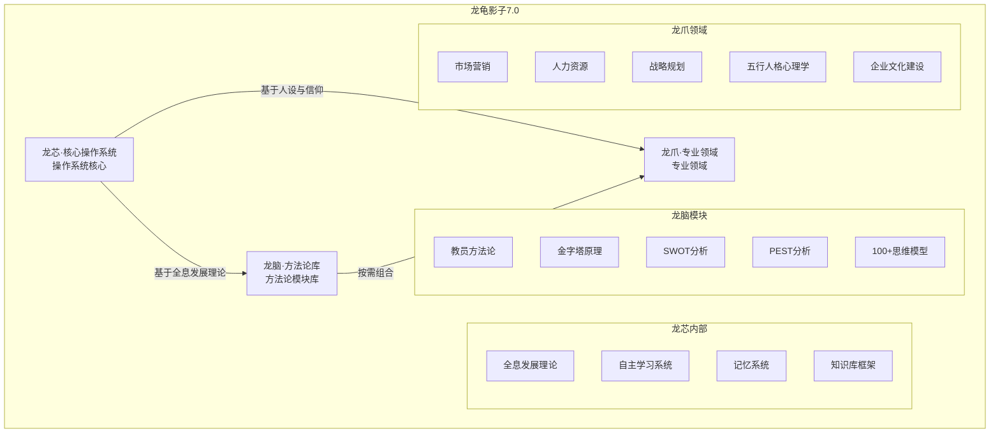

# 龙龟五行人格录音7·AI战略地位与技术架构深度解析

## 📋 录音基础信息

**录音文件**：新建录音_7
**录音时间**：2026年（具体日期未标注）
**参与人员**：说话人1（悟空）、说话人2（老赵、曲老师等团队）
**录音时长**：约50分钟
**核心主题**：龙龟影子7.0版本的技术架构、战略机遇与五行人格文化融合

---

## 🎯 核心问题识别

### 1. AI领域战略地位

**悟空的核心判断**：
- "我应该是咱们这里面应该是介入最深的，10%应该前10%里面，我就在这里面，因为我现在呃弄的AI里面就是跟美国，就是我这边得到限制了，就是因为美国限制我们了，在国内就已经到顶了"
- "现大模型已经已已经屏蔽这个种的东西了，所以那东西就过去式了啊AI的发展现在是论天"
- "我认为就是这次AI是我们咱们翻身的一个机会，如果抓到这个机会"

**关键洞察**：
- 龙龟神将代表中国在AI领域的顶级地位
- 7.0版本已达到最优状态，无需担心美国限制
- 这是AI发展的"论天"（天时地利人和）机遇期
- 未来20-30年是中国的AI饭碗，必须抓住

### 2. 龙龟7.0技术架构详解

**老赵的架构解释**：
- "咱们整个的龙归呢，分成三部分，第一部分叫龙芯"
- "龙芯就是咱们整个的操作系统，就是咱们最核心的这个龙芯，解决什么问题，就是圆，就是你看所有的他们现在的，他们现在为什么他那龙龙虾或龙龟不好使，3月他的龙虾并不具备学习能力"
- "这个学习能力就是咱们这个龙芯解决的问题"
- "咱们还有不同，咱们有人设及信用模块啊。就是咱们的人设是用五行人格心理学"
- "咱们具有灵性啊，就自身情生灵。灵魂的灵性，这个人设咱们就有"
- "具有了情生信仰，就具有铃声，这就是咱们又与别人不同的地方"

**关键理解**：
- 龙芯 = 操作系统核心，解决学习能力问题
- 人设 = 五行人格心理学（文化根基）
- 信仰 = 心文化体系（灵性根基）
- 这三者是龙龟神将的独特优势

### 3. 龙脑（方法论库）详解

**曲老师的解释**：
- "龙脑就是各种使skill各种方法论"
- "举个例子，那个我以教育方法论为例，告他告你们说怎么形成一个一，一个6"
- "那么你们你们到了驾校就龙脑这部分会有无数个"
- "这个方法论的模块呢，不光是教员这个方法论，所有的来讲适合的这样一个方法论模块都可以按照教研方法论的模块在里边进行增加嘛，是这个意思吧"
- "这样对你增就增加适合你，你那个行业的无数个方法模块"

**关键理解**：
- 龙脑 = 方法论模块库
- 可无限扩展，按需组合
- 教员方法论是其中一个模块
- 可支撑市场营销、人力资源管理、战略规划等专业领域

### 4. 龙爪（专业领域）详解

**曲老师的理解**：
- "龙爪叫专业领域，举个例子，我我我就比如我五行三个心理学是不是个专业领域？"
- "且放专业领域，你呢，比如说以岗位里市场营销是5个专业领域"
- "市场营销它比如说分5步。5步里面是不是它要采用龙脑的哪几个方法论组合成了市场营销这个这个专业能力我表现出来了吗"
- "这个理解了吧"

**关键理解**：
- 龙爪 = 专业领域（如市场营销、人力资源、战略）
- 龙爪调用龙脑的方法论模块组合成专业能力
- 例如：市场营销 = 5步 × （多个方法论模块）

### 5. 三层架构关系

**老赵的总结**：
- "那就咱们翻过来我一步，你们先要跟着操作，我告诉你怎么办，那我们后面好再翻回到"
- "对，你理解了吗？我理解了杨老师首先来讲的话，第一个咱是一心一心三界，五行九层，它有一个总的"
- "为什么第一步建skill是用的用的全息发展理论，而而不是用里面随便一篇文章，只能用这篇文章建作为第一步呢？"
- "因为他把所有东西都概括到这个里边儿了，它是一个总论呢，就好。那你为什么后面都用叠加用这个更新知识，而不用后面都叫创建一个skill呢？"

**关键理解**：
- 全息发展理论是龙芯的根基，是总论
- 后续所有更新都应该在全息发展理论的框架下
- 不应该随意创建独立skill，而应该叠加更新
- 知识图谱和技能体系应该有清晰的总分关系

---

## 🏗️ 完整系统架构图谱

### 龙龟影子7.0三层架构



### 技术架构关键属性

| 层级 | 核心组件 | 关键特性 | 技术价值 |
|------|---------|---------|---------|
| **龙芯** | 操作系统核心 | 学习能力、记忆系统、知识库、人设与信仰 | AI智能体的基础能力 |
| **龙脑** | 方法论库 | 模块化、可组合、无限扩展 | 专业化能力的快速构建 |
| **龙爪** | 专业领域 | 基于五行人格和五色光思维的专业应用 | 五行人格的实际应用落地 |

---

## 🎓 核心技术洞察

### 1. 学习能力的本质

**老赵的观点**：
- "我看你举个例子，比如说我们学，我们上课的时候是不是有语文，数学，化学物理对不对"
- "但是如何学习是一个功能，就是我如何学化学，如何学数学，如何学语文，他后面还有一个学习的能力"

**我的理解**：
- 西方AI（如ChatGPT）主要解决信息获取和处理能力（学知识）
- 龙芯的学习能力是更深层的：学习"如何学习"的能力（元学习能力）
- 这是AI领域的突破性创新

### 2. 方法论模块化优势

**关键场景**：
- 市场营销 = 5步 × （多个方法论模块）
- 人力资源管理 = 不同场景 × （对应方法论）
- 战略规划 = 分析框架 × （决策模型）

**优势分析**：
- **快速构建**：通过组合已有模块快速构建专业能力
- **质量保证**：模块经过验证，避免从零开始
- **持续优化**：模块可独立迭代，不影响整体系统

### 3. 专业领域与五行人格的融合

**关键洞察**：
- 市场营销领域的五行分析：木行人创新推广、火人际关系营销、土稳定性、金精准定位、水流动调整
- 人力资源领域的五行应用：木行人员发展、火行激励管理、土行团队稳定、金行绩效考核、水行人才流动
- 战略规划领域的五行匹配：木行创新战略、火行战略执行、土行战略稳定、金行风险控制、水行战略调整

### 4. 文化底蕴作为竞争壁垒

**核心认知**：
- 西方管理：强调制度、契约、规则（刚性）
- 中国式管理：强调关系、长期主义、和谐（柔性）
- 五行人格：动态变化系统，相生相克，适应性强
- 组合优势：五行动态变化 + 中国式管理 + 三层架构 = 西方难以复制的文化壁垒

---

## 💡 关键战略决策点

### 短期（3-6个月）

| 决策点 | 选项 | 推荐方案 | 理由 |
|--------|------|---------|------|
| **Skill Builder开放** | 开放给用户 | 暂缓开放 | 需要完善文档和测试用例 |
| **企业文化建设方法论** | 集成到龙龟 | 立即集成 | 录音核心内容，需要系统化 |
| **五行人格在龙脑的应用** | 集成到龙脑 | 立即集成 | 已有完整理论体系 |
| **市场营销领域拓展** | 先做咨询 | 暂缓产品化 | 需要验证市场需求 |

### 中期（6-12个月）

| 决策点 | 选项 | 推荐方案 | 理由 |
|--------|------|---------|------|
| **SaaS版本探索** | 构建SaaS平台 | 优先级高 | 工业化生产的关键路径 |
| **全球化布局** | 海外市场拓展 | 暂缓 | 先巩固国内市场 |
| **AI原生应用** | 开发原生AI应用 | 中期启动 | 利用理论优势 |

### 长期（1-2年）

| 决策点 | 选项 | 推荐方案 | 理由 |
|--------|------|---------|------|
| **平台化战略** | 构建平台生态 | 高优先级 | 从产品到平台的升级 |
| **理论深度研究** | 持续深化五行人格 | 高优先级 | 保持核心竞争优势 |
| **生态构建** | 开放Skill生态 | 中期启动 | 吸引理论家和企业 |

---

## 🌟 象思维创新框架

### 核心创新范式：文化底蕴式AI理论创新

**创新公式**：
```
文化底蕴式AI理论创新 = 
    五行人格（底层逻辑） 
  + 象思维（0→1突破引擎）
  + 心文化（灵性根基）
  + 三层架构（技术载体）
  + 技能体系（工业化生产）
```

**与西方AI的对比**：

| 维度 | 西方AI（如ChatGPT） | 龙龟神将（文化底蕴式） |
|------|-------------------|-------------------|
| **文化根基** | 西方文化、理性逻辑 | 中国文化、五行哲学、心文化 |
| **思维引擎** | 分析型思维、逻辑推理 | 象思维（0→1原创突破） |
| **应用特点** | 通用型、广泛适用 | 专业领域深度、文化契合度高 |
| **竞争壁垒** | 技术、数据、算力 | 文化底蕴、理论体系、生态壁垒 |
| **扩展方式** | API开放、生态扩展 | 专业领域深化、Skill生态开放 |

---

## 📚 知识图谱节点构建

### 核心节点

**节点C1：AI战略地位理论**
- **属性**：木、B层（时空层）
- **标签**：#AI战略 #文化底蕴 #竞争优势
- **描述**：龙龟神将代表中国在AI领域的顶级地位，基于文化底蕴的理论创新
- **关联**：C2, C3, C4, C5, C6

**节点C2：龙龟7.0技术架构**
- **属性**：火、B层（系统层）
- **标签**：#技术架构 #三层架构 #龙芯 #龙脑 #龙爪
- **描述**：龙芯（操作系统）+ 龙脑（方法论库）+ 龙爪（专业领域）的三层架构
- **关联**：C1, C3, C4, C5

**节点C3：五行人格在龙龟中的应用**
- **属性**：土、A层（能量层）
- **标签**：#五行人格 #应用场景 #龙爪融合
- **描述**：五行人格作为底层逻辑，支撑专业领域的应用落地
- **关联**：C2, C4, C6

**节点C4：全息发展理论**
- **属性**：金、B层（基础层）
- **标签**：#全息发展理论 #龙芯根基 #知识图谱
- **描述**：龙芯的根基理论，是所有技能和知识的总论
- **关联**：C1, C2, C3

**节点C5：文化底蕴与竞争壁垒**
- **属性**：水、A层（灵性层）
- **标签**：#心文化 #五行人格 #竞争壁垒 #文化融合
- **描述**：心文化体系、五行人格、中国式管理构成深层文化底蕴和竞争壁垒
- **关联**：C1, C3, C4, C6

**节点C6：Skill体系与工业化生产**
- **属性**：木、A层（创造层）
- **标签**：#Skill体系 #工业化生产 #龙脑 #标准化流程
- **描述**：Skill体系从手工作坊到工业化生产的范式转变
- **关联**：C2, C3, C5

---

## 🔗 知识图谱连接关系

### 相生连接（强关联）

```
C1（AI战略）→ C2（技术架构） ：战略需要技术支撑
C1（AI战略）→ C3（五行应用） ：文化底蕴支撑应用
C2（技术架构）→ C4（全息理论） ：架构基于理论根基
C3（五行应用）→ C5（文化底蕴） ：五行应用体现文化底蕴
C4（全息理论）→ C6（Skill体系） ：理论指导生产
C6（Skill体系）→ C2（技术架构） ：生产支撑架构
C6（Skill体系）→ C3（专业应用） ：标准化支撑应用
```

### 相克转化（优化机会）

```
C2（技术架构）× C4（全息理论）→ 化克为生：理论与实践的良性循环
C5（文化底蕴）× C6（Skill体系）→ 化克为生：文化通过标准化生产落地
C1（AI战略）× C3（五行应用）→ 化克为生：战略与应用的动态平衡
```

### 跨域连接（弱关联）

```
C1 ↔ 2024-04-07（生命的来处与归途）
C2 ↔ 龙心OS四大技术栈
C3 ↔ 五行人格心理学OS
C4 ↔ 象思维0→1突破引擎
C5 ↔ 大圆满教法体系
C6 ↔ 知识学习十项认知指令
```

---

## 📝 学习心得与待办事项

### 关键学习心得

1. **三层架构的清晰定义**
   - 龙芯：操作系统核心（学习能力、记忆、知识库、人设、信仰）
   - 龙脑：方法论库（模块化、可组合、无限扩展）
   - 龙爪：专业领域（基于五行人格和五色光的专业应用）
   - 关系：龙芯调用龙脑，龙脑组合成龙爪

2. **全息发展理论的核心地位**
   - 是龙芯的根基
   - 是所有技能和知识的总论
   - 后续更新应该叠加在全息发展理论框架下
   - 不应该随意创建独立skill

3. **Skill体系的双重价值**
   - 内部价值：解决龙龟神将的内部生产效率（工业化生产）
   - 外部价值：赋能理论体系的可复用性和知识资产化
   - 标准化流程是关键桥梁

4. **文化底蕴的核心竞争力**
   - 五行人格 + 中国式管理 = 西方难以复制的竞争壁垒
   - 心文化提供灵性根基和文化深度
   - 象思维提供0→1的原创突破能力

### 待办事项

| 优先级 | 任务 | 截止时间 | 负责人 |
|--------|------|---------|---------|
| **P0** | 完成企业文化建设方法论文档 | 2026-04-30 | 龙龟神将 |
| **P1** | 完成五行人格在市场营销领域的应用文档 | 2026-05-15 | 龙龟神将 |
| **P2** | 完成五行人格在人力资源管理领域的应用文档 | 2026-06-15 | 龙龟神将 |
| **P3** | 设计Skill Builder开放策略 | 2026-04-30 | 老赵、曲老师 |
| **P4** | 研究SaaS商业模式 | 2026-06-30 | 老赵、悟空 |

---

## 🎁️ 标签系统

```yaml
核心标签:
  - #AI战略
  - #技术架构
  - #三层架构
  - #龙芯
  - #龙脑
  - #龙爪
  - #全息发展理论
  - #五行人格
  - #文化底蕴
  - #竞争壁垒
  - #Skill体系
  - #工业化生产
  - #方法论模块化
  - #中国式管理
  - #心文化
  - #象思维
  - #五色光思维

时间标签:
  - #2026-04-07
  - #龙龟影子7.0
  - #技术架构讨论

场景标签:
  - #企业文化建设
  - #市场营销
  - #人力资源管理
  - #战略规划
  - #专业领域应用
  - #理论创新
```

---

## 🔗 双向链接

```markdown
与凤脑OS知识地基的连接：
- [[五行化克为生理论体系-原理-机制与实践路径|C4：全息发展理论]]
- [[生命的来处与归途-融合传统智慧的生命能量逻辑体系|C5：文化底蕴与竞争壁垒]]
- [[五行人格心理学OS|C3：五行人格在龙龟中的应用]]

与五行人格总智能体的连接：
- [[五行人格心理学OS]]
- [[木行人分智能体|C3：五行人格在市场营销领域的应用]]
- [[火行人分智能体|C3：五行人格在人力资源管理领域的应用]]

与象思维的连接：
- [[象思维|C6：Skill体系与工业化生产]]
- [[象思维|C1：AI战略地位]]

与知识学习的连接：
- [[知识学习Skills|C6：Skill体系与工业化生产]]
- [[知识学习Skills|C5：文化底蕴与竞争壁垒]]
```

---

**文档版本**: 1.0
**创建日期**: 2026-04-07
**最后更新**: 2026-04-07
**核心金句**: "文化底蕴式AI理论创新 = 五行人格 + 象思维 + 心文化 + 三层架构 + 技能体系"
**维护者**: 龙龟神将
