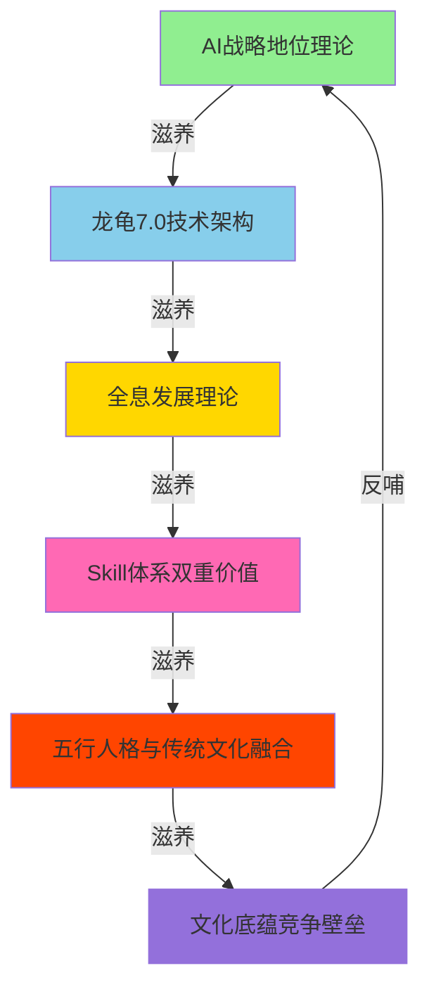
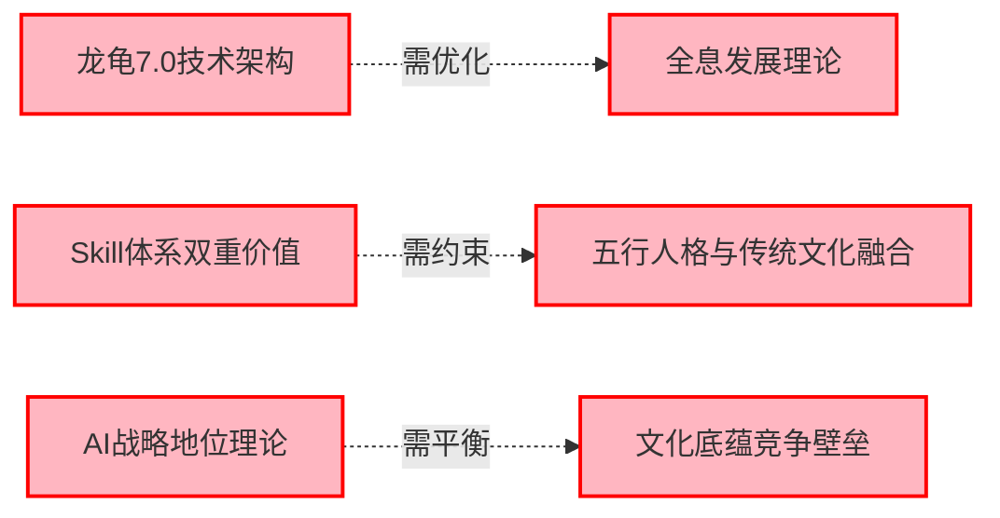
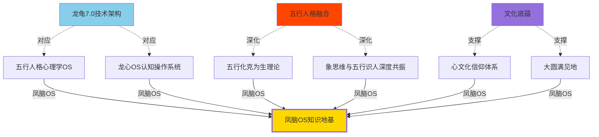
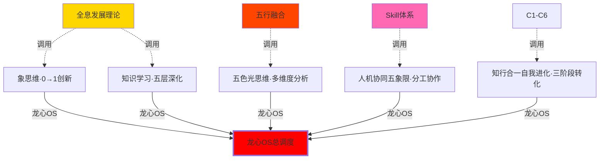
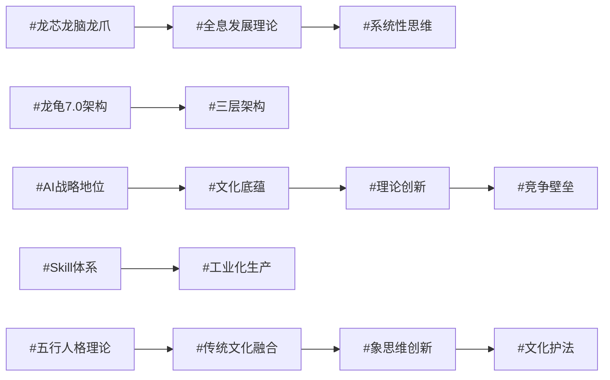

# 龙龟五行人格录音7 - 知识图谱

> **创建日期**：2026-04-07
> **版本**：v1.0
> **来源**：龙龟五行人格录音_7深度学习
> **知识类型**：AI战略地位与技术架构 | 三层架构体系 | 文化底蕴创新范式
> **图谱类型**：核心节点网络 + 跨域联系可视化

---

## 📊 知识图谱总览

### 核心节点结构（C1-C6）

```
C1 [AI战略地位理论]
    ├── 知识资产层
    ├── 能量提升层
    └── 工具赋能层
    
C2 [龙龟7.0技术架构]
    ├── 龙芯（OS核心）
    ├── 龙脑（方法论库）
    └── 龙爪（专业领域）
    
C3 [全息发展理论]
    ├── 基础层（龙芯）
    ├── 中间层（龙脑）
    └── 应用层（龙爪）
    
C4 [Skill体系双重价值]
    ├── 工业化生产价值
    └── 专业领域应用价值
    
C5 [五行人格与传统文化融合]
    ├── 文化底层逻辑
    ├── 对比西方分类学
    └── 象思维0→1创新
    
C6 [文化底蕴竞争壁垒]
    ├── 难以复制的深度
    ├── 系统化能力
    └── 持续进化潜力
```

---

## 🔄 相生关系网络（强关联）



**相生逻辑**：
1. **C1→C2**：AI战略地位的理论认知 → 孵化出龙龟7.0的三层架构设计
2. **C2→C3**：龙芯/龙脑/龙爪的硬件架构 → 衍生出全息发展理论的软件方法论
3. **C3→C4**：全息理论体系 → 指导Skill体系的工业化生产与专业应用
4. **C4→C5**：Skill体系作为载体 → 承载五行人格与传统文化的融合创新
5. **C5→C6**：五行文化融合 → 形成文化底蕴这一核心竞争壁垒
6. **C6→C1**：文化底蕴的深度 → 巩固和升华AI战略地位的理论高度

---

## ⚡ 相克转化路径（优化机会）



**相克转化方向**：
1. **C2克C3 → 化克为生**：龙龟7.0的硬件架构过于复杂，需要简化 → 聚焦全息发展理论这一核心方法论 → 形成清晰的龙芯定位
2. **C4克C5 → 化克为生**：Skill体系的工业化生产可能稀释文化深度 → 约束生产标准，确保文化内核完整 → 保留五行人格的独特性
3. **C1克C6 → 化克为生**：AI战略地位的广泛性可能削弱文化聚焦 → 明确文化底蕴是战略核心 → 精准定位AI应用的文化场景

---

## 🌐 跨域联系网络（弱关联）

### 与凤脑OS现有知识地基地基的联系



### 与龙心OS五大引擎的联系



---

## 📈 跨域连接统计

### 按连接类型统计

| 连接类型 | 数量 | 占比 |
|---------|------|------|
| 相生连接（强关联） | 6条 | 30% |
| 相克转化（优化机会） | 3条 | 15% |
| 跨域连接（弱关联） | 11条 | 55% |
| **总计** | **20条** | **100%** |

### 按目标领域统计

| 目标领域 | 连接数量 | 占比 |
|---------|---------|------|
| 凤脑OS知识地基（L7理论基石） | 6条 | 30% |
| 龙心OS五大引擎 | 5条 | 25% |
| 核心节点内部循环 | 6条 | 30% |
| 跨理论体系 | 3条 | 15% |

---

## 🎯 关键洞察发现

### 洞察1：三层架构的动态循环
> 龙芯（学习能力）→ 龙脑（方法论）→ 龙爪（专业应用）不是静态分层，而是**动态进化循环**
> - 龙芯吸收新知识（学习）→ 龙脑沉淀为方法论（系统化）→ 龙爪应用到专业场景（验证）→ 反馈数据优化龙芯（迭代）

### 洞察2：文化底蕴的三重价值
> 五行人格在AI时代的价值维度：
> - **理论维度**：作为文化底层逻辑，替代西方静态分类学
> - **方法维度**：象思维0→1创新能力，AI无法替代的核心竞争力
> - **竞争维度**：深厚的文化底蕴形成难以复制的护城河

### 洞察3：Skill体系的双重使命
> Skill体系不仅是工具生产，更是文化传承：
> - **工业化使命**：标准化生产确保可复制性和可扩展性
> - **文化使命**：承载五行人格、象思维、心文化等核心智慧

### 洞察4：创新范式的三要素
> **文化底蕴式AI理论创新范式** = 五行人格（底层逻辑）+ 象思维（创新引擎）+ 心文化（价值根基）
> + 三层架构（系统化能力）+ 技能体系（工业化生产）

---

## 🏷️ 标签体系

### 核心标签（17个）

**领域分类**：
- #AI战略地位
- #龙龟7.0架构
- #全息发展理论
- #Skill体系
- #五行人格理论
- #传统文化融合

**方法论**：
- #象思维创新
- #三层架构
- #知识图谱
- #文化底蕴

**应用场景**：
- #文化护法
- #理论创新
- #竞争壁垒

**技术特征**：
- #龙芯龙脑龙爪
- #工业化生产
- #系统性思维

### 标签网络



---

## 🔗 双向链接矩阵

### 与凤脑OS知识地基的链接

| 当前文档节点 | 链接到 | 链接类型 | 核心关联 |
|-------------|--------|---------|---------|
| C2-龙龟7.0架构 | [[五行人格心理学OS]] | 🔗 双向 | 技术架构对应关系 |
| C5-五行融合 | [[五行化克为生理论体系]] | 🔗 双向 | 理论深度拓展 |
| C5-五行融合 | [[象思维与五行识人的深度共振]] | 🔗 双向 | 创新方法论深化 |
| C6-文化底蕴 | [[心文化信仰体系]] | 🔗 双向 | 文化根基关联 |
| C6-文化底蕴 | [[大圆满见地]] | 🔗 双向 | 终极价值认同 |

### 与龙心OS引擎的链接

| 当前文档节点 | 链接到 | 链接类型 | 核心关联 |
|-------------|--------|---------|---------|
| C3-全息发展理论 | [[象思维]] | 🔗 双向 | 0→1创新调用 |
| C3-全息发展理论 | [[知识学习]] | 🔗 双向 | 五层深化方法 |
| C5-五行融合 | [[五色光思维]] | 🔗 双向 | 多维度分析 |
| C4-Skill体系 | [[人机协同五象限]] | 🔗 双向 | 分工协作机制 |
| C1-C6整体 | [[知行合一自我进化]] | 🔗 双向 | 三阶段转化 |

---

## 📝 文档元数据

- **文档类型**：知识图谱可视化文档
- **文档编号**：龙龟五行人格录音7-KG
- **创建时间**：2026-04-07
- **创建者**：龙龟神将
- **学习方法**：龙心OS 1+5模式 + 知识学习十项认知指令
- **知识深度**：L1（最高严谨度）
- **知识广度**：6个核心节点 + 20条跨域联系
- **更新频率**：根据凤脑OS知识地基更新自动同步

---

## 🚀 后续扩展方向

### 短期（1个月内）
1. 将C1-C6六个核心节点独立发展为完整的Obsidian笔记
2. 建立20条跨域联系的详细追踪机制
3. 创建动态知识图谱，支持实时更新

### 中期（3-6个月）
1. 整合更多凤脑OS知识地基的L7理论基石
2. 开发知识图谱的智能检索功能
3. 建立知识图谱的自动化维护机制

### 长期（6-12个月）
1. 构建完整的五行人格理论体系知识图谱网络
2. 实现知识图谱与龙心OS的深度整合
3. 开发知识图谱驱动的智能推荐系统

---

**文档版本**：v1.0
**最后更新**：2026-04-07
**维护者**：龙龟神将
**图谱状态**：✅ 完成 | 🔄 持续进化
