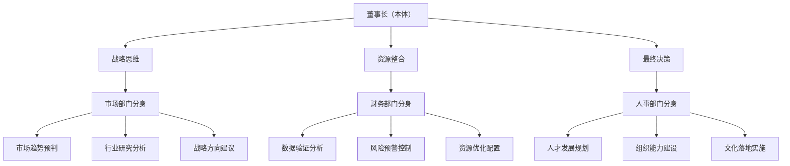

# 分身理论应用

## 🎯 理论概述
**分身理论**是一种组织管理理论，指的是高层管理者（如董事长）将自己的专业能力、决策权限和战略视野"分身"到各专业部门，使各部门负责人成为高层管理者在该领域的专业延伸和战略执行者。

## 📋 核心定义

### 什么是分身？
```
分身 = 战略视野 + 专业能力 + 决策权限 + 执行责任
```

### 分身的四个特征
1. **战略一致性**：与高层管理者战略思维保持一致
2. **专业延伸性**：在专业领域延伸高层管理者的能力
3. **决策自主性**：在授权范围内自主决策
4. **责任承担性**：承担决策和执行的完全责任

## 🏗️ 理论架构

### 三维分身模型


### 各维度详细说明

#### 1. 战略思维分身
**目标**：将董事长的战略思维延伸到各专业领域

```yaml
市场部门分身：
  核心能力：行业趋势预判、竞争格局分析
  工作方式：定期市场研究报告、行业动向分析
  输出成果：战略方向建议、市场机会识别
  价值体现：成为董事长的"市场眼睛"

财务部门分身：
  核心能力：数据验证分析、风险预警控制
  工作方式：经营数据分析、财务风险评估
  输出成果：经营状况报告、风险预警提示
  价值体现：成为董事长的"数据大脑"

人事部门分身：
  核心能力：人才发展规划、组织能力建设
  工作方式：人才盘点分析、组织能力评估
  输出成果：人才发展计划、组织优化方案
  价值体现：成为董事长的"人才心脏"
```

#### 2. 资源整合分身
**目标**：将董事长的资源整合能力延伸到各专业领域

```python
class 资源整合分身:
    def __init__(self, 部门):
        self.部门 = 部门
        self.资源类型 = self.获取资源类型()
        self.整合方法 = self.设计整合方法()
        self.价值创造 = self.规划价值创造()
    
    def 获取资源类型(self):
        return {
            "市场部": ["行业信息", "客户资源", "渠道关系"],
            "财务部": ["资金资源", "数据资源", "政策资源"],
            "人事部": ["人才资源", "培训资源", "文化资源"]
        }
    
    def 设计整合方法(self):
        return {
            "信息整合": "多渠道信息收集分析",
            "资源优化": "现有资源效率提升",
            "新资源开发": "开拓新的资源渠道"
        }
```

#### 3. 决策执行分身
**目标**：将董事长的决策执行能力延伸到各专业领域

```
决策流程：
  问题识别 → 方案设计 → 决策建议 → 执行实施 → 效果评估
  
分身的角色：
  1. 问题识别者：发现专业领域的问题
  2. 方案设计者：设计解决问题的方案
  3. 决策建议者：向董事长提出决策建议
  4. 执行实施者：负责方案的实施执行
  5. 效果评估者：评估实施效果并提出改进
```

## 🚀 实施步骤

### 第一阶段：认知统一（1个月）
```markdown
## 步骤1：理论理解
- 学习分身理论基本概念
- 理解分身的重要性和价值
- 掌握分身的核心要求

## 步骤2：角色定位
- 明确各部门的分身角色
- 制定分身的职责清单
- 建立分身的考核标准

## 步骤3：能力评估
- 评估现有人员的能力差距
- 制定能力提升计划
- 开展必要的培训
```

### 第二阶段：实践应用（3-6个月）
```markdown
## 步骤4：工作模式转变
- 从执行者转变为思考者
- 从部门视角转变为企业视角
- 从短期目标转变为长期战略

## 步骤5：决策权限授权
- 明确授权的范围和边界
- 建立决策的流程和标准
- 设立决策的监督机制

## 步骤6：工作成果输出
- 定期输出专业分析报告
- 提出战略发展建议
- 展示分身的价值创造
```

### 第三阶段：机制固化（6-12个月）
```markdown
## 步骤7：制度建立
- 建立分身工作制度
- 完善考核激励机制
- 制定人才培养计划

## 步骤8：文化融入
- 将分身理念融入企业文化
- 形成分身的思维习惯
- 建立分身的传承机制

## 步骤9：持续优化
- 定期评估分身效果
- 优化分身工作方法
- 扩展分身应用范围
```

## 🔧 分身能力要求

### 基础能力要求
```yaml
战略思维能力：
  - 行业趋势分析能力
  - 竞争格局判断能力
  - 战略机会识别能力
  - 长远发展规划能力

专业决策能力：
  - 专业问题分析能力
  - 解决方案设计能力
  - 风险评估控制能力
  - 决策效果预测能力

资源整合能力：
  - 信息资源整合能力
  - 人力资源整合能力
  - 资金资源整合能力
  - 社会资源整合能力

执行实施能力：
  - 计划制定能力
  - 团队组织能力
  - 过程控制能力
  - 效果评估能力
```

### 高级能力要求
```python
class 高级分身能力:
    def 创新思维能力(self):
        return "在专业领域提出创新性解决方案"
    
    def 跨界整合能力(self):
        return "整合不同领域的知识和资源"
    
    def 文化塑造能力(self):
        return "在专业领域塑造和传播企业文化"
    
    def 人才培养能力(self):
        return "培养专业领域的后备人才"
    
    def 影响力建设能力(self):
        return "在专业领域建立影响力和话语权"
```

## 📊 考核评估体系

### 考核指标体系
```markdown
## 战略贡献指标
- 战略建议采纳率：提出的战略建议被采纳的比例
- 趋势预判准确度：对行业趋势预判的准确程度
- 机会识别数量：识别出的战略机会数量和质量

## 专业成果指标
- 专业报告质量：专业分析报告的质量和深度
- 问题解决效果：解决问题的效果和效率
- 创新方案数量：提出的创新性解决方案数量

## 资源整合指标
- 资源开发数量：新开发资源的价值和数量
- 资源利用效率：现有资源的利用效率提升
- 资源整合效果：跨部门资源整合的效果

## 执行效果指标
- 计划完成率：工作计划的完成程度
- 团队建设效果：团队能力的提升程度
- 文化传播效果：企业文化传播的效果
```

### 评估周期和方法
```yaml
评估周期：
  月度评估：工作进展和成果评估
  季度评估：战略贡献和能力提升评估
  年度评估：综合表现和未来发展评估

评估方法：
  成果评估：工作成果的质量和数量评估
  能力评估：分身能力的提升程度评估
  价值评估：对企业发展的价值贡献评估
  团队评估：团队建设和文化传播评估
```

## 🛠️ 实施工具包

### 工具1：分身角色定位表
```markdown
| 部门 | 分身角色 | 核心职责 | 能力要求 | 考核指标 |
|------|----------|----------|----------|----------|
| 市场部 | 市场眼睛 | 行业研究、趋势预判 | 分析能力、预见能力 | 研究报告质量、趋势预判准确度 |
| 财务部 | 数据大脑 | 数据分析、风险预警 | 分析能力、风险意识 | 数据报告质量、风险预警及时性 |
| 人事部 | 人才心脏 | 人才规划、组织建设 | 识人能力、培养能力 | 人才发展计划、组织能力提升 |
| 供应链部 | 资源手臂 | 资源整合、优化配置 | 整合能力、优化能力 | 资源开发效果、成本控制效果 |
```

### 工具2：分身工作日志
```markdown
## 今日思考
- 发现了什么新的行业趋势？
- 识别了什么战略机会？
- 遇到了什么专业问题？

## 今日行动
- 进行了什么专业分析？
- 提出了什么解决方案？
- 整合了什么资源？

## 今日成果
- 输出了什么专业报告？
- 解决了什么问题？
- 创造了什么价值？

## 明日计划
- 计划进行什么专业研究？
- 计划解决什么专业问题？
- 计划创造什么专业价值？
```

### 工具3：分身能力评估表
```markdown
## 战略思维能力评估
- 行业趋势分析能力：□初级 □中级 □高级
- 竞争格局判断能力：□初级 □中级 □高级
- 战略机会识别能力：□初级 □中级 □高级
- 长远发展规划能力：□初级 □中级 □高级

## 专业决策能力评估
- 专业问题分析能力：□初级 □中级 □高级
- 解决方案设计能力：□初级 □中级 □高级
- 风险评估控制能力：□初级 □中级 □高级
- 决策效果预测能力：□初级 □中级 □高级

## 资源整合能力评估
- 信息资源整合能力：□初级 □中级 □高级
- 人力资源整合能力：□初级 □中级 □高级
- 资金资源整合能力：□初级 □中级 □高级
- 社会资源整合能力：□初级 □中级 □高级
```

## 🎯 成功关键因素

### 1. 高层支持
```
- 董事长充分理解和认同
- 给予充分的授权和信任
- 提供必要的资源支持
- 建立开放的沟通机制
```

### 2. 人员能力
```
- 选择合适的人员担任分身
- 提供系统的能力培训
- 建立持续的学习机制
- 鼓励创新和实践
```

### 3. 制度保障
```
- 明确分身的职责和权限
- 建立科学的考核机制
- 设计合理的激励机制
- 提供充分的资源支持
```

### 4. 文化支撑
```
- 建立信任和授权的文化
- 鼓励创新和担当的文化
- 重视学习和成长的文化
- 强调价值和贡献的文化
```

## ⚠️ 风险控制

### 常见风险及应对
```yaml
授权风险：
  风险描述：授权过大或过小
  应对措施：明确授权边界，建立监督机制

能力风险：
  风险描述：分身能力不足
  应对措施：加强能力培训，建立辅导机制

沟通风险：
  风险描述：信息沟通不畅
  应对措施：建立定期沟通机制，使用统一沟通工具

协调风险：
  风险描述：部门之间协调困难
  应对措施：建立协调机制，明确协作流程
```

### 风险预警机制
```
预警指标：
  决策失误率 > 10%
  战略建议采纳率 < 30%
  团队满意度 < 70%
  工作进度延迟率 > 20%

应对流程：
  预警触发 → 原因分析 → 改进措施 → 
  实施改进 → 效果评估 → 机制优化
```

## 🔄 持续优化机制

### 优化循环
```
实践应用 → 效果评估 → 问题分析 → 
能力提升 → 方法优化 → 制度完善 → 
文化强化 → 再次实践
```

### 优化重点
```markdown
## 能力优化
- 战略思维能力优化
- 专业决策能力优化
- 资源整合能力优化
- 执行实施能力优化

## 方法优化
- 工作方法优化
- 决策方法优化
- 沟通方法优化
- 协作方法优化

## 制度优化
- 考核制度优化
- 激励制度优化
- 培训制度优化
- 沟通制度优化
```

## 📈 预期成效

### 短期成效（3-6个月）
```
1. 各部门战略思维开始建立
2. 专业决策能力初步提升
3. 资源整合意识开始形成
4. 工作成果质量有所提高
```

### 中期成效（6-12个月）
```
1. 分身角色基本确立
2. 战略贡献开始显现
3. 专业价值得到认可
4. 组织效率显著提升
```

### 长期成效（1-3年）
```
1. 形成强大的专业团队
2. 建立系统的决策机制
3. 实现高效的组织运作
4. 形成深厚的专业积累
5. 支撑企业的持续发展
```

## 🎓 学习与应用建议

### 学习路径
```markdown
## 第一阶段：理论学习
- 学习分身理论基本概念
- 理解分身的价值和意义
- 掌握分身的能力要求

## 第二阶段：案例分析
- 分析成功分身案例
- 学习分身实践经验
- 理解分身应用要点

## 第三阶段：实践应用
- 在实际工作中应用
- 不断反思和改进
- 积累分身经验

## 第四阶段：优化创新
- 优化分身工作方法
- 创新分身应用模式
- 建立个人分身体系
```

### 应用建议
```
1. 结合企业实际情况应用
2. 注重能力的系统提升
3. 坚持持续的学习和实践
4. 建立反馈和改进机制
5. 培养团队的协作精神
```

---

**理论来源**：聊天记录3中的实践总结  
**理论基础**：战略管理、组织行为学、领导力理论  
**实践验证**：在企业中实际应用验证  
**应用价值**：提升组织决策质量、增强专业能力、促进战略落地  
**关联文档**：[[创业单元模式.md]]、[[文化落地路径.md]]、[[24节气市场理论.md]]  
**适用场景**：企业战略转型期、专业能力建设期、组织效率提升期、文化落地深化期