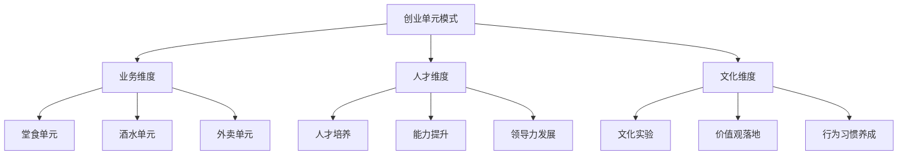

# 创业单元模式

## 🎯 模式概述
**创业单元模式**是一种将大组织分解为小型、独立、自负盈亏的经营单元，通过内部创业实现人才培养和组织发展的管理模式。

## 📋 核心定义

### 什么是创业单元？
```
创业单元 = 小组织 + 独立经营 + 人才培养 + 文化实验
```

### 创业单元的五个特征
1. **独立性**：相对独立的经营权和决策权
2. **完整性**：包含完整的业务价值链
3. **成长性**：注重人才培养和团队成长
4. **实验性**：作为新模式的试验田
5. **复制性**：成功后可以标准化复制

## 🏗️ 模式架构

### 三维架构模型


### 各维度详细说明

#### 1. 业务维度
**目标**：建立可复制的业务模式

```yaml
堂食单元：
  业务特点：高客单价、文化体验
  核心产品：金枪鱼刺身等高端产品
  价值主张：文化溢价和独特体验
  复制标准：达到设定营业额比例

酒水单元：
  业务特点：高毛利、社交属性
  核心产品：四季酒等特色酒水
  价值主张：情感连接和社交价值
  复制标准：达到20%营业额占比

外卖单元：
  业务特点：高频次、标准化
  核心产品：吃三盒等套餐产品
  价值主张：便捷高效和品质保证
  复制标准：达到30%营业额占比
```

#### 2. 人才维度
**目标**：建立可持续的人才复刻机制

```python
class 人才培养系统:
    def __init__(self):
        self.输入标准 = "符合企业文化价值观"
        self.培养路径 = ["基础培训", "在岗实践", "导师指导", "独立负责"]
        self.能力目标 = ["销售能力", "服务能力", "管理能力", "创新能力"]
        self.输出标准 = "能独立负责一个创业单元"
        self.评估机制 = ["定期考核", "业绩评估", "文化认同", "团队反馈"]
```

#### 3. 文化维度
**目标**：实现企业文化的深度落地

```
文化落地路径：
  理念理解 → 行为习惯 → 价值创造 → 文化传承
  
具体实施：
  1. 理念培训：理解企业文化核心理念
  2. 行为规范：制定符合文化的行为标准
  3. 激励机制：奖励符合文化的行为
  4. 案例分享：传播文化实践的成功案例
  5. 持续优化：根据实践反馈优化文化实践
```

## 🚀 实施步骤

### 第一阶段：模式设计（1-2个月）
```markdown
## 步骤1：现状分析
- 分析当前业务瓶颈
- 识别人才发展问题
- 评估文化落地情况

## 步骤2：单元定义
- 确定创业单元类型
- 制定业务标准
- 设计组织架构

## 步骤3：激励机制设计
- 设计奖金分配方案
- 制定考核标准
- 建立晋升通道
```

### 第二阶段：试点运行（3-6个月）
```markdown
## 步骤4：试点选择
- 选择适合的门店
- 配置核心团队
- 提供必要资源

## 步骤5：运行监控
- 定期数据收集
- 问题及时解决
- 经验及时总结

## 步骤6：模式优化
- 根据运行情况优化
- 调整激励机制
- 完善管理制度
```

### 第三阶段：全面推广（6-12个月）
```markdown
## 步骤7：标准化
- 制定标准操作程序
- 编写培训材料
- 建立评估体系

## 步骤8：全面推广
- 在其他门店推广
- 批量培养人才
- 建立复制机制

## 步骤9：持续优化
- 定期评估效果
- 收集反馈意见
- 持续改进优化
```

## 💰 激励机制设计

### 奖金池设计
```yaml
总体规模：5万元/创业单元/年
分配比例：
  总设计师（负责人）：30%（1.5万元）
  创业单元团队：50%（2.5万元）
  门店全员：20%（1万元）

考核维度：
  人才输出：培养合格人才数量
  业务增长：营业额增长率
  文化落地：文化理念实践程度
  团队协作：内部协作效率
```

### 考核标准设计
```python
class 考核标准:
    def 人才输出考核(self):
        return {
            "基础要求": "培养1名合格人才",
            "优秀标准": "培养3名以上合格人才",
            "卓越标准": "培养6名以上合格人才"
        }
    
    def 业务增长考核(self):
        return {
            "基础要求": "完成基础营业额目标",
            "优秀标准": "完成卓越营业额目标",
            "卓越标准": "超额完成营业额目标"
        }
    
    def 文化落地考核(self):
        return {
            "基础要求": "理解企业文化理念",
            "优秀标准": "践行企业文化行为",
            "卓越标准": "传播企业文化价值"
        }
```

### 晋升通道设计
```
晋升路径：
  普通员工 → 创业单元成员 → 单元负责人 → 店长 → 区域经理
  
晋升条件：
  1. 业绩达标：完成设定的业务目标
  2. 能力达标：具备相应岗位的能力
  3. 文化达标：认同并践行企业文化
  4. 团队达标：能够带领团队成长
```

## 📊 效果评估体系

### 评估指标体系
```markdown
## 业务效果指标
- 营业额增长率：环比和同比数据
- 利润率变化：毛利和净利变化
- 客户满意度：客户评价和复购率
- 市场份额：在细分市场的占有率

## 人才发展指标
- 人才输出数量：培养合格人才数量
- 人才质量：人才的综合能力评估
- 团队稳定性：员工流失率变化
- 领导力发展：管理人才的成长

## 文化落地指标
- 文化理解度：员工对企业文化的理解
- 行为符合度：日常行为与文化要求的符合度
- 价值认同度：对企业价值观的认同程度
- 文化传播力：员工向外传播企业文化的能力
```

### 评估周期和方法
```yaml
评估周期：
  短期评估：每月一次（业务数据）
  中期评估：每季度一次（综合评估）
  长期评估：每年一次（战略评估）

评估方法：
  数据统计：量化指标统计分析
  访谈调研：员工和客户访谈
  行为观察：日常行为观察记录
  案例分析：成功和失败案例分析
```

## 🔧 实施工具包

### 工具1：创业单元启动检查清单
```markdown
## 启动前准备
- [ ] 业务模式定义清晰
- [ ] 团队组建完成
- [ ] 资源配备到位
- [ ] 激励机制明确
- [ ] 培训计划制定

## 启动后跟进
- [ ] 运行数据定期收集
- [ ] 问题及时解决
- [ ] 经验及时总结
- [ ] 模式及时优化
- [ ] 成果及时宣传
```

### 工具2：人才培养跟踪表
```markdown
| 员工姓名 | 当前岗位 | 培养目标 | 培养计划 | 进度跟踪 | 评估结果 |
|----------|----------|----------|----------|----------|----------|
| 张三 | 服务员 | 堂食单元负责人 | 3个月实践+培训 | 第2个月 | 良好 |
| 李四 | 调酒师 | 酒水单元负责人 | 技能培训+管理学习 | 第1个月 | 进行中 |
| 王五 | 外卖员 | 外卖单元负责人 | 业务学习+团队管理 | 第3个月 | 优秀 |
```

### 工具3：文化落地评估表
```markdown
## 文化理念理解评估
- 核心理念理解：□不理解 □基本理解 □深刻理解
- 价值观认同：□不认同 □基本认同 □完全认同
- 行为规范掌握：□不掌握 □基本掌握 □熟练掌握

## 文化实践行为评估
- 日常行为符合度：□不符合 □基本符合 □完全符合
- 团队协作表现：□不协作 □基本协作 □积极协作
- 客户服务表现：□不达标 □基本达标 □超越期望
```

## 🎯 成功关键因素

### 1. 高层支持
```
- 董事长亲自推动
- 资源充分投入
- 政策持续支持
- 文化深度认同
```

### 2. 团队配合
```
- 核心团队能力强
- 成员配合默契
- 学习意愿强烈
- 执行力到位
```

### 3. 制度保障
```
- 激励机制合理
- 考核标准科学
- 晋升通道清晰
- 培训体系完善
```

### 4. 文化支撑
```
- 文化理念清晰
- 价值观一致
- 行为规范明确
- 传播机制有效
```

## ⚠️ 风险控制

### 常见风险及应对
```yaml
人才风险：
  风险描述：核心人才流失
  应对措施：建立人才梯队，完善激励机制

业务风险：
  风险描述：业务模式失败
  应对措施：小范围试点，及时调整优化

文化风险：
  风险描述：文化理念冲突
  应对措施：充分沟通，渐进式改变

管理风险：
  风险描述：管理失控
  应对措施：明确权限，建立监督机制
```

### 风险预警机制
```
预警指标：
  人才流失率 > 15%
  营业额连续3个月下降
  客户投诉率 > 5%
  团队满意度 < 70%

应对流程：
  预警触发 → 原因分析 → 方案制定 → 
  措施实施 → 效果评估 → 机制优化
```

## 🔄 持续优化机制

### 优化循环
```
运行实践 → 数据收集 → 问题分析 → 
方案优化 → 实施改进 → 效果评估 → 
经验总结 → 标准更新 → 再次实践
```

### 优化重点
```markdown
## 业务模式优化
- 产品组合优化
- 服务流程优化
- 运营效率优化
- 成本控制优化

## 人才培养优化
- 培训内容优化
- 培养方法优化
- 评估标准优化
- 激励机制优化

## 文化落地优化
- 传播方式优化
- 实践方法优化
- 评估工具优化
- 激励机制优化
```

## 📈 预期成效

### 短期成效（3-6个月）
```
1. 创业单元初步建立
2. 团队积极性提升
3. 业务数据改善
4. 文化理念开始落地
```

### 中期成效（6-12个月）
```
1. 人才培养机制成熟
2. 业务模式标准化
3. 组织效率显著提升
4. 文化深度融入日常
```

### 长期成效（1-3年）
```
1. 可持续的人才输出
2. 可复制的业务模式
3. 强大的组织能力
4. 深厚的文化底蕴
5. 稳定的企业发展
```

## 🎓 学习与应用建议

### 学习路径
```markdown
## 第一阶段：理论学习
- 学习模式基本概念
- 理解架构设计原理
- 掌握实施步骤方法

## 第二阶段：案例分析
- 分析成功案例经验
- 学习失败案例教训
- 理解实际应用要点

## 第三阶段：实践应用
- 小范围试点应用
- 根据实际情况调整
- 积累实践经验

## 第四阶段：优化创新
- 根据实践优化模式
- 创新应用新的场景
- 建立个人实践体系
```

### 应用建议
```
1. 结合企业实际情况调整
2. 注重文化理念的融入
3. 坚持小步快跑的节奏
4. 建立持续优化的机制
5. 培养内部的学习能力
```

---

**模式来源**：聊天记录3中的实践总结  
**理论基础**：系统思维、矛盾思维、实验思维  
**实践验证**：在现有企业中试点运行  
**应用价值**：解决人才培养、业务复制、文化落地问题  
**关联文档**：[[分身理论应用.md]]、[[文化落地路径.md]]、[[激励机制设计.md]]  
**适用场景**：企业发展期、人才培养期、文化构建期、业务扩张期