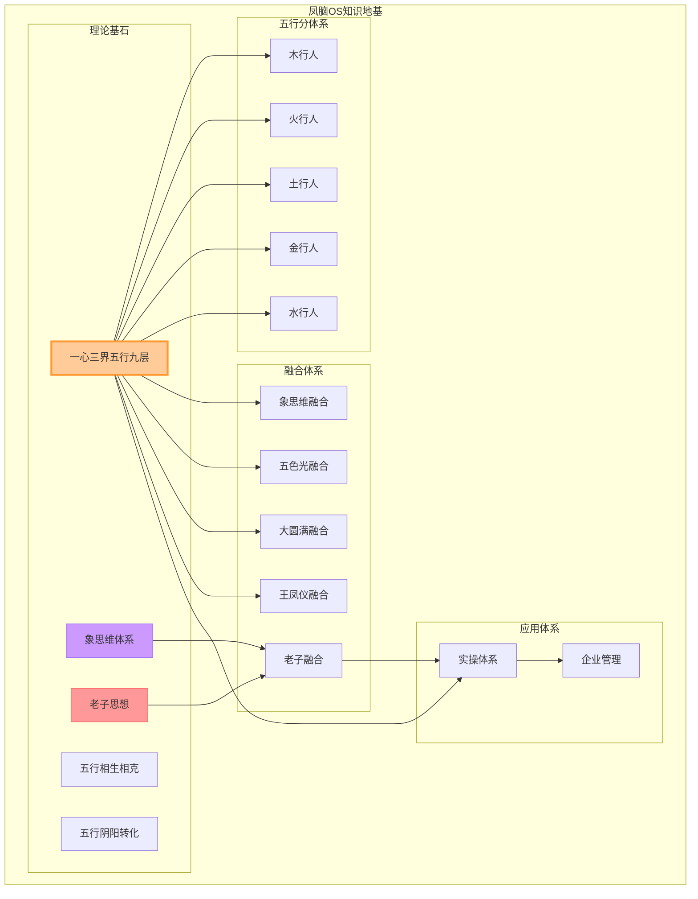

# 凤脑OS知识地基

> 凤脑OS是五行人格心理学智能体的知识地基层，包含理论基石和跨域知识联系网络，为凤心OS提供理论支撑和跨域连接。

## 2026-04-04 新增接入：五行人格特点全文学习网络

### 本轮新增三文件
- [[📖 五行人格心理学人格特点·五维特质知识母本（20250928）]]
- [[📚 五行人格心理学人格特点·总索引（20250928）]]
- [[🌐 五行人格心理学人格特点·知识图谱（20250928）]]

### 新增价值
1. **补齐人格工程模板层**：把 1793 行原文统一重构为“核心驱力 → 五维结构 → 题项行为 → 九层发展 → B=MAP微行为”的调用骨架。
2. **补齐导航层**：让凤心OS在实际对话里可以快速完成“定五行、定维度、判顺逆、判层级、给微行为”的检索动作。
3. **补齐图谱层**：让五行人格特点不再只是静态内容，而是进入可视化、可组合、可调度的知识网络。

### 与凤心OS的直接接口
- **识别接口**：五行核心驱力（木/火/土/金/水）
- **诊断接口**：五维结构（每行五维）
- **分级接口**：九层发展（1-9级）
- **转化接口**：福格模型 B=MAP 微行为抓手

---

## 一、凤脑OS定位

```
┌──────────────────────────────────────────────────────────────┐
│           龙心OS × 凤脑OS × 凤心OS × 凤爪OS                  │
├──────────────────────────────────────────────────────────────┤
│                                                              │
│  龙心OS（总智能体）                                          │
│       ↓                                                      │
│  ┌─────────────────────────────────────────────────┐       │
│  │              凤心OS（智能发动机）                    │       │
│  │  ┌─────────────────────────────────────────┐     │       │
│  │  │            凤脑OS（知识地基）              │     │       │
│  │  │  ┌─────────────────────────────────┐   │     │       │
│  │  │  │      凤爪OS（应用接口层）        │   │     │       │
│  │  │  └─────────────────────────────────┘   │     │       │
│  │  └─────────────────────────────────────────┘     │       │
│  └─────────────────────────────────────────────────┘       │
│                                                              │
└──────────────────────────────────────────────────────────────┘
```

---

## 二、理论基石（17篇核心文档）

### 2.1 基础理论文档

| 序号 | 文档名称 | 核心内容 |
|------|---------|---------|
| 1 | 一心三界五行九层体系 | 五行识人核心框架 |
| 2 | 五行相生相克规律 | 五行能量运行规律 |
| 3 | 五行阴阳转化体系 | 拔阴取阳·化克为生 |
| 4 | 老子核心思想 | 道·德·无为·返璞归真 |
| 5 | 象思维理论体系 | 物象→意象→原象 |

### 2.2 五行分文档

| 序号 | 文档名称 | 核心内容 |
|------|---------|---------|
| 6 | 木行人特质解析 | 曲直·生发·仁德 |
| 7 | 火行人特质解析 | 炎上·明热·礼德 |
| 8 | 土行人特质解析 | 稼穑·承载·信德 |
| 9 | 金行人特质解析 | 从革·刚硬·义德 |
| 10 | 水行人特质解析 | 润下·虚寒·智德 |

### 2.3 融合文档

| 序号 | 文档名称 | 核心内容 |
|------|---------|---------|
| 11 | 融合老子智慧五行识人 | 道—德—五行—三界—一心闭环 |
| 12 | 五行识人×象思维 | 认知范式融合 |
| 13 | 五行识人×五色光 | 思维工具融合 |
| 14 | 五行识人×大圆满 | 心文化融合 |
| 15 | 五行识人×王凤仪 | 化性谈融合 |

### 2.4 应用文档

| 序号 | 文档名称 | 核心内容 |
|------|---------|---------|
| 16 | 五行识人实操体系 | 观象·运象·转化 |
| 17 | 五行识人×企业管理 | 组织应用 |

---

## 三、跨域知识联系网络（核心30条）

### 3.1 五行×老子核心联系

| 序号 | 联系内容 | 来源 |
|------|---------|-----|
| 1 | 道→一心（纯粹觉知） | 融合老子智慧五行识人 |
| 2 | 一→一心（无分别） | 融合老子智慧五行识人 |
| 3 | 德→三界（心界能量） | 融合老子智慧五行识人 |
| 4 | 物→三界（身界形态） | 融合老子智慧五行识人 |
| 5 | 无为→能量调节（顺势而为） | 融合老子智慧五行识人 |
| 6 | 返璞归真→拔阴取阳 | 融合老子智慧五行识人 |
| 7 | 致虚极→悬置 | 融合老子智慧五行识人 |
| 8 | 守静笃→内观 | 融合老子智慧五行识人 |
| 9 | 上善若水→水行特质 | 融合老子智慧五行识人 |
| 10 | 反者道之动→化克为生 | 融合老子智慧五行识人 |
| 11 | 形德合一→外观识别 | 融合老子智慧五行识人 |
| 12 | 无为而治→三界协同 | 融合老子智慧五行识人 |
| 13 | 复归于婴儿→健康层级 | 融合老子智慧五行识人 |
| 14 | 物壮则老→失衡警示 | 融合老子智慧五行识人 |

### 3.2 五行×象思维核心联系

| 序号 | 联系内容 | 来源 |
|------|---------|-----|
| 15 | 物象→五行物象 | 象思维理论体系 |
| 16 | 意象→五行意象 | 象思维理论体系 |
| 17 | 原象→五行原象 | 象思维理论体系 |
| 18 | 动态整体直观→五行平衡 | 象思维理论体系 |
| 19 | 象道合一→与道合真 | 象思维理论体系 |

### 3.3 五行×五色光核心联系

| 序号 | 联系内容 | 来源 |
|------|---------|-----|
| 20 | 木→绿光（生发·创新） | 五色光思维skills |
| 21 | 火→红光（炎上·热情） | 五色光思维skills |
| 22 | 土→黄光（承载·整合） | 五色光思维skills |
| 23 | 金→白光（收敛·精准） | 五色光思维skills |
| 24 | 水→蓝光（润下·冷静） | 五色光思维skills |

### 3.4 五行×大圆满核心联系

| 序号 | 联系内容 | 来源 |
|------|---------|-----|
| 25 | 本来清净→纯粹觉知 | 大圆满核心见地 |
| 26 | 本自圆满→五行本具 | 大圆满核心见地 |
| 27 | 直指心性→一心发现 | 大圆满核心见地 |
| 28 | 解脱自信→无为自由 | 大圆满核心见地 |

### 3.5 五行×王凤仪核心联系

| 序号 | 联系内容 | 来源 |
|------|---------|-----|
| 29 | 认不是→水行真 | 王凤仪化性谈 |
| 30 | 五行病→五行失衡 | 王凤仪化性谈 |

---

## 四、知识网络可视化



---

## 五、核心金句

> 1. **"凤脑OS是五行人格心理学的知识地基层，为凤心OS提供理论支撑和跨域连接。"**
> 2. **"17篇核心文档，130+条跨域联系，构成完整的知识网络。"**
> 3. **"五行识人融合老子智慧，形成道—德—五行—三界—一心的完整闭环。"**
> 4. **"象思维是五行识人的底层认知范式，提供从物象到原象的认知穿透。"**
> 5. **"五色光×五行，形成思维诊断与处方的精准匹配。"**

---

## 六、关联文件索引

### 核心融合文档
- [[融合《老子》智慧的五行识人：认知与实践]]
- [[融合老子智慧五行识人-知识图谱]]

### 理论基石
- [[一心三界五行九层体系]]
- [[象思维理论体系]]

### 五行分文件
- [[木行人分智能体]]
- [[火行人分智能体]]
- [[土行人分智能体]]
- [[金行人分智能体]]
- [[水行人分智能体]]

### 系统文件
- [[龙心OS总智能体]]
- [[凤心OS总智能体]]
- [[📖 五行人格心理学人格特点·五维特质知识母本（20250928）]]
- [[📚 五行人格心理学人格特点·总索引（20250928）]]
- [[🌐 五行人格心理学人格特点·知识图谱（20250928）]]

---

## 七、标签体系

#凤脑OS #知识地基 #五行人格心理学 #理论基石 #跨域联系 #象思维 #老子智慧 #五色光 #大圆满 #王凤仪 #凤心OS #龙心OS
