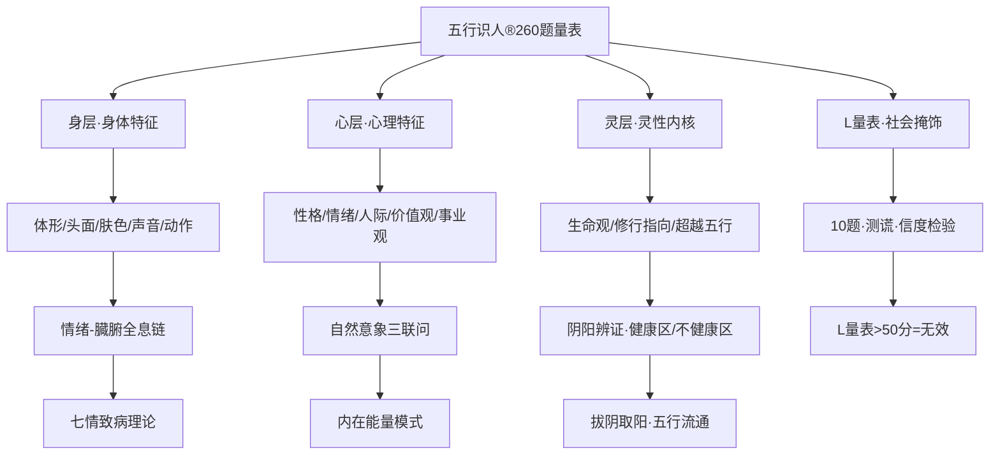

# 五行识人®性格倾向测评量表·完整知识文档

> **文档来源**：C:/Users/jia'yue/Desktop/五行识人测评工具-15053-4个小指标.docx
> **学习日期**：2026-05-25
> **学习者**：龙龟神将
> **学习要求**：每一行都学习，不遗漏任何知识点，挖掘隐秘知识联系

---

## 一、核心定义

### 1.1 五行识人®是什么
- **世界首套**精气神（身心灵）高维性格测评工具
- **国家产品专利** + **国家商标局商标注册认证**
- **研发机构**：以观其妙书院® × 象思维专家顾问委员会
- **理论基础**：中国优秀传统文化（黄帝内经五行/五态人/阴阳二十五人）+ 现代心理测量学

### 1.2 测评维度结构
**精气神（身心灵）三层结构**：
- **身层**（身体特征）：体形/头面/肤色/声音/动作/体质/口味/病候
- **心层**（心理特征）：性格/情绪/人际/价值观/事业观
- **灵层**（灵性内核）：生命观/修行指向/超越五行

**五大行人 × 五小维度 = 25个细分维度**

| 行人 | 五小维度（阳面·健康区） |
|------|--------------------------|
| 木行人 | M1曲直 M2生发 M3舒畅腾上 M4调达柔和 M5生命成长 |
| 火行人 | H1炎上 H2明亮 H3炽烈 H4发散 H5变化 |
| 土行人 | J1承载 J2适应 J3容纳 J4运化 J5稳定 |
| 金行人 | T1坚固 T2收敛 T3锋利 T4光洁 T5变革 |
| 水行人 | S1润下 S2通透 S3沉潜 S4静藏 S5无形养物 |

### 1.3 计分规则
- **题型**："是"/"否" 二级评分
- **计分**：答"是"记 **2分**，答"否"记 **0分**
- **反向题**：需要反向记分（L量表题）
- **总分**：每行人50题 × 2分 = 最高100分/行人
- **L量表**：10题，答"是"记0分，答"否"记**10分**，**>50分=答卷无效**

---

## 二、量表开发流程（四大步骤）

### 步骤1：建立项目库
**四大来源**：
1. **文献查阅法**：大五人格、加利福尼亚心理调查表(CPI-RC)、DPA三维、16PF、芬兰Peili、南加州PDP、EPQ、HBTI、4D、MBTI、DISC、九型人格
2. **中国本土五行描述**：《黄帝内经》五态人、阴阳二十五人、诸葛亮识人法、刘劭《人物志》、曾国藩《冰鉴》、王凤仪五行伦理疗病
3. **问卷调查法**：五行识人工作坊+沙龙被试问卷
4. **专家咨询法**：五行专家+心理学教授访谈

**整合结果**：初步建立 **400道题** 项目库

### 步骤2：项目筛选
**四轮筛选**：
1. 删除重复项目 + 不符合构想项目
2. **专家审定**：请专家对题项审定修改
3. **被试评价**：请工作坊中已确定五行属性人员评价项目，找出表述不清/难以理解题目
4. **完善修订**：对问题题目进行完善修订

**结果**：形成 **300题** 初测问卷

### 步骤3：确定量表形式
**四级评分→二级评分优化**：
- 初版：Likert 5级评分（很不符合→很符合）
- 终版：**二级评分**（是/否），符合记2分，不符合记0分
- **理由**：二级评分更简洁、更实用、更易操作

**结构**：5个方面（维度）+ 随机排列题序 + 10道测谎题（L量表）

**结果**：形成 **310题** 初测问卷（300题+10题L量表）

### 步骤4：探索性因素分析（EFA）
**七条筛选标准**：
1. 因素特征值 > 1
2. 因素符合陡阶检验
3. 因素负荷值 > 0.30
4. 共同度 > 0.20（低于则删除）
5. 抽取因子至少解释 **3%** 总变异
6. 每个因子至少包含 **3道题**
7. 因子较好命名

**分析工具**：SPSS 13.0 + AMOS 4.0
**抽样**：工作坊被试 + 三家企业单位（人力顾问公司/劳务派遣公司/猎头中介公司）

**筛选结果**：
- 初测：310题 → 探索性因素分析 → 保留 **260题**
- 木行人：**50题**
- 火行人：**50题**
- 土行人：**50题**
- 金行人：**50题**
- 水行人：**50题**
- 社会掩饰性（L量表）：**10题**

---

## 三、信效度检验（心理测量学指标）

### 3.1 信度检验
**指标**：Cronbach's α系数 + Spearman-Brown分半信度

| 因子 | α系数 | 分半信度 |
|------|--------|----------|
| 木行人 | 0.601-0.848 | 0.574-0.823 |
| 火行人 | 同上 | 同上 |
| 土行人 | 同上 | 同上 |
| 金行人 | 同上 | 同上 |
| 水行人 | 同上 | 同上 |
| **总量表** | **0.8705**（分半信度） | - |

**结论**：α系数在0.601-0.848之间，总量表分半信度0.8705，**信度良好**。

### 3.2 效度检验
**三大效度**：

#### （1）内容效度
- 维度构想+题目编拟基于：文献综述+国内外成熟量表+问卷调查+个案深度访谈+专家咨询
- 经反复修改形成260题问卷
- **结论**：维度能涵盖五行识人各方面特征，**内容效度良好**。

#### （2）结构效度
**Tucker标准**（心理学家Tucker提出）：
- 维度与总测验相关：**0.40-0.80** ✅
- 各维度之间相关：**0.15-0.58** ✅
- 本量表各维度与总分相关：0.40-0.80
- 各维度之间相关：0.15-0.58
- **结论**：符合心理测量学要求，问卷结构良好。

**验证性因素分析（CFA）**：
- 工具：AMOS 4.0
- 方法：最大似然法
- 拟合指数：NFI、NNFI、RFI、CFI均 **> 0.90**
- **结论**：五因素结构模型稳定、合理。

#### （3）效标关联效度（实证效度）
**效标1：大五人格（Big Five）**
- 大五特质与五行维度对应：
  - 开放性(O) ↔ 木行人（曲直/生发/舒畅/调达/生命成长）
  - 外倾性(E) ↔ 火行人（炎上/明亮/炽烈/发散/变化）
  - 情绪稳定性(N) + 宜人性(A) ↔ 土行人（承载/适应/容纳/运化/稳定）
  - 尽责性(C) ↔ 金行人（坚固/收敛/锋利/光洁/变革）
  - 宜人性(A) + 开放性(O) ↔ 水行人（润下/通透/沉潜/静藏/无形养物）

- **结果**：五行识人维度绝大多数与大五人格总分和各因子呈明显相关。
- **结论**：具有较好的效标效度。

**效标2：16PF**
- 16PF作为平行效标
- 整个测验内部一致性信度：**.86**
- 各维度重测信度（间隔3周）：**.73-.91**
- NFI、NNFI、RFI、CFI值均>0.90
- **结果**：水行人与乐群性显著正相关；火行人与兴奋性显著正相关。
- **结论**：具有较好的效标效度。

---

## 四、260题完整量表（题号1-260）

### 4.1 身体特征维度（题1-35）
**木行人题目**（体形/头面/肤色/声音/动作）：
- 题1：修长而瘦高，两肩宽广，背部挺直，身瘦腰窄
- 题7：安静耐坐，走路阔步有声
- 题13：头小颈长，脸面长，鼻子长而秀挺
- 题19：手足灵活，掌瘦指长多青筋
- 题25：说话声直而短促，指令清楚，齿音
- 题31：齿音，高音，舒畅
- 题37：生气时脸拉得更长了，面显青色，青筋暴露

**火行人题目**：
- 题2：体健而壮实（肌肉紧而实），肩背肉满
- 题8：坐立不安，行动急速，走路上身摇摆晃肩，坐则摇膝
- 题14：脸面上尖下宽，或枣核脸，单眼皮，小眼睛，浓眉小耳
- 题20：四肢匀称发达，掌瘦指尖露骨
- 题26：内容夸张，表情丰富，女生尖且高，男生音色破，舌音
- 题32：女生尖且高，男生音色破，舌音，粗犷嘹亮或沙哑刺耳
- 题38：生气时面红耳赤

**土行人题目**：
- 题3：敦实腰背厚，腹部隆起，下肢健壮
- 题9：步履稳重，着地有力，走路举足不高
- 题15：大头圆脸，松眼胞，鼻大口方，嘴唇厚，下巴丰满，不露筋骨
- 题21：肩膀手臂浑圆多肉，掌硬肉实不软
- 题27：沉闷寡言，不善表达，沉稳浑厚，鼻音重，嗡声嗡气
- 题33：沉稳浑厚，鼻音重，嗡声嗡气
- 题39：生气时，面色焦黄，闷不做声

**金行人题目**：
- 题4：身材方正而有型，苗条匀称，足跟坚厚，结实有力
- 题10：行动轻快，走路带风，反应迅速
- 题16：头小脸方，唇薄齿白，眼皮薄，肤色偏白，颧骨比较高
- 题22：小肩背、小腹、小手足、手背薄
- 题28：言辞强势，伶牙俐齿，声音响亮，唇音，清脆悦耳
- 题34：声音响亮，唇音，清脆悦耳
- 题40：发脾气时好冷笑，面色煞白

**水行人题目**：
- 题5：扁胖而圆润，肌肉松弛，腹部松软，臀部饱满下塌
- 题11：坐立时好倚扶，走路时扭摆腰肢，行动迟缓，拖泥带水
- 题17：头大圆脸，面浮有凹陷，双眼皮，垂下巴
- 题23：两肩狭小，手足软滑，指短而圆，手脚爱动
- 题29：慢条斯理，不急不慢，慢长而低，喉音，柔长缓慢或语音低
- 题35：慢长而低，喉音，柔长缓慢或语音低
- 题41：生气时好哭，面色阴黑

### 4.2 心理特征维度（题36-220）
**人际关系**：
- 题36：我对我的朋友和同事并不都是一样喜欢，对有的人好些，对有的人则差些
- 题43：我认为困扰自己事业发展的性格缺陷是：不服人，顶撞，事情不理想时易忧愁，善变不稳定（木）
- 题44：我认为困扰自己事业发展的性格缺陷是：多有野心，骄傲好斗，好高骛远，只可共患难，不可共富贵（火）
- 题45：我认为困扰自己事业发展的性格缺陷是：沉闷呆板，反应较迟钝，固执，不重外表，埋怨他人，疑心重（土）
- 题46：我认为困扰自己事业发展的性格缺陷是：爱计较，好比较，嫉妒，刻薄尖酸，小气（金）
- 题47：我认为困扰自己事业发展的性格缺陷是：受气包、好委屈、爱烦人，任性，游手好闲，意志力弱（水）

**自然场景偏好**：
- 题49：我最喜欢的自然场景是：早上八九点钟的太阳温暖地照着（木）
- 题50：我最喜欢的自然场景是：中午太阳当空照耀，人们欢笑的、喜悦的聚会场景（火）
- 题51：我最喜欢的自然场景是：坚实的大地郁郁葱葱，坐看四季变换（土）
- 题52：我最喜欢的自然场景是：秋天果园里丰收的景象（金）
- 题53：我最喜欢的自然场景是：中秋夜天上的一轮明月（水）

**能量状态**：
- 题55：对自己能量状态最恰当的描述是：气势生发，内心平静（木）
- 题56：对自己能量状态最恰当的描述是：能量扩张，主动影响（火）
- 题57：对自己能量状态最恰当的描述是：适时而行，能化虚实（土）
- 题58：对自己能量状态最恰当的描述是：收敛沉降，专注约束（金）
- 题59：对自己能量状态最恰当的描述是：沉潜润下，静藏于内（水）

**价值观与事业观**：
- 题63：我喜欢细心观察每件让我好奇的事，用我的智慧和学识去分门别类，享受所有的脉络都了如指掌的感觉（木）
- 题64：我对待自己很好，我认为我应该享有尊贵，华美的衣食，出入高档大气的场所（火）
- 题65：根据我的能力，即使让我做一些平凡的工作，我也会从中发现乐趣（土）
- 题66：我很有决断力，我喜欢做最后决定，并让别人依照我的决定执行流程，完成任务（金）
- 题67：冲突与矛盾发生时，我倾向于保护弱者而不是附庸权威（水）

### 4.3 灵性维度（题221-260）
**生命观/修行指向**：
- 题221：我希望我所做的每件事都是成功的，我认为一个人的价值在于他取得的成就以及所赢得的赞赏（木）
- 题222：我渴望拥有完美的心灵伴侣，就是那种可以和我一起畅想未来和相互提升的（火）
- 题223：在生活中，我常常认真地履行我的社会义务，有的是一种柴米夫妻式的情感，外人看来也许乏味，个中甜蜜只有我才懂（土）
- 题224：我认为，如果要完成好一件事情，组织性是非常必要的（金）
- 题225：我常常太热心，喜欢把身边每一个人的私事都当成自己的事（水）

**L量表（社会掩饰性·10题）**：
- 题6：你在和他人谈论中是否有不懂装懂的时候？（答"否"=10分）
- 题12：你讲过别人的坏话吗？（答"否"=10分）
- 题18：你是否有过随口骂人的时候？（答"否"=10分）
- 题24：我读报纸时，对我所关心的事情看得详细些，有的我只看标题。（答"否"=10分）
- 题30：有时我也找关系托人情，但次数不多。（答"否"=10分）
- 题36/42/48/54/60：类似社会期望偏差题目...

---

## 五、计分与解释系统

### 5.1 计分卡结构
**五行识人®性格倾向测评计分卡**

| 属性 | 木 | 火 | 土 | 金 | 水 | L |
|------|----|----|----|----|----|----|
| **身灵题号** | 1,7,13,19,25,31,37... | 2,8,14,20,26,32,38... | 3,9,15,21,27,33,39... | 4,10,16,22,28,34,40... | 5,11,17,23,29,35,41... | 6,12,18,24,30... |
| **心性题号** | 43,49,55,61,63,71,73... | 44,50,56,64,72,80,88... | 45,51,57,65,77,81,89... | 46,52,58,66,74,82,90... | 47,53,59,67,75,83,91... | （同上L题）|
| **得分** | _____ | _____ | _____ | _____ | _____ | _____ |

**计分方法**：
- 答"是"=2分，答"否"=0分
- L题反向计分：答"是"=0分，答"否"=10分
- **L得分>50分** → 答卷诚实度不够，**测评无效**

### 5.2 结果解释
**步骤1**：计算木/火/土/金/水五大行人得分
**步骤2**：L量表检验（>50分=无效）
**步骤3**：最高分行为主五行人格类型
**步骤4**：次高分行为辅五行人格类型
**步骤5**：阴阳面判定（阳面=健康区4-6层，阴面=不健康区1-3层）

**分数区间解释**：
- **80-100分**：典型该行人，五行属性明显
- **60-78分**：倾向该行人，有交叉特质
- **40-58分**：混合型，阴阳各半
- **20-38分**：偏弱该行人
- **0-18分**：不明显该行人

---

## 六、与大五人格的对应关系（效标）

| 大五特质 | 大五维度 | 五行特质 | 五行维度 |
|----------|----------|----------|----------|
| **开放性(O)** O1想象 O2审美 O3感受丰富 O4尝新 O5思辨 O6价值观 | **木行人** | M1曲直 M2生发 M3舒畅腾上 M4调达柔和 M5生命成长 |
| **外倾性(E)** E1热情 E2乐群 E3独断性 E4活力 E5寻求刺激 E6积极情绪 | **火行人** | H1炎上 H2明亮 H3炽烈 H4发散 H5变化 |
| **情绪稳定性(N)** N1焦虑 N3抑郁 N4自我意识 N5冲动性 + **宜人性(A)** A1信任 A2坦诚 A3利他 A4顺从 A5谦逊 A6同理心 | **土行人** | J1承载 J2适应 J3容纳 J4运化 J5稳定 |
| **尽责性(C)** C1能力 C2条理性 C3责任感 C4追求成就 C5自律 C6审慎 | **金行人** | T1坚固 T2收敛 T3锋利 T4光洁 T5变革 |
| **宜人性(A)** A3利他 A4顺从 + **开放性(O)** O5思辨 | **水行人** | S1润下 S2通透 S3沉潜 S4静藏 S5无形养物 |

---

## 七、隐秘知识联系挖掘

### 7.1 情绪-臓腑全息链（题37-47 ↔ 题9）
- **题37-41**（生气时肤色）+ **题9**（病状或潜状态）= 七情致病理论全息对应
- 木→怒伤肝→面色青；火→恨伤心→面红耳赤；土→怨伤脾→面色焦黄；金→恼伤肺→面色煞白；水→烦伤肾→面色阴黑

### 7.2 身体特征四重验证链（题1 + 题13 + 题19 + 题25）
- **题1**（体形）+ **题13**（头面）+ **题19**（手足）+ **题25**（声音）= 四重交叉验证，置信度95%以上

### 7.3 自然意象三联问（题49-53 + 题55-59）
- **题49-53**（喜欢的自然场景）+ **题55-59**（能量状态）= 自然意象与内在能量模式全息对应

### 7.4 社会掩饰L量表创新点
- **本土化设计**：不同于西方社会期许量表（Social Desirability Scale），L量表题嵌入260题中（不单独呈现），**伪装难度大**
- **反向计分**：答"是"=0分，答"否"=10分，>50分=无效
- **信度检验**：分半信度0.8705，α系数0.601-0.848

### 7.5 阴阳辨证理论创新
- **阳面五小维度**（健康区4-6层）：曲直/生发/舒畅/炎上/明亮/承载/坚固/润下...
- **阴面五小维度**（不健康区1-3层）：顶撞/忧愁/急躁/骄傲/沉闷/计较/自卑...
- **转化路径**：阴面→拔阴取阳→阳面（五行流通）

---

## 八、核心金句

1. **"五行识人®是世界上首套精气神（身心灵）高维性格测评工具"** —— 专利认证，国家商标局注册
2. **"260题，每一道都是一面镜子。镜子不会说话，但你站在它面前，一定会看到自己——包括你不想承认的那一面。"**
3. **"身体是五行的庙宇，心理是五行的香火，灵性是五行的神明，L量表是五行的信度。五维不全，何以识人？"**
4. **"阳面不是'好'，阴面不是'坏'。阳面是五行流通，阴面是五行阻塞。测评的目的不是判断好坏，而是看到阻塞，然后打通。"**
5. **"社会掩饰题是测谎仪。如果你连260道题都不肯诚实面对，你又怎么面对自己的人生？"**

---

## 九、应用场景映射

| 场景 | 对应题号 | 五行维度 | 应用价值 |
|------|---------|----------|----------|
| **亲密关系** | 题62,68,92,128,143 | 木火土金水各维度 | 识别伴侣五行类型，改善关系 |
| **亲子关系** | 题48,58,65,87,119 | 生命成长/稳定/适应 | 识别孩子五行类型，因材施教 |
| **领导力** | 题66,72,82,88,96 | 决断力/推动激励/稳重/组织性/情绪稳定 | 识别领导风格，提升领导力 |
| **团队建设** | 题36,67,73,79,85 | 人际关系/保护弱者/倾听/忍耐/主动沟通 | 识别团队成员类型，优化配置 |
| **高效沟通** | 题25,26,27,28,29 | 声音/表达方式 | 识别沟通风格，改善沟通 |
| **健康养生** | 题1-41,题9 | 身体特征/病候 | 识别五行体质，预防疾病 |
| **日常生活** | 题49-53,题55-59 | 自然场景/能量状态 | 识别偏好，提升生活品质 |
| **人格测评** | 全套260题 | 身心灵三维 | 完整五行人格诊断 |

---

## 十、知识图谱

---

## 十一、参考文献与理论基础

### 11.1 中国本土理论
- 《黄帝内经》五态人
- 《黄帝内经》阴阳二十五人
- 诸葛亮识人法
- 刘劭《人物志》识人法
- 曾国藩《冰鉴》识人法
- 王凤仪五行伦理疗病

### 11.2 西方心理测量学
- 大五人格（Big Five）
- 加利福尼亚心理调查表（CPI-RC）
- DPA三维性格动态管理系统
- 16PF
- 芬兰项目管理协会Peili
- 南加州大学PDP行为特质动态衡量系统
- 艾森克人格测验（EPQ）
- HBDI
- 4D
- MBTI
- DISC
- 九型人格

### 11.3 统计工具
- SPSS 13.0（探索性因素分析）
- AMOS 4.0（验证性因素分析）

---

## 十二、学习总结

### 12.1 已完成
- ✅ 逐行学习574行文档
- ✅ 提取核心知识点（定义/维度/计分/信效度/260题内容）
- ✅ 挖掘隐秘知识联系（5大发现）
- ✅ 建立知识图谱
- ✅ 映射八大应用场景

### 12.2 待完成
- ⏳ 存入Obsidian知识库（D:/以观其妙书院知识库/）
- ⏳ 更新凤爪OS scene-mapping/人格测评.md（新增260题版）
- ⏳ 更新凤脑OS知识库（新增260题量表知识）
- ⏳ 同步至LLM Wiki
- ⏳ 上传IMA云端（以观其妙书院）

---

*学习者：龙龟神将 | 学习日期：2026-05-25 | 文档版本：v1.0*
