# 拔阴取阳 - 知识图谱可视化

> **图谱类型**: 独立知识图谱文件
> **覆盖范围**: 拔阴取阳与五行人格心理学全系统关系网络
> **最后更新**: 2026-04-04
> **维护者**: 龙龟神将

---

## 🌐 核心关系网络

### 拔阴取阳理论定位图

```mermaid
graph LR
    A[五行人格心理学] --> B[拔阴取阳理论]
    A --> C[五行分智能体系统]
    A --> D[五行分类图谱]
    A --> E[L7理论基石]
    
    B --> F[三界生命模型]
    B --> G[五行病诊断]
    B --> H[五行通关点]
    B --> I[四步法详解]
    B --> J[超越三界外]
    
    B --> K[象思维]
    B --> L[五色光思维]
    B --> M[知行合一]
    
    F --> N[心文化体系]
    N --> O[大圆满见地]
    
    style B fill:#ff6b6b
    style N fill:#4ecdc4
    style K fill:#95e1d3
    style L fill:#f38181
    style O fill:#aa96da
```

---

## 🧬 五行能量流动图谱

### 五行相生循环

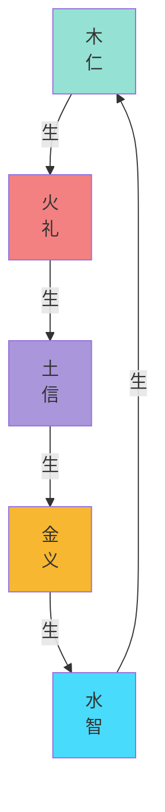

### 拔阴取阳转化路径

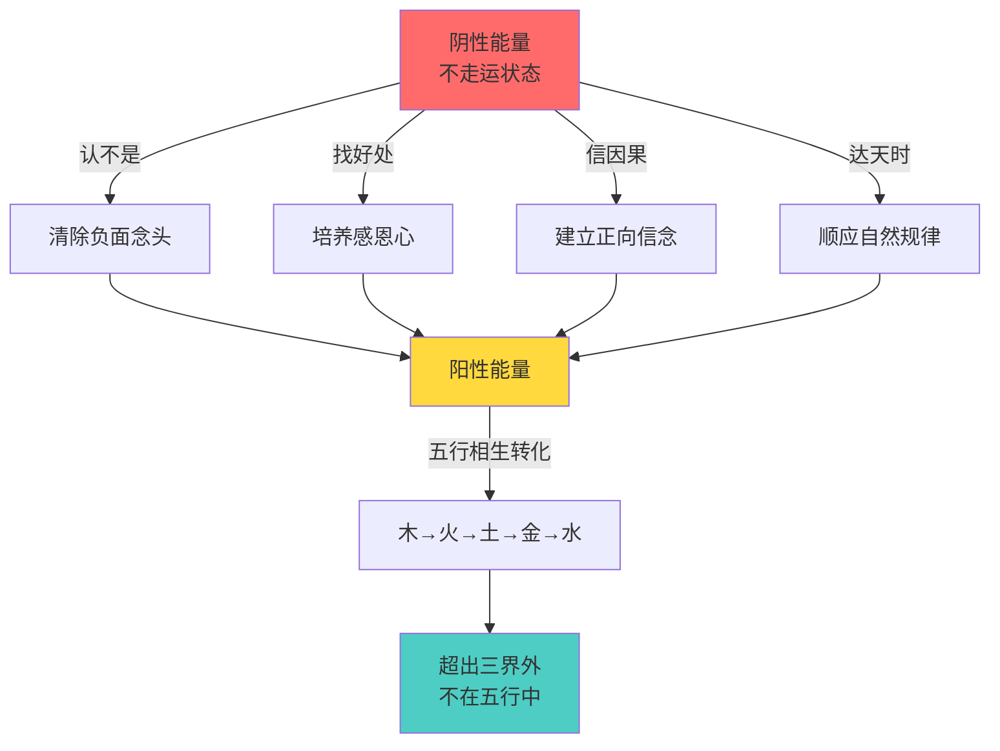

---

## 🏥 五行病诊断图谱

### 五行病诊断链条

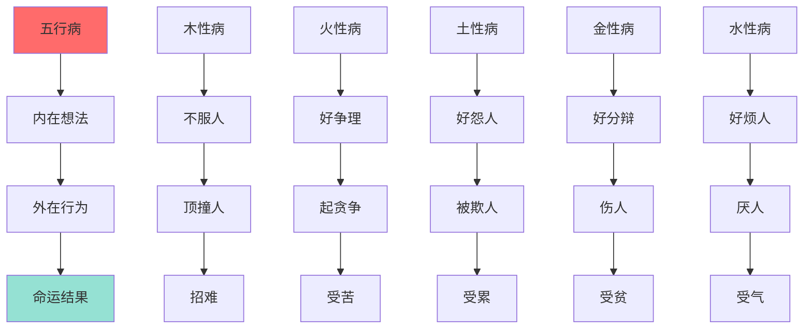

### 五行病与脏腑对应图谱

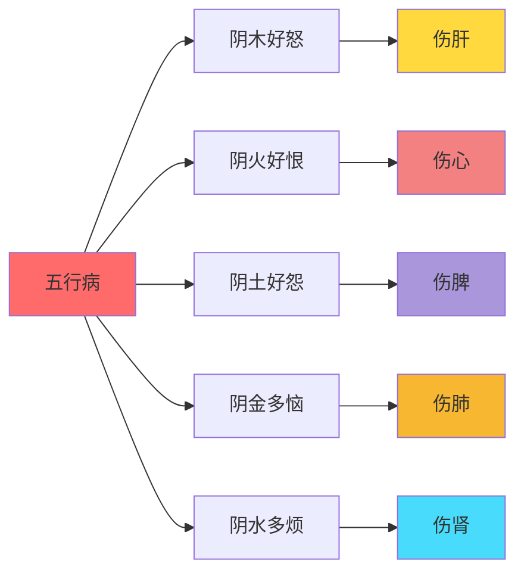

---

## 🏔️ 三界生命模型图谱

### 三界诊断图谱

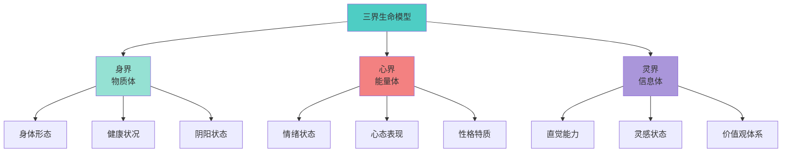

### 三界转化图谱

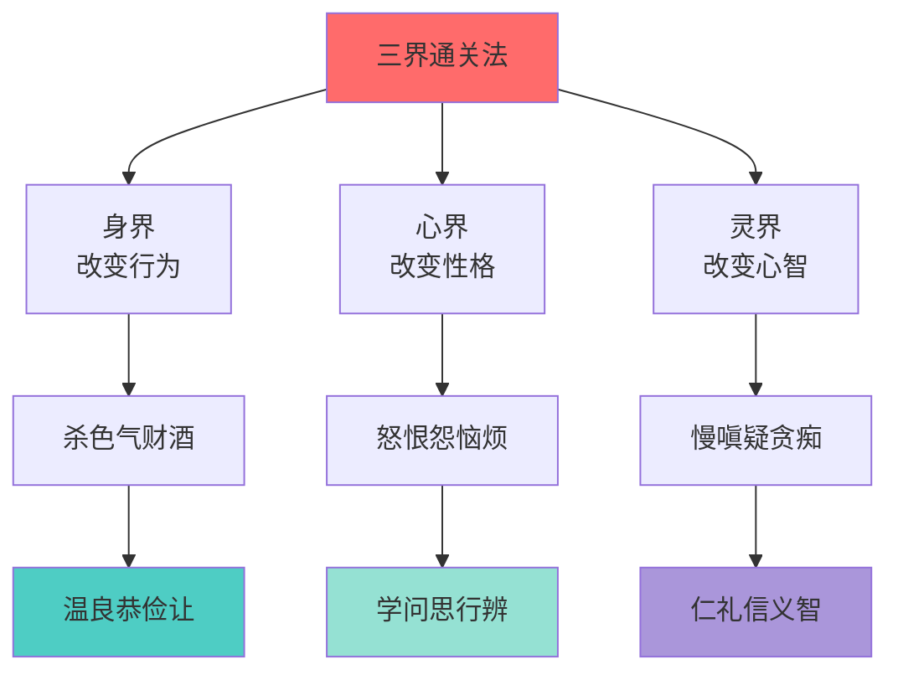

---

## 🔀 五行通关点图谱

### 五行通关点矩阵

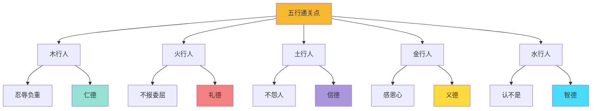

### 通关点转化关系

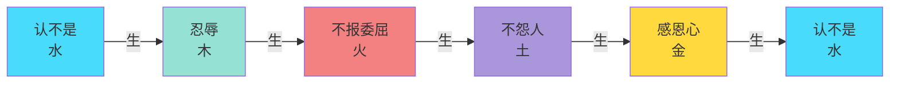

---

## 🌟 超越三界外图谱

### 三清境界图谱

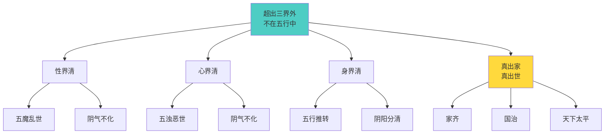

---

## 🔗 跨体系关联图谱

### 与龙心OS体系关联

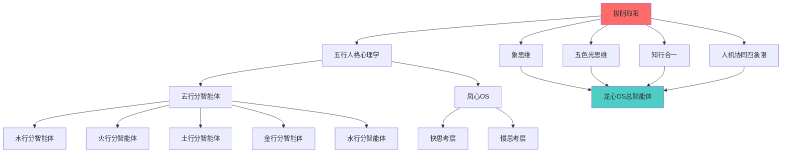

### 与心文化体系关联

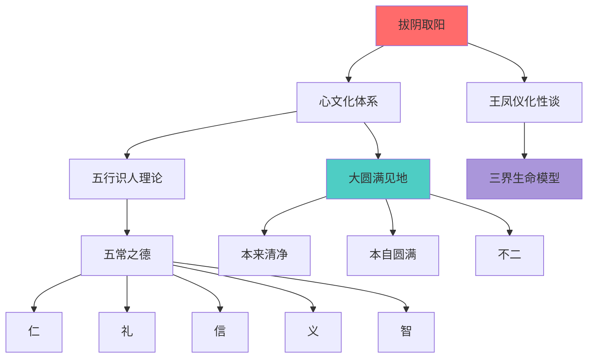

---

## 📈 进化路径图谱

### 学习路径图

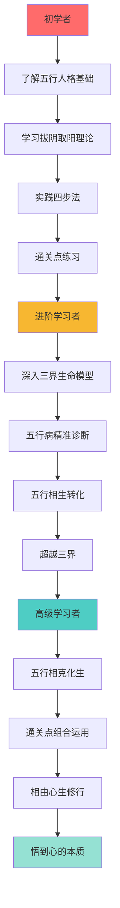

---

## 📊 数据统计图谱

### 五行能量分布图

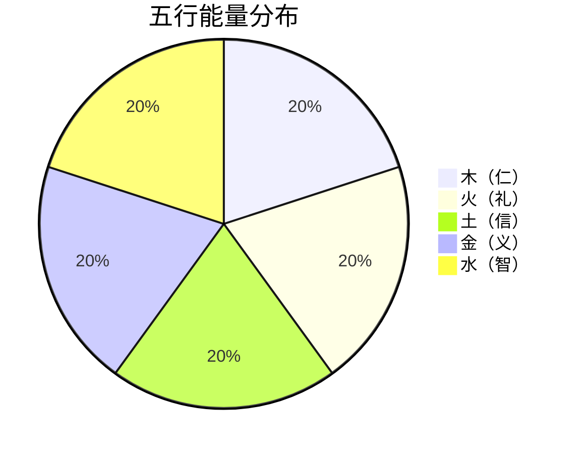

### 三界能量构成图

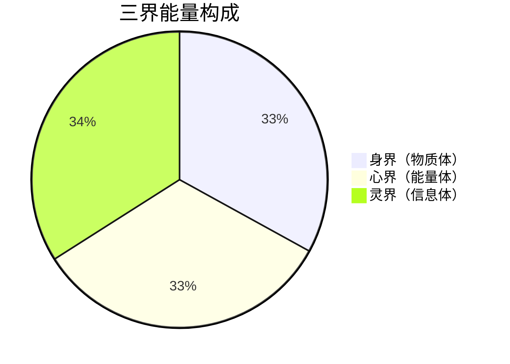

---

## 🔄 动态演化图谱

### 能量转化动态图

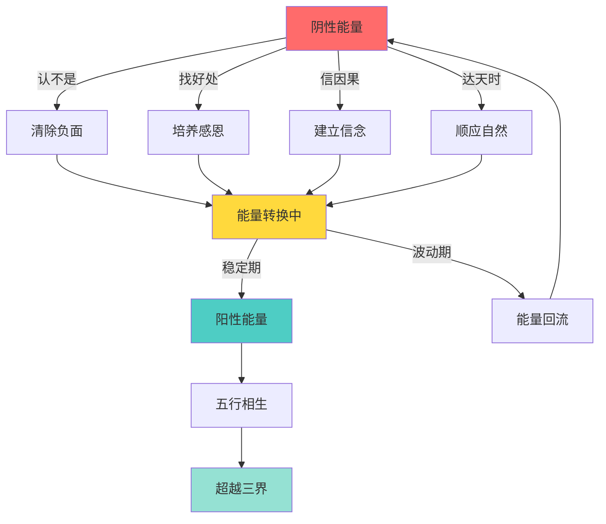

---

## 📖 标签关系图谱

### 标签层次结构

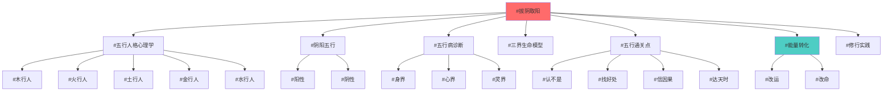

---

## 🔍 检索路径图谱

### 问题解决路径

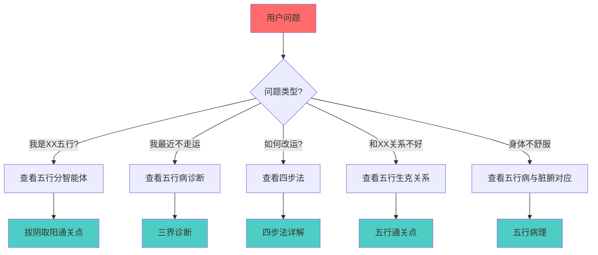

---

**图谱版本**: 1.0
**创建时间**: 2026-04-04
**最后更新**: 2026-04-04
**文档类型**: 独立知识图谱文件
**所属系统**: 五行人格心理学·拔阴取阳模块

---

*拔阴取阳 - 知识图谱可视化* · 龙心OS知识网络核心图谱
