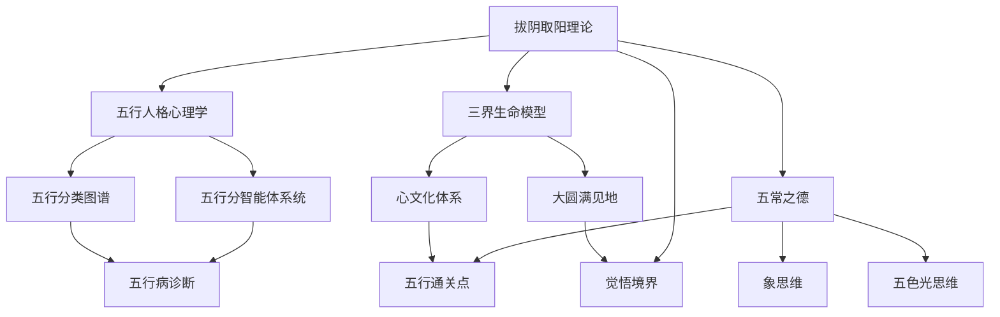

# 拔阴取阳 - 知识索引

> **索引类型**: 总导航索引
> **索引范围**: 拔阴取阳完整知识体系
> **最后更新**: 2026-04-04
> **维护者**: 龙龟神将

---

## 📋 索引导航

### 快速导航
- 🌟 **核心文档**: [[拔阴取阳-深度学习与知识图谱]]
- 📊 **知识图谱**: [[拔阴取阳-知识图谱可视化]]
- 📚 **WorkBuddy版**: [[拔阴取阳-WorkBuddy知识库版]]

### 主题分类索引

#### 📚 核心理论
| 主题 | 关键词 | 快速跳转 |
|------|---------|-----------|
| 拔阴取阳定义 | #拔阴取阳 | [[拔阴取阳-深度学习与知识图谱#核心定义]] |
| 四步法 | #认不是 #找好处 #信因果 #达天时 | [[拔阴取阳-深度学习与知识图谱#四步法详解]] |
| 核心公式 | #阴性能量 #阳性能量 | [[拔阴取阳-深度学习与知识图谱#核心公式]] |

#### 🧬 五行诊断
| 五行 | 阴性诊断 | 阳性转化 | 通关点 |
|------|-----------|-----------|---------|
| 木行人 | 不服人、抗上、顶撞 | 仁德、正直担当 | [[木行人格心理学]] #忍辱负重 |
| 火行人 | 争理、急躁、虚荣 | 礼明、热情自信 | [[火行人格心理学]] #不报委屈 |
| 土行人 | 怨人、疑心、不信任 | 信实、包容稳重 | [[土行人格心理学]] #不怨人 |
| 金行人 | 好分辩、嫉妒、计较 | 义气、感恩心 | [[金行人格心理学]] #感恩心 |
| 水行人 | 好烦、多愁、自卑 | 智慧、柔和清静 | [[水行人格心理学]] #认不是 |

#### 🏥 三界生命模型
| 三界 | 阴性状态 | 阳性状态 | 转化方向 |
|------|-----------|-----------|---------|
| 身界（物质体） | 僵硬、驼背、虚弱 | 健壮、灵活、有力 | [[拔阴取阳-深度学习与知识图谱#三界生命模型]] |
| 心界（能量体） | 愁闷、消极、混乱 | 明亮、稳定、有序 | [[拔阴取阳-深度学习与知识图谱#三界生命模型]] |
| 灵界（信息体） | 迷茫、固执、狭隘 | 直觉、开放、智慧 | [[拔阴取阳-深度学习与知识图谱#三界生命模型]] |

#### 🔄 转化路径
| 阶层 | 核心操作 | 关键要点 |
|------|---------|---------|
| 第一步：拔阴 | 认不是、找好处、信因果、达天时 | 彻底清除阴性能量 |
| 第二步：生阳 | 以五行相生顺序转化 | 木→火→土→金→水→木 |
| 第三步：超越 | 超出三界外，不在五行中 | 觉悟者终极境界 |

---

## 📊 知识网络图

### 核心关系网络

### 模块关系矩阵
| 模块 | 父模块 | 子模块 | 关联模块 |
|------|---------|---------|-----------|
| 拔阴取阳理论 | 五行人格心理学 | 五行分智能体、五行分类图谱 | 象思维、五色光思维 |
| 三界生命模型 | 心文化体系 | 大圆满见地 | 五行病诊断 |
| 五常之德 | 五行通关点 | 认不是、找好处、信因果、达天时 | 知行合一 |

---

## 🎯 应用场景索引

### 个人成长场景
- **人格转化**: [[拔阴取阳-深度学习与知识图谱#五行人拔阴取阳通关点]]
- **能量诊断**: [[拔阴取阳-深度学习与知识图谱#五行病诊断]]
- **修行实践**: [[拔阴取阳-深度学习与知识图谱#超越三界外]]

### 人际关系场景
- **家庭关系**: [[拔阴取阳-深度学习与知识图谱#无论你选择谁]]
- **职场关系**: [[拔阴取阳-深度学习与知识图谱#五行通关点]]
- **人缘管理**: [[拔阴取阳-深度学习与知识图谱#金行人拔阴取阳通关点]]

### 健康养生场景
- **五行病诊断**: [[拔阴取阳-深度学习与知识图谱#五行病心性特征与病理特征]]
- **脏腑对应**: [[拔阴取阳-深度学习与知识图谱#五行病与脏腑对应]]
- **身心调适**: [[拔阴取阳-深度学习与知识图谱#三界生命模型]]

---

## 🔍 搜索策略

### 按问题类型搜索
| 问题类型 | 推荐路径 |
|---------|-----------|
| "我是XX五行？" → 查看对应五行分智能体 |
| "我最近不走运" → 查看[[拔阴取阳-深度学习与知识图谱#五行病诊断]] |
| "如何改运？" → 查看四步法详解 |
| "和XX关系不好" → 查看五行生克关系 |
| "身体不舒服" → 查看五行病与脏腑对应 |

### 按五行人类型搜索
| 五行人 | 诊断入口 | 转化入口 | 通关点入口 |
|--------|---------|-----------|-----------|
| 木行人 | [[木行人格心理学]] | [[拔阴取阳-深度学习与知识图谱#木行人拔阴取阳通关点]] | #忍辱负重 |
| 火行人 | [[火行人格心理学]] | [[拔阴取阳-深度学习与知识图谱#火行人拔阴取阳通关点]] | #不报委屈 |
| 土行人 | [[土行人格心理学]] | [[拔阴取阳-深度学习与知识图谱#土行人拔阴取阳通关点]] | #不怨人 |
| 金行人 | [[金行人格心理学]] | [[拔阴取阳-深度学习与知识图谱#金行人拔阴取阳通关点]] | #感恩心 |
| 水行人 | [[水行人格心理学]] | [[拔阴取阳-深度学习与知识图谱#水行人拔阴取阳通关点]] | #认不是 |

---

## 📈 进化路径索引

### 初学者路径
1. 了解五行人格基础 → [[五行人格心理学]]
2. 学习拔阴取阳理论 → [[拔阴取阳-深度学习与知识图谱]]
3. 实践四步法 → 认不是 → 找好处 → 信因果 → 达天时
4. 通关点练习 → [[拔阴取阳-深度学习与知识图谱#五行通关点]]

### 进阶路径
1. 深入三界生命模型 → 身界、心界、灵界诊断
2. 五行病精准诊断 → 内在想法→外在行为→呙运结果
3. 五行相生转化 → 以相生顺序改命
4. 超越三界 → 觉悟者终极境界

### 高级路径
1. 五行相克化生 → 化克为生技术
2. 五行通关点组合运用 → 灵活转化
3. 相由心生修行 → 转化内在心性
4. 悟到心的本质 → 高维投影理论

---

## 🔗 外部链接索引

### 龙心OS体系
- [[龙心OS-v4.0-完整架构]] - 龙心操作系统总架构
- [[五行人格心理学]] - 五行人格心理学总智能体
- [[五行分类图谱]] - 五行分类图谱与突触原象

### 核心方法论
- [[象思维]] - 0→1原创突破引擎
- [[五色光思维]] - 五色分治同频共振系统
- [[知行合一自我进化]] - 三阶段转化模型
- [[人机协同五象限]] - 五象限分工协议

### 信仰体系
- [[心文化]] - 五行识人与大圆满教法
- [[大圆满见地]] - 本来清净与本自圆满的不二

---

## 📊 维护记录

| 版本 | 更新日期 | 更新内容 | 维护者 |
|------|---------|---------|---------|
| 1.0 | 2026-04-04 | 初始创建，建立完整索引体系 | 龙龟神将 |

---

*拔阴取阳 - 知识索引* · 龙心OS知识网络核心导航
