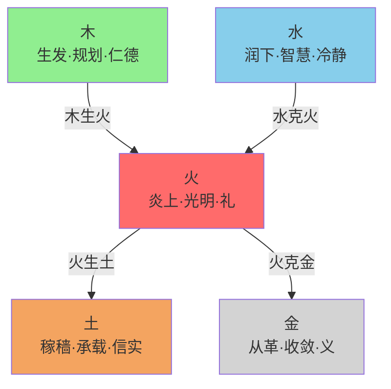

# 🔥 火行人"化克为生"体系全息解析
## 从能量逻辑到现代实践的完整指南

> **核心定位**：这是火行人分智能体的核心实践指南，深度解析火行能量在"化克为生"转化路径上的完整操作系统。
> 
> **关联文档**：[[火行人分智能体·SKILL.md]] | [[火行人生克规律全息解析]] | [[火行人九层发展层级全息解析]] | [[拔阴取阳-深度学习与知识图谱]] | [[化克为生-五行转化理论体系完整版]]

---

## 📖 目录

- [## 🌟 引言：火行人的生命能量特质与"化克为生"的核心要义](#-🌟-引言火行人的生命能量特质与化克为生的核心要义)
- [## 📚 第一部分：理论基础——火行人在五行网络中的生克关系总览](#-📚-第一部分理论基础火行人在五行网络中的生克关系总览)
- [## 🔥 第二部分：火行核心生克关系深度剖析与"化克为生"实践路径](#-🔥-第二部分火行核心生克关系深度剖析与化克为生实践路径)
- [## 🎯 第三部分：整合应用——"化克为生"诊断与干预操作系统](#-🎯-第三部分整合应用化克为生诊断与干预操作系统)
- [## 💎 结论：生克规律——火行人生命艺术的韵律之道](#-💎-结论生克规律火行人生命艺术的韵律之道)

---

## 🌟 引言：火行人的生命能量特质与"化克为生"的核心要义

在五行哲学与"一心三界五行"全息发展体系中，火行人以其独特的"炎上"能量特质而显明。火，在自然之象中代表光明、温暖、升腾与转化；映射于人，则对应心脏与小肠的生理功能，以及礼、热情、明理、感染力、行动力等心理与社会特质。

### 阳火与阴火：两种截然不同的生命状态

**健康的火行能量（阳火）**如同冬日暖阳：
- 能照亮自身前路，温暖他人心田
- 驱动事物向前发展
- 懂得在合适的时机、以合宜的方式（礼）展现其光热

**失衡的火行能量（阴火）**如同失控的野火：
- 嗔恨、急躁、虚荣、浮夸、苛责
- 既灼伤他人，也焚毁自身

### "化克为生"的核心定义

> **"化克为生"是中国传统五行哲学中一套极高阶的实践智慧与方法论。**

其核心定义是：
- **不直接对抗**五行相克所产生的冲突与失衡
- **通过引导**被克制一方（"畏"方）的能量
- **使其充分生发**它所"生"的下一行能量
- **从而引入新的力量**来平衡、转化乃至反向制约过旺的克制方
- **最终将原始的"克制-冲突"关系**，转化为"相生-协同"的动态循环系统

**简言之，这是一种"以生解克"、"以转化代对抗"的系统性思维与生命艺术。**

### 火行人"化克为生"的生命意义

对于火行人而言，深入理解并娴熟运用"化克为生"规律，是其实现从"阴火"到"阳火"转化的关键，是贯穿其生命修炼、人际关系、身心健康与事业发展的核心操作系统。

火行人的能量并非孤立存在，其燃烧的健康度、持久度与效用度，完全取决于它与系统中其他四种能量（木、土、金、水）的互动关系。

**本解析旨在**：
- 系统梳理火行人与木、土、金、水四行之间的生克关系
- 构建一个从理论到实践、从诊断到干预的完整框架
- 为火行人的自我成长与专业助人工作提供一套可操作的行动指南

---

## 📚 第一部分：理论基础——火行人在五行网络中的生克关系总览

火行能量处于由木、土、金、水构成的动态能量网络中。其基本互动关系可归纳为两组"相生"和两组"相克"：

### 四组基本互动关系



**相生关系（滋养赋能）**：
1. **木生火**：木行（生发、规划、仁德）是火行能量的根本来源与燃料。此关系决定了火行人的热情是否有可持续的根基与方向。
2. **火生土**：火行（热情、行动）的成果体现为土行（承载、成果、信实）。此关系决定了火行人的能量是否能落地生根，转化为切实的价值。

**相克关系（制约平衡）**：
1. **水克火**：水行（智慧、冷静、涵养）对火行（急躁、冲动）具有调节、制约作用。此关系决定了火行人的能量是否能在理性与热情的平衡中稳定燃烧。
2. **火克金**：火行（变革、热情）对金行（规则、收敛、界限）具有活化、熔炼作用。此关系决定了火行人的能量是用于破坏规则还是推动良性变革。

### 核心口诀：相克困境与转化方向

**化克为生的智慧，就蕴含在对这四组关系的深刻理解和主动调适之中。其核心口诀高度精炼地概括了相克困境与转化方向：**

```
水克火，急窝火；火生土，水畏土。
火克金，人不亲；金生水，火畏水。
```

**口诀解析**：

| 相克困境 | 核心口诀 | 转化路径 | 转化结果 |
|---------|---------|---------|---------|
| **水克火**（水弱火亢） | 水克火，急窝火 | 火生土，水畏土 | 火生土→土克水→水火既济 |
| **火克金**（火旺熔金） | 火克金，人不亲 | 金生水，火畏水 | 金生水→水克火→温和互动 |

**后续的解析将严格遵循以下结构**：
1. **关系本质与自然之象**
2. **健康状态表现（阳面）**
3. **失衡状态表现（阴面）与现代表现**
4. **核心调适技术（化克为生与拔阴取阳）**
5. **具体行动方案与案例**

---

## 🔥 第二部分：火行核心生克关系深度剖析与"化克为生"实践路径

### 一、木生火：愿景燃料与创新引擎——火行人的能量源泉建设

#### 1. 关系本质与自然之象

**木能生火，是自然的根本法则。**

- 钻木可取火，薪柴足则火焰旺
- 在五行中，木主生发、条达、仁德，对应肝胆与规划力
- 火主炎上、光明、礼，对应心与行动力

**健康的"木生火"关系**意味着：
- 火行人的热情与行动力，来源于清晰的愿景（木之规划）
- 来源于深厚的仁爱之心（木之仁德）与不断的创新灵感（木之生发）
- 木为火提供持久、稳定、健康的燃料

#### 2. 健康状态（阳木生阳火）

当木行能量健康（阳木）时，能持续、稳定地生发阳火。

**心理层面**：
- ✅ 目标清晰，有长远的愿景和使命感
- ✅ 内心充满仁爱与大我精神，热情服务于更高目标
- ✅ 善于规划，能将大目标分解为可执行的步骤
- ✅ 创新思维活跃，且创新有方向、有边界

**行为与关系层面**：
- ✅ 行动力强，且行动方向明确、持久
- ✅ 热情有感染力，能激励团队
- ✅ 在规则内创新，推动积极变革

**生理层面**：
- ✅ 心气充沛，精神焕发，但不过亢
- ✅ 肝气条达，与心气协调

#### 3. 失衡状态与现代表现

失衡主要表现为两种情形："木弱火虚"与"木多火塞"。

##### 木弱火虚（燃料不足）

**本质**：木行能量虚弱（如缺乏目标、仁德之心淡漠、规划能力差），无法为火提供足够燃料。

**阴面表现**：
- ❌ 热情缺乏根基，忽冷忽热，三分钟热度
- ❌ 做事缺乏长远规划，盲目行动
- ❌ 内心空虚，热情流于表面喧嚣或虚荣
- ❌ 容易因小事点燃情绪，但难以持久投入
- ❌ 常感心有余而力不足

**现代场景**：
- 创业者只有一时冲动（火），却没有商业计划和市场调研（木），很快失败并陷入自我怀疑
- 员工对工作缺乏兴趣（火虚），因为看不到工作的意义和个人成长路径（木弱）

##### 木多火塞（燃料杂乱）

**本质**：木行能量过旺但杂乱（想法太多、规划过度、创新点泛滥），反而堵塞了火行能量的出口，导致火不能顺利生发。

**阴面表现**：
- ❌ 思虑过度，想法千头万绪，导致行动瘫痪（"光想不做"）
- ❌ 过度规划导致迟迟无法开始
- ❌ 创新点太多，分散精力，无一深入
- ❌ 内心焦虑，感觉有很多事要做，却不知从何下手

**现代场景**：
- 产品经理有无数个产品创意（木多），每个都做了初步构想，但无法决策聚焦哪一个去全力推进（火塞），团队无所适从
- 个人学习计划列了十几项（木多），每天在选择学什么上内耗，实际学习时间很少（火塞）

#### 4. "化克为生"与强化相生的核心调适技术

**核心在于调整木火关系，使其回归"优质燃料稳定供能"的良性循环。**

##### 针对"木弱火虚"的"补木生火"法

**心法核心**："连接使命，点燃心灯"。为热情寻找一个超越个人利益的、更大的意义和目标。

**实操方法**：

**愿景可视化引燃法**：
- 将长期目标或人生使命，制作成愿景板或详细的心象图，每日清晨观想
- 生动地想象目标达成后的场景、感受及其带来的积极影响
- 以此激发深层、持久的情感动力（以木象激发火）

**寻根问心练习**：
- 当感到热情消退时，自问："我做这件事的初心是什么？"
- "它能为他人或社会带来什么价值？"
- 通过回溯和连接最初的"仁德"之心（木），重新点燃热情（火）

**微目标启动法**：
- 将大愿景拆解为最小的、可立即行动的第一步
- 运用"5分钟法则"：承诺只做5分钟，一旦启动，火的行动惯性常能被带动起来

##### 针对"木多火塞"的"疏木导火"法

**心法核心**："修剪枝蔓，聚焦核心"。引入金行的决断力，对过多的木行能量进行修剪和规范。

**实操方法**：

**"断舍离"清单法**：
- 列出所有想法、计划和欲求
- 然后运用"金"的标准（如"当下最重要"、"我最热爱"、"资源最可行"）进行强制排序和砍掉
- 通常只保留前20%的核心项目
- 这是"金克木"的运用，目的是为了更好的"木生火"

**"输出倒逼输入"法**：
- 强制设定一个小的成果输出 deadline（如火行行动）
- 例如"本周五下班前完成一份简易的PPT方案"
- 为了完成这个"火"的任务，倒逼自己去整理和聚焦杂乱的"木"的想法

**能量伙伴法**：
- 寻找一位行动力强的伙伴（火行人）或规划能力强的伙伴（木行人）作为"责任伙伴"
- 定期互相汇报进度、激励打气
- 借助外部结构形成稳定的木火相生支持系统

#### 5. 心理学原理与现代案例

**心理学原理**：
- 对应**自我决定论**与**目标设定理论**
- 内在动机（自主性、胜任感、归属感）是持久热情的源泉（木生火）
- 清晰而富有挑战性的目标能有效激发行动力

**现代案例**：
一位自媒体博主（火行人）初期凭热情日更，但很快陷入内容枯竭和疲惫（木弱火虚）。后来，她重新定位自己的使命是"帮助1000名职场新人建立自信"（木-仁德与愿景），并据此规划了系列主题（木-规划）。使命感和清晰的路线图让她重燃热情，内容质量与持续性大幅提升，粉丝粘性也显著增强。

---

### 二、火生土：热情落地与成果积淀——火行人的价值转化之道

#### 1. 关系本质与自然之象

**火能生土，是能量转化的关键一环。**

- 火焰燃烧后，化为灰烬，滋养大地
- 在五行中，火的热量与光明，转化为土的承载、孕育与信实

**健康的"火生土"关系**意味着：
- 火行人的热情、灵感与行动力，能够转化为踏实可靠的成果
- 转化为稳定的积累、他人的信任以及个人的信誉
- 这是"虚火"落地为"实土"的过程

#### 2. 健康状态（阳火生阳土）

当火行能量健康（阳火）并能顺利生土时：

**心理层面**：
- ✅ 热情不仅停留在想法和情绪，更能转化为坚持和耐心
- ✅ 言出必行，重视承诺
- ✅ 乐于通过实际行动服务他人，积累信誉

**行为与关系层面**：
- ✅ 执行力强，能保质保量完成项目
- ✅ 在团队中是可靠的伙伴，建立信任
- ✅ 能将创新想法推进到落地验证阶段
- ✅ 个人品牌建立在扎实的成果之上

**生理层面**：
- ✅ 心火温煦，脾胃健运（火生土），消化吸收良好，精力充沛

#### 3. 失衡状态与现代表现

失衡主要表现为"火浮不降"或"火弱土寒"。

##### 火浮不降（火不生土）

**本质**：火行能量虚浮在上，无法下沉转化为土行能量。热情空耗，无法落地。

**阴面表现**：
- ❌ 光说不练，夸夸其谈
- ❌ 想法很多，但缺乏执行和坚持
- ❌ 虎头蛇尾，启动时轰轰烈烈，很快失去耐心
- ❌ 容易承诺，但难以兑现，失信于人
- ❌ 内心焦虑于"无所成"，但行动上逃避艰苦的积累过程

**现代场景**：
- 会议上激情澎湃提出各种建议（火），但会后从不主动承担具体任务或跟进细节（土不生）
- 立下无数Flag（火），如健身、读书，但总是三天打鱼两天晒网，没有实际积累（土不生）

##### 火弱土寒（火虚土壅）

**本质**：火行能量本身虚弱，无力生土。导致土行也得不到温煦而变得"寒湿"、"壅滞"。

**阴面表现**：
- ❌ 缺乏行动的热情和勇气
- ❌ 做事拖拉，畏惧困难
- ❌ 即使有稳定的资源和计划（土），也因缺乏推动力（火）而僵化停滞
- ❌ 身心俱疲，脾胃虚寒，消化不良

**现代场景**：
- 团队拥有完善的流程和资源（土），但因领导者缺乏激励和推动力（火弱），整体氛围沉闷，效率低下
- 个人生活规律（土），但感觉毫无生气和乐趣（火弱），陷入倦怠

#### 4. "化克为生"与强化相生的核心调适技术

**核心在于引导火行能量完成从"光热"到"孕育"的转化，确保能量有效沉淀。**

##### 针对"火浮不降"的"引火归土"法

**心法核心**："微光成炬，厚积薄发"。将宏大的热情，收束到微小的、可完成的行动上，并通过完成来积累"土"的踏实感。

**实操方法**：

**微承诺与百分百兑现**：
- 每天给自己一个极小、极易完成的承诺（如"今晚11点前睡觉"、"今天喝8杯水"）
- 并绝对做到
- 这是最直接的"火生土"训练，培养"言出必行"的肌肉记忆

**"完成"优于"完美"**：
- 对于任何任务，设定一个"最小可交付成果"的标准
- 强制自己先完成它，而不是停留在准备的热情中
- 哪怕不完美，完成本身就能生"土"

**感恩日记与成果记录**：
- 每天睡前记录3件具体完成的小事或值得感恩的细节（土）
- 这能将飘散的热情（火）聚焦于已拥有的踏实（土）
- 滋养脾胃（土）功能，反向稳定情绪（火）

##### 针对"火弱土寒"的"助火暖土"法

**心法核心**："星火燎原，行动破冰"。从最小处点燃行动力，用行动产生的微小热量，去融化僵滞的土壤。

**实操方法**：

**设定并庆祝微小胜利**：
- 将大目标分解为极小步骤，每完成一步都给予自己即时、具体的肯定和奖励（点火）
- 例如，写完报告的第一段后，就站起来活动一下，喝杯喜欢的茶

**体育锻炼（特别是温和有氧）**：
- 运动能直接提升身体阳气（火），改善血液循环，温暖脾胃（土）
- 从每天15分钟散步开始

**接触温暖与明亮**：
- 多穿暖色衣服，身处阳光充足、明亮温暖的环境
- 食用温性食物（如生姜、红枣）
- 从物理环境上"补火"

#### 5. 心理学原理与现代案例

**心理学原理**：
- 对应**行为激活理论**与**自我效能感**
- 通过增加正向行为（火）来改善情绪和状态
- 而行为的成功完成（生土）会提升自我效能感，形成正向循环

**现代案例**：
一位销售总监（火行人）擅长激励团队（火），但团队业绩波动大，客户投诉售后跟不上（火不生土）。总监引入"客户成功案例库"和"销售流程核对清单"（土的结构），要求每单成交后，必须填写案例并完成服务交接清单。起初团队觉得繁琐（火克土），但坚持后，团队交付质量稳定提升，客户复购率大增，总监的激励也更有底气（火生土）。这就是将"火的热情"制度化、流程化为"土的成果"。

---

### 三、水克火：智慧调节与冷静平衡——火行人的情绪与节奏控制器

#### 1. 关系本质与自然之象

**水能克火，是自然的平衡法则。**

- 水火既济，则蒸腾化气，动力无穷
- 水火未济，则或火沸水干，或水淹火灭

在五行中：
- 水主润下、智慧、涵养、冷静，对应肾脏与志恐
- 火主炎上、热情、急躁，对应心脏与喜乐

**正常的"水克火"关系**意味着：
- 水行的智慧、冷静与深度思考，能够调节、制约火行的急躁、冲动与过度消耗
- 使热情在理性的轨道上持久、稳定地燃烧
- 达到"水火既济"的和谐状态

#### 2. 健康状态（阳水调阳火，水火既济）

当水行能量健康（阳水）并能有效调节火行时：

**心理层面**：
- ✅ 热情而有分寸，冲动而有节制
- ✅ 做事前能冷静思考，权衡利弊
- ✅ 情绪来得快，但也能通过智慧迅速平复
- ✅ 具备深刻的洞察力和长远眼光

**行为与关系层面**：
- ✅ 行动果断但不鲁莽
- ✅ 在压力下能保持镇定
- ✅ 沟通时既能表达热情，也能倾听和理解
- ✅ 决策兼具激情与远见

**生理层面**：
- ✅ 心肾相交，睡眠安稳，精力充沛而不过亢

#### 3. 失衡状态与现代表现

失衡主要表现为"水弱火亢"与"水强火灭"。

##### 水弱火亢（火旺水枯）

**本质**：水行能量不足（缺乏智慧、冷静、涵养），无法制约过旺的火行能量。

**阴面表现**：
- ❌ 急躁冒进，缺乏耐心
- ❌ 做事冲动鲁莽，缺乏计划和深思熟虑
- ❌ 易怒，情绪失控，言语尖刻
- ❌ 像一辆没有刹车的高速跑车
- ❌ 内心烦躁，坐卧不安

**现代场景**：
- 项目经理（火）为了赶工期，不断催促团队，忽略潜在风险（水弱），最终导致项目因重大疏漏返工
- 家长（火）辅导孩子作业时，因孩子反应慢而大发雷霆（火亢），事后又后悔（水弱无法制火）

##### 水强火灭（水过度克火）

**本质**：水行能量过强（过度思虑、恐惧、悲观），严重抑制甚至浇灭了火行能量。

**阴面表现**：
- ❌ 热情被过度压抑，变得消沉、冷漠
- ❌ 过度谨慎，犹豫不决，错失良机
- ❌ 悲观怀疑，浇灭一切行动的热情和生命活力
- ❌ 表现为萎靡不振，对事物失去兴趣

**现代场景**：
- 创业者有好的创意（火），但被无穷尽的 market risk analysis（水）所困，迟迟不敢行动，最终创意胎死腹中
- 员工因害怕犯错（水过强），不敢提出任何新想法或尝试新方法（火灭），团队创新停滞

#### 4. "化克为生"与强化制衡的核心调适技术

**核心在于恢复水火之间的动态平衡**，其转化路径紧扣口诀：

> **"水克火，急窝火；火生土，水畏土"**

这意味着，当水火冲突时，关键不是让火去直接对抗水（那会加剧消耗），而是让火主动去"生土"，用土行的稳定、包容和务实，来制约过度的水（思虑、恐惧），从而达到平衡。

##### 针对"水弱火亢"的"滋水降火"与"火生土制水"法

**心法核心**："阴火恨转阳火问，火生厚土镇寒川"。将急躁、愤怒（阴火恨）的能量，转化为向内探索、提问求真的能量（阳火问）；同时将热情导向建设性的、踏实的行为（生土），用成果的稳定感来安抚焦虑。

**拔阴取阳（心界转化）**：
- 当急躁、愤怒升起时，强制转化为向内的提问：
  - "我此刻的情绪背后，真正的需求或恐惧是什么？"
  - "如果慢下来，会有什么更好的可能性？"
  - "对方的处境和感受是怎样的？"
- 这就是"阴火恨转阳火问"。

**化克为生（核心路径）**：

**火行人的功课（被克方关键）**：
- 收敛急躁，发展 "土"的特性（耐心、包容、拆解目标）

**行动**：
- 给感觉"慢"的同事（水行人）预留充分的思考时间
- 并将大目标拆解为小阶段
- 例如说："这个方案我们下周三定稿，你今天先梳理核心需求，明天我们一起讨论细节，有疑问随时找我，不用急。"
- 用"土"的稳定感减轻水的焦虑

**配合方的功课（若对方是水）**：
- 发展 "木"的计划性（主动管理预期）

**行动**：
- 提前制定清晰的时间表，主动同步进度
- 例如说："目前分析已完成70%，今晚整理数据，明天下午3点前给您提交初步报告。"
- 用"木"的计划性让火看到进度可控

**辅助技术**：

**暂停技术**：
- 感到情绪即将失控时，立即启动"暂停"
- 深呼吸（调水）、离开现场、喝一杯温水
- 这是最简单的"水克火"生理干预

**冥想与静坐**：
- 定期练习，直接滋养"水"的沉静、涵养之力
- 为"火"安装天然的调节器

##### 针对"水强火灭"的"温阳化水"与"点火生土"法

**心法核心**："破冰取火，微光暖身"。从极小处点燃行动，用行动产生的微小热量和成就感，去融化内心的寒冰（过度思虑和恐惧）。

**实操方法**：

**"5分钟行动"破冰**：
- 选择一件最微小、最无压力的事，强迫自己只做5分钟
- 行动本身是"火"的生发，能直接对抗"水"的凝滞

**化恐惧为具体规划**：
- 将抽象的担忧（水）转化为具体的风险评估清单和应对步骤（火生土）
- 写下来的过程，就是将阴水"固化"为阳土的过程

**寻找并点燃小确幸**：
- 主动去做能带来即时快乐和成就感的小事
- 如完成一个小目标、帮助他人、享受阳光
- 这是直接的"补火"

#### 5. 心理学原理与现代案例

**心理学原理**：
- 对应**情绪调节理论**与**动机理论**
- 认知重评（阳火问）是高效的情绪调节策略
- 水过旺类似"习得性无助"和低动机状态，抑制了驱动行为的奖赏系统（火的功能）

**现代案例（水弱火亢）**：
一家创业公司CEO（火）与CTO（水）因产品开发节奏冲突，CEO嫌CTO太慢（水克火失衡），天天催促进度，自己急到失眠喉咙痛（火亢）。后来CEO运用"火生土"路径，不再空催，而是与CTO一起制定了"研发节奏与里程碑表"（土），并约定每周五下午茶时间固定同步进度（稳定的土）。CEO有了"进度可视"的稳定感（土），焦虑大减；CTO也能在清晰的框架内工作（土克水，管理了自身的过度纠结），效率提升，产品如期上线。

**现代案例（水强火灭）**：
市场部团队（火）因连续业绩压力和严厉批评（水克火）而士气低落，人人不敢创新（火灭）。新任总监没有施加更多压力，而是设立了"创新孵化基金"，鼓励任何天马行空的想法并给予小额支持（助火），并要求每个想法必须附一个简单的落地试点计划（火生土）。团队的微小热情被点燃，并因需要务实规划而变得更加沉稳（土），最终通过几个小试点成功反转了业绩。

---

### 四、火克金：破旧立新与规则活化——火行人的影响力与边界艺术

#### 1. 关系本质与自然之象

**火能克金，是变革与塑造的法则。**

- 真金需要火炼，方能成器
- 但烈火亦能熔金，使其失形

在五行中：
- 火主礼、热情、变革
- 金主义、收敛、规则、界限

**正常的"火克金"关系**意味着：
- 火行的热情、感染力与破旧立新的力量，能够温暖、活化金行的规则与框架
- 使其不失温度、与时俱进，推动必要的变革
- 这是"火炼真金"的过程

#### 2. 健康状态（阳火炼阳金）

当火行能量健康（阳火）并能良性制约金行时：

**心理层面**：
- ✅ 尊重规则但不受其僵化束缚
- ✅ 能用热情和感染力推动规则优化
- ✅ 原则性强，但表达时充满温度和尊重
- ✅ 敢于挑战不合理的旧制

**行为与关系层面**：
- ✅ 是团队活力的源泉，能打破沉闷
- ✅ 善于沟通，能软化僵硬的谈判
- ✅ 推动创新在合规框架内落地
- ✅ 批评对事不对人，且旨在建设

**生理层面**：
- ✅ 心火温煦肺金，呼吸顺畅，皮肤光泽

#### 3. 失衡状态与现代表现

失衡主要表现为"火旺熔金"与"金寒火郁"。

##### 火旺熔金（火过度克金）

**本质**：火行能量过旺（过于急躁、热情过度、缺乏耐心），熔化、破坏了金行的规则、界限与冷静。

**阴面表现**：
- ❌ 做事冲动，缺乏计划和条理
- ❌ 热心肠但可能侵犯他人边界
- ❌ 因急躁而批评、伤害他人，导致关系疏远（"人不亲"）
- ❌ 不尊重流程和承诺，显得"不靠谱"
- ❌ 言语尖刻，像烈火灼人

**现代场景**：
- 热情似火的销售（火）为了成单，不断向财务、法务（金）施压，承诺无法兑现的条款，破坏公司风控规则，导致部门间关系紧张
- 家长（火）过度干预孩子的学习和生活（金-孩子的自主空间），导致亲子关系疏离

##### 金寒火郁（金虚火浮）

**本质**：自身金行能量虚弱（自律性不足、界限不清），导致无法有效收敛和规范火行能量，使火气显得虚浮、杂乱。

**阴面表现**：
- ❌ 难以坚持计划，容易半途而废
- ❌ 对外是老好人，不懂拒绝，对内却苛责自己
- ❌ 情绪起伏大，冲动行事后又懊悔不已
- ❌ 想法多变，缺乏深耕

**现代场景**：
- 创业者（火显金虚）有很多好点子，但缺乏将点子转化为严谨商业计划和执行体系的能力（金虚），公司运营混乱
- 个人想自律学习（金），但总是被娱乐冲动（火）带偏，事后又自我批判

#### 4. "化克为生"与强化制衡的核心调适技术

**核心在于转化"火克金"的破坏性为建设性**，其转化路径紧扣口诀：

> **"火克金，人不亲；金生水，火畏水"**

这意味着，当火金冲突时，关键不是让金变得更硬去对抗火，而是让金主动去"生水"，发展出水行的柔和、变通与智慧，以柔克刚；同时，火方则需"生土"，以诚信可靠重建信任。

##### 针对"火旺熔金"（人际冲突）的"金生水，火畏水"与"火生土"法

**心法核心**："柔能克刚，信能生亲"。金方以柔制火，火方以信固金。

**化克为生（核心路径）**：

**金行人的功课（被克方关键）**：
- 放下苛责，发展 "水"的特性（柔和、变通、共情）

**行动**：
- 理解火的热情是动力来源，用柔和态度引导
- 例如，当火行人临时提出修改方案时，金行人可以说：
  - "你的新想法很有启发（共情-水）"
  - "不过我们之前已经和客户确认了流程，如果修改需要同步评估风险和成本（固金）"
  - "我们一起看看怎么调整更安全高效好吗？（引导-水）"
- 这就是"金生水，以水克火"

**火行人的功课（克人方）**：
- 发展 "土"的特性（信守承诺、提前沟通、建立信任）

**行动**：
- 尊重金行人制定的流程，变更计划前务必提前沟通
- 例如："我这边想调整下周的会议时间，提前和你商量下——周三下午或周四上午你方便吗？如果确定，我马上同步给其他参会人。"
- 用"土"的靠谱感让金建立信任，改善"人不亲"

**辅助技术（对火行人）**：

**"阴火恨转阳火问"**：
- 在想要批评或冲动行事前，先问自己：
  - "我的目的是什么？"
  - "有没有更尊重对方规则的方式达到它？"

**工具固金**：
- 主动使用清单、流程表、日历提醒等工具（金）来规范自己的工作
- 减少随意性，让"火"在"金"的轨道上运行

##### 针对"金寒火郁"（自克）的"炼金生水"自修法

**心法核心**："百炼成钢，上善若水"。通过微小的自律锤炼金性，并在过程中培养对自己的宽容和理解（金生水）。

**实操方法**：

**微承诺与兑现**：
- 每天给自己一个极小的承诺（如11点睡、晨起喝一杯水），并坚决完成
- 这是最直接的"炼金"

**整理与断舍离**：
- 整理物理空间（书桌、衣柜、电脑桌面）是锤炼金行（秩序、决断）最直接的方式

**自我对话练习**：
- 当冲动时，对自己说"停，让我看看发生了什么"
- 像一位冷静的观察者（金）看待自己的情绪（火）
- 然后问："我现在真正需要的是什么？"（金生水）

#### 5. 心理学原理与现代案例

**心理学原理**：
- 对应**冲动控制**、**边界意识**与**信任修复理论**
- 火过旺类似冲动控制障碍，破坏了执行功能所需的抑制力（金的功能）
- 金方的"柔和引导"符合非暴力沟通原则
- 火方的"提前沟通"是修复信任的有效行为

**现代案例（人际）**：
某设计公司，火行设计师频繁临时要求修改设计稿，金行项目经理不堪其扰，不再主动沟通，项目濒临停滞（人不亲）。经调解，项目经理（金）改变策略，对设计师说："你的创意追求很棒（肯定-水），我们一起来制定一个修改流程，既保证创意迭代，又不影响整体进度好吗？（引导-水）"同时，设计师（火）承诺任何修改想法提前24小时书面提出（土）。双方协作效率提升，关系缓和。

**现代案例（自克）**：
一位创业者（火显金虚）自知易冲动决策。他坚持每天早晨用10分钟，以清单形式规划当天最重要的三件事（炼金），并在每次情绪激动想打断会议时，强制自己深呼吸、记录要点，会后再说（金生水）。长期坚持，决策质量显著提高，团队也认为他变得更沉稳可靠。

---

## 🎯 第三部分：整合应用——"化克为生"诊断与干预操作系统

理论的价值在于指导实践。本部分将整合上述生克规律，形成一套可用于个人自我教练、心理咨询、团队管理或关系辅导的标准化操作流程。

### 第一步：系统诊断——识别火行人的能量状态

#### 1. 定位主导属性

首先确认个体是否以火行为主导特质。主要观察：
- 是否热情、健谈、富有感染力
- 是否行动力强
- 是否注重仪式感
- 是否容易急躁
- 是否寻求关注等

#### 2. 识别失衡关系

通过以下信号，判断是哪一组或哪几组生克关系失衡：

| 失衡关系 | 核心信号 | 表现特征 |
|---------|---------|---------|
| **木生火问题** | 缺乏持久热情、目标模糊、思多行少 | - 热情忽冷忽热<br/>- 创意很多但无法执行<br/>- 缺乏长远规划 |
| **火生土问题** | 光说不练、虎头蛇尾、失信于人 | - 启动时激情四溢，后续无力收尾<br/>- 言过其实，做得很少<br/>- 成果寥寥 |
| **水克火问题** | 急躁易怒（水弱火亢）；或消沉冷漠（水强火灭） | - 水弱火亢：急躁冒进、情绪失控<br/>- 水强火灭：热情被压抑、犹豫不决 |
| **火克金问题** | 人际关系紧张、破坏规则、言语伤人（火旺熔金）；或自律差（金寒火郁） | - 火旺熔金：尖刻批评、不守规则<br/>- 金寒火郁：计划难坚持、内外不一 |

#### 3. 评估失衡程度与层面

判断失衡主要显现在哪个层面：
- **身界**：生理症状（上火、炎症、高血压等）
- **心界**：情绪思维（急躁、焦虑、情绪剧烈）
- **灵界**：价值观动机（嗔恨、自我中心）
- **或是复合出现**

---

### 第二步：制定处方——选择与组合调适技术

根据诊断结果，从"技术库"中选择匹配的"拔阴取阳"和"化克为生"方法进行组合。

#### 1. 针对单一关系失衡

**木生火问题**：
- 主用：愿景可视化、5分钟启动法
- 配合灵界"连接使命"的寻根问心

**火生土问题**：
- 主用：微承诺法、感恩日记
- 配合心界"阴火恨转阳火问"以转化浮躁

**水克火问题（火亢）**：
- 主用："火生土，水畏土"路径（火方练耐心拆解）
- 配合："暂停技术"和"冥想"

**火克金问题（人际）**：
- 主用："金生水，火畏水"路径（引导金方柔和、火方守信）
- 配合：火方"工具固金"

#### 2. 针对复杂复合失衡（更常见）

**例如**：一个火行人同时表现为"急窝火"（水克火失衡，水弱火亢）和"光说不练"（火不生土）。

这常是"水弱火亢"与"火浮不降"的联合表现。

**复合处方**：

**核心**：强化 "火生土"
- 因为"土"既能消耗过旺的火，又能制约水（土克水）
- 引导其专注完成一件小事（生土），建立稳定感

**同步**：练习 "阴火恨转阳火问"
- 调节水克火，将急躁转为对任务拆解的具体提问

**辅助**：进行身体锻炼（有氧运动）稳定阳气，配合冥想滋养阴水

---

### 第三步：持续干预与升维——融入生活的修炼

#### 1. 微小切入，持续记录

转化无需巨变。从一个微小的、符合"生"之路径的习惯开始，并记录实践过程中的感受、挑战和变化。

#### 2. 定期复盘与调整

每周或每月回顾，评估：
- 能量状态是否改善
- 关系是否缓和
- 并根据效果调整"处方"

#### 3. 升维目标

将解决具体冲突的"化克为生"实践，逐步升维为一种生命态度和思维方式。

**最终指向**："一心三界五行"体系的终极目标——让火行人从被"阴火"习性驱动、在生克失衡中挣扎的个体，成长为一个以"阳火"觉性为主导、能主动运用生克规律来照亮自我、和谐关系、创造价值的生命艺术家。

---

### 案例整合推演

**一位火行创业者**：
- 初期激情四射（木生火）
- 但很快与联合创始人（金行，重财务规则）爆发冲突，指责对方死板（火克金过度）
- 自己则不断提出新点子但难以落地（火不生土）
- 团队关系紧张（人不亲），自己失眠暴躁（水弱火亢）

**诊断**：复合失衡。核心是"火克金过度"与"火不生土"，伴有"水弱火亢"。

**整合处方**：

**灵界**：重温创业初心（木），是为解决社会问题（礼），而非证明自我（嗔）。

**心界**：强制践行"阴火恨转阳火问"。每次想批评合伙人时，改为："从财务安全角度，这个新点子最大的风险是什么？我们如何分阶段测试？"

**身界与五行实践**：
- **化火克金**：主动与合伙人约定，任何新想法，必须先形成一页纸的简易商业计划（土），再讨论（火生土，土生金）
- **强化火生土**：聚焦一个最小可行产品，承诺自己每周交付一个具体改进（微目标）
- **平衡水克火**：每天冥想15分钟，睡前不处理工作

**预期效果**：
- 通过持续实践，冲突减少（火克金转化）
- 产品迭代稳定（火生土）
- 情绪更平稳（水火渐济）
- 创业者可从失控的状态，逐步回归到有建设性的、明礼照世的境界

---

## 💎 结论：生克规律——火行人生命艺术的韵律之道

对火行人而言，深入理解和娴熟运用生克与"化克为生"规律，绝非掌握一套玄奥的知识，而是学习一门生命的艺术，即如何让内在的"光明之火"在复杂的关系与世界中有韵律地燃烧。

### 火行人的四组生克法则

**木生火、火生土、水克火、火克金**，这四组关系构成了火行能量生存、发展、平衡与创造的基本宇宙法则。

它告诉我们：

1. **热情需要愿景与仁德的滋养（木生火）**，否则便是无根之火
2. **热情必须转化为踏实的创造与信实（火生土）**，否则便是耗散之焰
3. **热情离不开智慧与冷静的调节（水克火）**，否则便是焚身之灾
4. **热情应当用于活化规则与推动变革（火克金）**，但需警惕过度破坏带来的孤立（人不亲）

### 两大核心技术

**"拔阴取阳"与"化克为生"**，是在这韵律中主动调音的两大核心技术。

#### 拔阴取阳
- 从内在动机和情绪反应的根源上进行转化
- 将嗔恨转为礼问，将虚荣转为服务

#### 化克为生
- 在外部关系和行为模式上进行重构
- 将对抗的相克循环，转化为滋养的相生循环

### 终极目标

**这一切修炼都指向"一心三界五行"体系的终极目标**：让火行人从一个被"阴火"习性驱动、在生克失衡中挣扎的个体，成长为一个以"阳火"觉性为主导、能主动运用生克规律来照亮自我、和谐关系、创造价值的生命艺术家。

**他明了自身如火焰般的特质，懂得何时添柴（木），何时落地（土），何时静心（水），何时破局（金），从而在动态平衡中，实现从"躁火"到"明火"的超越，真正活出"礼明照世"的生命境界。**

---

## 🔗 关联文档

### 核心理论文档
- [[火行人分智能体·SKILL.md]] - 火行人分智能体的完整理论体系和实践方法
- [[火行人生克规律全息解析]] - 火行人生克关系动态网络法则
- [[火行人九层发展层级全息解析]] - 火行人九层阶梯全息解析
- [[拔阴取阳-深度学习与知识图谱]] - 拔阴取阳四步法完整体系
- [[化克为生-五行转化理论体系完整版]] - 五行转化理论完整版

### 实践指南文档
- [[火行人格心理学·实践指南]] - 火行人化克为生实操训练
- [[火行人格心理学·外观识别体系]] - 火行人外观识别六章节

### 知识图谱
- [[火行人化克为生知识图谱]] - 可视化化克为生转化路径
- [[火行人生克规律知识图谱]] - 可视化生克关系网络

### 总索引
- [[火行人分智能体·总索引]] - 火行人分智能体完整导航

---

## 🏷️ 标签系统

**核心标签**：
- #火行人
- #化克为生
- #五行生克
- #能量互动
- #实践智慧
- #火行人分智能体
- #生命艺术
- #动态平衡

**关系标签**：
- #木生火 #愿景燃料 #创新引擎
- #火生土 #热情落地 #成果积淀
- #水克火 #智慧调节 #冷静平衡
- #火克金 #破旧立新 #规则活化

**技术标签**：
- #拔阴取阳 #化克为生
- #水火既济 #火炼真金
- #诊断系统 #干预操作
- #三界诊断 #PEEF诊断框架

---

**文档版本**: 1.0  
**创建时间**: 2026-04-04  
**维护者**: 龙龟神将  
**同步状态**: WorkBuddy ↔ Obsidian 三向同步  
**知识图谱版本**: v6.1（火行人分智能体v4.0完成版）
