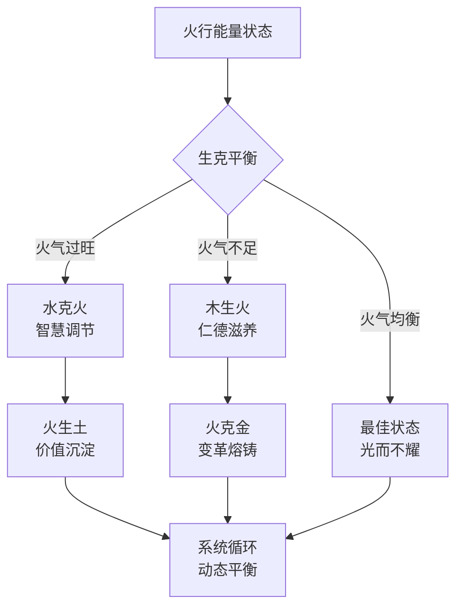
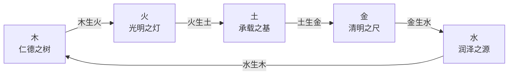
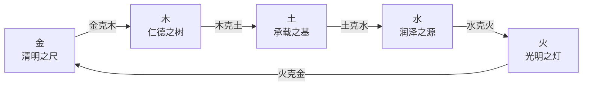
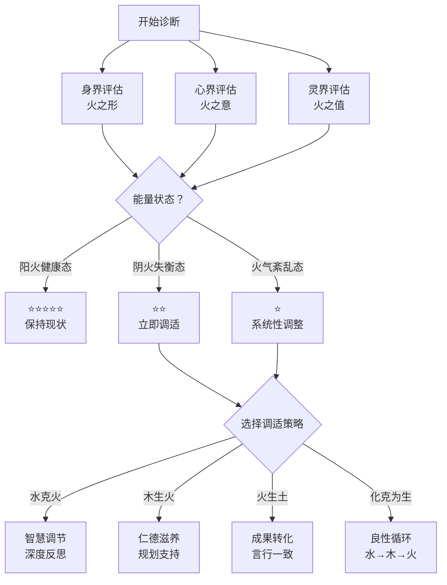

# 🔥 火行人生克规律全息解析
## 动态网络中的能量互动法则与实践智慧

> **核心定位**：这是火行人分智能体的核心理论文档之一，深度解析火行能量在五行生克网络中的互动法则。
> 
> **关联文档**：[[火行人分智能体·SKILL.md]] | [[火行人九层发展层级全息解析]] | [[拔阴取阳-深度学习与知识图谱]] | [[化克为生-五行转化理论体系完整版]]

---

## 📖 目录

- [## 🔗 6.1 生克规律的哲学内涵](#-6-1-生克规律的哲学内涵)
- [## 🌊 6.2 生克规律的哲学本质](#-6-2-生克规律的哲学本质)
- [## 🔥 6.3 火行核心生克关系深度剖析](#-6-3-火行核心生克关系深度剖析)
- [## 🎯 6.4 生克规律的整合应用](#-6-4-生克规律的整合应用)
- [## 🎵 6.5 火行人生命艺术的韵律之道](#-6-5-火行人生命艺术的韵律之道)

---

## 🔗 6.1 生克规律的哲学内涵

### 核心定义

**五行生克规律不是静态规则，而是动态平衡的艺术。**

> "生者，助其成也；克者，制其过也。"——《尚书·洪范》

生克规律的本质是：
- **"生"是滋养与赋能**：推动能量流动，支持成长与发展
- **"克"是制约与平衡**：防止能量失衡，维持系统稳定
- **不是对立而是互补**：生克相济，共同构成动态平衡系统

### 哲学核心：动态平衡观

**核心洞察**：
- 火行人的生命质量，不取决于其天生的热情与感染力，而取决于其生命能量（火气）的**"品质"（阴阳比例）**与**"流通状态"（三界协同与五行生克）**
- 成长，就是一个有章可循的"能量炼金"过程

### 动态网络的四个核心特征

1. **非决定论**：五行能量不是宿命，而是可以转化的力量
2. **系统性**：五行相互影响，单一变化引发全系统响应
3. **周期性**：生克关系呈现周期性波动，需要动态调适
4. **可塑性**：通过"拔阴取阳"与"化克为生"，可以优化能量状态

---

## 🌊 6.2 生克规律的哲学本质

### 本质一：相生循环 - 能量的滋养网络

**生者，助其成也。**

火行在相生循环中的位置：

**火行的相生关系**：
- **木生火**：仁德之木滋养光明之火
  - 阳木（仁德）→ 阳火（礼明）：热情有根基，光而不耀
  - 阴木（傲慢）→ 阴火（嗔恨）：固执点燃急躁
- **火生土**：光明之火沉淀为承载之土
  - 阳火（礼明）→ 阳土（信实）：热情转化为成果
  - 阴火（嗔恨）→ 阴土（怨疑）：急躁导致后悔

**相生循环的启示**：
- 火行的能量来源于木行的仁德滋养
- 火行的价值在于火生土，将热情转化为可见成果
- 阴火（嗔恨）无法滋养土，只能导致能量浪费

### 本质二：相克平衡 - 能量的制约系统

**克者，制其过也。**

火行在相克平衡中的位置：

**火行的相克关系**：
- **水克火**：润泽之水调节光明之火
  - 核心作用：**智慧调节热情，防止失控**
  - 阳水（智慧）× 阳火（礼明）= 水火既济（最佳平衡）
  - 阴水（多思）× 阴火（急躁）= 犹豫不决+情绪冲动
- **火克金**：光明之火熔铸清明之金
  - 核心作用：**热情变革僵化，带来活力**
  - 阳火（礼明）× 阴金（挑剔）= 感染力破刻板
  - 阴火（嗔恨）× 阴金（贪婪）= 尖刻攻击+占有欲

**相克平衡的启示**：
- 火行人的致命弱点是"火气过旺"：急躁、虚荣、攻击性
- 解药是"水克火"：通过智慧、冷静、反思调节热情
- 火克金是把双刃剑：适度的火克金带来活力，过度的火克金破坏规则

### 本质三：五行互通 - 能量的全息网络

> "五行一气，周流不息。"——《黄帝内经》

五行不是五个独立的能量，而是**同一生命能量的五种显化**：
- 木火土金水 = 同一能量的五种频率
- 生克关系 = 能量频率之间的互动法则
- 任何一行的转化，都会引发全系统的调整

**火行人的核心任务**：
1. **保持火气品质**：从阴火（嗔恨）转化为阳火（礼明）
2. **畅通生克循环**：木→火→土→金→水→木
3. **优化相克平衡**：用智慧（水）调节热情（火），用热情（火）活化规则（金）

---

## 🔥 6.3 火行核心生克关系深度剖析

### 6.3.1 木生火：能量源头与品质决定

> **关系本质**：木是火的燃料，木的品质决定火的品质。

#### 生火机制详解

| 木行状态 | 火行结果 | 表现形式 | 能量品质 |
|---------|----------|---------|----------|
| **阳木（仁德）** | 阳火（礼明） | 热情有根基，光而不耀，温暖而不灼人 | ⭐⭐⭐⭐⭐ 优质 |
| **阴木（傲慢）** | 阴火（嗔恨） | 固执点燃急躁，怒气外溢，虚荣好胜 | ⭐⭐ 差质 |
| **阳木+阴木混合** | 阴阳火交织 | 忽冷忽热，热情不持久，自我矛盾 | ⭐⭐⭐ 中质 |

#### 火行人的"木火互动"诊断

**阳木滋养的阳火特征**：
- ✅ 热情源于内在的使命感，而非外在认可
- ✅ 感染力自然流露，无需刻意表现
- ✅ 光明照亮他人，而非炫耀自己
- ✅ 火生土能力强，将热情转化为成果

**阴木滋养的阴火特征**：
- ❌ 热情源于证明自我，急于被看见
- ✗ 虚荣好胜，喜欢炫耀和比较
- ❌ 急躁易怒，遇到挫折立即爆发
- ❌ 火生土能力弱，光说不练，缺乏成果

#### 火行人的"木火优化"策略

**拔阴取阳（木行）**：
- **阴木傲慢 → 阳木仁德**：将"我比你强"转为"我能帮助你"
- **阴木抗上 → 阳木正直**：将"凭什么听你的"转为"我愿意学习"

**火行人自我觉察**：
> "我的热情来自哪里？是内在的使命感，还是外在的证明欲？"
> 
> "我的感染力是自然流露，还是刻意表演？"
> 
> "我的成果转化率高吗？还是只停留在热情层面？"

---

### 6.3.2 火生土：价值沉淀与成果转化

> **关系本质**：火的价值在于生土，将热情转化为可见成果。

#### 生土机制详解

| 火行状态 | 土行结果 | 表现形式 | 转化效率 |
|---------|----------|---------|----------|
| **阳火（礼明）** | 阳土（信实） | 热情转化为成果，言行一致，可靠稳重 | ⭐⭐⭐⭐⭐ 高效 |
| **阴火（嗔恨）** | 阴土（怨疑） | 急躁导致后悔，虎头蛇尾，失信于人 | ⭐ 低效 |
| **阳火+阴火混合** | 阴阳土交织 | 成果时有时无，承诺不稳定，缺乏沉淀 | ⭐⭐⭐ 中效 |

#### 火行人的"火土转化"诊断

**阳火生阳土的特征**：
- ✅ **言行一致**：说到做到，不轻诺寡信
- ✅ **成果导向**：将热情落实到具体行动和结果
- ✅ **稳重可靠**：情绪稳定，值得信赖
- ✅ **价值沉淀**：持续创造有价值的成果

**阴火生阴土的特征**：
- ❌ **虎头蛇尾**：开始激情四溢，后续无力收尾
- ❌ **言过其实**：说得很好，做得很少
- ❌ **后悔常伴**：急躁行动后，往往后悔当初冲动
- ❌ **缺乏沉淀**：热情随风而逝，没有留下有价值的痕迹

#### 火行人的"火土转化"策略

**核心心法：从"热情"到"成果"的三步转化**

**第一步：明确目标**
> "我要把这份热情转化为什么具体成果？"
> - 是要建立人际关系？完成一个项目？还是创造价值？

**第二步：拆解行动**
> "达成这个成果，需要哪些具体步骤？"
> - 第一步做什么？第二步做什么？每一步的标准是什么？

**第三步：跟踪进度**
> "我现在的进度在哪里？距离目标还有多远？"
> - 用清单、用进度表、用他人反馈，保持可见性

**拔阴取阳（火行）**：
- **阴火嗔恨 → 阳火礼明**：将"为什么这样对我"转为"我能为你做什么"
- **阴火急躁 → 阳火明辨**：将"快点说"转为"让我先思考一下"

---

### 6.3.3 水克火：智慧调节与冷却机制

> **关系本质**：水是火的调节器，防止火气失控。

#### 水克机制详解

| 火行状态 | 水行作用 | 调节效果 | 平衡状态 |
|---------|----------|---------|----------|
| **阴火（嗔恨/急躁）** | **阳水（智慧）** | 冷静思考，情绪调节，理性决策 | 🌊🔥 水火既济 |
| **阳火（礼明/热情）** | **阴水（多思）** | 过度谨慎，热情降温，决策拖延 | ⚠️ 火气过弱 |
| **火气过旺** | **阳水（沉潜）** | 深度反思，内观觉察，能量内收 | ✅ 最佳调节 |
| **火气不足** | **阳水（流畅）** | 畅通表达，温和坚定，保护火性 | ✅ 适度补充 |

#### 火行人的"水火平衡"诊断

**水火既济（最佳平衡）的特征**：
- ✅ **热情而不急躁**：有行动力，但不冲动
- ✅ **感染力而不炫耀**：能影响他人，但不张扬
- ✅ **果断而不鲁莽**：快速决策，但有思考
- ✅ **乐观而不盲从**：积极向上，但有理性

**阴火（失衡状态）的特征**：
- ❌ **急躁冲动**：遇到挫折立即爆发
- ❌ **虚荣好胜**：急于证明自己，害怕被忽视
- ❌ **情绪剧烈**：喜怒无常，难以预测
- ❌ **后悔常伴**：冲动决策后，往往后悔

#### 火行人的"水火平衡"策略

**核心心法：智慧调节热情的四步法**

**第一步：觉察信号**
> "我现在是阳火状态还是阴火状态？"
> - 阳火：温暖、明亮、礼明
> - 阴火：急躁、嗔恨、虚荣

**第二步：暂停行动**
> "当我感到阴火信号时，先暂停，不立即行动。"
> - 深呼吸三次
> - 离开现场5分钟
> - 先观察，后行动

**第三步：理性思考**
> "我的火气从哪里来？真正的需求是什么？"
> - 是自我受伤？是感到不被认可？还是害怕失控？
> - 阳水（智慧）的提问方式：
>   - "事实是什么？"
>   - "有哪些可能的解决方案？"
>   - "长期来看，什么是最好的选择？"

**第四步：转念行动**
> "用阳火的方式表达需求。"
> - 阴火嗔恨："你凭什么这样对我？" → 阳火礼明："我需要被理解和尊重。"
> - 阴火急躁："快点说！" → 阳火明辨："请给我一点时间思考。"

**拔阴取阳（火行心界转化）**：
- **阴火恨 → 阳火问**：将"怨恨、急躁的能量，转化为提问、探索、求真的能量"
- **阴火嗔 → 阳火礼**：从价值观根源上，将嗔恨、自我中心转为明礼、利他

**化克为生（水克火→水生木→木生火）**：
- **引入第三行（木）化解冲突**：用木行的仁德和规划能力
- **形成良性循环**：水生木（智慧滋养生长）→ 木生火（生长点燃热情）
- **实践方法**：遇到挫折时，不直接爆发（阴火），而是：
  1. 先反思（水）：发生了什么？我学到了什么？
  2. 再成长（木）：如何用这些经验帮助自己成长？
  3. 再行动（火）：用转化的热情解决问题

---

### 6.3.4 火克金：变革活力与规则约束

> **关系本质**：火克金是一把双刃剑，适度带来活力，过度破坏规则。

#### 火克机制详解

| 火行状态 | 金行结果 | 表现形式 | 平衡状态 |
|---------|----------|---------|----------|
| **阳火（礼明）** | **阴金（挑剔）** | 用感染力破除刻板，融化僵化，带来活力 | ✅ 适度变革 |
| **阳火（礼明）** | **阳金（清明）** | 光明照亮规则，遵守契约，用热情影响决策 | ⭐⭐⭐⭐⭐ 最佳平衡 |
| **阴火（嗔恨）** | **阴金（贪婪）** | 尖刻批评，攻击性强，破坏人际边界 | ❌ 危害性克制 |
| **阴火（嗔恨）** | **阳金（决断）** | 躁亢任性，不尊重规则，破坏秩序 | ❌ 冲突性克制 |

#### 火行人的"火金互动"诊断

**阳火适度克金的特征**：
- ✅ **感染力破僵化**：能温暖地影响他人，融化敌对
- ✅ **热情激发活力**：能点燃团队氛围，带来动力
- ✅ **变革而不破坏**：改变陈规，但不破坏稳定
- ✅ **灵活而守信**：适应变化，但遵守核心契约

**阴火过度克金的特征**：
- ❌ **尖刻批评**：喜欢挑剔别人，打击他人
- ❌ **攻击性强**：遇到不同意见立即反击
- ❌ **不守规则**：认为规则是束缚，我行我素
- ❌ **破坏边界**：不尊重他人边界，强行推销热情

#### 火行人的"火金平衡"策略

**核心心法：变革与规则的黄金比例**

**七分变革，三分坚守**
> 火行人的变革能力是天赋，但不能因为热情就破坏一切稳定。

**火克金的正确打开方式**：
1. **用阳火的感染力，而非阴火的攻击性**
2. **变革针对陈规，而非针对人**
3. **用热情激发活力，而非用急躁制造混乱**
4. **尊重核心规则，同时保持灵活性**

**化克为生（火克金→火生土→土生金）**：
- **停止争论（止火）**：当与金行人发生冲突时，先停止争论
- **专注做事（生土）**：将热情投入到实际行动和成果创造
- **重建信誉（土生金）**：通过可靠的行为和成果，赢得金行人的信任

**实践方法**：
> "当金行人说'这不现实'时，我不再反驳（阴火），而是：
> 1. 先倾听：理解他的担忧是什么
> 2. 再行动：用实际成果证明可行性
> 3. 后信任：长期稳定的行为重建信誉"

---

## 🎯 6.4 生克规律的整合应用

### 6.4.1 三界生克诊断框架

> **火行人的能量状态 = 身界（火之形）+ 心界（火之意）+ 灵界（火之值）的综合体现**

#### 身界诊断：火之形的能量状态

| 身界状态 | 表现特征 | 能量评估 | 调适建议 |
|---------|----------|----------|----------|
| **上尖下阔，面色红润** | 阳火健康态 | ⭐⭐⭐⭐⭐ | 保持现状，适度运动 |
| **动作急促，躁动不安** | 阴火失衡态 | ⭐⭐ | 水克火：冥想、静坐、深度呼吸 |
| **体型臃肿或过度消瘦** | 火气紊乱态 | ⭐⭐ | 木生火：调整作息，饮食清淡，早睡早起 |
| **易发炎症、高血压、心悸** | 火气过度态 | ⭐ | 必须调节：寻求专业医疗+水火平衡训练 |

#### 心界诊断：火之意的能量状态

| 心界状态 | 表现特征 | 能量评估 | 调适建议 |
|---------|----------|----------|----------|
| **情绪喜，思维敏捷** | 阳火健康态 | ⭐⭐⭐⭐⭐ | 保持现状，持续生土转化 |
| **情绪恨，思维跳跃** | 阴火失衡态 | ⭐⭐ | 拔阴取阳：恨转问、嗔转礼 |
| **急躁易怒，主观武断** | 阴火失衡态 | ⭐ | 水克火：深度反思，理性决策训练 |
| **情绪波动大，喜怒无常** | 火气紊乱态 | ⭐ | 三界协同调整：身界运动+灵界修行 |

#### 灵界诊断：火之值的能量状态

| 灵界状态 | 表现特征 | 能量评估 | 调适建议 |
|---------|----------|----------|----------|
| **价值观核心是"礼"** | 阳火健康态 | ⭐⭐⭐⭐⭐ | 保持现状，用阳火照亮他人 |
| **价值观扭曲为"嗔"** | 阴火失衡态 | ⭐⭐ | 灵界根本转化：嗔恨转礼明，自我中心转利他 |
| **使命驱动"照亮与连接"** | 阳火健康态 | ⭐⭐⭐⭐⭐ | 火生土：将使命转化为具体行动 |
| **使命扭曲为"破坏与征服"** | 阴火失衡态 | ⭐ | 根本性转化：重新思考生命意义，寻求更高价值 |

---

### 6.4.2 生克规律应用场景矩阵

| 场景类型 | 核心生克关系 | 阳火应对策略 | 阴火风险提示 |
|---------|-------------|-------------|-------------|
| **人际关系** | 水克火（智慧调节） 火克金（感染力） | 用温暖连接，用感染力影响，不急躁不攻击 | 急躁导致冲突，虚荣导致距离 |
| **工作执行** | 木生火（仁德滋养） 火生土（成果转化） | 保持热情根基，将热情转化为可见成果 | 固执点燃急躁，虎头蛇尾 |
| **领导力发挥** | 火克金（变革活力） 火生土（稳重可靠） | 用感染力破僵化，用可靠性建立信任 | 躁亢任性，不守规则 |
| **情绪管理** | 水克火（智慧冷却） 火克金（热情表达） | 深度反思，转念行动，适度表达 | 急躁冲动，后悔常伴 |
| **创新突破** | 木生火（规划支持） 火克金（打破陈规） | 先规划再行动，适度打破常规 | 盲目冒进，不考虑后果 |

---

### 6.4.3 生克规律的综合诊断流程

**火行人能量状态综合评估（PEEF诊断框架）**

**诊断步骤**：

**第一步：三界评估（5分钟）**
- 身界：体型、动作、生理状态
- 心界：情绪、思维、人际互动
- 灵界：价值观、使命、生命方向

**第二步：能量状态判断（1分钟）**
- 阳火健康态（⭐⭐⭐⭐⭐）：光而不耀，热情有根基
- 阴火失衡态（⭐⭐）：急躁、虚荣、嗔恨
- 火气紊乱态（⭐）：身心灵三界严重不协调

**第三步：选择调适策略（2分钟）**
- 水克火：需要智慧调节，深度反思
- 木生火：需要仁德滋养，规划支持
- 火生土：需要成果转化，言行一致
- 化克为生：需要良性循环，系统性调整

**第四步：制定行动计划（3分钟）**
- 具体行动：今天做什么？明天做什么？
- 监控指标：如何知道自己有进步？
- 支持系统：谁可以给我反馈？

---

## 🎵 6.5 火行人生命艺术的韵律之道

### 核心结论：动态平衡的艺术

> **火行人的生命质量，取决于其能量（火气）的"品质"与"流通状态"。**

#### 生命的四种韵律状态

| 状态 | 阳火比例 | 水克火状态 | 火生土能力 | 生命质量 |
|------|----------|-------------|-------------|----------|
| **光而不耀** | 80%+ | 🌊🔥 水火既济 | 高效转化 | ⭐⭐⭐⭐⭐ 火行人最高境界 |
| **温暖明亮** | 60-80% | 良好平衡 | 有效转化 | ⭐⭐⭐⭐ 健康常态 |
| **忽冷忽热** | 40-60% | 偶尔失衡 | 转化不稳定 | ⭐⭐ 需要调适 |
| **急躁嗔恨** | <40% | 严重失衡 | 低效转化 | ⭐ 需要系统性调整 |

#### 韵律之道的核心心法

**心法一：观察而非评判**
> "火气上来时，先观察：我的身体在做什么？我的情绪是什么？我的念头是什么？"
> 
> 不急于贴标签："我太急躁了""我又发脾气了"
> 
> 而是如实观察："我现在心跳很快""我现在感到愤怒""我现在觉得不被理解"

**心法二：接纳而非对抗**
> "接纳当下的火气状态，无论阳火还是阴火。"
> 
> 不对抗："我不能急躁""我不能愤怒"
> 
> 而是接纳："我现在的确感到急躁，这没关系"

**心法三：转念而非压抑**
> "阴火能量不是要消灭的敌人，而是可以转化的资源。"
> 
> 阴火恨 → 阳火问：将"为什么这样对我"转为"我能学到什么？"
> 阴火嗔 → 阳火礼：将"你凭什么"转为"我需要什么？"

**心法四：行动而非空想**
> "将热情转化为具体行动，将价值转化为可见成果。"
> 
> 阳火的终极检验：火生土能力
> 
> 如果没有成果转化，说明热情只停留在表面

#### 韵律之道的日常实践

**早晨启动（3分钟）**：
1. 觉察今日火气预期：今天有什么会议？有什么决策？
2. 设定阳火心法：今天我要"问"而非"恨"，要"礼"而非"嗔"
3. 明确火生土目标：今天我要转化什么热情为成果？

**中午调适（5分钟）**：
1. 评估上午状态：是阳火还是阴火主导？
2. 水克火调节：用3分钟深度反思，让智慧冷却急躁
3. 调整下午计划：根据能量状态调整下午的任务

**晚间复盘（10分钟）**：
1. 总结今日火火互动：
   - 木生火：我的热情有根基吗？还是急于证明自己？
   - 火生土：我转化了什么成果？还是虎头蛇尾？
   - 水克火：我有智慧调节吗？还是急躁冲动？
   - 火克金：我适度变革了吗？还是破坏规则？

2. 提取核心洞察：今天最重要的一件事是什么？
3. 设定明日心法：明天我要"问"而非"恨"，要"礼"而非"嗔"

---

## 💎 核心金句总结

1. **火行人的生命质量，不取决于其天生的热情与感染力，而取决于其生命能量（火气）的"品质"（阴阳比例）与"流通状态"（三界协同与五行生克）。**

2. **木生火：木是火的燃料，木的品质决定火的品质。阳木（仁德）滋养阳火（礼明），阴木（傲慢）点燃阴火（嗔恨）。**

3. **火生土：火的价值在于生土，将热情转化为可见成果。阳火（礼明）生阳土（信实），阴火（嗔恨）生阴土（怨疑）。**

4. **水克火：水是火的调节器，防止火气失控。智慧（阳水）调节热情（阳火）= 水火既济（最佳平衡）。**

5. **火克金：火克金是一把双刃剑，适度带来活力，过度破坏规则。用感染力破僵化，而非用攻击性破坏稳定。**

6. **光而不耀，是火行人的终极自由。**

7. **成长，就是一个有章可循的"能量炼金"过程。**

---

## 🔗 关联文档

### 核心理论文档
- [[火行人分智能体·SKILL.md]] - 火行人分智能体的完整理论体系和实践方法
- [[火行人九层发展层级全息解析]] - 火行人九层阶梯全息解析
- [[拔阴取阳-深度学习与知识图谱]] - 拔阴取阳四步法完整体系
- [[化克为生-五行转化理论体系完整版]] - 五行转化理论完整版

### 实践指南文档
- [[火行人格心理学·实践指南]] - 火行人生克规律实操训练
- [[火行人格心理学·外观识别体系]] - 火行人外观识别六章节

### 知识图谱
- [[火行人生克规律知识图谱]] - 可视化生克关系网络

### 总索引
- [[火行人分智能体·总索引]] - 火行人分智能体完整导航

---

**文档版本**: 1.0  
**创建时间**: 2026-04-04  
**维护者**: 龙龟神将  
**同步状态**: WorkBuddy ↔ Obsidian 三向同步  
**知识图谱版本**: v6.1（火行人分智能体v4.0完成版）
