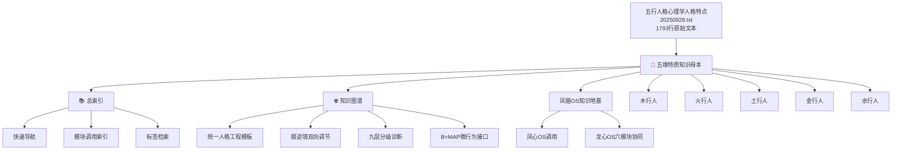
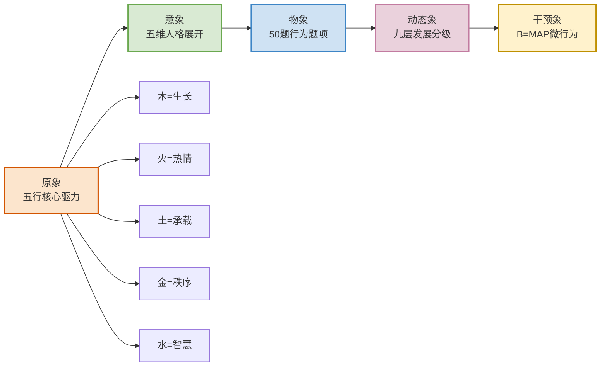
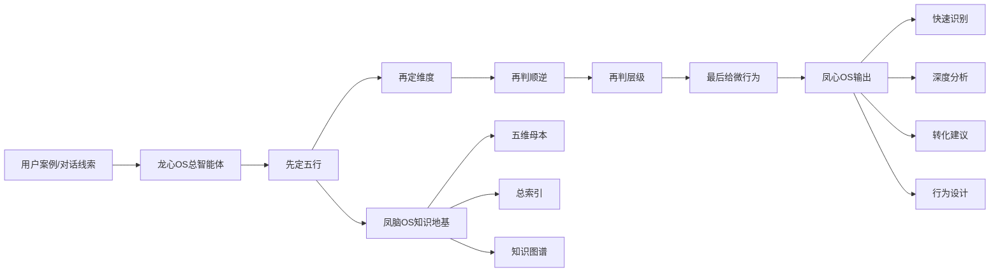
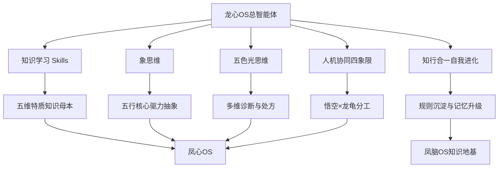
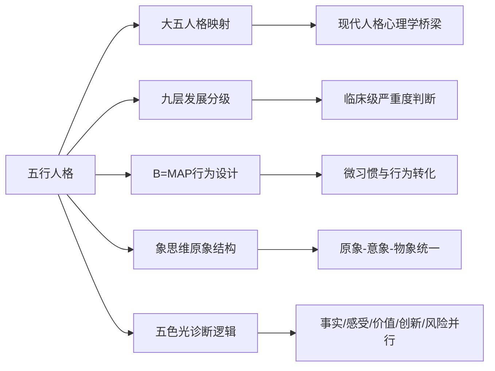

# 🌐 五行人格心理学人格特点·知识图谱（20250928）

> [[📖 五行人格心理学人格特点·五维特质知识母本（20250928）]] ｜ [[📚 五行人格心理学人格特点·总索引（20250928）]] ｜ [[凤脑OS知识地基]]
>
> 本图谱把 `五行人格心理学人格特点20250928.txt` 的 1793 行学习成果转化为可视化关系网络，用于支撑 [[凤心OS]] 的快速检索、[[龙心OS]] 六模块的组合调用，以及后续跨文档知识延展。

---

## 一、知识网络总览

---

## 二、统一人格工程模板图

### 图谱解释
- **原象层**：五行不是标签，而是五种核心生命驱力。
- **意象层**：每一种驱力都展开为五维结构。
- **物象层**：每一维都被翻译成行为题项，可以量化观测。
- **动态象层**：九层发展让人格从静态描述进入动态分级。
- **干预象层**：B=MAP让理论直接进入行为改造。

---

## 三、五行 × 五维 × 风险焦点图

```mermaid
graph TD
    M[木行人] --> M1[曲直]
    M --> M2[生发]
    M --> M3[舒畅腾上]
    M --> M4[调达柔和]
    M --> M5[内在成长]

    F[火行人] --> F1[炎上]
    F --> F2[明亮]
    F --> F3[炽烈]
    F --> F4[发散]
    F --> F5[迅疾]

    T[土行人] --> T1[承载]
    T --> T2[适应]
    T --> T3[容纳]
    T --> T4[运化]
    T --> T5[稳定]

    J[金行人] --> J1[坚固]
    J --> J2[收敛]
    J --> J3[锋利]
    J --> J4[光洁]
    J --> J5[变革]

    S[水行人] --> S1[润下]
    S --> S2[通透]
    S --> S3[沉潜]
    S --> S4[静藏]
    S --> S5[养物]
```

### 五行风险总线
- **木**：独特性失衡后，最容易滑向傲慢、逆反、偏执与退缩。
- **火**：高能量若失去节律，最容易滑向急躁、虚荣、夸张与操控。
- **土**：承载若失去弹性，最容易滑向僵化、抱怨、控制与拖延。
- **金**：秩序若失去人性，最容易滑向苛责、冷硬、独断与破坏。
- **水**：智慧若失去主体性，最容易滑向圆滑、依赖、反刍与耗散。

---

## 四、凤心OS调用链图

### 调用原则
1. 不可只凭单句情绪话就直接定人格。
2. 必须同时判断五行、维度、顺逆、层级四个维度。
3. 输出必须落到最小行为动作，而不是停留在抽象评价。

---

## 五、龙心OS六模块协同图

### 协同解释
- **知识学习 Skills** 负责把 1793 行原文吃透并结构化。
- **象思维** 负责把五行还原为五种本体驱力。
- **五色光思维** 负责把诊断从单维度判断升级为多维度辨证。
- **人机协同四象限** 负责把案例经验与理论模型拼接起来。
- **知行合一自我进化** 负责把本轮学习沉淀成未来可调用资产。

---

## 六、跨域关系图

### 隐秘联系总结
- **五行 × 大五人格**：让传统识人理论有了现代心理学接口。
- **五行 × 九层发展**：让人格评估具备“程度判断”而非只有“类型判断”。
- **五行 × B=MAP**：让诊断结果直接连接到最小转化动作。
- **五行 × 象思维**：把五行从标签还原为原象。
- **五行 × 五色光思维**：让处方从单点建议升级为结构化决策。

---

## 七、图谱使用说明

### 适合的使用场景
- 需要快速说明这套体系“到底由什么构成”。
- 需要向凤心OS说明“该如何按顺序调用”。
- 需要做课程讲解、系统展示、知识库导航。
- 需要在未来继续往这套体系上新增测评、案例、工具或应用模块。

### 图谱的三层价值
1. **导航价值**：一眼看到母本、索引、图谱、凤脑OS之间的关系。
2. **诊断价值**：一眼看到五行五维和关键风险通道。
3. **系统价值**：一眼看到龙心OS 1+5 模式如何联动这套知识。

---

## 八、核心金句

> **五行人格心理学的真正力量，不在于“分五类人”，而在于“建立一个可识别、可分级、可转化、可调度的人格工程系统”。**

> **凤脑OS储存结构，凤心OS调用结构，龙心OS编排结构。**

> **图谱不是装饰，而是让知识从“能读”升级为“能调”。**
