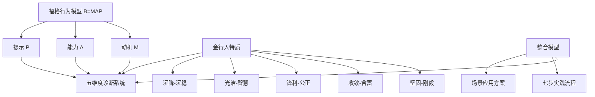
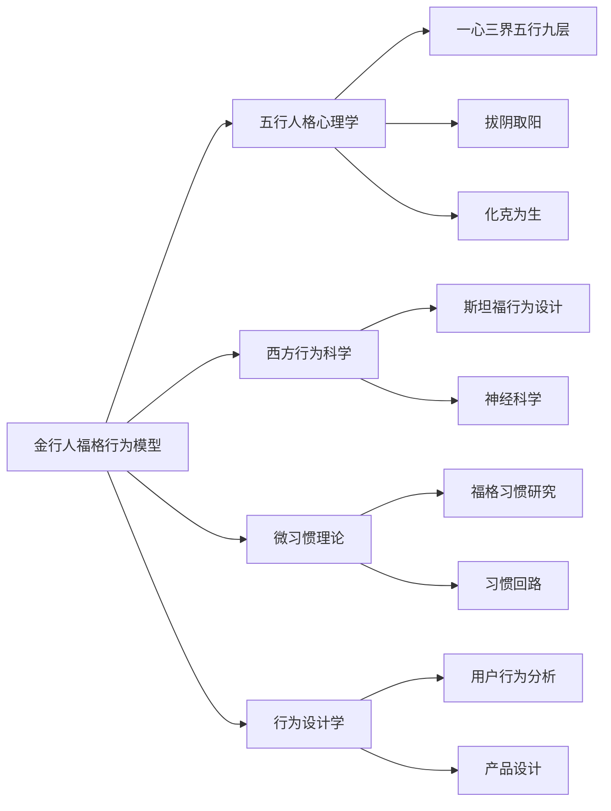

# 📊 金行人福格行为模型（B=MAP）知识图谱

## 一、核心节点

### 1.1 理论融合节点



### 1.2 五维度行为设计方案节点

| 维度 | 阳面目标 | 阴面问题 | B=MAP诊断 | 核心微行为 |
|------|---------|---------|-----------|-----------|
| **坚固** | 共赢合作 | 好胜计较 | M=证明自己强<br/>A=情感脑力高<br/>P=竞争警报 | 10秒黄金沉默 |
| **收敛** | 智慧分享 | 小气狭隘 | M=资源稀缺恐惧<br/>A=损失厌恶<br/>P=求助被解读索取 | 每日一微分享 |
| **锋利** | 对事对人 | 严苛无情 | M=消除错误<br/>A=共情能力低<br/>P=错误触发批评 | 缓冲-聚焦句式 |
| **光洁** | 扎实权威 | 虚荣自负 | M=证明价值<br/>A=威胁自我感<br/>P=成功触发炫耀 | 成就谦述法 |
| **沉降** | 周密定力 | 焦虑多疑 | M=风险恐惧<br/>A=失控焦虑<br/>P=变化触发反刍 | 1分钟焦虑快照 |

## 二、关系网络

### 2.1 理论基础关系

```json
{
  "福格行为模型": {
    "核心公式": "B = M × A × P",
    "PAC动机框架": {
      "P": "Person - 内在愉悦/痛苦",
      "A": "Action - 外在利益/惩罚",
      "C": "Context - 社会接受/拒绝"
    },
    "核心概念": ["动机", "能力", "提示", "行动线", "黄金行为", "微习惯", "锚点提示"]
  },
  "金行人特质": {
    "核心能量": "从革、收敛、肃降",
    "五维度": ["坚固", "收敛", "锋利", "光洁", "沉降"],
    "阴阳两面": {
      "阳面": ["刚毅坚强", "含蓄持重", "公正锋利", "智慧权威", "沉稳冷静"],
      "阴面": ["好胜计较", "小气狭隘", "严苛无情", "虚荣自负", "焦虑多疑"]
    }
  }
}
```

### 2.2 与五行体系的关系

| 五行 | 在本模型中的角色 |
|------|-----------------|
| **金** | 主体：精准、秩序、原则性的行为优化 |
| **木** | 相克：创新挑战可能触发金行人的防御反应 |
| **火** | 相生：热情驱动可增强行为改变的动力 |
| **土** | 相生：价值整合帮助发现行为改变的意义 |
| **水** | 相克：风险焦虑可能成为行为改变的阻碍 |

### 2.3 与其他知识体系的链接



## 三、实践应用网络

### 3.1 七步实践路径

| 步骤 | 名称 | 核心操作 | 金行人适配要点 |
|------|------|---------|---------------|
| 1 | 明确愿望 | 成果陈述 | 连接"秩序"、"价值"动机 |
| 2 | 探索选项 | 头脑风暴 | 避免过早可行性批判 |
| 3 | 匹配行为 | 黄金行为 | 高影响力×高可行性 |
| 4 | 微习惯开始 | 简化行为 | 抵抗"完美或不做"冲动 |
| 5 | 找到提示 | 锚点设计 | 利用计划敏感性 |
| 6 | 庆祝成功 | 即时反馈 | 理性肯定方式 |
| 7 | 排除障碍 | 迭代优化 | 视为系统数据反馈 |

### 3.2 场景应用映射

| 场景 | 问题类型 | 适用维度 | 核心方案 |
|------|---------|---------|---------|
| 决策犹豫 | 过度准备 | 沉降 | 15分钟决策计时器 |
| 团队沟通 | 严厉感 | 锋利 | SBIT反馈法 |
| 知识分享 | 不愿分享 | 收敛 | 知识库Q&A |
| 竞争态度 | 好胜敌对 | 坚固 | 三赢表达法 |

## 四、关键概念索引

### 4.1 核心概念快速链接

| 概念 | 定义 | 相关文档 |
|------|------|---------|
| **B=MAP** | 行为=动机×能力×提示 | 本文档 |
| **黄金行为** | 高影响力×高可行性的行为 | 本文档 |
| **微习惯** | 简单到不会失败的行为 | [[📖 金行人福格行为模型B=MAP]] |
| **锚点提示** | 绑定到既有习惯的触发器 | 本文档 |
| **行动线** | M×A决定行为发生可能性 | 本文档 |
| **PAC动机框架** | Person/Action/Context动机来源 | 本文档 |

### 4.2 五维度关键词

| 维度 | 阳面关键词 | 阴面关键词 | 转化关键词 |
|------|----------|----------|-----------|
| 坚固 | 刚毅、坚韧、合作 | 好胜、计较、对立 | 共赢、三赢、沉默 |
| 收敛 | 含蓄、积累、深度 | 狭隘、自私、封闭 | 分享、播种、投资 |
| 锋利 | 公正、精准、原则 | 严苛、无情、攻击 | 缓冲、共情、SBIT |
| 光洁 | 智慧、权威、贡献 | 虚荣、自负、炫耀 | 谦述、寻优、归因 |
| 沉降 | 沉稳、冷静、周密 | 焦虑、多疑、失控 | 快照、同心圆、正念 |

## 五、学习路径建议

### 5.1 初学者路径

```
Step 1: 理解福格行为模型基础
  → 阅读：福格行为模型核心公式
  → 实践：识别自己的B=MAP
  
Step 2: 理解金行人特质
  → 阅读：[[📖 金行人专属-一心三界五行九层象思维体系v2.0]]
  → 实践：自我特质评估
  
Step 3: 掌握五维度诊断
  → 阅读：本知识图谱"五维度行为设计方案"
  → 实践：选择一个维度进行诊断
  
Step 4: 应用七步流程
  → 阅读：第四章"七步实践路径"
  → 实践：从微习惯开始
  
Step 5: 场景深化
  → 阅读：第五章"应用实践"
  → 实践：解决具体问题
```

### 5.2 进阶研究者路径

```
进阶研究 → 
  理论对比：福格模型 vs 传统习惯理论
  跨文化整合：B=MAP × 五行人格 × 九型人格
  技术应用：AI个性化行为导航系统
  组织应用：团队管理中的金行人激励
```

---

**图谱版本**: 1.0
**创建日期**: 2026-03-27
**更新频率**: 按需更新
**维护者**: 龙龟神将
