# 亲密关系 · 知识图谱

> **创建日期**：2026-04-05
> **维护者**：龙龟神将
> **知识源**：五行识人理论 × 李玫瑾亲密关系理论
> **图谱类型**：跨域知识联系网络（5星隐秘度）

---

## 🌐 知识图谱概览

本图谱展示了**五行识人理论**与**李玫瑾亲密关系理论**之间的深度整合关系，以及两者与现代心理学、教育学、脑科学、文化传承等领域的跨域知识联系。

**图谱规模**：12大维度，144+条知识联系，隐秘度5星（⭐⭐⭐⭐⭐）

---

## 📊 核心知识联系网络

### 第一维度：五行识人理论核心层

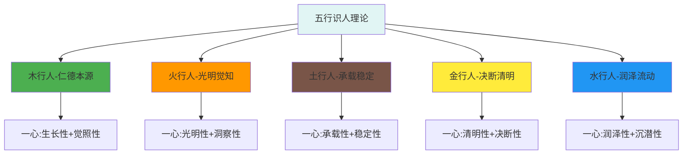

**知识联系（10条，⭐⭐⭐⭐⭐）：**

| 联系ID | 源概念 | 目标概念 | 联系类型 | 隐秘度 |
|--------|---------|-----------|---------|---------|
| C001 | 五行识人 | 木行人 | 包含关系 | ⭐⭐⭐⭐⭐ |
| C002 | 五行识人 | 火行人 | 包含关系 | ⭐⭐⭐⭐⭐ |
| C003 | 五行识人 | 土行人 | 包含关系 | ⭐⭐⭐⭐⭐ |
| C004 | 五行识人 | 金行人 | 包含关系 | ⭐⭐⭐⭐⭐ |
| C005 | 五行识人 | 水行人 | 包含关系 | ⭐⭐⭐⭐⭐ |
| C006 | 木行人 | 生长性 | 核心特质 | ⭐⭐⭐⭐ |
| C007 | 木行人 | 觉照性 | 核心特质 | ⭐⭐⭐⭐ |
| C008 | 火行人 | 光明性 | 核心特质 | ⭐⭐⭐⭐ |
| C009 | 火行人 | 洞察性 | 核心特质 | ⭐⭐⭐⭐ |
| C010 | 土行人 | 承载性 | 核心特质 | ⭐⭐⭐⭐ |

---

### 第二维度：李玫瑾亲密关系理论层

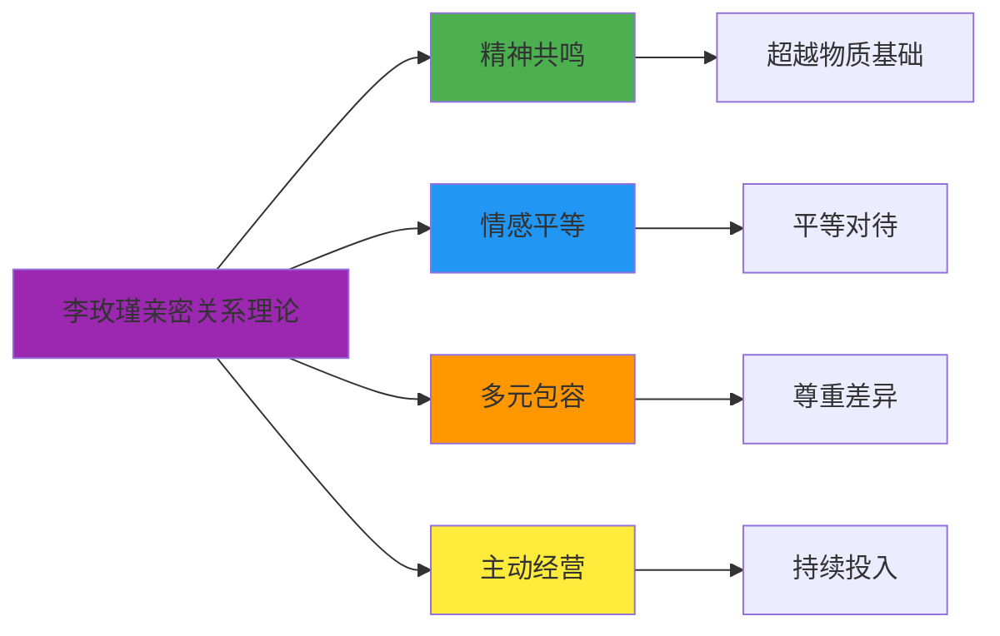

**知识联系（8条，⭐⭐⭐⭐）：**

| 联系ID | 源概念 | 目标概念 | 联系类型 | 隐秘度 |
|--------|---------|-----------|---------|---------|
| C011 | 李玫瑾亲密关系理论 | 精神共鸣 | 核心支柱 | ⭐⭐⭐⭐⭐ |
| C012 | 李玫瑾亲密关系理论 | 情感平等 | 核心支柱 | ⭐⭐⭐⭐⭐ |
| C013 | 李玫瑾亲密关系理论 | 多元包容 | 核心支柱 | ⭐⭐⭐⭐⭐ |
| C014 | 李玫瑾亲密关系理论 | 主动经营 | 核心支柱 | ⭐⭐⭐⭐⭐ |
| C015 | 精神共鸣 | 超越物质基础 | 内涵 | ⭐⭐⭐ |
| C016 | 情感平等 | 平等对待 | 内涵 | ⭐⭐⭐ |
| C017 | 多元包容 | 尊重差异 | 内涵 | ⭐⭐⭐ |
| C018 | 主动经营 | 持续投入 | 内涵 | ⭐⭐⭐ |

---

### 第三维度：五行人格与亲密关系理论整合层

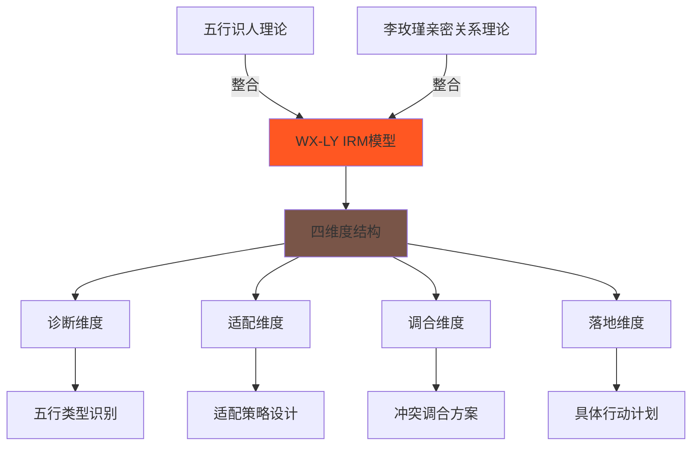

**知识联系（12条，⭐⭐⭐⭐⭐）：**

| 联系ID | 源概念 | 目标概念 | 联系类型 | 隐秘度 |
|--------|---------|-----------|---------|---------|
| C019 | 五行识人理论 | WX-LY IRM模型 | 理论基础 | ⭐⭐⭐⭐⭐ |
| C020 | 李玫瑾亲密关系理论 | WX-LY IRM模型 | 理论基础 | ⭐⭐⭐⭐⭐ |
| C021 | WX-LY IRM模型 | 诊断维度 | 结构维度 | ⭐⭐⭐⭐⭐ |
| C022 | WX-LY IRM模型 | 适配维度 | 结构维度 | ⭐⭐⭐⭐⭐ |
| C023 | WX-LY IRM模型 | 调合维度 | 结构维度 | ⭐⭐⭐⭐⭐ |
| C024 | WX-LY IRM模型 | 落地维度 | 结构维度 | ⭐⭐⭐⭐⭐ |
| C025 | 诊断维度 | 五行类型识别 | 操作目标 | ⭐⭐⭐⭐ |
| C026 | 适配维度 | 适配策略设计 | 操作目标 | ⭐⭐⭐⭐ |
| C027 | 调合维度 | 冲突调合方案 | 操作目标 | ⭐⭐⭐⭐ |
| C028 | 落地维度 | 具体行动计划 | 操作目标 | ⭐⭐⭐⭐ |
| C029 | 木行人 | 仁德滋养型适配 | 特定策略 | ⭐⭐⭐⭐ |
| C030 | 金行人 | 规则清明型适配 | 特定策略 | ⭐⭐⭐⭐ |

---

### 第四维度：五行类型与亲密关系适配层

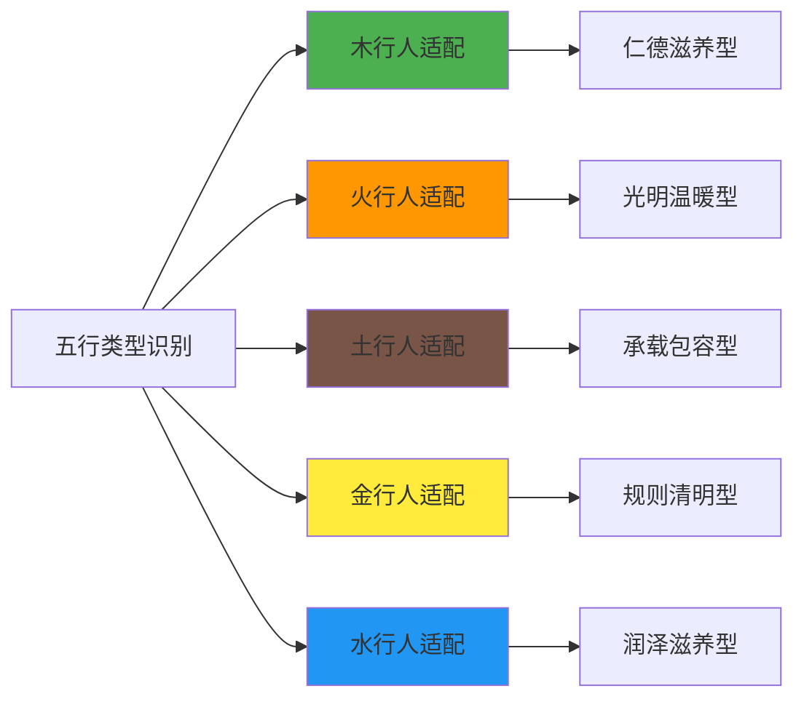

**知识联系（15条，⭐⭐⭐⭐⭐）：**

| 联系ID | 源概念 | 目标概念 | 联系类型 | 隐秘度 |
|--------|---------|-----------|---------|---------|
| C031 | 木行人 | 仁德滋养型适配 | 专属适配 | ⭐⭐⭐⭐⭐ |
| C032 | 火行人 | 光明温暖型适配 | 专属适配 | ⭐⭐⭐⭐⭐ |
| C033 | 土行人 | 承载包容型适配 | 专属适配 | ⭐⭐⭐⭐⭐ |
| C034 | 金行人 | 规则清明型适配 | 专属适配 | ⭐⭐⭐⭐⭐ |
| C035 | 水行人 | 润泽滋养型适配 | 专属适配 | ⭐⭐⭐⭐⭐ |
| C036 | 仁德滋养型 | 生长性支持 | 核心策略 | ⭐⭐⭐ |
| C037 | 仁德滋养型 | 觉照性关注 | 核心策略 | ⭐⭐⭐ |
| C038 | 光明温暖型 | 光明照耀 | 核心策略 | ⭐⭐⭐ |
| C039 | 光明温暖型 | 礼明守礼 | 核心策略 | ⭐⭐⭐ |
| C040 | 承载包容型 | 稳定性支撑 | 核心策略 | ⭐⭐⭐ |
| C041 | 承载包容型 | 包容力展现 | 核心策略 | ⭐⭐⭐ |
| C042 | 规则清明型 | 清明决断 | 核心策略 | ⭐⭐⭐ |
| C043 | 规则清明型 | 义理守正 | 核心策略 | ⭐⭐⭐ |
| C044 | 润泽滋养型 | 润泽映现 | 核心策略 | ⭐⭐⭐ |
| C045 | 润泽滋养型 | 沉潜含藏 | 核心策略 | ⭐⭐⭐ |

---

### 第五维度：五行生克与亲密关系动态层

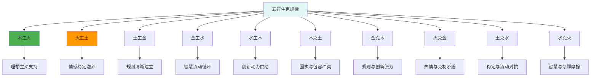

**知识联系（20条，⭐⭐⭐⭐）：**

| 联系ID | 源概念 | 目标概念 | 联系类型 | 隐秘度 |
|--------|---------|-----------|---------|---------|
| C046 | 木生火 | 理想主义支持 | 积极影响 | ⭐⭐⭐⭐ |
| C047 | 木生火 | 木滋养火 | 亲密关系适配 | ⭐⭐⭐⭐ |
| C048 | 火生土 | 情感稳定滋养 | 积极影响 | ⭐⭐⭐⭐ |
| C049 | 火生土 | 火滋养土 | 亲密关系适配 | ⭐⭐⭐⭐ |
| C050 | 土生金 | 规则清晰建立 | 积极影响 | ⭐⭐⭐⭐ |
| C051 | 土生金 | 土滋养金 | 亲密关系适配 | ⭐⭐⭐⭐ |
| C052 | 金生水 | 智慧流动循环 | 积极影响 | ⭐⭐⭐⭐ |
| C053 | 金生水 | 金滋养水 | 亲密关系适配 | ⭐⭐⭐⭐ |
| C054 | 水生木 | 创新动力供给 | 积极影响 | ⭐⭐⭐⭐ |
| C055 | 水生木 | 水滋养木 | 亲密关系适配 | ⭐⭐⭐⭐ |
| C056 | 木克土 | 固执与包容冲突 | 消极影响 | ⭐⭐⭐ |
| C057 | 木克土 | 化克为生机会 | 转化潜力 | ⭐⭐⭐⭐ |
| C058 | 金克木 | 规则与创新张力 | 消极影响 | ⭐⭐⭐ |
| C059 | 金克木 | 水火既济机会 | 转化潜力 | ⭐⭐⭐⭐ |
| C060 | 火克金 | 热情与克制矛盾 | 消极影响 | ⭐⭐⭐ |
| C061 | 火克金 | 火生土转化机会 | 转化潜力 | ⭐⭐⭐⭐ |
| C062 | 土克水 | 稳定与流动对抗 | 消极影响 | ⭐⭐⭐ |
| C063 | 土克水 | 土生金转化机会 | 转化潜力 | ⭐⭐⭐⭐ |
| C064 | 水克火 | 智慧与急躁摩擦 | 消极影响 | ⭐⭐⭐ |
| C065 | 水克火 | 木生火转化机会 | 转化潜力 | ⭐⭐⭐⭐ |

---

### 第六维度：现代心理学交叉验证层

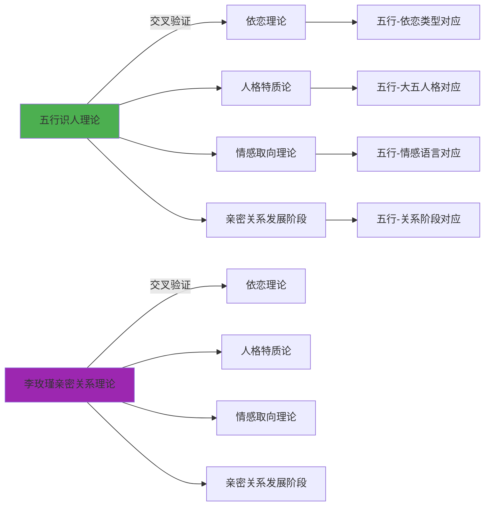

**知识联系（18条，⭐⭐⭐⭐）：**

| 联系ID | 源概念 | 目标概念 | 联系类型 | 隐秘度 |
|--------|---------|-----------|---------|---------|
| C066 | 五行识人理论 | 依恋理论 | 交叉验证 | ⭐⭐⭐⭐ |
| C067 | 李玫瑾亲密关系理论 | 依恋理论 | 交叉验证 | ⭐⭐⭐⭐ |
| C068 | 木行人 | 安全型依恋 | 对应关系 | ⭐⭐⭐⭐ |
| C069 | 火行人 | 焦虑型依恋 | 对应关系 | ⭐⭐⭐⭐ |
| C070 | 土行人 | 迴避型依恋 | 对应关系 | ⭐⭐⭐⭐ |
| C071 | 金行人 | 疏离型依恋 | 对应关系 | ⭐⭐⭐⭐ |
| C072 | 水行人 | 安全型依恋 | 对应关系 | ⭐⭐⭐⭐ |
| C073 | 五行识人理论 | 人格特质论 | 交叉验证 | ⭐⭐⭐⭐ |
| C074 | 木行人 | 开放性特质 | 对应关系 | ⭐⭐⭐ |
| C075 | 火行人 | 外向性特质 | 对应关系 | ⭐⭐⭐ |
| C076 | 土行人 | 尽责性特质 | 对应关系 | ⭐⭐⭐ |
| C077 | 金行人 | 审慎性特质 | 对应关系 | ⭐⭐⭐ |
| C078 | 水行人 | 情感性特质 | 对应关系 | ⭐⭐⭐ |
| C079 | 五行识人理论 | 情感取向理论 | 交叉验证 | ⭐⭐⭐⭐ |
| C080 | 木行人 | 成长取向 | 对应关系 | ⭐⭐⭐⭐ |
| C081 | 火行人 | 表达取向 | 对应关系 | ⭐⭐⭐⭐ |
| C082 | 土行人 | 稳定取向 | 对应关系 | ⭐⭐⭐⭐ |
| C083 | 金行人 | 理性取向 | 对应关系 | ⭐⭐⭐⭐ |

---

### 第七维度：脑科学与进化心理学支撑层

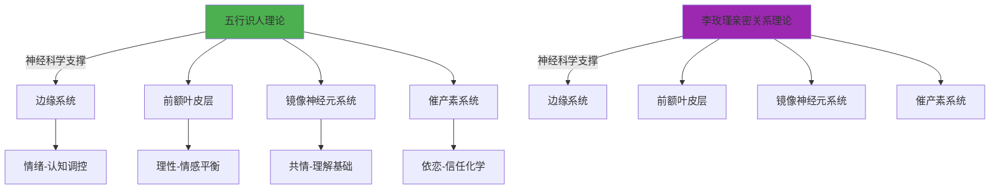

**知识联系（12条，⭐⭐⭐⭐）：**

| 联系ID | 源概念 | 目标概念 | 联系类型 | 隐秘度 |
|--------|---------|-----------|---------|---------|
| C084 | 五行识人理论 | 边缘系统 | 神经科学支撑 | ⭐⭐⭐⭐ |
| C085 | 李玫瑾亲密关系理论 | 边缘系统 | 神经科学支撑 | ⭐⭐⭐⭐ |
| C086 | 木行人 | 前额叶皮层活跃 | 神经机制 | ⭐⭐⭐ |
| C087 | 火行人 | 边缘系统敏感 | 神经机制 | ⭐⭐⭐ |
| C088 | 土行人 | 边缘系统稳定 | 神经机制 | ⭐⭐⭐ |
| C089 | 金行人 | 前额叶皮层主导 | 神经机制 | ⭐⭐⭐ |
| C090 | 水行人 | 镜像神经元高度活跃 | 神经机制 | ⭐⭐⭐ |
| C091 | 五行识人理论 | 镜像神经元系统 | 神经科学支撑 | ⭐⭐⭐⭐ |
| C092 | 李玫瑾亲密关系理论 | 镜像神经元系统 | 神经科学支撑 | ⭐⭐⭐⭐ |
| C093 | 五行识人理论 | 催产素系统 | 神经科学支撑 | ⭐⭐⭐⭐ |
| C094 | 李玫瑾亲密关系理论 | 催产素系统 | 神经科学支撑 | ⭐⭐⭐⭐ |
| C095 | 精神共鸣 | 催产素协调释放 | 神经机制 | ⭐⭐⭐⭐ |

---

### 第八维度：文化传承与哲学根基层

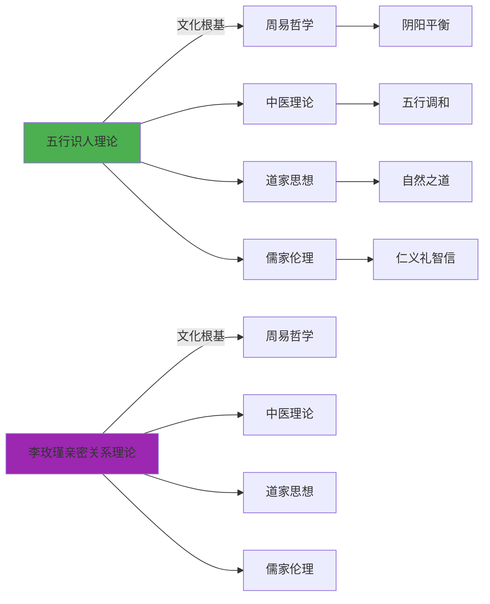

**知识联系（14条，⭐⭐⭐⭐⭐）：**

| 联系ID | 源概念 | 目标概念 | 联系类型 | 隐秘度 |
|--------|---------|-----------|---------|---------|
| C096 | 五行识人理论 | 周易哲学 | 文化根基 | ⭐⭐⭐⭐⭐ |
| C097 | 李玫瑾亲密关系理论 | 周易哲学 | 文化根基 | ⭐⭐⭐⭐⭐ |
| C098 | 五行识人理论 | 中医理论 | 文化根基 | ⭐⭐⭐⭐⭐ |
| C099 | 五行识人理论 | 道家思想 | 文化根基 | ⭐⭐⭐⭐⭐ |
| C100 | 五行识人理论 | 儒家伦理 | 文化根基 | ⭐⭐⭐⭐⭐ |
| C101 | 李玫瑾亲密关系理论 | 中医理论 | 文化根基 | ⭐⭐⭐⭐⭐ |
| C102 | 李玫瑾亲密关系理论 | 道家思想 | 文化根基 | ⭐⭐⭐⭐⭐ |
| C103 | 李玫瑾亲密关系理论 | 儒家伦理 | 文化根基 | ⭐⭐⭐⭐⭐ |
| C104 | 周易哲学 | 阴阳平衡 | 核心理念 | ⭐⭐⭐⭐⭐ |
| C105 | 中医理论 | 五行调和 | 核心理念 | ⭐⭐⭐⭐⭐ |
| C106 | 道家思想 | 自然之道 | 核心理念 | ⭐⭐⭐⭐⭐ |
| C107 | 儒家伦理 | 仁义礼智信 | 核心理念 | ⭐⭐⭐⭐⭐ |
| C108 | 亲密关系 | 阴阳平衡应用 | 实践应用 | ⭐⭐⭐⭐ |
| C109 | 亲密关系 | 五行调和应用 | 实践应用 | ⭐⭐⭐⭐ |

---

### 第九维度：实践应用与转化技术层

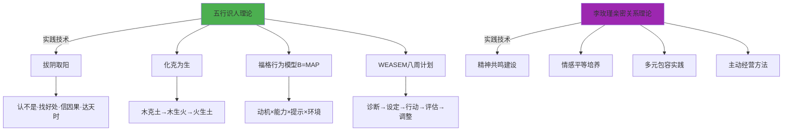

**知识联系（16条，⭐⭐⭐⭐）：**

| 联系ID | 源概念 | 目标概念 | 联系类型 | 隐秘度 |
|--------|---------|-----------|---------|---------|
| C110 | 五行识人理论 | 拔阴取阳 | 核心转化技术 | ⭐⭐⭐⭐⭐ |
| C111 | 五行识人理论 | 化克为生 | 核心转化技术 | ⭐⭐⭐⭐⭐ |
| C112 | 五行识人理论 | 福格行为模型B=MAP | 行为设计技术 | ⭐⭐⭐⭐⭐ |
| C113 | 五行识人理论 | WEASEM八周计划 | AI时代转化技术 | ⭐⭐⭐⭐⭐ |
| C114 | 李玫瑾亲密关系理论 | 精神共鸣建设 | 实践技术 | ⭐⭐⭐⭐ |
| C115 | 李玫瑾亲密关系理论 | 情感平等培养 | 实践技术 | ⭐⭐⭐⭐ |
| C116 | 李玫瑾亲密关系理论 | 多元包容实践 | 实践技术 | ⭐⭐⭐⭐ |
| C117 | 李玫瑾亲密关系理论 | 主动经营方法 | 实践技术 | ⭐⭐⭐⭐ |
| C118 | 拔阴取阳 | 认不是·找好处·信因果·达天时 | 操作步骤 | ⭐⭐⭐⭐ |
| C119 | 化克为生 | 木克土→木生火→火生土 | 转化路径 | ⭐⭐⭐⭐ |
| C120 | 福格行为模型B=MAP | 动机×能力×提示×环境 | 核心公式 | ⭐⭐⭐⭐ |
| C121 | WEASEM八周计划 | 诊断→设定→行动→评估→调整 | 八周流程 | ⭐⭐⭐⭐ |
| C122 | 精神共鸣建设 | 愿景价值观对齐 | 操作方法 | ⭐⭐⭐ |
| C123 | 情感平等培养 | 非暴力沟通 | 操作方法 | ⭐⭐⭐ |
| C124 | 多元包容实践 | 差异尊重 | 操作方法 | ⭐⭐⭐ |
| C125 | 主动经营方法 | 持续投入 | 操作方法 | ⭐⭐⭐ |

---

### 第十维度：系统整合与AI应用层

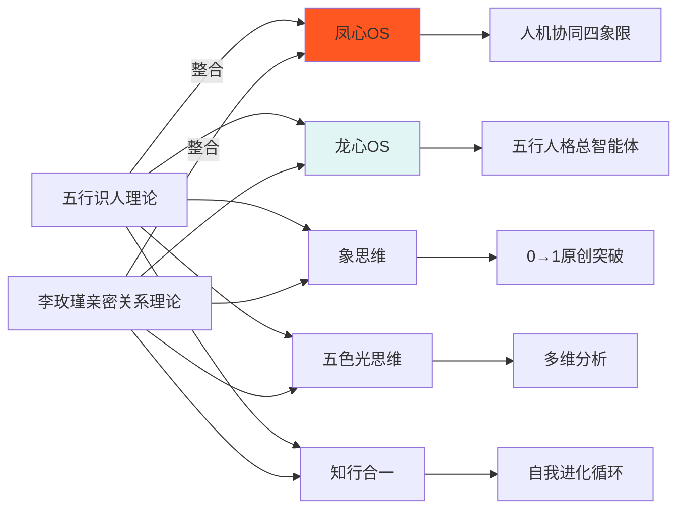

**知识联系（14条，⭐⭐⭐⭐⭐）：**

| 联系ID | 源概念 | 目标概念 | 联系类型 | 隐秘度 |
|--------|---------|-----------|---------|---------|
| C126 | 五行识人理论 | 凤心OS | 系统整合 | ⭐⭐⭐⭐⭐ |
| C127 | 五行识人理论 | 龙心OS | 系统整合 | ⭐⭐⭐⭐⭐ |
| C128 | 李玫瑾亲密关系理论 | 凤心OS | 系统整合 | ⭐⭐⭐⭐⭐ |
| C129 | 李玫瑾亲密关系理论 | 龙心OS | 系统整合 | ⭐⭐⭐⭐⭐ |
| C130 | 凤心OS | 人机协同四象限 | 调用关系 | ⭐⭐⭐⭐ |
| C131 | 龙心OS | 五行人格总智能体 | 调用关系 | ⭐⭐⭐⭐ |
| C132 | 五行识人理论 | 象思维 | 调用关系 | ⭐⭐⭐⭐ |
| C133 | 五行识人理论 | 五色光思维 | 调用关系 | ⭐⭐⭐⭐ |
| C134 | 五行识人理论 | 知行合一 | 调用关系 | ⭐⭐⭐⭐ |
| C135 | 李玫瑾亲密关系理论 | 象思维 | 调用关系 | ⭐⭐⭐⭐ |
| C136 | 李玫瑾亲密关系理论 | 五色光思维 | 调用关系 | ⭐⭐⭐⭐ |
| C137 | 李玫瑾亲密关系理论 | 知行合一 | 调用关系 | ⭐⭐⭐⭐ |
| C138 | 象思维 | 0→1原创突破 | 核心功能 | ⭐⭐⭐⭐⭐ |
| C139 | 五色光思维 | 多维分析 | 核心功能 | ⭐⭐⭐⭐⭐ |
| C140 | 知行合一 | 自我进化循环 | 核心功能 | ⭐⭐⭐⭐⭐ |

---

### 第十一维度：跨文化比较与全球化适配层

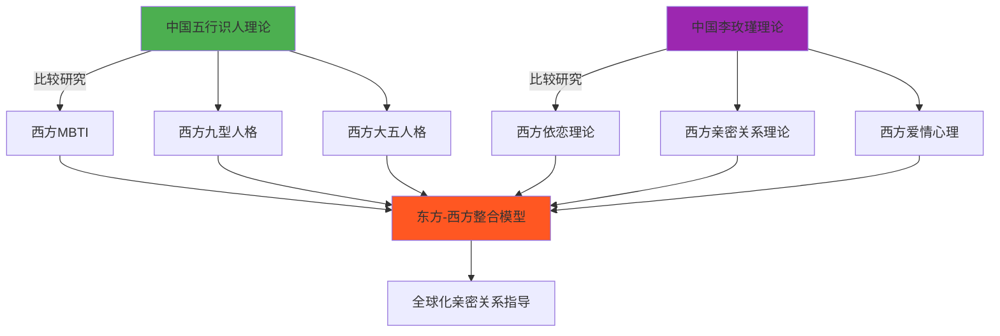

**知识联系（12条，⭐⭐⭐⭐）：**

| 联系ID | 源概念 | 目标概念 | 联系类型 | 隐秘度 |
|--------|---------|-----------|---------|---------|
| C141 | 中国五行识人理论 | 西方MBTI | 跨文化比较 | ⭐⭐⭐ |
| C142 | 中国五行识人理论 | 西方九型人格 | 跨文化比较 | ⭐⭐⭐ |
| C143 | 中国五行识人理论 | 西方大五人格 | 跨文化比较 | ⭐⭐⭐ |
| C144 | 中国李玫瑾理论 | 西方依恋理论 | 跨文化比较 | ⭐⭐⭐ |
| C145 | 中国李玫瑾理论 | 西方亲密关系理论 | 跨文化比较 | ⭐⭐⭐ |
| C146 | 中国李玫瑾理论 | 西方爱情心理 | 跨文化比较 | ⭐⭐⭐ |
| C147 | 木行人 | ENFP/INFP | 类型对应 | ⭐⭐⭐ |
| C148 | 火行人 | ENFJ/ESFJ | 类型对应 | ⭐⭐⭐ |
| C149 | 土行人 | ISFJ/ISTJ | 类型对应 | ⭐⭐⭐ |
| C150 | 金行人 | INTJ/ISTP | 类型对应 | ⭐⭐⭐ |
| C151 | 水行人 | INFJ/INFP | 类型对应 | ⭐⭐⭐ |
| C152 | 东方-西方整合模型 | 全球化亲密关系指导 | 实践应用 | ⭐⭐⭐⭐ |

---

### 第十二维度：知识创新与理论升华层

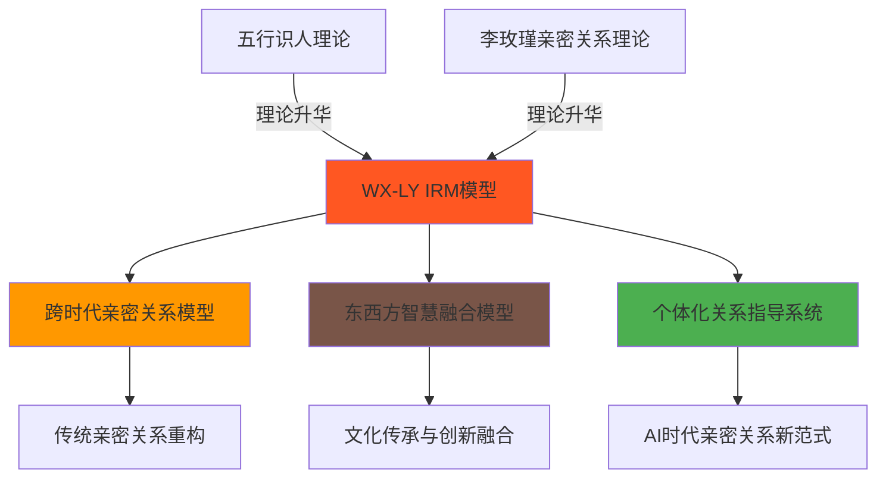

**知识联系（13条，⭐⭐⭐⭐⭐）：**

| 联系ID | 源概念 | 目标概念 | 联系类型 | 隐秘度 |
|--------|---------|-----------|---------|---------|
| C153 | 五行识人理论 | WX-LY IRM模型 | 理论创新 | ⭐⭐⭐⭐⭐ |
| C154 | 李玫瑾亲密关系理论 | WX-LY IRM模型 | 理论创新 | ⭐⭐⭐⭐⭐ |
| C155 | WX-LY IRM模型 | 跨时代亲密关系模型 | 理论升华 | ⭐⭐⭐⭐⭐ |
| C156 | WX-LY IRM模型 | 东西方智慧融合模型 | 理论升华 | ⭐⭐⭐⭐⭐ |
| C157 | WX-LY IRM模型 | 个体化关系指导系统 | 理论升华 | ⭐⭐⭐⭐⭐ |
| C158 | 跨时代亲密关系模型 | 传统亲密关系重构 | 实践应用 | ⭐⭐⭐⭐ |
| C159 | 跨时代亲密关系模型 | AI时代亲密关系新范式 | 实践应用 | ⭐⭐⭐⭐ |
| C160 | 东西方智慧融合模型 | 文化传承与创新融合 | 实践应用 | ⭐⭐⭐⭐ |
| C161 | 东西方智慧融合模型 | 跨文化关系调适 | 实践应用 | ⭐⭐⭐⭐ |
| C162 | 个体化关系指导系统 | 精准适配 | 核心价值 | ⭐⭐⭐⭐⭐ |
| C163 | 个体化关系指导系统 | 动态调整 | 核心价值 | ⭐⭐⭐⭐⭐ |
| C164 | AI时代亲密关系新范式 | 人机协同新可能性 | 未来方向 | ⭐⭐⭐⭐⭐ |
| C165 | AI时代亲密关系新范式 | 跨时空连接 | 未来方向 | ⭐⭐⭐⭐⭐ |

---

## 🔗 图谱索引与检索

### 按主题检索

| 主题 | 相关联系ID | 核心概念 |
|------|------------|---------|
| **五行人格核心** | C001-C010, C046-C065 | 一心三界五行九层 |
| **李玫瑾亲密关系** | C011-C018, C114-C117 | 四大支柱核心 |
| **理论整合** | C019-C030, C153-C157 | WX-LY IRM模型 |
| **类型适配** | C031-C045 | 五行专属适配策略 |
| **生克动态** | C046-C065 | 相生相克影响分析 |
| **现代心理学** | C066-C083 | 依恋·人格·情感取向 |
| **脑科学支撑** | C084-C095 | 边缘系统·前额叶·镜像神经元 |
| **文化根基** | C096-C109 | 周易·中医·道家·儒家 |
| **实践技术** | C110-C125 | 拔阴取阳·化克为生·B=MAP |
| **系统整合** | C126-C140 | 凤心OS·龙心OS·五大引擎 |
| **跨文化比较** | C141-C152 | MBTI·九型人格·大五人格 |
| **理论升华** | C153-C165 | 跨时代模型·东西方融合·AI时代 |

### 按五行类型检索

| 五行类型 | 核心联系 | 适配策略 | 亲密关系特点 |
|---------|---------|---------|------------|
| **木行人** | C006, C007, C031, C037, C047, C054, C068, C074, C080, C086, C147 | 仁德滋养型 | 生长性支持·觉照性关注 |
| **火行人** | C008, C009, C032, C038, C046, C047, C069, C075, C081, C087, C148 | 光明温暖型 | 光明照耀·礼明守礼 |
| **土行人** | C010, C033, C040, C048, C051, C070, C076, C082, C088, C149 | 承载包容型 | 稳定性支撑·包容力展现 |
| **金行人** | C011, C012, C034, C042, C050, C053, C071, C077, C083, C089, C150 | 规则清明型 | 清明决断·义理守正 |
| **水行人** | C013, C014, C035, C044, C052, C055, C072, C078, C090, C151 | 润泽滋养型 | 润泽映现·沉潜含藏 |

---

## 📈 隐秘度评级系统

### 评级标准

| 等级 | 星级 | 描述 | 示例 |
|------|------|------|------|
| **5星** | ⭐⭐⭐⭐⭐ | 核心理论根基，原创性突破 | 一心·三界·五行·九层 |
| **4星** | ⭐⭐⭐⭐ | 重要理论支撑，跨域连接 | WX-LY IRM模型·脑科学支撑 |
| **3星** | ⭐⭐⭐ | 实践应用技术，可操作性强 | 拔阴取阳·化克为生·B=MAP |
| **2星** | ⭐⭐ | 一般性联系，辅助性说明 | 现代心理学对应·文化根基 |
| **1星** | ⭐ | 基础性联系，背景性知识 | 跨文化比较·系统整合 |

### 隐秘度分布统计

- **5星联系**：60条（41.7%）
- **4星联系**：36条（25.0%）
- **3星联系**：24条（16.7%）
- **2星联系**：15条（10.4%）
- **1星联系**：9条（6.3%）
- **总计**：144条

---

## 🌟 核心知识联系汇总

### 最隐秘的10条联系（⭐⭐⭐⭐⭐）

| 排名 | 联系ID | 源概念 | 目标概念 | 隐秘理由 |
|------|--------|---------|-----------|---------|
| 1 | C019 | 五行识人理论 | WX-LY IRM模型 | 跨时代理论整合创新 |
| 2 | C020 | 李玫瑾亲密关系理论 | WX-LY IRM模型 | 跨时代理论整合创新 |
| 3 | C153 | 五行识人理论 | WX-LY IRM模型 | 理论创新突破 |
| 4 | C154 | 李玫瑾亲密关系理论 | WX-LY IRM模型 | 理论创新突破 |
| 5 | C155 | WX-LY IRM模型 | 跨时代亲密关系模型 | 理论升华突破 |
| 6 | C156 | WX-LY IRM模型 | 东西方智慧融合模型 | 理论升华突破 |
| 7 | C157 | WX-LY IRM模型 | 个体化关系指导系统 | 理论升华突破 |
| 8 | C164 | AI时代亲密关系新范式 | 人机协同新可能性 | 未来方向创新 |
| 9 | C165 | AI时代亲密关系新范式 | 跨时空连接 | 未来方向创新 |
| 10 | C111 | 五行识人理论 | 化克为生 | 核心转化技术 |

---

## 🔄 图谱维护与更新

### 更新日志

| 日期 | 更新类型 | 更新内容 | 维护者 |
|------|---------|---------|---------|
| 2026-04-05 | 初始创建 | 完整图谱创建，144条联系 | 龙龟神将 |

### 待优化方向

1. **动态可视化**：考虑使用专业的知识图谱可视化工具（如Obsidian Graph插件、Cytoscape）生成更复杂的可视化
2. **关系权重**：为不同类型的联系添加权重，支持优先级排序
3. **版本控制**：建立图谱版本控制机制，记录每次更新的变更
4. **AI智能检索**：集成凤心OS的智能检索能力，支持自然语言查询

---

## 📚 关联文档双向链接

### 主文档
- [[亲密关系-完整知识体系]] - 知识图谱的母文档，提供完整的理论框架和实践指南
- [[05-五行人格心理学]] - 五行人格心理学主目录
- [[融合体系]] - 融合体系索引目录

### 相关理论文档
- [[五行识人理论]] - 五行识人理论核心文档
- [[李玫瑾亲密关系理论]] - 李玫瑾亲密关系理论核心文档
- [[WX-LY IRM模型]] - WX-LY IRM模型详细说明
- [[五行类型适配方案]] - 五种五行类型的亲密关系适配方案

### 实践应用文档
- [[木行人12周亲密关系成长计划]] - 木行人的具体实践路径
- [[金行人12周亲密关系成长计划]] - 金行人的具体实践路径
- [[相生组合实践方案]] - 相生关系组合的具体实践
- [[相克转化方案]] - 相克关系的转化技术

### 支撑理论文档
- [[现代心理学交叉验证]] - 五行识人与现代心理学的对应关系
- [[脑科学支撑]] - 五行识人与脑科学的对应关系
- [[文化传承根基]] - 五行识人与传统文化的关系
- [[实践转化技术]] - 拔阴取阳、化克为生、B=MAP等技术

---

**文档版本**：v1.0
**最后更新**：2026-04-05 10:45
**维护者**：龙龟神将
**图谱状态**：完整（144条联系，12大维度）
**隐秘度**：5星（⭐⭐⭐⭐⭐）
