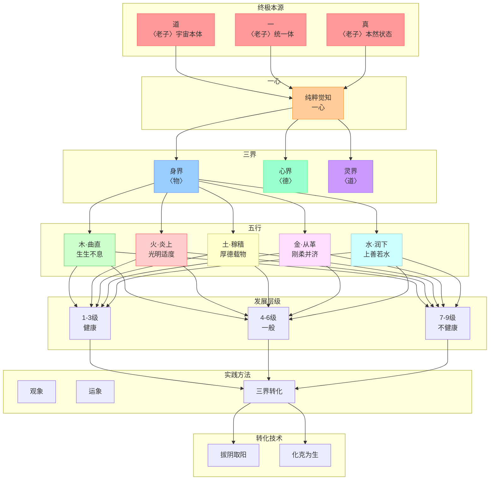
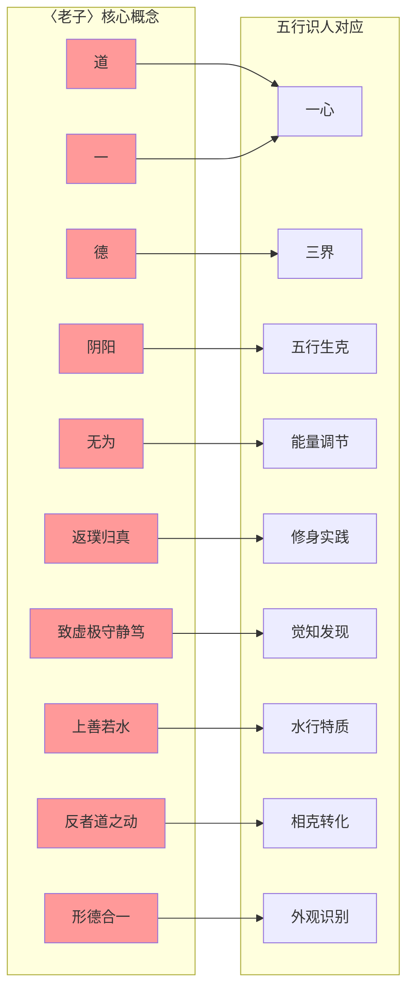
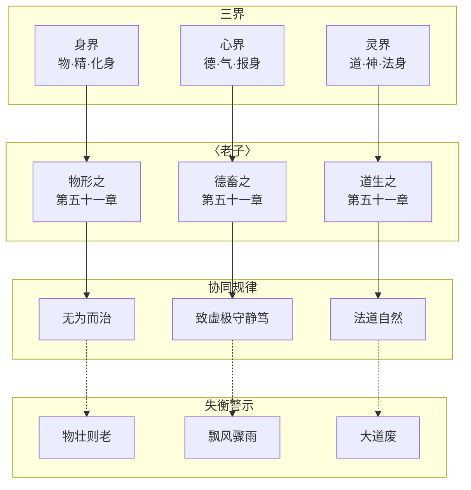

# 融合《老子》智慧五行识人 · 知识图谱

> 展示五行识人理论体系与《老子》思想深度融合的知识网络

---

## 一、核心体系架构



---

## 二、《老子》核心概念与五行识人对应网络



---

## 三、五行特质与《老子》印证矩阵

| 五行 | 取象 | 阳面特质 | 《老子》印证 | 阴面特质 | 《老子》警示 |
|------|------|---------|------------|---------|------------|
| 木 | 曲直之象 | 生发、调达、舒畅、内蕴 | "道生一" | 傲慢、抗上、郁结 | "企者不立" |
| 火 | 炎上之象 | 炎上、明亮、炽烈、发散、迅疾 | "光而不耀" | 躁亢、虚明、散乱 | "自矜者不长" |
| 土 | 稼穑之象 | 承载、适应、容纳、运化、稳定 | "厚德载物" | 滞重、迟缓、郁结、固执 | "为之则败" |
| 金 | 从革之象 | 坚固、收敛、锋利、光洁、变革 | "刚柔并济" | 刚愎、狭隘、尖刻、焦虑 | "知足不辱" |
| 水 | 润下之象 | 润下、通透、沉潜、静藏、养物 | "上善若水" | 沉滞、圆滑、多疑、散漫 | "飘风不终朝" |

---

## 四、三界与《老子》对应关系



---

## 五、转化技术知识网络

### 5.1 拔阴取阳 × 《老子》

| 口诀 | 《老子》对应 | 本质 |
|------|------------|-----|
| 欲生真水，必认不是 | "知不知，上"（第七十一章） | 承认局限 |
| 欲生真金，必找好处 | "既以为人，己愈有"（第八十一章） | 发现本性 |
| 欲生真土，必信因果 | "善建者不拔"（第五十四章） | 相信规律 |
| 欲生真火，必达天时 | "天之道，利而不害"（第八十一章） | 顺应时机 |
| 仁德阳木，自然而生 | "致虚极，守静笃"（第十六章） | 回归本真 |

### 5.2 化克为生 × 《老子》

| 相克 | 身感 | 转化 | 《老子》印证 | 本质 |
|------|------|------|------------|-----|
| 木克土 | 胃发堵 | 土生金→木畏金 | "曲则全" | 破旧立新 |
| 土克水 | 常后悔 | 水生木→土畏木 | "其微易散" | 打破固执 |
| 水克火 | 急窝火 | 火生土→水畏土 | "柔弱者生" | 以柔克刚 |
| 火克金 | 人不亲 | 金生水→火畏水 | "将欲弱之" | 以弱胜强 |
| 金克木 | 气不舒 | 木生火→金畏火 | "知足不辱" | 知止不殆 |

---

## 六、外观识别 × 形德合一

| 五行 | 外观特征 | 内在德行 | 《老子》印证 |
|------|---------|---------|------------|
| 木 | 三瘦（身直、肢长、形瘦） | 生发之德 | "勇于不敢则活" |
| 火 | 三尖（上尖、形突、轮廓锐） | 明热之德 | "光而不耀" |
| 土 | 三厚（身厚、肉厚、形敦） | 承载之德 | "敦兮其若朴" |
| 金 | 三方（脸方、唇薄、质薄） | 刚硬之德 | "坚强者死之徒" |
| 水 | 三肥（身圆、肤松、形垂） | 润下之德 | "天下莫柔弱于水" |

---

## 七、发展层级光谱

```
┌─────────────────────────────────────────────────────────────────────────┐
│                    五行发展层级 × 《老子》修身进阶                        │
├─────────────────────────────────────────────────────────────────────────┤
│                                                                          │
│  1-3级（健康）←──────────────→ 4-6级（一般）←──────────────→ 7-9级（不健康）  │
│                                                                          │
│  复归于婴儿              天下有道/天下无道              大道废            │
│       ↓                         ↓                         ↓              │
│  顺道本真                阴阳对抗                      离道日远          │
│       ↓                         ↓                         ↓              │
│  形德合一                妄为初现                      妄为深重          │
│       ↓                         ↓                         ↓              │
│  无为而无不为            祸兮福倚                      有大伪            │
│                                                                          │
│  核心转化：拔阴取阳 → 锚定本真 → 与道合真                                  │
│                                                                          │
└─────────────────────────────────────────────────────────────────────────┘
```

---

## 八、象思维 × 《老子》认知同构

| 象思维 | 《老子》 | 认知本质 |
|--------|---------|---------|
| 物象 | 形 | 外在显化 |
| 意象 | 德 | 内在品性 |
| 原象 | 道 | 终极本源 |

---

## 九、关键关联文件

### 核心文件
- [[融合《老子》智慧的五行识人：认知与实践]]
- [[一心三界五行九层体系]]
- [[象思维理论体系]]
- [[陈鼓应老子今注今译]]

### 五行分文件
- [[木行人分智能体]]
- [[火行人分智能体]]
- [[土行人分智能体]]
- [[金行人分智能体]]
- [[水行人分智能体]]

### 系统文件
- [[凤脑OS知识地基]]
- [[凤心OS总智能体]]
- [[龙心OS总智能体]]

---

## 十、核心标签

#知识图谱 #五行识人 #老子智慧 #陈鼓应 #一心三界五行九层 #象思维 #三界 #五行 #九层 #拔阴取阳 #化克为生 #外观识别 #形德合一 #无为而治 #返璞归真 #致虚极守静笃 #凤脑OS #知识地基
