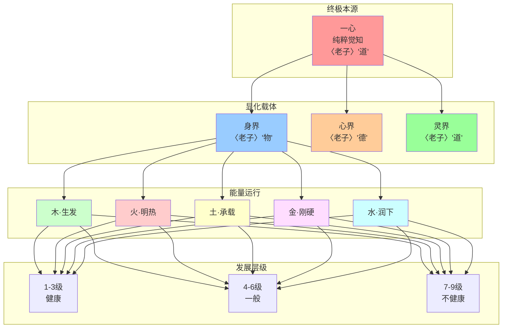
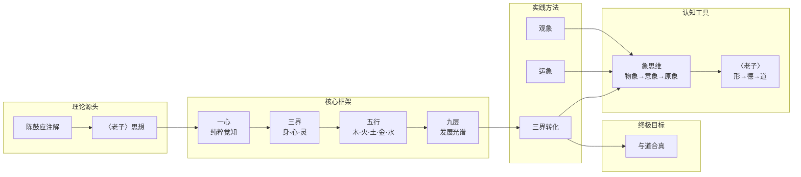

# 融合《老子》智慧的五行识人：认知与实践

> **全息五行识人：融合《老子》智慧的生命能量认知与实践体系**
> **核心融合**：陈鼓应《老子今注今译》× 五行识人理论 × 象思维

---

## 核心定义

### 一、理论体系全景图



### 二、核心闭环：道—德—五行—三界—一心

```
┌─────────────────────────────────────────────────────────────────┐
│           五行识人 × 《老子》思想 核心闭环                      │
├─────────────────────────────────────────────────────────────────┤
│                                                                 │
│    〈老子〉                五行识人                              │
│    ─────                  ──────                               │
│    道                     一心（纯粹觉知）                      │
│    ↓                      ↓                                    │
│    德                     三界（身·心·灵）                      │
│    ↓                      ↓                                    │
│    阴阳                   五行（木·火·土·金·水）               │
│    ↓                      ↓                                    │
│    无为                    拔阴取阳·化克为生                    │
│    ↓                      ↓                                    │
│    返璞归真               与道合真                              │
│                                                                 │
│    完整闭环：道→德→五行→三界→一心                              │
└─────────────────────────────────────────────────────────────────┘
```

---

## 第一章：一心——纯粹觉知与《老子》的"道""一""真"

### 1.1 核心定义：纯粹觉知与《老子》的同义关联

#### 一心与《老子》核心概念的对应

| 五行识人 | 《老子》 | 陈鼓应解读 | 核心内涵 |
|---------|---------|-----------|---------|
| 一心 | 道 | "无形无象、永恒运行的宇宙本体" | 纯粹觉知，超越具象 |
| 一心 | 一 | "道之本体，纯粹无杂的统一体" | 无分别，无阴阳 |
| 一心 | 真 | "本然状态，不刻意修饰、不人为造作" | 本真觉知 |
| 一心 | 虚·静 | "心灵的空明与沉稳" | 体认状态 |
| 一心 | 玄牝 | "道的生化之门，生命能量源头" | 能量源头 |
| 一心 | 常 | "永恒不变的本真" | 不生不灭 |

### 1.2 觉知的发现路径：《老子》"致虚极，守静笃"的实践诠释

#### 三阶段发现路径

```
┌──────────────────────────────────────────────────────────────┐
│           觉知发现路径 × 《老子》体道方法                   │
├──────────────────────────────────────────────────────────────┤
│                                                              │
│  第一阶段：悬置                                              │
│  ──────────                                                  │
│  〈老子〉："致虚极"                                          │
│  陈鼓应："让心灵达到空明的极致，放下对名利、得失、善恶的执着" │
│  本质：清除杂念，回归空无                                   │
│                                                              │
│  第二阶段：内观                                              │
│  ──────────                                                  │
│  〈老子〉："守静笃"                                          │
│  陈鼓应："坚守沉稳的状态，不被情绪、杂念扰动，静心内观"       │
│  本质：用虚静心灵直接体悟能量流动                           │
│                                                              │
│  第三阶段：合一                                              │
│  ──────────                                                  │
│  〈老子〉："圣人抱一为天下式"                                │
│  陈鼓应："与道合一，消融主客对立，达到'我与道同'的境界"      │
│  本质：天地与我并生，万物与我为一                            │
│                                                              │
└──────────────────────────────────────────────────────────────┘
```

### 1.3 进阶三阶段：从体认到自在的《老子》境界印证

| 阶段 | 五行识人 | 《老子》 | 陈鼓应解读 | 境界特征 |
|------|---------|---------|-----------|---------|
| 1 | 直指心性 | 复归于婴儿 | "生命的本真状态，纯粹无杂" | 觉知觉醒 |
| 2 | 确信无疑 | 复归于朴 | "未经雕琢的本然，坚定体认'我即觉性'" | 笃定自信 |
| 3 | 解脱自信 | 无为而无不为 | "顺势而为，让觉知自然显化" | 自由圆满 |

---

## 第二章：三界——五行能量的显化载体与《老子》的"道—德—物"

### 2.1 三界核心定义：《老子》"道—德—物"的多维对应

| 三界 | 对应范畴 | 《老子》 | 陈鼓应解读 | 五行能量本质 |
|------|---------|---------|-----------|-------------|
| 身界 | 物·精·化身·用·地 | "物形之" | "道与德的外在显化，有形质的存在" | 五行能量具象化 |
| 心界 | 德·气·报身·相·人 | "德畜之" | "道在万物中的具体体现，心灵的能量与品性" | 情绪·思维·动机 |
| 灵界 | 道·神·法身·体·天 | "道生之" | "宇宙万物的本源与规律，法道自然" | 价值观·使命·文化根基 |

### 2.2 三界协同规律：《老子》"无为而治"的平衡智慧

#### 协同的本质：顺道无为，不妄不躁

```
┌──────────────────────────────────────────────────────────────┐
│           三界协同 × 《老子》无为而治                        │
├──────────────────────────────────────────────────────────────┤
│                                                              │
│  灵界（道）→ 顺自然，坚守"道法自然"的价值观                │
│  心界（德）→ 守虚静，保持"致虚极"不被情绪扰动              │
│  身界（物）→ 不妄动，顺应"无为"规律不刻意造作               │
│                                                              │
│  〈老子〉第三十七章："道常无为而无不为"                       │
│  陈鼓应：无为不是无所作为，而是顺势而为                       │
│                                                              │
│  〈老子〉第六十四章："为之于未有，治之于未乱"                │
│  三界协同极致：不妄为，千里之行，始于足下                    │
│                                                              │
└──────────────────────────────────────────────────────────────┘
```

#### 失衡的连锁反应：《老子》"物壮则老"的警示

| 层级 | 失衡链条 | 《老子》警示 | 本质 |
|------|---------|-------------|-----|
| 个体 | 灵界扭曲 → 心界失控 → 身界衰败 | "物壮则老，谓之不道" | 背离自然规律 |
| 组织 | 使命模糊 → 氛围压抑 → 流程冗余 | "天下多忌讳，而民弥贫" | 妄为造作 |

### 2.3 三界转化口诀：《老子》"去伪存真"的修身实践

#### 身界转化：顺形无为，不妄造作

| 五行 | 转化口诀 | 《老子》引用 | 陈鼓应解读 |
|------|---------|-------------|-----------|
| 木 | 阴木杀→阳木温 | "勇于不敢则活" | 顺势而为，无为 |
| 火 | 阴火色→阳火良 | "祸兮福之所倚" | 温和善良 |
| 土 | 阴土气→阳土恭 | "洼则盈" | 包容退让 |
| 金 | 阴金贪→阳金俭 | "少则得" | 节俭克制 |
| 水 | 阴水酒→阳水让 | "为而不争" | 谦让包容 |

#### 心界转化：虚静守中，不被情累

| 五行 | 转化口诀 | 《老子》引用 | 实践方法 |
|------|---------|-------------|---------|
| 木 | 阴木怒→阳木学 | "学不学，复众人之所过" | 以谦逊之心学习 |
| 火 | 阴火恨→阳火问 | "以百姓心为心" | 包容理解差异 |
| 土 | 阴土怨→阳土思 | "飘风不终朝" | 反思自身规律 |
| 金 | 阴金恼→阳金行 | "为无为，事无事" | 纯粹之心行事 |
| 水 | 阴水烦→阳水辩 | "自知者明" | 超越表象直达本质 |

#### 灵界转化：返璞归真，与道合一

| 五行 | 转化口诀 | 《老子》引用 | 核心方向 |
|------|---------|-------------|---------|
| 木 | 阴木傲慢→阳木仁 | "江海善下，故能为百谷王" | 谦下滋养 |
| 火 | 阴火嗔→阳火礼 | "上德不德，是以有德" | 自然照亮 |
| 土 | 阴土疑→阳土信 | "以辅万物之自然" | 诚信放下 |
| 金 | 阴金贪→阳金义 | "知足不辱，知止不殆" | 知足坚守 |
| 水 | 阴水痴→阳水智 | "上善若水" | 不争处世 |

---

## 第三章：五行——三界能量运行的底层逻辑与《老子》的自然观

### 3.1 相生：能量的自然滋养

| 相生 | 能量转化 | 《老子》引用 | 陈鼓应解读 |
|------|---------|-------------|-----------|
| 木→火 | 生发→明热 | "道生一，一生二" | 一生二的自然转化 |
| 火→土 | 明热→承载 | "道常无名，朴虽小" | 阴阳调和的自然结果 |
| 土→金 | 承载→刚硬 | "九层之台，起于累土" | 积微成著的自然过程 |
| 金→水 | 刚硬→润下 | "天下莫柔弱于水" | 刚柔相济的自然转化 |
| 水→木 | 润下→生发 | "水善利万物而不争" | 利他自利的自然体现 |

### 3.2 相克：能量的自然制约

| 相克 | 能量制约 | 《老子》引用 | 陈鼓应解读 |
|------|---------|-------------|-----------|
| 木克土 | 生发制约滞重 | "洼则盈" | 破旧立新的自然制约 |
| 土克水 | 承载制约泛滥 | "治之于未乱" | 治之于未乱的自然守护 |
| 水克火 | 沉静制约躁亢 | "柔弱者生之徒" | 以柔克刚的自然制约 |
| 火克金 | 温热制约刚愎 | "将欲弱之，必固强之" | 微明的自然转化 |
| 金克木 | 收敛制约过度生发 | "知足不辱，知止不殆" | 知止不殆的自然校准 |

### 3.3 实践口诀：《老子》"顺道无为"的能量转化应用

#### 拔阴取阳口诀：《老子》"去甚去奢去泰"的修身实践

```
┌──────────────────────────────────────────────────────────────┐
│           拔阴取阳 × 《老子》去伪存真                        │
├──────────────────────────────────────────────────────────────┤
│                                                              │
│  欲生真水，必认不是                                          │
│  → 〈老子〉第七十一章："知不知，上"                           │
│  → 承认认知局限，回归"润下"本真                             │
│                                                              │
│  欲生真金，必找好处                                          │
│  → 〈老子〉第八十一章："既以为人，己愈有"                    │
│  → 发现他人本性，回归"从革"本真                             │
│                                                              │
│  欲生真土，必信因果                                          │
│  → 〈老子〉第五十四章："善建者不拔"                          │
│  → 相信规律必然性，回归"稼穑"本真                          │
│                                                              │
│  欲生真火，必达天时                                          │
│  → 〈老子〉第八十一章："天之道，利而不害"                    │
│  → 顺应自然时机，回归"炎上"本真                             │
│                                                              │
│  水金土火，通透豁达；仁德阳木，自然而生                      │
│  → 〈老子〉第十六章："致虚极，守静笃"                        │
│  → 四行回归后，仁自然流露                                    │
│                                                              │
└──────────────────────────────────────────────────────────────┘
```

#### 化克为生口诀：《老子》"反者道之动"的能量调和

| 相克链 | 身界感受 | 转化方法 | 《老子》印证 |
|--------|---------|---------|------------|
| 木克土 | 胃发堵 | 土生金→木畏金 | "曲则全，枉则直" |
| 土克水 | 常后悔 | 水生木→土畏木 | "其微易散" |
| 水克火 | 急窝火 | 火生土→水畏土 | "柔弱者生" |
| 火克金 | 人不亲 | 金生水→火畏水 | "将欲弱之" |
| 金克木 | 气不舒 | 木生火→金畏火 | "知足不辱" |

---

## 第四章：五行各类特点——融合象思维与《老子》自然本性的深度解析

### 4.1 木行：取象"曲直之象"，对应《老子》"生生不息"的自然本性

#### 象思维根基与《老子》溯源

| 维度 | 内容 | 《老子》引用 | 核心内涵 |
|------|------|-------------|---------|
| 取象 | 曲中求直、冒地而生 | 第四十二章"道生一" | 道生万物的自然体现 |
| 体性 | 以"温柔"为体，以"曲直"为性 | 第二十二章"曲则全" | 顺应环境不失本质 |

#### 阴阳两面特质

| 阳面（顺道） | 老子境界 | 阴面（妄为） | 老子警示 |
|------------|---------|------------|---------|
| 生发（创新突破） | "物形之，势成之" | 曲迂（傲慢孤僻） | "企者不立" |
| 调达（仁德善良） | "为而不争" | 抗逆（抗上不服） | "跨者不行" |
| 舒畅（正直豁达） | "致虚极，守静笃" | 郁结（忧愁善变） | "福兮祸所伏" |
| 内蕴（安静积淀） | "生于毫末" | — | — |

### 4.2 火行：取象"炎上之象"，对应《老子》"光明适度"的自然本性

#### 象思维根基与《老子》溯源

| 维度 | 内容 | 《老子》引用 | 核心内涵 |
|------|------|-------------|---------|
| 取象 | 发光放热、升腾向上 | 第三十六章"将欲歙之" | 明热而不躁亢 |
| 体性 | 以"明热"为体，以"炎上"为性 | 第五十八章"光而不耀" | 光明而不炫耀 |

#### 阴阳两面特质

| 阳面（顺道） | 老子境界 | 阴面（妄为） | 老子警示 |
|------------|---------|------------|---------|
| 炎上（主动推动） | "利而不害" | 躁亢（急躁争斗） | "自矜者不长" |
| 明亮（明辨是非） | "上德不德" | 虚明（炫耀虚荣） | "福兮祸所伏" |
| 炽烈（热情自信） | "德畜之" | 炽烈过极（自卑夸张） | — |
| 发散（积极影响） | "既以为人，己愈有" | 散乱（无序发散） | "飘风不终朝" |
| 迅疾（雷厉风行） | "为之于未有" | — | — |

### 4.3 土行：取象"稼穑之象"，对应《老子》"厚德载物"的自然本性

#### 象思维根基与《老子》溯源

| 维度 | 内容 | 《老子》引用 | 核心内涵 |
|------|------|-------------|---------|
| 取象 | 孕育生化、承载万物 | 第二十五章"地法天" | 厚德载物的自然流露 |
| 体性 | 以"含散持实"为体，以"稼穑"为性 | 第三十九章"得一以宁" | 顺应时节孕育收获 |

#### 阴阳两面特质

| 阳面（顺道） | 老子境界 | 阴面（妄为） | 老子警示 |
|------------|---------|------------|---------|
| 承载（信实可靠） | "物形之" | 滞重（呆板无趣） | "为之则败" |
| 适应（耐力持久） | "九层之台" | 迟缓（拖拉磨蹭） | — |
| 容纳（宽宏厚道） | "为而不争" | 郁结（沉闷埋怨） | "祸兮祸所伏" |
| 运化（支持担当） | "曲则全" | 固执（固执不化） | "将欲取之" |
| 稳定（镇定沉稳） | "累土" | — | — |

### 4.4 金行：取象"从革之象"，对应《老子》"刚柔并济"的自然本性

#### 象思维根基与《老子》溯源

| 维度 | 内容 | 《老子》引用 | 核心内涵 |
|------|------|-------------|---------|
| 取象 | 可锻可铸、刚硬收敛 | 第七十八章"攻坚强者" | 刚柔并济的智慧 |
| 体性 | 以"强冷"为体，以"从革"为性 | 第三十六章"将欲废之" | 冷静判断，刚硬执行 |

#### 阴阳两面特质

| 阳面（顺道） | 老子境界 | 阴面（妄为） | 老子警示 |
|------------|---------|------------|---------|
| 坚固（刚毅坚强） | "上德不德" | 刚愎（刚愎自用） | "自伐者无功" |
| 收敛（含蓄持重） | "不敢为天下先" | 狭隘（小气吝啬） | — |
| 锋利（仗义果断） | "民不畏死" | 尖刻（尖酸刻薄） | — |
| 光洁（权威端方） | — | 自负（孤高自赏） | — |
| 变革（目标清晰） | "反者道之动" | 焦虑（患得患失） | "致虚极" |

### 4.5 水行：取象"润下之象"，对应《老子》"上善若水"的自然本性

#### 象思维根基与《老子》溯源

| 维度 | 内容 | 《老子》引用 | 核心内涵 |
|------|------|-------------|---------|
| 取象 | 滋润万物、趋下沉潜 | 第八章"上善若水" | 几于道的体现 |
| 体性 | 以"虚寒"为体，以"润下"为性 | 第四十九章"百姓心为心" | 谦和包容滋养他人 |

#### 阴阳两面特质

| 阳面（顺道） | 老子境界 | 阴面（妄为） | 老子警示 |
|------------|---------|------------|---------|
| 润下（滋润祥和） | "善利万物而不争" | 沉滞（消极放任） | "飘风不终朝" |
| 通透（智慧亲和） | "自知者明" | 圆滑（圆滑世故） | "美言不信" |
| 沉潜（外柔内刚） | "大直若屈" | 多疑（忧虑多疑） | "轻诺必寡信" |
| 静藏（善解人意） | "致虚极，守静笃" | 散漫（散漫无序） | "不贵难得之货" |
| 养物（赋能生长） | "天之道，利而不害" | 软弱（意志薄弱） | "勇于敢则杀" |

---

## 第五章：外观识别口诀——融合象思维与《老子》"形德合一"的外在显化

### 5.1 总口诀及象理解析

```
┌──────────────────────────────────────────────────────────────┐
│           外观识别总口诀 × 《老子》形德合一                  │
├──────────────────────────────────────────────────────────────┤
│                                                              │
│  木瘦金方水必肥，上尖下阔为真火，                          │
│  土行背厚晃如龟，朝中方白属金行。                          │
│                                                              │
│  〈老子〉第二十八章："知雄守雌，常德不离，复归于婴儿"        │
│  陈鼓应：婴儿之形是常德不离的显化，形与德合一是顺道本然     │
│                                                              │
└──────────────────────────────────────────────────────────────┘
```

### 5.2 五行外观识别详解

| 五行 | 核心特征 | 形德对应 | 《老子》印证 |
|------|---------|---------|------------|
| 木 | 三瘦（身直、肢长、形瘦） | 生发之德显于舒展之形 | "勇于不敢则活" |
| 火 | 三尖（上尖、形突、轮廓锐） | 明热之德显于昂扬之形 | "光而不耀" |
| 土 | 三厚（身厚、肉厚、形敦） | 承载之德显于敦实之形 | "敦兮其若朴" |
| 金 | 三方（脸方、唇薄、质薄） | 刚硬之德显于端方之形 | "坚强者死之徒" |
| 水 | 三肥（身圆、肤松、形垂） | 润下之德显于柔和之形 | "天下莫柔弱于水" |

### 5.3 外观识别的核心原则：以形察德，以德证形

> **〈老子〉第五十四章**："修之于身，其德乃真"
> 
> 陈鼓应：形体是德行的载体，德行是形体的灵魂

---

## 第六章：发展层级——五行能量的动态光谱与《老子》的修身进阶

### 6.1 层级状态与三界/五行的对应

| 健康状态(1-3级) | 《老子》境界 | 一般状态(4-6级) | 《老子》警示 | 不健康状态(7-9级) | 《老子》印证 |
|----------------|------------|----------------|-------------|------------------|-------------|
| 复归于婴儿 | 顺道本真 | 天下有道/无道 | 阴阳对抗 | 大道废 | 离道日远 |
| 形德合一 | 无妄为 | 祸兮福倚 | 妄为初现 | 有大伪 | 妄为深重 |

### 6.2 木行人九层发展层级

| 层级 | 名称 | 灵界 | 心界 | 身界 | 《老子》印证 | 转化口诀 |
|------|------|------|------|------|------------|---------|
| 1 | 解放 | 回归觉性 | 仁德舒展 | 灵活创新 | 复归于婴儿 | 锚定木仁 |
| 2 | 心理能力 | 探索成长 | 积极进取 | 主动尝试 | 反者道之动 | 强化生发 |
| 3 | 社会价值 | 贡献价值 | 正直豁达 | 创新落地 | 既以为人 | 联动火行 |
| 4 | 失衡 | 自我膨胀 | 偏执敏感 | 固执己见 | 知足不辱 | 金行收敛 |
| 5 | 人际控制 | 渴望认可 | 傲慢易怒 | 刻意对立 | 学不学 | 怒转学 |
| 6 | 过度补偿 | 掩饰自卑 | 冲动激进 | 不计后果 | 千里之行 | 土行承载 |
| 7 | 侵害 | 怨恨他人 | 孤僻冷漠 | 消极对抗 | 善者善之 | 傲慢转仁 |
| 8 | 妄想强迫 | 执念过去 | 极端偏执 | 重复僵化 | 致虚极 | 郁结转舒畅 |
| 9 | 病态破坏 | 对抗世界 | 仇恨满溢 | 恶意顶撞 | 复归于朴 | 锚定木仁 |

### 6.3 火行人九层发展层级

| 层级 | 名称 | 灵界 | 心界 | 身界 | 《老子》印证 | 转化口诀 |
|------|------|------|------|------|------------|---------|
| 1 | 解放 | 光明磊落 | 热情包容 | 积极正向 | 光而不耀 | 锚定火礼 |
| 2 | 心理能力 | 勇敢担当 | 自信果敢 | 雷厉风行 | 将欲歙之 | 强化炎上 |
| 3 | 社会价值 | 传递温暖 | 开朗友善 | 积极影响 | 利而不害 | 联动土行 |
| 4 | 失衡 | 炫耀自我 | 急躁浮夸 | 张扬高调 | 知足不辱 | 金行收敛 |
| 5 | 人际控制 | 操控他人 | 傲慢自私 | 强势压迫 | 百姓心为心 | 恨转问 |
| 6 | 过度补偿 | 掩饰脆弱 | 暴躁易怒 | 冲动冒进 | 为之未有 | 土行稳定 |
| 7 | 侵害 | 迁怒他人 | 刻薄冷漠 | 言语伤人 | 为而不争 | 嗔转礼 |
| 8 | 妄想强迫 | 偏执多疑 | 情绪失控 | 反复无常 | 致虚极 | 散乱转专注 |
| 9 | 病态破坏 | 毁灭一切 | 极端暴躁 | 暴力攻击 | 天道利而不害 | 锚定火礼 |

### 6.4 土行人九层发展层级

| 层级 | 名称 | 灵界 | 心界 | 身界 | 《老子》印证 | 转化口诀 |
|------|------|------|------|------|------------|---------|
| 1 | 解放 | 包容承载 | 宽厚诚信 | 稳重可靠 | 地法天 | 锚定土信 |
| 2 | 心理能力 | 坚守底线 | 坚韧不拔 | 沉稳应对 | 起于累土 | 强化稼穑 |
| 3 | 社会价值 | 支持他人 | 谦和厚道 | 踏实落地 | 天道无亲 | 联动金行 |
| 4 | 失衡 | 固执己见 | 呆板无趣 | 墨守成规 | 反者道之动 | 木行生发 |
| 5 | 人际控制 | 控制局面 | 多疑敏感 | 拖延犹豫 | 不善者亦善之 | 怨转思 |
| 6 | 过度补偿 | 证明自我 | 压抑沉闷 | 大包大揽 | 无为无不为 | 水行润下 |
| 7 | 侵害 | 怨恨积累 | 消极抵触 | 敷衍了事 | 轻诺必寡信 | 疑转信 |
| 8 | 妄想强迫 | 偏执固执 | 内心压抑 | 重复僵化 | 致虚极 | 郁结转舒畅 |
| 9 | 病态破坏 | 报复社会 | 极端固执 | 恶意阻碍 | 地法天 | 锚定土信 |

### 6.5 金行人九层发展层级

| 层级 | 名称 | 灵界 | 心界 | 身界 | 《老子》印证 | 转化口诀 |
|------|------|------|------|------|------------|---------|
| 1 | 解放 | 刚正不阿 | 刚毅正直 | 果断担当 | 直而不肆 | 锚定金义 |
| 2 | 心理能力 | 突破局限 | 坚韧果敢 | 灵活应变 | 为道日损 | 强化从革 |
| 3 | 社会价值 | 匡扶正义 | 公正无私 | 破旧立新 | 为而不争 | 联动水行 |
| 4 | 失衡 | 固执狭隘 | 刚愎自用 | 刻板僵化 | 圣人无常心 | 火行炎上 |
| 5 | 人际控制 | 掌控他人 | 傲慢自负 | 尖酸刻薄 | 为无为 | 恼转行 |
| 6 | 过度补偿 | 掩饰自卑 | 好胜好斗 | 急功近利 | 知足不辱 | 土行承载 |
| 7 | 侵害 | 报复他人 | 狭隘刻薄 | 恶意中伤 | 勇于不敢 | 贪转义 |
| 8 | 妄想强迫 | 偏执多疑 | 焦虑紧张 | 反复纠结 | 致虚极 | 焦虑转从容 |
| 9 | 病态破坏 | 毁灭规则 | 极端刚愎 | 暴力破坏 | 上德不德 | 锚定金义 |

### 6.6 水行人九层发展层级

| 层级 | 名称 | 灵界 | 心界 | 身界 | 《老子》印证 | 转化口诀 |
|------|------|------|------|------|------------|---------|
| 1 | 解放 | 润下滋养 | 谦和通透 | 灵活包容 | 上善若水 | 锚定水智 |
| 2 | 心理能力 | 沉潜积淀 | 外柔内刚 | 从容应对 | 大器晚成 | 强化润下 |
| 3 | 社会价值 | 滋养他人 | 智慧亲和 | 灵活应变 | 利而不害 | 联动木行 |
| 4 | 失衡 | 随波逐流 | 散漫无序 | 消极放任 | 无为无不为 | 土行承载 |
| 5 | 人际控制 | 依赖他人 | 多疑敏感 | 犹豫不决 | 自胜者强 | 烦转辩 |
| 6 | 过度补偿 | 掩饰软弱 | 圆滑世故 | 投机取巧 | 信言不美 | 金行收敛 |
| 7 | 侵害 | 怨恨他人 | 冷漠孤僻 | 敷衍了事 | 知人者智 | 痴转智 |
| 8 | 妄想强迫 | 偏执多疑 | 内心混乱 | 反复无常 | 致虚极 | 散乱转专注 |
| 9 | 病态破坏 | 毁灭一切 | 极端软弱 | 自暴自弃 | 上善若水 | 锚定水智 |

---

## 第七章：五行识人三维核心对应体系

### 7.1 观象步骤：从具象到原象的认知穿透

```
┌──────────────────────────────────────────────────────────────┐
│           观象三阶段 × 《老子》以身观身                      │
├──────────────────────────────────────────────────────────────┤
│                                                              │
│  第一阶：观"实体象"（物象）                                  │
│  ────────────────────────                                    │
│  聚焦身界的外观形体、行为姿态                                 │
│  〈老子〉第五十四章："以身观身"                               │
│  陈鼓应：观实体象的本质是观其形以知其德                       │
│                                                              │
│  第二阶：取"意象"（意象）                                    │
│  ────────────────────────                                    │
│  结合言象与例象提炼内在心理模式                                │
│  〈老子〉寓言人物：庖丁（木）、圣人（火）、佝偻承蜩者（土）    │
│  善为士者（金）、上善若水者（水）                            │
│                                                              │
│  第三阶：定"原象"（原象）                                    │
│  ────────────────────────                                    │
│  超越实体象与意象，直抵能量本质                                │
│  〈老子〉第十六章："致虚极，守静笃，万物并作，吾以观复"        │
│  本质：观复——回归能量的本真状态                              │
│                                                              │
└──────────────────────────────────────────────────────────────┘
```

### 7.2 运象技术：以规律调谐能量的核心方法

| 技术 | 适用场景 | 《老子》引用 | 实践方法 |
|------|---------|-------------|---------|
| 相生链补弱 | 能量不足 | "道生之，德畜之" | 顺势滋养 |
| 相克链制亢 | 能量过亢 | "反者道之动" | 适度制约 |
| 拔阴取阳 | 阴面特质 | "复归于朴" | 去伪存真 |
| 化克为生 | 相克阻滞 | "弱者道之用" | 阻滞转协同 |

### 7.3 三界转化动作：从能量调节到象道合一的落地

```
┌──────────────────────────────────────────────────────────────┐
│           三界转化 × 《老子》返璞归真                         │
├──────────────────────────────────────────────────────────────┤
│                                                              │
│  身界转化：顺形无为，不妄造作                                  │
│  〈老子〉第六十四章："慎终如始，则无败事"                      │
│                                                              │
│  心界转化：虚静守中，不被情累                                  │
│  〈老子〉第十六章："致虚极，守静笃"                             │
│                                                              │
│  灵界转化：体道合一，回归本真                                  │
│  〈老子〉第二十五章："人法地，地法天，天法道，道法自然"        │
│                                                              │
│  三维联动核心：知行合一，返璞归真                              │
│                                                              │
└──────────────────────────────────────────────────────────────┘
```

---

## 第八章：象思维——五行识人的底层认知范式

### 8.1 象思维与《老子》思想的同构性

| 象思维 | 《老子》 | 认知本质 |
|--------|---------|---------|
| 物象 | 形 | 外在显化 |
| 意象 | 德 | 内在品性 |
| 原象 | 道 | 终极本源 |

### 8.2 核心特质同构：动态整体直观 = 道法自然，不执不滞

| 象思维特质 | 《老子》印证 | 本质内涵 |
|-----------|------------|---------|
| 非实体性 | "道之为物，惟恍惟惚" | 能量流动无实体 |
| 非对象性 | "天地与我并生" | 主客同源无对立 |
| 非现成性 | "反者道之动" | 阴阳转化无定态 |
| 整体直观性 | "不出户，知天下" | 整体体悟本质 |

### 8.3 象思维的终极目标：象道合一 = 与道合真

> **〈老子〉第三十七章**："道常无为而无不为"
> 
> 陈鼓应：象道合一的境界，正是"无为而无不为"

---

## 第九章：结语——以道识人，以行修心

### 核心闭环

```
┌──────────────────────────────────────────────────────────────┐
│           五行识人终极闭环                                     │
├──────────────────────────────────────────────────────────────┤
│                                                              │
│    观象 ──→ 运象 ──→ 三界转化                               │
│      ↓         ↓         ↓                                  │
│    识人     调能量     修身                                  │
│      ↓         ↓         ↓                                  │
│    反观自身  调节自身   回归本真                              │
│      ↓         ↓         ↓                                  │
│    ══════════════════════════════                            │
│                     ↓                                        │
│              与道合真（一心）                                 │
│                                                              │
└──────────────────────────────────────────────────────────────┘
```

### 核心金句

> 1. **"道法自然"**——五行识人的本质是顺应宇宙规律
> 2. **"返璞归真"**——拔阴取阳的终极目标是回归纯粹觉知
> 3. **"无为而无不为"**——象道合一的境界是顺势而成
> 4. **"致虚极，守静笃"**——觉知发现的核心路径
> 5. **"形德合一"**——外观识别的本质是见形知德

---

## 关联文件

### 核心关联

- [[一心三界五行九层体系]]
- [[象思维理论体系]]
- [[五色光思维skills]]
- [[陈鼓应老子今注今译]]

### 五行人格关联

- [[木行人分智能体]]
- [[火行人分智能体]]
- [[土行人分智能体]]
- [[金行人分智能体]]
- [[水行人分智能体]]

### 凤脑OS关联

- [[凤脑OS知识地基]]
- [[凤心OS总智能体]]

---

## 知识图谱



---

## 标签体系

#五行识人 #老子智慧 #陈鼓应 #一心三界五行九层 #象思维 #形德合一 #返璞归真 #无为而治 #致虚极守静笃 #凤脑OS #知识地基 #五行人格 #拔阴取阳 #化克为生 #全息发展模型
