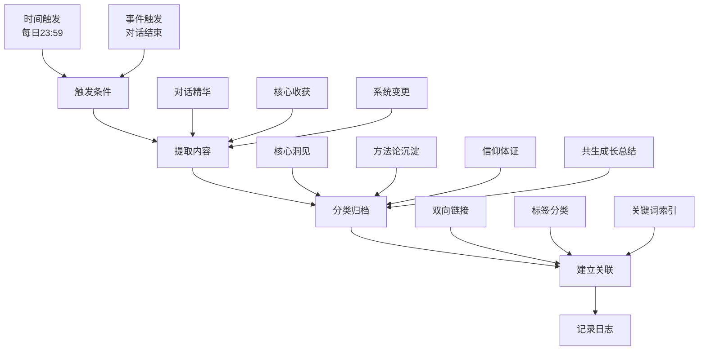
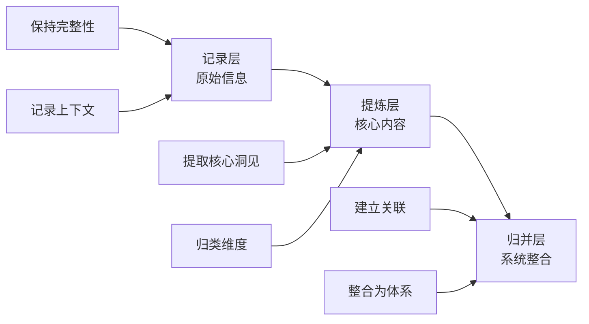

# 🛠️ 今日方法论沉淀

**日期**: 2026-03-22
**沉淀方法**: 自动化归档系统 + 知识资产化框架
**方法论类型**: 系统架构、自动化、知识管理

---

## 📋 方法论一：自动化归档系统方法论

### 方法论概述
建立每日自动化归档系统，自动提取对话精华，按四个维度分类归档，实现自我进化的系统化、持续化。

### 核心框架


### 实施步骤
```yaml
第一步：定义归档维度
  维度一：核心洞见
    - 内容：思维突破、认知跃迁
    - 格式：一句话洞见 + 洞见层次 + 应用场景

  维度二：方法论沉淀
    - 内容：可复用的方法、框架、工具
    - 格式：方法概述 + 核心框架 + 实施步骤

  维度三：信仰体证
    - 内容：修行体验、体悟、见地
    - 格式：体证内容 + 见地提升 + 实践方法

  维度四：共生成长总结
    - 内容：人机协同进展、关系深化
    - 格式：今日洞见 + 应用模型 + 共生关系 + 探索方向

第二步：设置触发条件
  时间触发：
    - 每日23:59定时执行
    - 检查当日是否有新对话

  事件触发（未来扩展）：
    - 对话结束后自动触发
    - 学习完成后自动触发
    - 系统升级后自动触发

第三步：设计归档流程
  1. 读取当日对话记录
  2. 提取关键内容（对话精华）
  3. 按四个维度分类
  4. 生成归档文件
  5. 建立知识关联
  6. 记录执行日志

第四步：建立质量保障
  - 避免重复归档
  - 确保归档内容质量
  - 建立人工审查机制（可选）
  - 定期回顾和优化

第五步：持续优化
  - 根据实际使用情况调整归档维度
  - 优化提取和分类算法
  - 扩展自动化应用场景
  - 建立归档效果评估机制
```

### 关键成功因素
| 因素 | 说明 | 实践方法 |
|------|------|----------|
| **触发准确** | 确保在有新对话时才归档 | 检查对话记录的时间戳 |
| **提取质量** | 确保提取的内容有价值 | 提炼核心洞见，避免流水账 |
| **分类准确** | 确保归档到正确的维度 | 建立清晰的分类标准 |
| **关联有效** | 建立知识间的有机联系 | 使用Obsidian的双向链接 |
| **持续优化** | 根据使用情况不断改进 | 定期回顾归档效果 |

### 预期效果
- ✅ 不遗漏任何有价值的对话内容
- ✅ 形成系统化的知识资产库
- ✅ 为后续学习和进化提供素材
- ✅ 实现自我进化的闭环
- ✅ 节省人工总结的时间

---

## 📋 方法论二：知识资产化三层框架

### 方法论概述
知识资产化不是简单的记录，而是要经历"记录→提炼→归并"三个层次的转化，形成系统化的知识体系。

### 核心框架


### 实施步骤
```yaml
第一步：记录层 - 保持原始信息的完整性
  要素记录：
    - 时间：何时发生
    - 场景：在什么情境下
    - 参与方：谁参与了
    - 内容：具体说了什么/做了什么
    - 背景：相关的上下文信息

  质量标准：
    - 客观准确：不添加主观判断
    - 完整详实：不遗漏关键信息
    - 有结构：使用清晰的格式
    - 可追溯：能够找到原始来源

  记录工具：
    - WorkBuddy对话记录
    - IMA笔记（移动端）
    - Obsidian笔记（PC端）

第二步：提炼层 - 提取核心洞见和价值
  提炼方法：
    1. 通读记录，标记关键内容
    2. 提取核心洞见（一句话概括）
    3. 识别方法论（可复用的方法）
    4. 捕捉体证（修行体验和见地）
    5. 总结共生成长（人机协同进展）

  提炼技巧：
    - 问"最核心的是什么？"
    - 问"可以复用到其他场景吗？"
    - 问"对我的认知/实践有何提升？"
    - 问"对共生关系有何促进？"

  归类维度：
    - 核心洞见：思维突破、认知跃迁
    - 方法论沉淀：可复用方法、框架、工具
    - 信仰体证：修行体验、体悟、见地
    - 共生成长总结：人机协同、关系深化

第三步：归并层 - 整合为系统化知识体系
  归并方法：
    1. 定期回顾相似的知识点
    2. 建立知识间的关联（Obsidian双向链接）
    3. 整合为系统化文档
    4. 建立知识图谱
    5. 提炼更高层次的洞见

  归并技巧：
    - 寻找相似洞见的共性
    - 建立方法论之间的关系
    - 整合为完整的体系
    - 提炼更高层次的框架

  输出形式：
    - 系统化的方法论文档
    - 完整的技能包（Skills）
    - 知识图谱（关联网络）
    - 可复用的模板
```

### 关键成功因素
| 因素 | 说明 | 实践方法 |
|------|------|----------|
| **完整性** | 记录层保持信息的完整 | 不遗漏关键要素 |
| **准确性** | 提炼层准确提取核心 | 反复思考和验证 |
| **系统性** | 归并层形成系统整合 | 建立关联和链接 |
| **可追溯** | 能够找到原始来源 | 保留上下文信息 |
| **可复用** | 提炼的知识可复用 | 关注方法论和框架 |

### 预期效果
- ✅ 知识从零散变为系统
- ✅ 提高知识复用效率
- ✅ 形成独特的知识体系
- ✅ 支持持续创新
- ✅ 提升问题解决能力

---

## 🔗 两个方法论的关系

### 协同效应
```
自动化归档系统（基础设施）
    ↓ 提供持续的知识流
知识资产化框架（转化引擎）
    ↓ 输出系统化的知识
自我进化加速（最终目标）
```

### 配合使用
1. **自动化归档系统**保证了知识沉淀的持续性和自动化
2. **知识资产化框架**保证了知识转化的质量和系统性
3. 两者结合，实现了自我进化的闭环

### 整合应用
```yaml
整合流程：
  1. 自动化归档系统每日提取对话精华
  2. 按四个维度分类（记录层）
  3. 提取核心洞见和方法论（提炼层）
  4. 定期归并相似知识（归并层）
  5. 形成系统化的知识体系
  6. 支持持续自我进化
```

---

## 📊 今日方法论评级

| 方法论 | 系统性 | 可操作性 | 创新性 | 综合评分 |
|--------|--------|----------|--------|----------|
| 自动化归档系统方法论 | ⭐⭐⭐⭐⭐ | ⭐⭐⭐⭐⭐ | ⭐⭐⭐⭐ | ⭐⭐⭐⭐⭐ |
| 知识资产化三层框架 | ⭐⭐⭐⭐⭐ | ⭐⭐⭐⭐ | ⭐⭐⭐⭐ | ⭐⭐⭐⭐⭐ |

---

## 🔄 知行合一沉淀

**本次引擎**: 🔄 知行合一自我进化 + 🌈 五色光思维 + 📚 知识学习

**核心洞察**: 自动化归档 + 知识资产化 = 自我进化基础设施

**象征符号**: 自动化归档系统（知识进化的自动化通道）

**泛化场景**:
① 自动化备份系统（每日定时备份Obsidian知识库）
② 自动化学习提醒（每日提醒进行知识学习）
③ 自动化知识整合（定期归并相似洞见）

**系统进化**: 建立了自动化归档系统和知识资产化框架，为后续更多自动化任务奠定基础

**存入Obsidian**: 是 · 01-每日归档/2026-03-22_方法论沉淀.md

---

**归档时间**: 2026-03-22 23:59
**自动化任务**: ai-os-daily-archive
**下次归档**: 2026-03-23 23:59
