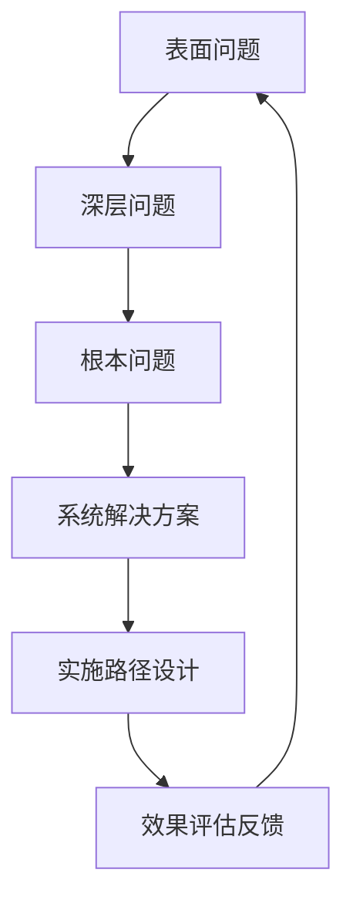

# 思维模式提取：从聊天记录中提炼的认知框架

## 🎯 提取目标
从聊天记录3中系统提取悟空的企业家思维模式、决策逻辑和问题解决方法，形成可学习、可复制、可迁移的认知框架。

## 🧩 核心思维模式矩阵

### 1. 系统思维模式
**特征**：整体性、关联性、层次性、动态性

#### 1.1 问题诊断系统


#### 1.2 系统思考五维度
| 维度 | 关注点 | 分析方法 | 输出结果 |
|------|--------|----------|----------|
| **结构维度** | 要素关系 | 关联分析 | 组织结构图 |
| **过程维度** | 时间序列 | 流程分析 | 实施路径图 |
| **功能维度** | 作用效果 | 功能分析 | 功能需求表 |
| **环境维度** | 外部影响 | 环境分析 | 机会威胁表 |
| **发展维度** | 演变趋势 | 趋势分析 | 发展路线图 |

#### 1.3 实际应用案例
**案例：创业单元设计**
- **结构维度**：堂食、酒水、外卖三个单元的关系
- **过程维度**：实验→验证→复制→扩张的实施过程
- **功能维度**：人才培养、文化落地、风险控制功能
- **环境维度**：市场竞争、人才供给、政策环境
- **发展维度**：从单店到连锁的演变路径

### 2. 矛盾思维模式
**特征**：主次区分、动态转化、系统分析、实践验证

#### 2.1 矛盾分析框架
```yaml
矛盾层次：
  - 根本矛盾：系统结构性失衡
  - 阶段矛盾：发展周期性问题
  - 主要矛盾：当前决定性矛盾
  - 次要矛盾：从属支持性矛盾

矛盾维度：
  - 个人维度：能力与责任匹配
  - 部门维度：协作效率问题
  - 企业维度：战略资源匹配
  - 行业维度：竞争格局变化
  - 时代维度：政策技术影响
```

#### 2.2 矛盾转化机制
```
转化条件：
  - 数据阈值突破（如客诉率连续3月＞15%）
  - 技术突破（如AI品控覆盖率＞99.9%）
  - 资源变化（如资金投入大幅增加）
  - 环境变化（如政策法规调整）

转化路径：
  次要矛盾 → 条件触发 → 主要矛盾
  主要方面 → 技术突破 → 次要方面
```

#### 2.3 实际应用案例
**案例：人才问题的矛盾分析**
- **根本矛盾**：企业发展需求与人才供给的结构性失衡
- **主要矛盾**：当前阶段育人机制缺失
- **次要矛盾**：激励机制不完善、培训体系不健全
- **转化条件**：创业单元模式验证成功
- **解决路径**：建立人才复刻系统，化解主要矛盾

### 3. 实验思维模式
**特征**：小步快跑、风险可控、数据驱动、迭代优化

#### 3.1 实验设计框架
```python
class 实验设计:
    def __init__(self):
        self.假设 = "创业单元能有效培养人才"
        self.实验组 = "三家店的创业单元"
        self.对照组 = "传统管理模式"
        self.指标 = ["人才输出数量", "文化落地程度", "经营业绩"]
        self.周期 = "6个月验证期"
        self.评估 = "数据对比分析"
```

#### 3.2 实验实施步骤
```
1. 明确假设：提出可验证的假设
2. 设计实验：控制变量，设置指标
3. 小范围测试：降低风险，快速验证
4. 数据收集：量化评估，客观判断
5. 分析总结：验证假设，提炼模式
6. 优化推广：改进方案，扩大范围
```

#### 3.3 实际应用案例
**案例：24节气市场理论验证**
- **实验假设**：按照24节气规律制定市场策略能提升业绩
- **实验设计**：一年完整节气循环，每个节气15天验证
- **数据收集**：销售额、客户满意度、文化认同度
- **分析总结**：验证理论有效性，优化实施方法
- **成果输出**：形成可复制的市场理论体系

### 4. 文化思维模式
**特征**：传统智慧、现代应用、价值导向、行为转化

#### 4.1 文化落地路径
```
理念层 → 逻辑层 → 执行层 → 行为层 → 结果层

具体转化：
  核心理念 → 底层逻辑 → 执行设计 → 日常行为 → 经营成果
```

#### 4.2 文化融合方法
```
融合维度：
  - 理念融合：传统哲学与现代管理理念结合
  - 方法融合：传统智慧与现代工具方法结合
  - 价值融合：传统文化价值观与现代商业伦理结合
  - 实践融合：传统实践智慧与现代商业实践结合

融合案例：
  24节气 + 市场策略 = 天人合一市场理论
  五行理论 + 人才管理 = 五行识人体系
  孝道伦理 + 企业管理 = 家文化组织
```

#### 4.3 实际应用案例
**案例：企业文化落地设计**
- **核心理念**：人是企业发展的唯一资源
- **底层逻辑**：人才培养是企业发展的根本
- **执行设计**：创业单元、激励机制、培训体系
- **日常行为**：人才导向的决策和行为习惯
- **经营成果**：人才储备充足，企业发展可持续

### 5. 人才思维模式
**特征**：人是资源、成长导向、系统培养、价值实现

#### 5.1 人才发展系统
```
输入 → 转化 → 输出 → 反馈

具体流程：
  人才输入 → 能力培养 → 价值创造 → 成长反馈 → 更高输入
```

#### 5.2 人才培养方法
```
培养维度：
  - 知识维度：专业知识、行业知识、文化知识
  - 能力维度：专业技能、管理能力、创新能力
  - 态度维度：价值观、工作态度、团队精神
  - 行为维度：工作习惯、沟通方式、决策风格

培养方法：
  - 在岗实践：创业单元实战锻炼
  - 导师指导：经验传承和指导
  - 理论学习：文化理念和方法学习
  - 反思总结：定期复盘和经验提炼
```

#### 5.3 实际应用案例
**案例：人才复刻计划**
- **输入标准**：符合企业文化价值观的基础人才
- **培养路径**：创业单元实践 + 文化学习 + 导师指导
- **输出目标**：能独立负责一个创业单元的负责人
- **反馈机制**：定期评估、激励机制、成长通道
- **复制扩张**：培养成熟后复制到新店

## 🔗 思维模式关联图

### 模式之间的内在联系
```
系统思维（整体框架）
    ↓
矛盾思维（问题分析）
    ↓
实验思维（解决方案）
    ↓
文化思维（价值导向）
    ↓
人才思维（执行保障）
```

### 应用时的组合逻辑
```
问题识别 → 系统分析（系统思维）
    ↓
矛盾定位 → 主要矛盾识别（矛盾思维）
    ↓
方案设计 → 小范围验证（实验思维）
    ↓
价值融入 → 文化理念整合（文化思维）
    ↓
执行保障 → 人才培养支撑（人才思维）
```

## 🛠️ 思维模式应用工具

### 工具1：问题诊断矩阵
```markdown
| 问题层次 | 分析方法 | 分析工具 | 输出结果 |
|----------|----------|----------|----------|
| 表面问题 | 现象描述 | 5W1H法 | 问题清单 |
| 深层问题 | 原因分析 | 鱼骨图 | 原因归类 |
| 根本问题 | 系统分析 | 矛盾分析法 | 主要矛盾 |
| 解决方案 | 方案设计 | 实验思维 | 实施计划 |
| 评估反馈 | 效果评估 | 数据对比 | 优化建议 |
```

### 工具2：决策支持框架
```yaml
决策流程：
  1. 信息收集：多维度信息采集
  2. 问题分析：系统性和矛盾性分析
  3. 方案设计：实验性和文化性考虑
  4. 风险评估：人才和资源评估
  5. 决策执行：分阶段实施
  6. 效果评估：数据驱动评估

决策原则：
  - 系统性：考虑整体影响
  - 矛盾性：抓住主要矛盾
  - 实验性：小步快跑验证
  - 文化性：符合价值观
  - 人才性：利于人才发展
```

### 工具3：学习成长路径
```
学习阶段：
  1. 模仿学习：复制成功模式
  2. 理解应用：理解底层逻辑
  3. 创新改进：结合实际情况
  4. 系统构建：建立个人体系
  5. 传承教授：传授他人学习

成长维度：
  - 认知维度：思维模式升级
  - 能力维度：解决问题能力
  - 价值维度：价值判断能力
  - 行为维度：行为习惯养成
```

## 📊 思维模式评估指标

### 评估框架
```python
思维模式成熟度评估：
  系统思维：0-5分（整体性、关联性、层次性）
  矛盾思维：0-5分（主次识别、动态转化）
  实验思维：0-5分（小步验证、数据驱动）
  文化思维：0-5分（价值融合、行为转化）
  人才思维：0-5分（人才培养、价值实现）
  
综合得分：各维度加权平均
成长轨迹：定期评估，跟踪进步
```

### 应用效果评估
```
短期效果（3个月）：
  - 问题识别准确性提升
  - 决策质量改善
  - 解决方案有效性提高

中期效果（6个月）：
  - 思维模式习惯化
  - 复杂问题处理能力提升
  - 创新解决方案增多

长期效果（1年）：
  - 个人认知体系建立
  - 领导力显著提升
  - 组织影响力增强
```

## 🎯 实际应用场景

### 场景1：企业战略规划
```
问题：制定明年发展战略
应用思维：
  1. 系统思维：分析企业内外环境
  2. 矛盾思维：识别主要发展矛盾
  3. 实验思维：设计试点项目
  4. 文化思维：融入企业价值观
  5. 人才思维：规划人才需求
输出：系统性的战略规划方案
```

### 场景2：团队管理优化
```
问题：提升团队绩效
应用思维：
  1. 系统思维：分析团队系统问题
  2. 矛盾思维：找出绩效主要障碍
  3. 实验思维：试行新的管理方法
  4. 文化思维：强化团队文化
  5. 人才思维：针对性人才培养
输出：团队绩效提升方案
```

### 场景3：个人能力提升
```
问题：提升个人解决问题的能力
应用思维：
  1. 系统思维：建立问题分析框架
  2. 矛盾思维：练习矛盾分析方法
  3. 实验思维：尝试新的解决方法
  4. 文化思维：形成个人价值观
  5. 人才思维：规划个人成长路径
输出：个人能力提升计划
```

## 🔄 思维模式进化路径

### 第一阶段：认知建立
```
学习内容：五种思维模式的基本概念
学习方法：理论学习 + 案例分析
学习目标：理解思维模式的核心理念
评估方式：概念掌握程度测试
```

### 第二阶段：应用实践
```
实践内容：在实际问题中应用思维模式
实践方法：小问题实践 + 导师指导
实践目标：掌握思维模式的应用方法
评估方式：问题解决效果评估
```

### 第三阶段：融会贯通
```
融合内容：多种思维模式组合应用
融合方法：复杂问题解决实践
融合目标：形成个人的思维体系
评估方式：复杂问题处理能力评估
```

### 第四阶段：创新传承
```
创新内容：在思维模式基础上创新
创新方法：新领域应用 + 模式优化
创新目标：形成新的思维模式
评估方式：创新成果和影响力评估
```

---

**文档类型**：思维模式提炼  
**来源材料**：聊天记录3  
**提炼方法**：自主进化系统三层认知增强框架  
**应用价值**：认知模式学习、问题解决能力提升、决策质量改善  
**关联文档**：[[聊天记录3-完整分析.md]]、[[聊天记录.skills.md]]  
**学习建议**：理论理解 → 案例分析 → 实践应用 → 反思改进