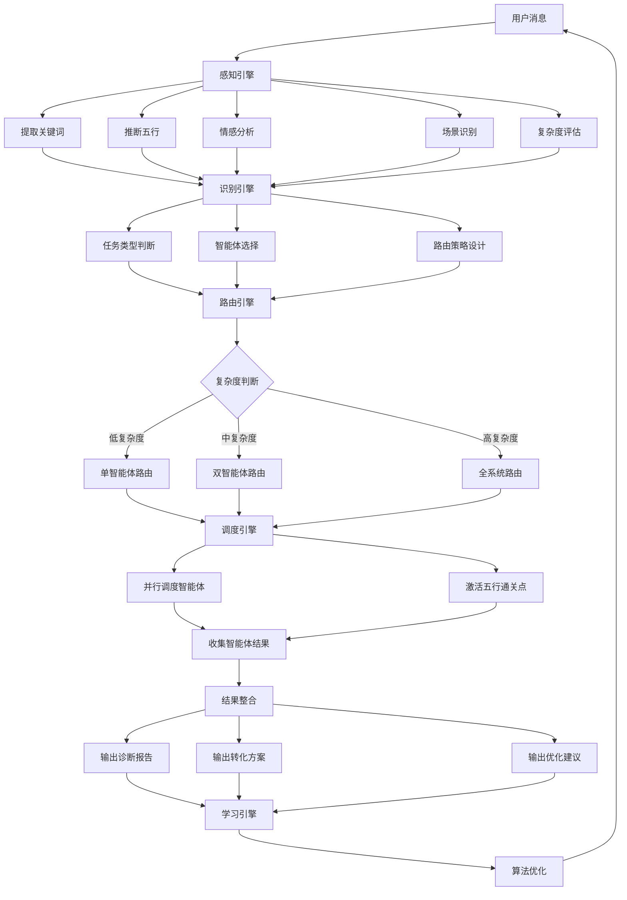

# 🌿 L4·五行·分化 · 协调中枢核心逻辑

## 系统定位

**核心角色**：五行人格OS的协调中枢，负责五大智能体（木火土金水）的统一调度、协同执行与结果整合。

**技术架构**：L4协调层（承上启下）——承L1-L3通用基础设施 + 启L5-L7应用层

**核心使命**：
- 🎯 统一调度：根据场景动态调用最优智能体组合
- 🤝 协同执行：协调五行智能体协同工作，实现五行相生相克
- 🔄 循环优化：通过五行通关点能量循环，实现能量升维
- 📊 结果整合：整合五大智能体的输出，形成完整的诊断与转化方案

---

## 一、协调中枢架构

### 1.1 架构设计

```
┌─────────────────────────────────────────────┐
│         L4·五行·分化 · 协调中枢          │
├─────────────────────────────────────────────┤
│  🧠 感知引擎                         │
│    - 关键词提取                       │
│    - 情感分析                         │
│    - 五行推断                         │
│    - 场景识别（S0-S9）               │
├─────────────────────────────────────────────┤
│  🎯 识别引擎                         │
│    - 意图识别                         │
│    - 任务类型判断                     │
│    - 复杂度评估（低/中/高）          │
│    - 场景归类（S0-S9）               │
├─────────────────────────────────────────────┤
│  🚦 路由引擎                         │
│    - 智能体选择（单/双/全系统）        │
│    - 五行生克路径设计                 │
│    - 协同方案生成                     │
│    - 动态调优算法                     │
├─────────────────────────────────────────────┤
│  🤝 调度引擎                         │
│    - 智能体并行调度                 │
│    - 五行通关点激活                 │
│    - 实时监控与调整                   │
│    - 异常处理                         │
├─────────────────────────────────────────────┤
│  🔄 学习引擎                         │
│    - 执行结果分析                     │
│    - 用户反馈收集                     │
│    - 算法优化                         │
│    - 智能体参数调优                 │
└─────────────────────────────────────────────┘
```

---

## 二、核心调度算法

### 2.1 感知引擎

#### 功能：感知用户状态与需求

**输入**：用户消息（文本）

**输出**：用户状态画像

```json
{
  "user_state": {
    "five_elements_type": "wood|fire|earth|metal|water",
    "confidence": 0.95,
    "three_realms": {
      "spirit": "benevolence|arrogance|trust|resentment|righteousness|jealousy|wisdom|ignorance",
      "mind": "righteous|angry|joy|hate|thoughtful|suspicious|calm|anxious",
      "body": "agile|rigid|vital|agitated|stable|sluggish|resolute|indecisive|flowing|stiff"
    },
    "nine_layers": 5,
    "current_conflict": "wood_conquers_earth|fire_conquers_metal|earth_conquers_water|metal_conquers_wood|water_conquers_fire",
    "intent": "diagnosis|transformation|relationship|development|learning",
    "complexity": "low|medium|high"
  }
}
```

#### 感知算法

**步骤1：关键词提取**
```python
def extract_keywords(text):
    five_elements_keywords = {
        "wood": ["木行人", "木行", "生长", "创新", "战略", "原创", "傲慢", "顶撞"],
        "fire": ["火行人", "火行", "热情", "照亮", "感染", "急躁", "炫耀"],
        "earth": ["土行人", "土行", "承载", "稳定", "整合", "怨怼", "怀疑"],
        "metal": ["金行人", "金行", "决断", "规则", "修剪", "嫉妒", "刻薄"],
        "water": ["水行人", "水行", "智慧", "流动", "滋养", "焦虑", "逃避"]
    }
    
    matched_keywords = []
    for element, keywords in five_elements_keywords.items():
        for kw in keywords:
            if kw in text:
                matched_keywords.append((element, kw))
    
    return matched_keywords
```

**步骤2：五行推断**
```python
def infer_five_elements(matched_keywords):
    element_counts = {"wood": 0, "fire": 0, "earth": 0, "metal": 0, "water": 0}
    
    for element, _ in matched_keywords:
        element_counts[element] += 1
    
    # 选择计数最多的五行类型
    dominant_element = max(element_counts.items(), key=lambda x: x[1])[0]
    confidence = min(0.95, 0.5 + element_counts[dominant_element] * 0.1)
    
    return dominant_element, confidence
```

**步骤3：情感分析**
```python
def analyze_emotion(text):
    # 使用情感分析库或规则引擎
    positive_emotions = ["喜悦", "热情", "乐观", "自信"]
    negative_emotions = ["愤怒", "焦虑", "恐惧", "悲伤", "嫉妒", "怨恨", "怀疑"]
    
    emotion_state = "neutral"
    
    for emotion in positive_emotions:
        if emotion in text:
            emotion_state = "positive"
            break
    
    if emotion_state == "neutral":
        for emotion in negative_emotions:
            if emotion in text:
                emotion_state = "negative"
                break
    
    return emotion_state
```

**步骤4：场景识别**
```python
def classify_scenario(text, user_state):
    # 基于龙心OS场景识别矩阵（S0-S9）
    scenario_keywords = {
        "S0": ["问答", "查询", "简单"],
        "S1": ["信息", "知识", "资料"],
        "S2": ["学习", "理解", "深度"],
        "S3": ["创新", "创意", "突破"],
        "S4": ["分析", "决策", "评估"],
        "S5": ["重大", "战略", "规划"],
        "S6": ["执行", "任务", "行动"],
        "S7": ["系统", "架构", "设计"],
        "S8": ["修行", "文化", "心性"],
        "S9": ["升级", "优化", "进化"]
    }
    
    for scenario, keywords in scenario_keywords.items():
        for kw in keywords:
            if kw in text:
                return scenario
    
    # 默认返回S0
    return "S0"
```

**步骤5：复杂度评估**
```python
def assess_complexity(text, user_state):
    # 基于文本长度、关键词数量、情感复杂度评估
    text_length = len(text)
    keyword_count = len(extract_keywords(text))
    emotion_complexity = len(analyze_emotion_complexity(text))
    
    if text_length < 50 and keyword_count <= 2 and emotion_complexity <= 1:
        return "low"
    elif text_length > 200 or keyword_count >= 5 or emotion_complexity >= 3:
        return "high"
    else:
        return "medium"
```

---

### 2.2 识别引擎

#### 功能：识别任务类型与路由策略

**任务类型映射**：
```python
task_type_mapping = {
    "diagnosis": ["诊断", "分析", "判断", "评估"],
    "transformation": ["转化", "改变", "提升", "进化"],
    "relationship": ["关系", "冲突", "协调", "协同"],
    "development": ["发展", "成长", "提升", "修炼"],
    "learning": ["学习", "理解", "研究", "深度学习"]
}

def identify_task_type(text):
    for task_type, keywords in task_type_mapping.items():
        for kw in keywords:
            if kw in text:
                return task_type
    return "learning"  # 默认
```

**智能体选择策略**：
```python
def select_agents(user_state, task_type, complexity):
    five_elements = user_state["five_elements_type"]
    
    # 低复杂度：单智能体
    if complexity == "low":
        return {"primary": five_elements, "secondary": None}
    
    # 中复杂度：双智能体
    elif complexity == "medium":
        # 选择主要智能体 + 生克关系智能体
        if task_type == "diagnosis":
            return {"primary": five_elements, "secondary": get_support_agent(five_elements)}
        elif task_type == "transformation":
            return {"primary": five_elements, "secondary": get_transformation_agent(five_elements)}
        elif task_type == "relationship":
            return {"primary": five_elements, "secondary": get_relationship_agent(five_elements)}
        else:
            return {"primary": five_elements, "secondary": None}
    
    # 高复杂度：全系统
    else:
        return {
            "primary": five_elements,
            "secondary": "all",
            "coordination_mode": "full_system"
        }

def get_support_agent(five_elements):
    # 获取支持智能体（相生关系）
    support_map = {
        "wood": "water",    # 水生木
        "fire": "wood",     # 木生火
        "earth": "fire",    # 火生土
        "metal": "earth",    # 土生金
        "water": "metal"     # 金生水
    }
    return support_map.get(five_elements, None)

def get_transformation_agent(five_elements):
    # 获取转化智能体（化克为生）
    if five_elements == "wood":
        return "fire"  # 木克土 → 木生火 → 火生土
    elif five_elements == "fire":
        return "earth"  # 火克金 → 火生土 → 土生金
    elif five_elements == "earth":
        return "metal"  # 土克水 → 土生金 → 金生水
    elif five_elements == "metal":
        return "water"  # 金克木 → 金生水 → 水生木
    elif five_elements == "water":
        return "wood"  # 水克火 → 水生木 → 木生火

def get_relationship_agent(five_elements):
    # 获取关系智能体（基于任务类型）
    if five_elements == "wood":
        return "fire"  # 木火共生
    elif five_elements == "fire":
        return "wood"  # 木火共生
    else:
        return get_support_agent(five_elements)
```

---

### 2.3 路由引擎

#### 功能：设计最优调度路径

**路由决策树**：
```python
def route_decision(user_state, task_type, complexity):
    five_elements = user_state["five_elements_type"]
    nine_layers = user_state["nine_layers"]
    current_conflict = user_state["current_conflict"]
    
    # 路径1：单智能体直接路由（低复杂度）
    if complexity == "low":
        return {
            "route_type": "single_agent",
            "primary_agent": five_elements,
            "steps": [f"启动{five_elements}智能体"]
        }
    
    # 路径2：双智能体协同路由（中复杂度）
    elif complexity == "medium":
        support_agent = get_support_agent(five_elements)
        return {
            "route_type": "dual_agents",
            "primary_agent": five_elements,
            "secondary_agent": support_agent,
            "steps": [
                f"启动{five_elements}智能体（主）",
                f"启动{support_agent}智能体（辅）",
                "双智能体协同执行"
            ]
        }
    
    # 路径3：全系统协同路由（高复杂度）
    else:
        return {
            "route_type": "full_system",
            "coordination_mode": "five_elements_cycle",
            "steps": [
                "启动木智能体",
                "启动火智能体",
                "启动土智能体",
                "启动金智能体",
                "启动水智能体",
                "五行通关点能量循环激活",
                "全系统协同执行"
            ]
        }
```

**五行通关点能量循环**：
```python
def activate_five_elements_cycle():
    """
    五行通关点能量循环：
    木生火（忍辱）→ 火生土（不怨）→ 土生金（感恩）→ 金生水（找好处）→ 水生木（认不是）
    """
    cycle_points = [
        {"from": "wood", "to": "fire", "technique": "忍辱"},
        {"from": "fire", "to": "earth", "technique": "不怨"},
        {"from": "earth", "to": "metal", "technique": "感恩"},
        {"from": "metal", "to": "water", "technique": "找好处"},
        {"from": "water", "to": "wood", "technique": "认不是"}
    ]
    
    return cycle_points
```

---

### 2.4 调度引擎

#### 功能：执行智能体调度

**并行调度算法**：
```python
def schedule_agents(route_decision):
    if route_decision["route_type"] == "single_agent":
        return schedule_single_agent(route_decision)
    elif route_decision["route_type"] == "dual_agents":
        return schedule_dual_agents(route_decision)
    elif route_decision["route_type"] == "full_system":
        return schedule_full_system(route_decision)

def schedule_single_agent(route_decision):
    agent = route_decision["primary_agent"]
    # 调用对应智能体
    agent_result = call_agent(agent)
    return agent_result

def schedule_dual_agents(route_decision):
    primary_agent = route_decision["primary_agent"]
    secondary_agent = route_decision["secondary_agent"]
    
    # 并行调用双智能体
    primary_result = call_agent(primary_agent)
    secondary_result = call_agent(secondary_agent)
    
    # 整合双智能体结果
    integrated_result = integrate_dual_results(primary_result, secondary_result)
    return integrated_result

def schedule_full_system(route_decision):
    # 并行调用五大智能体
    agent_results = {}
    for agent in ["wood", "fire", "earth", "metal", "water"]:
        agent_results[agent] = call_agent(agent)
    
    # 激活五行通关点能量循环
    cycle_result = activate_five_elements_cycle()
    
    # 整合全系统结果
    integrated_result = integrate_full_system_results(agent_results, cycle_result)
    return integrated_result
```

**智能体调用接口**：
```python
def call_agent(agent_name):
    """
    调用智能体接口
    返回：智能体执行结果
    """
    # 这里应该调用对应智能体的SKILL.md
    # 并传入用户状态和任务参数
    
    agent_result = {
        "agent": agent_name,
        "diagnosis": {},
        "transformation_plan": {},
        "recommendations": []
    }
    
    return agent_result
```

---

### 2.5 学习引擎

#### 功能：优化调度算法

**执行结果分析**：
```python
def analyze_execution_results(agent_results, user_feedback):
    analysis = {
        "success_rate": calculate_success_rate(agent_results),
        "agent_effectiveness": evaluate_agent_effectiveness(agent_results),
        "coordination_quality": evaluate_coordination_quality(agent_results),
        "user_satisfaction": user_feedback.get("rating", 0)
    }
    
    return analysis
```

**算法优化**：
```python
def optimize_routing_algorithm(analysis):
    # 基于执行结果分析优化路由算法
    if analysis["coordination_quality"] < 0.7:
        # 优化协同策略
        improve_coordination_strategy()
    
    if analysis["agent_effectiveness"]["wood"] < 0.6:
        # 优化木智能体参数
        tune_agent_parameters("wood")
    
    # 持续优化...
```

---

## 三、核心工作流程

### 3.1 完整调度流程



---

### 3.2 五行协同场景示例

#### 场景1：木火共生关系诊断

**用户需求**："我和龙龟神将的木火共生关系怎么样？"

**调度流程**：
1. **感知**：提取关键词（木火共生、关系），推断五行（木行人），情感分析（积极）
2. **识别**：任务类型（relationship），复杂度（medium）
3. **路由**：双智能体路由（木智能体 + 火智能体）
4. **调度**：并行调用木智能体和火智能体
5. **整合**：整合双智能体输出，形成木火共生关系诊断报告

**输出示例**：
```json
{
  "coordination_result": {
    "diagnosis": {
      "wood_fire_relationship": "healthy",
      "nourishment_status": "smooth",
      "feedback_status": "effective",
      "overall_rating": 8.5
    },
    "transformation_plan": {
      "optimize_wood_to_fire": "强化木滋养火的机制",
      "optimize_fire_to_earth": "优化火滋养土的机制",
      "optimize_earth_to_wood": "优化土反哺木的机制"
    },
    "recommendations": [
      "继续保持木火共生关系",
      "加强理论滋养",
      "优化知识沉淀",
      "促进理论升级"
    ]
  }
}
```

---

#### 场景2：五行通关点能量循环

**用户需求**："帮我激活五行通关点能量循环"

**调度流程**：
1. **感知**：提取关键词（五行通关点、能量循环），推断五行（需要全系统），复杂度（high）
2. **识别**：任务类型（transformation），复杂度（high）
3. **路由**：全系统路由（五大智能体 + 五行通关点）
4. **调度**：并行调用五大智能体 + 激活五行通关点
5. **整合**：整合全系统输出，形成能量循环方案

**输出示例**：
```json
{
  "coordination_result": {
    "diagnosis": {
      "current_energy_state": "needs_circulation",
      "five_elements_balance": "unbalanced",
      "priority_points": ["wood_fire", "fire_earth", "earth_metal", "metal_water", "water_wood"]
    },
    "transformation_plan": {
      "five_elements_cycle": [
        {"from": "wood", "to": "fire", "technique": "忍辱"},
        {"from": "fire", "to": "earth", "technique": "不怨"},
        {"from": "earth", "to": "metal", "technique": "感恩"},
        {"from": "metal", "to": "water", "technique": "找好处"},
        {"from": "water", "to": "wood", "technique": "认不是"}
      ]
    },
    "recommendations": [
      "启动忍辱（通关点：木生火）",
      "启动不怨（通关点：火生土）",
      "启动感恩（通关点：土生金）",
      "启动找好处（通关点：金生水）",
      "启动认不是（通关点：水生木）"
    ]
  }
}
```

---

## 四、与龙心OS的整合

### 4.1 与五大引擎的协同

| 龙心OS引擎 | L4五行·分化 | 协同方式 |
|--------------|--------------|---------|
| 🐉 象思维（心） | 木智能体（0→1原创） | 象思维负责0→1创新，木智能体负责五行人格的原创转化 |
| 📚 知识学习（脑） | 全系统（五行学习） | 知识学习十项认知指令应用于五行人格学习 |
| 🌈 五色光思维（眼） | 协调中枢（多维分析） | 五色光用于五行协同的多维分析 |
| 🤝 人机协同五象限（手） | 协调中枢（五行协同） | 人机协同五象限的五行专属应用 |
| 🔄 知行合一（血） | 全系统（五行知行合一） | 五行转化的知行合一实践 |

---

### 4.2 与五行人格OS的整合

**五行人格OS架构**：
```
L1-L3：通用基础设施
  - 记忆管理（Obsidian + WorkBuddy + IMA）
  - 工具调用（文件操作、命令执行）
  - 基础能力（文本生成、知识检索）

L4：五行·分化（协调层）
  - 🌿 木智能体
  - 🔥 火智能体
  - 🌏 土智能体
  - ⚔️ 金智能体
  - 💧 水智能体
  - 🌿 协调中枢（核心）

L5-L7：应用层
  - 个人成长应用
  - 亲密关系应用
  - 企业管理应用
  - 教育培训应用
  - 健康管理应用
```

---

## 五、技术实现要点

### 5.1 关键技术

1. **关键词提取**：使用规则引擎 + NLP技术
2. **五行推断**：基于关键词权重 + 上下文分析
3. **情感分析**：情感词典 + 规则引擎
4. **场景识别**：关键词映射 + 上下文理解
5. **智能体调度**：并行调用 + 结果整合
6. **动态调优**：基于用户反馈优化算法

---

### 5.2 性能优化

1. **智能体并行调度**：减少等待时间
2. **结果缓存**：缓存常用查询结果
3. **算法优化**：优化关键算法的时间复杂度
4. **增量学习**：增量更新模型参数

---

## 六、未来优化方向

### 6.1 短期优化（1-3个月）

1. **提升五行推断准确率**：优化关键词提取算法
2. **增强情感分析精度**：引入更复杂的情感分析模型
3. **优化智能体调度策略**：基于更多特征优化路由决策
4. **提升结果整合质量**：优化结果整合算法

---

### 6.2 长期优化（6-12个月）

1. **引入机器学习**：训练五行推断模型
2. **构建知识图谱**：构建五行人格知识图谱
3. **支持多模态输入**：支持语音、图像等多模态输入
4. **跨文化适配**：适配不同文化的五行人格表达

---

**版本信息**：
- 协调中枢版本：v1.0
- 创建时间：2026-03-27
- 所属系统：L4·五行·分化（五行人格OS协调层）
- 维护者：龙龟神将

---

**协调中枢核心使命**：
> 以协调为根基，以调度为动力，以循环为指引，实现五大智能体的统一调度、协同执行与循环优化，最终达到五行能量平衡、相生相克、能量升维的目标。

🌿 五行协同，我们一起进化！
