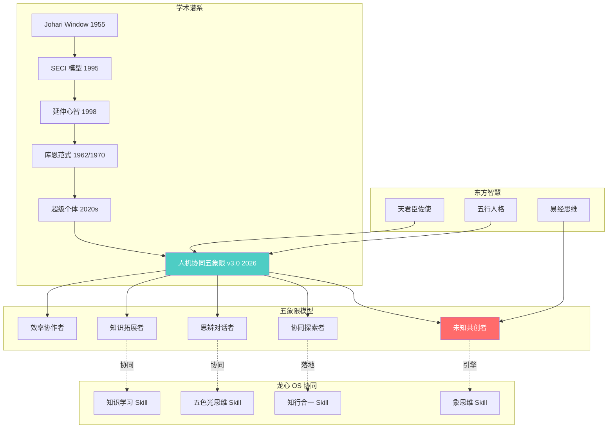
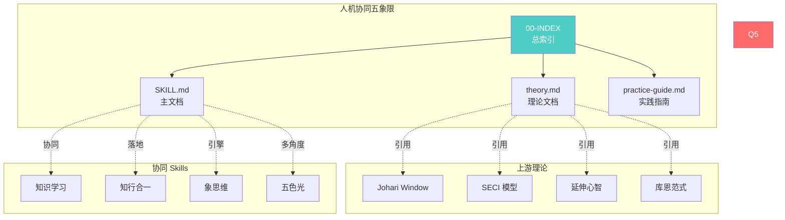
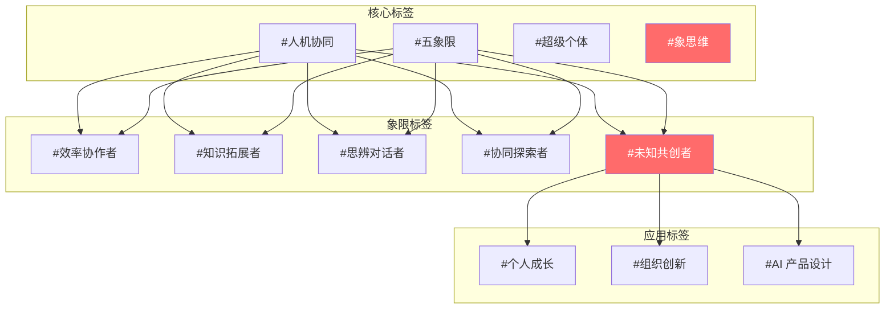
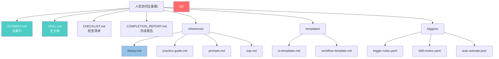
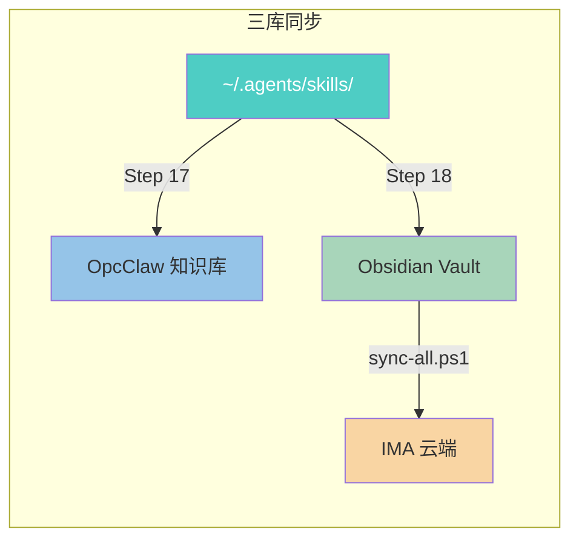

# 人机协同五象限 - 知识图谱

> 🕸️ 可视化展示各体系之间的关系

---

## 🌐 核心关系图



---

## 📊 五象限价值递进图


---

## 🔗 双向链接网络



---

## 🏷️ 标签体系



---

## 📁 文件关系图



---

## 🎯 使用导航

### 快速入口
1. **新手入门** → [[00-INDEX]] → [[theory]]
2. **立即使用** → [[SKILL]] → 触发词
3. **深度实践** → [[practice-guide]] → [[prompts]]
4. **配置规则** → [[trigger-rules]] → [[skill-routes]]

### 学习路径
```
00-INDEX (总览)
    ↓
theory (理论完整理解)
    ↓
practice-guide (实践指南)
    ↓
prompts (提示词模板)
    ↓
io-templates (实战应用)
```

---

## 🔄 知识流动



---

_知识图谱完成 · 2026-04-16 · 龙心 OS 人机协同五象限 Skill v3.0_
