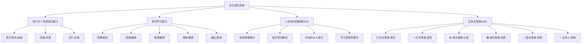
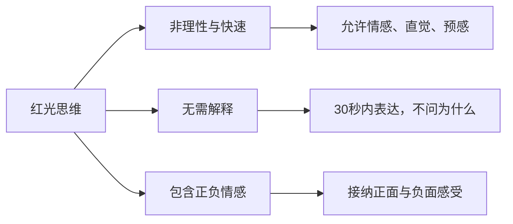
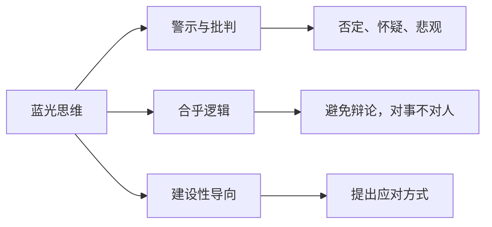
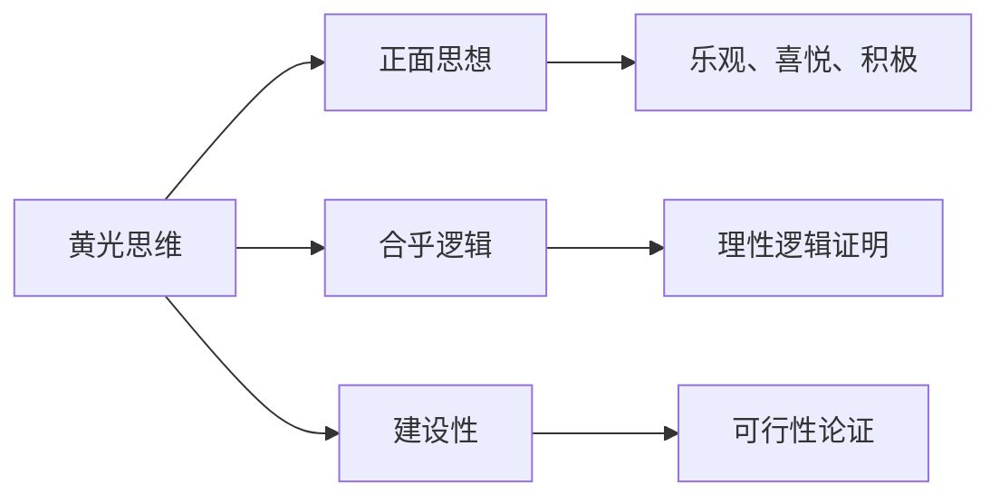
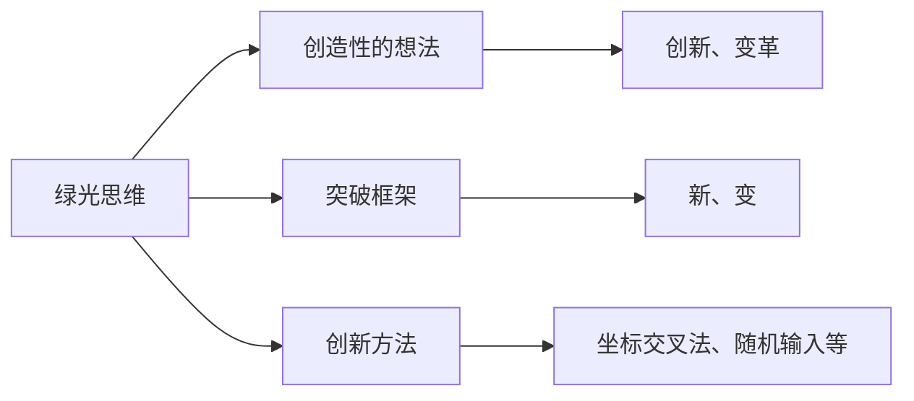
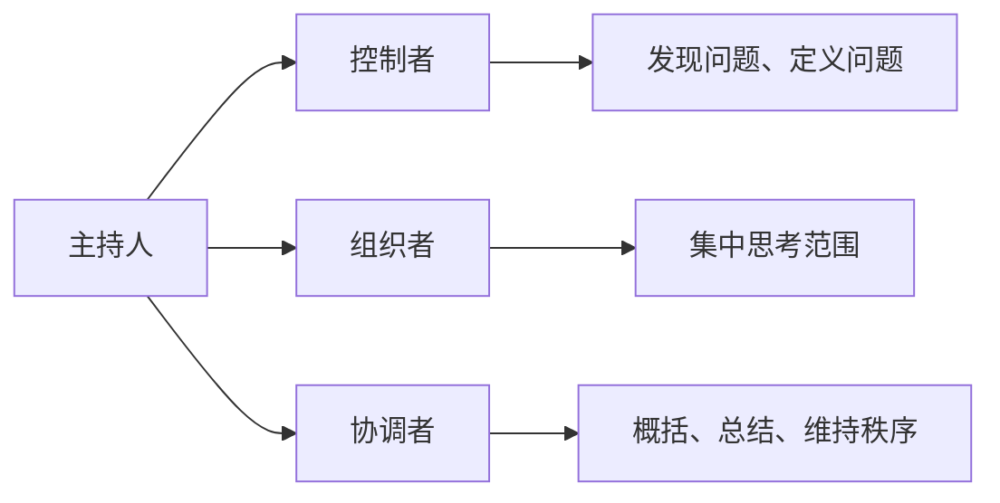
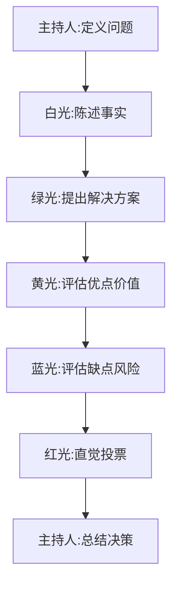

# 五色光思维Skills核心体系

> **基于三层认知增强框架的结构化思维系统**
> **核心心法：放弃旧模式，成为五色光思维者**

---

## 一、体系总览：基于三层认知框架的思维系统

### 1.1 五色光思维在自主进化系统中的定位



### 1.2 五色光思维Skills体系架构

| 层级 | 构成要素 | 对应三层框架 | 核心价值 |
|------|---------|-------------|---------|
| **第一层：思维角色** | 六种思维模式（白红黄绿蓝+主持人） | 知行合一能力 | 思维分解与角色管理 |
| **第二层：思维方法** | 各颜色思维的具体原则、规则、要点 | 知识学习能力 | 深度思考与认知操作 |
| **第三层：思维应用** | 思维序列、流程、实战模板 | 人机协同能力 | 实践应用与价值创造 |

### 1.3 核心心法：思维模式的根本转变

**重点提示：要成为五色光思维，放弃自己现有的思维模式。而不是在自己现有思维上再加上五色光思维。**

这一心法体现了三层认知框架的深度整合：
1. **放弃旧模式** → 从表示空间（原有思维习惯）中解脱
2. **成为五色光思维者** → 通过压缩理解思维本质，通过泛化应用新思维模式

---

## 二、六种思维角色深度解析

### 2.1 ⚪ 白光思维：客观事实思维

```mermaid
graph LR
    W[白光思维] --> W1[客观中立]
    W --> W2[精确细致]
    W --> W3[沟通工具]
    
    W1 --> W1a[只关心"是什么"]
    W2 --> W2a[一级事实 vs 次级事实]
    W3 --> W3a[提供共同事实基础]
```

#### 核心原则：
1. **不能任意提高事实层次**，除非有能力证明
2. **态度必须是中立的**
3. **应该成为一种习惯**
4. **防止过度使用**
5. **不主观、不解释**
6. **去除感情色彩、去除虚幻、想象**
7. **区别事实本身和事实的解释**
8. **区别验证过的事实和认为的事实**

#### 事实的层次和真实度：
- **一级事实**：经过检验证实的事实
- **次级事实**：人们相信为真，但未经检验的事实
- **事实的真实度**：根据来源和验证程度分级

#### 白光使用重点：
1. 记录双方的冲突点
2. 厘清事实的关联性和准确性
3. 将事实和猜测区分开来
4. 明确获得信息要采取的行动
5. 报告别人的感受（不可以报告自己的感受）

### 2.2 🔴 红光思维：直觉感受思维



#### 何时使用红光？
1. 气氛沉闷时
2. 新的创意或计划时
3. 不好的消息时
4. 会议前后调动情绪
5. 当没有渠道表达时

#### 红光思维的作用：
1. 给情感、直觉、预见、品味、审美观、价值观等一个合法的地位
2. 对人的突然的洞察力、情况的即刻了解、情绪的时刻转换作出判断

#### 背景情感与思维：
- 同情、愤怒、嫉妒或害怕等背景情感会限制所有思维
- 如果背景情感被排斥于思维过程之外，会以潜在形式影响思维
- 红光允许人们将感觉与直觉放进来，不需要道歉，不用解释

### 2.3 🔵 蓝光思维：风险控制思维



#### 蓝光思维的原则：
1. 蓝光思维是一种强势思维
2. 可以用蓝光应付蓝光
3. 蓝光思维应该提出应对方式

#### 蓝光思维的用途：
1. 对事实和数据提出质疑
2. 指出不符合经验的方面
3. 合理的提出自己的个人经验
4. 指出未来的危险与可能发生的问题
5. 验算结论
6. 合乎逻辑的判断
7. 找出逻辑上的错误
8. 检验经验是否适用
9. 对黄色光思维的制衡

#### 使用蓝色光思维的危险性：
1. 攻击他人会立即有满足感
2. 赞美他人会显得低人一等
3. 批评是很容易的事

### 2.4 🟡 黄光思维：积极价值思维



#### 黄色思维的用途：
1. 探求事物的优点
2. 证明为什么某个观点行得通，但必须符合逻辑
3. 当未来不确定时，通过问题建立可行性基础

#### 建设性与创造性的区别：
1. 黄光是**建设性的**，绿光才负责**创造性**
2. 黄光是有效的运用旧的想法
3. 黄光所谈的是效果，而不是惊奇

#### 概念提炼方法：
1. 提出焦点问题
2. 提出想法
3. 提取概念
4. 想出其它方法

### 2.5 🟢 绿光思维：创新方案思维



#### 绿色思维的使用用途：
1. 产生初始想法
2. 产生进一步的想法或更好的想法
3. 产生新想法
4. 改变思维层次
5. 诱因的操作
6. 为"创造"提供时间和空间
7. 提取概念

#### 绿光格言：
- 『把我不能换成 让我想想看』
- 『把我不会换成 让我试试看』

#### 绿光思维方法：
1. **坐标轴对照法**：多维度思考
2. **随机输入元素碰撞**：解决惯性思维、思维局限
   - 任意选择一个词汇
   - 将随机词汇放在思考主题下面
   - 看随机词汇将思维引向哪里

### 2.6 🎩 主持人：思维过程的控制与组织



#### 主持人的主要责任：
1. **控制**、组织、指挥和协调整个思考过程
2. 使思考过程程序化、清晰化、条理化
3. 不断做摘要、概括、总结
4. 维持思考的秩序，使思考集中到一个方向

#### 主持人/自己的技术要点：
1. **问正确的问题**
2. **定义问题**
3. 设计思考问题的议程
4. 提出下一步思考的建议
5. 进行讨论的总结并做出最后的决定

---

## 三、基于三层框架的系统整合

### 3.1 与知行合一自我进化能力的整合

| 三阶段转化模型 | 五色光思维对应 | 具体应用 |
|---------------|--------------|---------|
| **表示空间**（经验） | 白光收集事实 + 红光记录感受 | 建立全面的事实和情感基线 |
| **压缩**（本质） | 蓝光识别风险 + 黄光提炼价值 | 从复杂性中提取核心本质 |
| **泛化**（应用） | 绿光创造新应用 + 红光检验直觉 | 创造新的应用场景和可能性 |

### 3.2 与知识学习能力的整合

| 十大认知指令 | 五色光思维支持 | 具体作用 |
|-------------|--------------|---------|
| **洞察/剖析** | 白光事实分析 + 蓝光问题识别 | 深度理解事物的本质和问题 |
| **透视/阐释** | 黄光价值提炼 + 绿光创新视角 | 从不同角度重新解释事物 |
| **推演/解构** | 蓝光逻辑验证 + 绿光结构重组 | 系统性分析和重构 |
| **思辨/溯源** | 蓝光批判思考 + 白光事实追溯 | 理性思考和根源探索 |
| **融合/启发** | 绿光创新整合 + 红光直觉启发 | 跨领域融合和灵感激发 |

### 3.3 与人机协同四象限的整合

| 人机协同模式 | 五色光思维分配 | 协作优势 |
|-------------|--------------|---------|
| **高效助理模式** | 白光+蓝光为主 | AI处理事实和风险，人类做决策 |
| **知识导师模式** | 黄光+绿光为主 | AI提供价值和创新，人类做选择 |
| **共创合伙人模式** | 绿光+红光为主 | 共同创造，直觉与创新结合 |
| **学习型助手模式** | 白光+黄光为主 | 共同学习，事实与价值结合 |

---

## 四、核心应用原则与心法

### 4.1 三大核心应用原则

#### 1. 单色聚焦原则
- **内涵**：在同一时间内，所有思考者必须且只能使用一种颜色的思维模式
- **价值**：彻底避免思维混乱和互相扯皮
- **实践**：主持人必须立即纠偏任何偏离当前颜色的发言

#### 2. 序列自由组合原则
- **内涵**：五种颜色的使用没有固定、唯一的顺序
- **价值**：赋予思考过程极大的灵活性和针对性
- **实践**：根据会议目的、问题性质和团队状态，灵活设计最合适的思维序列

#### 3. 强制完整性原则
- **内涵**：一旦决定使用某一种颜色的思维，就必须在该维度上进行充分、深入的思考
- **价值**：防止滥用或误用，避免片面应用
- **实践**：鼓励全面、系统地在当前颜色下充分思考

### 4.2 重要注意事项

1. **放弃旧模式**：要成为五色光思维者，关键是暂时放下自己固有的、混合的思维习惯
2. **避免起手蓝光**：除非是专门的"风险评估会"，否则会议开场禁用蓝光
3. **慎用结尾绿光**：会议临近结束时应收敛、决策，避免使用发散的绿光
4. **"要用就全用"**：杜绝片面使用，引导全员在该颜色下充分思考
5. **顺序不固定**：没有绝对正确的顺序，只有最适合当前场景的顺序

### 4.3 思维序列的框架性指引

| 阶段 | 主持人角色 | 红光 | 白光 | 绿光 | 黄光 | 蓝光 |
|------|-----------|------|------|------|------|------|
| **初始序列**（开局） | 提出主题，确定焦点，宣布思维序列与时间 | 表达初始感受（了解情绪基线） | 共享已知或需要的信息（奠定事实基础） | 通常在白光之后使用，以产生新想法 | 找出利益所在，但避免在毫无基础时空谈 | **避免使用**。防止一开始就扼杀氛围 |
| **中间序列**（核心探讨） | 总结上阶段内容，核对进度，引导切换 | 检验感受变化，特别是在激烈讨论后 | 收集更多信息以支持深入讨论 | 产生新想法，或解决蓝光提出的问题 | 找出利益所在，评估不同方案的可行性 | 识别困难与风险，对方案进行批判性检验 |
| **结尾序列**（收尾决策） | 总结/结束，决定下一步 | 检验最终反应，达成一致（直觉投票或信心确认） | **不经常使用**（除非需要核对最终事实） | 改进早期观点，列出选项，但应避免在最后阶段开启全新发散 | **不经常使用**（除非需要最后强调价值以鼓舞行动） | 进行最终的风险检验，确认已考虑周全 |

---

## 五、五色光思维Skills总结表

| 颜色 | 功能定位 | 关键规则 | 典型问题 | 主要禁忌 |
|------|---------|---------|---------|---------|
| **⚪ 白光**（客观事实） | 处理信息与数据 | 1. 禁止解释与争论<br>2. 区分一级与次级事实<br>3. 聚焦关键信息 | "现有数据是什么？"<br>"缺失哪些信息？" | 会议结尾禁用；混淆事实与观点 |
| **🔴 红光**（直觉情绪） | 暴露情感与预感 | 1. 30秒内快速表达<br>2. 无需解释原因<br>3. 接受所有感受 | "我的直觉是什么？"<br>"团队情绪如何？" | 禁止凭直觉决策；避免辩论原因 |
| **🟡 黄光**（积极价值） | 识别利益与机会 | 1. 需逻辑证明价值<br>2. 与蓝光互补（常先黄后蓝）<br>3. 聚焦建设性 | "这样做有什么利益？"<br>"可行性依据是什么？" | 避免脱离实际；拒绝空想 |
| **🟢 绿光**（创新变革） | 生成创造性方案 | 1. 允许非逻辑发散<br>2. 延迟评判，追求数量<br>3. 可借助创新工具 | "还有其他方法吗？"<br>"如何突破框架？" | 会议结尾禁用；避免单用（需蓝光验证） |
| **🔵 蓝光**（风险批判） | 识别风险与漏洞 | 1. 基于逻辑批判，对事不对人<br>2. 需全面列举风险<br>3. 可提出改进建议 | "可能的问题是什么？"<br>"逻辑漏洞在哪里？" | 会议开场禁用；避免人身攻击 |
| **🎩 主持人**（控制组织） | 管理思维过程 | 1. 问正确的问题<br>2. 定义问题<br>3. 维持纪律与秩序<br>4. 总结与推进 | "我们现在使用什么思维？"<br>"下一步该做什么？" | 不能参与具体颜色的思考；不能偏袒 |

---

## 六、实战应用模板

### 6.1 通用问题解决步骤（经典短序列）



### 6.2 绩效面谈模板

1. **主持人**（管理者）：设定面谈目标与框架
2. **红光**（开场）："整体来说，对你过去季度的表现，我的直觉感受是满意中有一些担忧"
3. **白光**：陈述事实："这是你设定的三个目标及完成数据：A目标完成120%，B目标完成80%，C目标完成60%"
4. **黄光**：肯定价值："A目标超额完成，说明你在XX方面能力非常突出，带来了XX具体贡献"
5. **蓝光**：指出问题："B和C目标未完成，主要障碍在于XX和XX，这反映了在XX方面可能存在不足"
6. **绿光**：寻求改进："针对这些不足，你觉得我们可以从哪几个方向进行改进？我建议……"
7. **红光**（结尾）：鼓励信心："我相信以你的能力，下一季度一定能克服这些挑战，我对你有信心"
8. **主持人**：双方共识改进计划，拟定下一步具体行动

### 6.3 个人决策模板（是否购买某楼盘）

1. **自己**（主持人）：想购买一套100平米的房子
2. **白光**：看房，收集价格、位置、学区、配套、户型等客观信息
3. **黄光**：分析看过的几个楼盘的各自优势（A盘学区好，B盘价格低，C盘户型佳）
4. **蓝光**：分析各楼盘的劣势（A盘贵，B盘远，C盘开发商口碑一般）
5. **绿光**：针对劣势，思考有无弥补办法（如B盘远，但未来有地铁规划；C盘口碑一般，但可仔细研究合同条款）
6. **红光**：综合所有信息后，凭直觉做出最优选择（"我还是最喜欢A盘的感觉"）
7. **自己**（主持人）：做出决策，交定金，筹备首付

---

## 七、总结：五色光思维Skills的价值

### 7.1 核心价值体现

**五色光思维Skills通过将思考"分色管理"，强制实现了思考的秩序与深度。它像一套思维上的"交通规则"，让团队智慧的车流得以有序、高效地驶向目的地，而非陷入混乱的拥堵与碰撞。**

### 7.2 基于三层认知框架的独特优势

1. **系统化思维分解**：将复杂思考分解为可管理的六个维度
2. **同频化集体智慧**：实现团队思考的"同频共振"
3. **结构化思维转化**：通过有意识的思维切换，重新构建问题
4. **完整化思维整合**：确保每个思维维度都得到充分应用

### 7.3 应用场景广泛性

无论是用于高效会议、个人决策、项目复盘、创新研讨、绩效管理、战略规划，还是日常问题解决，五色光思维Skills都能通过其结构化的力量，将思考的质量和团队的协作提升到一个新的层次。

---

**标签**：#五色光思维 #思维Skills #结构化思维 #集体智慧 #认知框架 #思维管理 #思考方法 #创新思维 #问题解决 #决策制定 #团队协作 #个人成长 #思维进化 #知行合一 #知识学习 #人机协同

**关联文件**：
- [[五色光思维知识图谱]]
- [[五色光思维双向链接索引]]
- [[知行合一自我进化能力]]
- [[知识学习能力Skills]]
- [[人机协同四象限Skills]]
- [[五色光思维完整体系]]
- [[象思维核心体系]]
- [[100个实战思维模型体系]]

**核心金句**：
1. "要成为五色光思维，放弃自己现有的思维模式。而不是在自己现有思维上再加上五色光思维。"
2. "思考的最大障碍在于混乱，我们总是尝试同时做太多的事情。"
3. "五色光思维是一个管理我们思维本身的一种方法。它将我们的思维从不同侧面和角度进行分解。"
4. "同频思考：让每个人在同一时间使用相同的思维模式。"
5. "『把我不能换成 让我想想看』，『把我不会换成 让我试试看』"