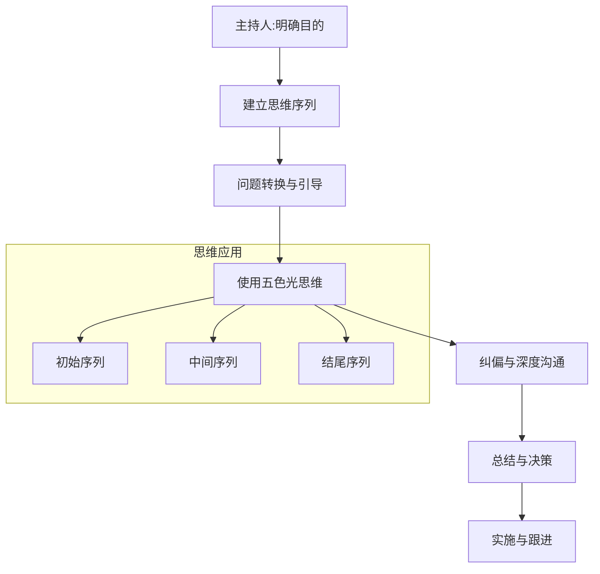
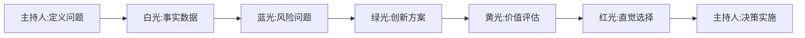
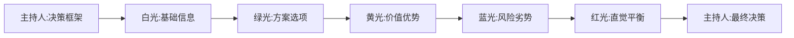
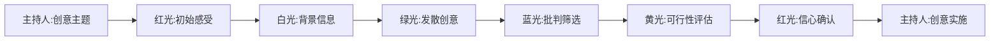
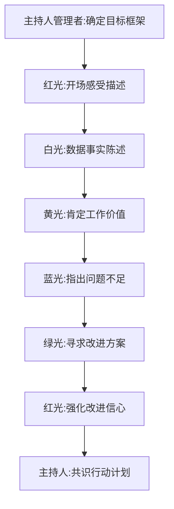
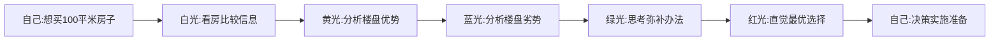
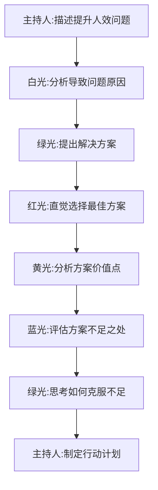

# 五色光思维序列与应用流程

> **结构化思维过程控制与管理体系**

---

## 一、五色光思维使用总流程

### 1.1 完整应用流程框架

### 1.2 五大核心步骤

| 步骤 | 名称 | 核心内容 | 关键产出 |
|------|------|---------|---------|
| **1** | 明确目的 | 定义问题、确定焦点、设定目标 | 清晰的问题陈述 |
| **2** | 建立序列 | 设计思维颜色顺序与时间分配 | 结构化的思维序列 |
| **3** | 问题转换 | 根据序列设计引导问题 | 针对性的提问方案 |
| **4** | 使用五色光思维 | 按序列引导团队思考 | 各颜色维度的思考成果 |
| **5** | 纠偏与深度沟通 | 维持纪律、深化思考 | 高质量的讨论成果 |

---

## 二、思维序列设计原则

### 2.1 序列自由组合原则

**核心内涵**：五种颜色的使用没有固定、唯一的顺序。主持人应根据会议目的、问题性质和团队状态，灵活设计最合适的思维序列。

### 2.2 序列设计三大考虑因素

#### 1. 会议/思考目的
- 决策制定 → 侧重评估与选择序列
- 问题解决 → 侧重分析与创造序列
- 创意激发 → 侧重发散与整合序列
- 冲突化解 → 侧重事实与情绪序列

#### 2. 问题性质
- 简单问题 → 短序列（2-3种颜色）
- 复杂问题 → 长序列（4-5种颜色）
- 模糊问题 → 探索性序列

#### 3. 团队状态
- 士气低落 → 先红光+黄光
- 过度乐观 → 先白光+蓝光
- 创新需求 → 强调绿光使用

---

## 三、经典思维序列模式

### 3.1 问题分析序列（白→蓝→绿→黄→红）

#### 适用场景：
- 复杂问题诊断与解决
- 战略规划与选择
- 流程优化与改进

#### 详细步骤：
1. **主持人**：明确定义问题范围与边界
2. **白光**：收集所有相关事实、数据、信息
3. **蓝光**：系统分析问题、风险、障碍
4. **绿光**：针对问题和风险，创造新的解决方案
5. **黄光**：评估各方案的可行性、价值、收益
6. **蓝光**（可选）：对优选方案进行风险评估
7. **红光**：直觉投票，表达感受和信心
8. **主持人**：总结决策，制定行动计划

### 3.2 决策制定序列（白→绿→黄→蓝→红）

#### 适用场景：
- 重要投资决策
- 人事任命选择
- 供应商评估选择

#### 详细步骤：
1. **主持人**：确定决策标准和权重
2. **白光**：提供各选项的客观数据
3. **绿光**：思考是否有其他选项或组合
4. **黄光**：分析各选项的积极价值和收益
5. **蓝光**：评估各选项的风险和问题
6. **红光**：直觉感受和偏好表达
7. **主持人**：综合权衡，做出最终决策

### 3.3 创意激发序列（红→白→绿→蓝→黄→红）

#### 适用场景：
- 产品创新设计
- 市场活动策划
- 业务模式创新

#### 详细步骤：
1. **主持人**：设定创意主题和目标
2. **红光**：调动情绪，表达对主题的原始感受
3. **白光**：提供必要的背景信息和事实
4. **绿光**：大量发散，产生尽可能多的创意
5. **蓝光**：批判性筛选，排除明显不可行的
6. **黄光**：评估剩余创意的价值和可行性
7. **红光**：表达对优选创意的信心和热情
8. **主持人**：制定创意实施方案

---

## 四、实战应用案例详解

### 4.1 绩效面谈五色光应用

#### 具体对话模板：

**主持人**："这次绩效面谈的目标是回顾上季度表现，制定改进计划。我们先从红光开始。"

**红光**："整体来说，对你过去季度的表现，我的直觉感受是满意中有一些担忧。"

**白光**："这是你的三个目标及完成数据：A目标完成120%，B目标完成80%，C目标完成60%。"

**黄光**："A目标超额完成，说明你在XX方面能力非常突出，带来了XX具体贡献。"

**蓝光**："B和C目标未完成，主要障碍在于XX和XX，这反映了在XX方面可能存在不足。"

**绿光**："针对这些不足，你觉得我们可以从哪几个方向进行改进？我建议……"

**红光**："我相信以你的能力，下一季度一定能克服这些挑战，我对你有信心。"

**主持人**："好，那我们达成共识：接下来重点改进XX方面，具体行动计划是……"

### 4.2 个人决策：是否购房

#### 思维过程展开：

**白光**：
- A盘价格300万，学区一流，交通方便，户型105平
- B盘价格250万，学区二流，距离稍远，户型98平
- C盘价格280万，学区中上，配套齐全，户型102平

**黄光**：
- A盘：学区价值最高，未来升值潜力大
- B盘：性价比最优，节省预算50万
- C盘：综合评分最高，生活便利性最好

**蓝光**：
- A盘：价格最高，首付压力大
- B盘：距离太远，通勤时间增加
- C盘：开发商口碑一般，质量风险

**绿光**：
- A盘劣势应对：考虑更长期贷款，首付分阶段
- B盘劣势应对：考虑公共交通，探索远程办公
- C盘劣势应对：仔细研究合同，请专业律师把关

**红光**："综合考虑所有，还是最喜欢A盘的感觉，学区价值最重要。"

**自己**："决策：选择A盘，交定金，筹备首付。"

### 4.3 团队会议：提升人效问题

#### 会议流程细化：

**主持人**："今天会议目标：解决人效低下问题，提升团队产出。"

**白光**：
- 数据分析：当前人效指数65%，低于行业平均75%
- 时间统计：平均每人每天浪费在会议2小时，邮件1.5小时
- 技能匹配：30%人员技能与岗位不匹配

**绿光**：
- 方案A：优化会议制度，减少无效会议
- 方案B：引入协作工具，减少邮件时间
- 方案C：实施技能培训，提升岗位匹配度
- 方案D：调整激励机制，激发工作动力

**红光**："直觉上，方案A和C的组合可能最有效。"

**黄光**：
- 方案A价值：预计节省1.5小时/天，人效提升15%
- 方案C价值：技能匹配度提升至80%，人效提升20%
- 组合价值：协同效应，总人效预计提升40%

**蓝光**：
- 方案A风险：可能影响必要的信息沟通
- 方案C风险：培训成本较高，时间较长
- 组合风险：同时推进多个变革，团队压力大

**绿光**：
- 风险应对：设计分层会议制度，保留必要沟通
- 风险应对：分阶段培训，先核心后全面
- 风险应对：变革节奏控制，给团队适应时间

**主持人**："行动计划：先试点会议优化，同时启动核心人员培训，两个月后评估效果，决定是否全面推广。"

---

## 五、序列阶段指导框架

### 5.1 三阶段序列设计框架

| 阶段 | 主持人角色 | 红光 | 白光 | 绿光 | 黄光 | 蓝光 |
|------|-----------|------|------|------|------|------|
| **初始序列** （开局） | 提出主题 确定焦点 设定序列与时间 | 表达初始感受 （了解情绪基线） | 共享已知 或需要的信息 （奠定事实基础） | 在白光之后使用 以产生新想法 | 找出利益所在 但避免在毫无基础时 空谈 | **避免使用** 防止一开始就 扼杀氛围 |
| **中间序列** （核心探讨） | 总结上阶段内容 核对进度 引导切换 | 检验感受变化 特别是 激烈讨论后 | 收集 更多信息 以支持深入讨论 | 产生新想法 及解决 蓝光涉及的问题 | 找出利益所在 评估 不同方案的可行性 | 识别可能的 困难和风险 对方案进行 批判性检验 |
| **结尾序列** （收尾决策） | 总结/结束 决定下一步 | 检验反映 达成一致 （直觉投票或 信心确认） | **不经常使用** （除非需要 核对最终事实） | 改进早期观点 列出可供选择的 行动方案 （避免开启 全新发散） | **不经常使用** （除非需要 最后强调价值 以鼓舞行动） | 进行最终的 困难和风险检验 确认已 考虑周全 |

### 5.2 序列设计注意事项

#### 初始序列设计要点：
1. **避免起手蓝光**（除非专门的风险评估会）
2. **可先红光了解情绪基线**
3. **必先白光奠定事实基础**
4. **考虑团队状态决定颜色顺序**

#### 中间序列设计要点：
1. **根据讨论需要灵活调整顺序**
2. **可重复使用某种颜色深化思考**
3. **注意节奏控制，避免冗长**
4. **保持序列的逻辑连贯性**

#### 结尾序列设计要点：
1. **慎用结尾绿光**（避免发散无法收尾）
2. **多用红光达成共识**
3. **结合黄光鼓舞士气**
4. **蓝光做最终风险检验**

---

## 六、特殊场景序列设计

### 6.1 危机处理序列（蓝→白→绿→黄→红）

**适用场景**：突发事件、紧急状况、重大失误

**序列设计**：
1. **蓝光**：快速识别当前最大风险和立即威胁
2. **白光**：收集确凿事实和实时数据
3. **绿光**：紧急应对方案头脑风暴
4. **黄光**：评估各应对方案的可行性和有效性
5. **红光**：直觉选择最有效的应急措施
6. **主持人**：立即行动，后续复盘

### 6.2 战略规划序列（白→蓝→红→绿→黄→蓝→红）

**适用场景**：年度规划、业务战略、长期发展

**序列设计**：
1. **白光**：宏观环境、行业趋势、内部能力分析
2. **蓝光**：识别战略风险和发展障碍
3. **红光**：团队对未来的愿景和期望
4. **绿光**：战略方向和可能路径
5. **黄光**：各战略方向的价值和收益
6. **蓝光**：战略实施的困难和风险
7. **红光**：对优选战略的信心和支持
8. **主持人**：确定战略框架，分解执行计划

### 6.3 创新评审序列（绿→黄→蓝→红）

**适用场景**：新产品评审、创意评估、提案选择

**序列设计**：
1. **绿光**：全面介绍创新提案，强调新颖性
2. **黄光**：深入分析创新的价值和收益
3. **蓝光**：系统评估创新的风险和问题
4. **红光**：表达对创新的热情和信心
5. **主持人**：做出选择决策，制定推进计划

---

## 七、流程控制与纠偏机制

### 7.1 主持人纠偏要点

#### 常见偏离情况及纠偏话术：

| 偏离情况 | 纠偏话术 | 要点 |
|---------|---------|------|
| **白光时解释** | "请注意，现在是白光时间，请只陈述事实。" | 强化规则意识 |
| **蓝光时人身攻击** | "这是蓝光时间，请针对方案本身提风险，不要针对个人。" | 对事不对人 |
| **红光时追问原因** | "红光无需解释，只需陈述感受。" | 保护表达安全 |
| **黄光时空谈理想** | "请说明这个价值的具体实现路径。" | 要求逻辑支撑 |
| **绿光时立即评判** | "绿光不评判，先产生想法。" | 保护创造性 |

### 7.2 深度沟通引导方法

#### 五色光深度沟通技术：

1. **白光深化**：
   - 追问："这个数据的来源是什么？"
   - 探究："还有哪些相关数据？"
   - 核实："如何验证这个信息的准确性？"

2. **红光深化**：
   - 引导："能否用一句话形容你的感受？"
   - 探索："这种感受背后的深层需求是什么？"
   - 确认："这种情绪是否影响到你对方案的判断？"

3. **黄光深化**：
   - 挖掘："除了直接利益，还有哪些间接价值？"
   - 论证："实现这个价值的关键成功因素是什么？"
   - 量化："这个价值如何转化为具体指标？"

4. **绿光深化**：
   - 发散："如果我们打破所有限制，会怎么做？"
   - 组合："这些想法可以如何组合成新方案？"
   - 转化："如何把这个看似不切实际的想法变得可行？"

5. **蓝光深化**：
   - 系统思考："这个风险属于哪个风险类别？"
   - 影响分析："这个问题的最大可能影响是什么？"
   - 预防措施："我们如何提前预防这个风险？"

---

## 八、总结：序列与应用流程核心价值

### 8.1 流程控制的价值

**结构化流程**确保了思考的深度和效率：
1. **避免混乱**：单色聚焦防止思维纠缠
2. **保证完整**：强制完整性确保全面思考
3. **提升质量**：序列设计优化思考路径
4. **促进共识**：流程化推进达成团队一致

### 8.2 序列设计的智慧

**没有绝对正确的序列，只有最适合的序列：**
1. **灵活性**：根据场景动态调整
2. **针对性**：针对问题设计最佳路径
3. **系统性**：确保思考的系统性和完整性
4. **创造性**：探索创新的思维组合方式

### 8.3 应用心法

1. **先设计，后行动**：思考前必先明确序列
2. **重过程，轻结果**：高质量过程自然产生高质量结果
3. **会纠偏，善引导**：主持人角色是流程成功的关键
4. **能复盘，常优化**：不断总结提升序列设计能力

---

**标签**：#五色光思维 #思维序列 #应用流程 #决策流程 #问题解决 #会议管理 #流程控制 #序列设计 #实战应用 #沟通引导

**关联文件**：
- [[五色光思维Skills核心体系]]
- [[白光思维-客观事实思维]]
- [[红光思维-直觉感受思维]]
- [[黄光思维-积极价值思维]]
- [[绿光思维-创新方案思维]]
- [[蓝光思维-风险控制思维]]
- [[主持人-思维控制组织]]
- [[五色光思维知识图谱]]
- [[五色光思维双向链接索引]]

**核心金句**：
1. "每一种颜色的思维，既可以单独使用，也可以按顺序组合使用。"
2. "没有绝对正确的使用顺序，只要合乎情理，任何顺序都可以。"
3. "先明确目的，再建立序列，然后转换问题，接着使用五色光思维，最后纠偏深度沟通。"
4. "序列自由组合，没有固定唯一的顺序，只有最适合当前场景的顺序。"
5. "五色光代表的是角色分类，是一种思考要求，而不是扮演者本人观点。"