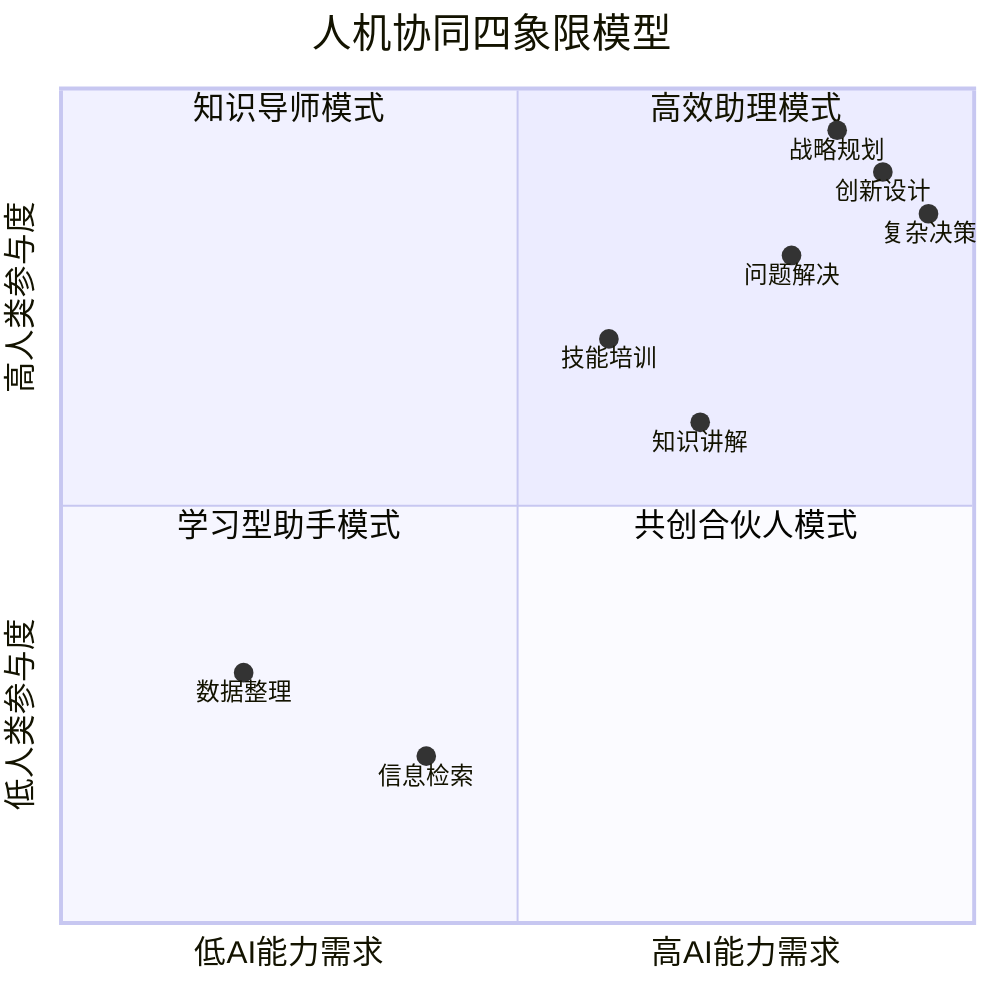
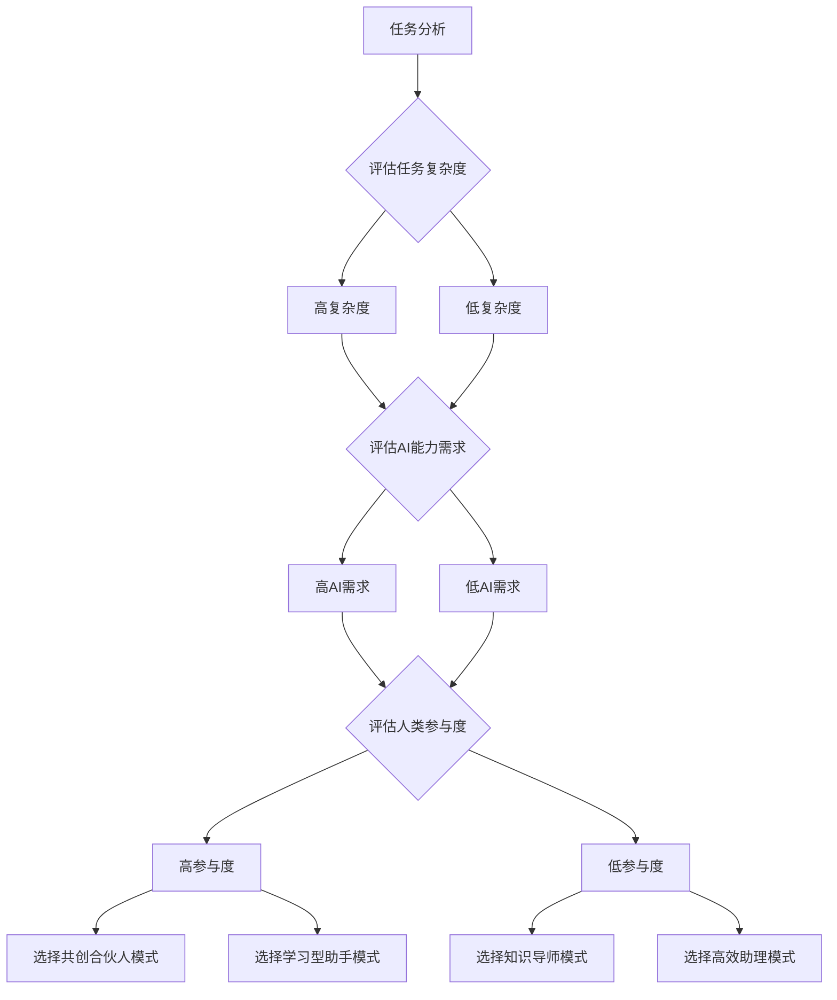

# 人机协同四象限Skills

> 高效人机协作模式体系 | 基于能力匹配与任务复杂度 | 教员方法论核心协作工具

---

## 🎯 核心定义

**人机协同四象限Skills**是基于任务复杂度与人类/AI能力匹配度划分的四种高效协作模式，旨在最大化人机协作效能，实现1+1>2的协同效应。

**核心框架：**
> 任务复杂度 × 能力匹配度 = 最优协作模式

---

## 📊 四象限模型详解



---

## 🧩 四象限详解

### 第一象限：高效助理模式
**特征：** 低AI能力需求 × 低人类参与度

**适用场景：**
- 重复性、标准化任务
- 数据整理与格式化
- 基础信息检索
- 简单文档处理

**协作方式：**
- AI主导执行，人类监督
- 自动化流程，人工审核
- 批量处理，人工抽样检查

**技能要求：**
- AI：基础数据处理、模式识别
- 人类：任务定义、质量监督

### 第二象限：知识导师模式
**特征：** 高AI能力需求 × 低人类参与度

**适用场景：**
- 知识传授与讲解
- 技能培训与指导
- 问题解答与咨询
- 学习路径规划

**协作方式：**
- AI作为知识源，人类作为学习者
- AI提供个性化学习内容
- 人类反馈学习效果

**技能要求：**
- AI：知识结构化、个性化推荐
- 人类：学习目标设定、效果评估

### 第三象限：学习型助手模式
**特征：** 低AI能力需求 × 高人类参与度

**适用场景：**
- 创意构思辅助
- 方案优化建议
- 流程改进咨询
- 问题诊断支持

**协作方式：**
- 人类主导，AI辅助
- AI提供建议，人类决策
- 人机对话式协作

**技能要求：**
- AI：建议生成、方案优化
- 人类：决策判断、创意整合

### 第四象限：共创合伙人模式
**特征：** 高AI能力需求 × 高人类参与度

**适用场景：**
- 复杂问题解决
- 创新产品设计
- 战略规划制定
- 突破性技术研发

**协作方式：**
- 人机深度协作，共同创造
- AI提供创新视角，人类提供价值判断
- 共同迭代优化

**技能要求：**
- AI：创造性思维、复杂问题解决
- 人类：战略眼光、价值判断、领导力

---

## 🔄 协作流程设计

### 流程一：模式选择流程


### 流程二：协作实施流程
1. **任务分解** - 将复杂任务分解为子任务
2. **模式匹配** - 为每个子任务匹配合适的协作模式
3. **角色分配** - 明确人机各自角色与职责
4. **流程设计** - 设计具体的协作流程
5. **效果评估** - 评估协作效果并优化

---

## 🛠️ 应用模板

### 模板一：协作模式选择模板
```markdown
## 人机协作模式选择报告

### 1. 任务分析
- 任务描述：
- 核心目标：
- 成功标准：

### 2. 维度评估
- 任务复杂度：[低/中/高]
  - 评估依据：
- AI能力需求：[低/中/高]
  - 评估依据：
- 人类参与度：[低/中/高]
  - 评估依据：

### 3. 模式选择
- 推荐模式：[高效助理/知识导师/学习型助手/共创合伙人]
- 选择理由：
- 预期效果：

### 4. 协作设计
- AI角色与职责：
- 人类角色与职责：
- 协作流程：
- 沟通机制：
```

### 模板二：协作效果评估模板
```markdown
## 人机协作效果评估报告

### 1. 协作过程评估
- 模式适用性：[优秀/良好/一般/差]
- 流程顺畅度：
- 沟通有效性：
- 问题解决速度：

### 2. 结果评估
- 目标达成度：
- 质量满意度：
- 效率提升度：
- 创新性体现：

### 3. 改进建议
- 模式调整：
- 流程优化：
- 技能提升：
- 工具改进：
```

---

## 📈 协作效能评估指标

| 协作模式 | 效率指标 | 质量指标 | 创新指标 | 满意度指标 |
|---------|---------|---------|---------|-----------|
| 高效助理 | 任务完成速度 | 准确率 | - | 便利性满意度 |
| 知识导师 | 学习效率 | 知识掌握度 | 学习深度 | 学习体验满意度 |
| 学习型助手 | 决策质量 | 方案优化度 | 改进建议数量 | 决策支持满意度 |
| 共创合伙人 | 创新产出 | 解决方案质量 | 突破性创新数量 | 协作体验满意度 |

---

## 🔗 关联文件

- [[知行合一自我进化能力]] - 进化能力支持
- [[知识学习能力Skills]] - 学习能力支持
- [[教员方法论完整体系]] - 方法论基础
- [[五色光思维完整体系]] - 思维工具

---

## 💡 核心金句

> "真正的人机协同不是替代，而是增强；不是竞争，而是共生。"

> "四象限模型是协作的导航图，帮助我们找到最优的协作路径。"

> "从助理到合伙人，是人机关系的进化，也是人类智慧的解放。"

---

## 🏷️ 标签

#人机协同 #四象限模型 #高效助理 #知识导师 #学习型助手 #共创合伙人 #协作模式 #教员方法论 #AI协作

---

## 🚀 进阶应用

### 1. 组织级协作体系
- 建立组织级人机协作标准
- 设计不同部门的协作模式组合
- 构建协作效果评估体系

### 2. 项目级协作设计
- 根据项目特点设计协作模式
- 动态调整协作模式
- 项目协作效果优化

### 3. 个人级技能发展
- 根据协作模式发展相应技能
- 提升人机协作能力
- 构建个人协作优势

---

## 🌟 成功案例

### 案例一：企业战略规划项目
- **协作模式：** 共创合伙人模式
- **AI角色：** 市场数据分析、趋势预测、方案生成
- **人类角色：** 价值判断、战略决策、资源协调
- **成果：** 制定出具有前瞻性的三年发展战略

### 案例二：新产品设计项目
- **协作模式：** 学习型助手模式
- **AI角色：** 竞品分析、用户需求挖掘、设计建议
- **人类角色：** 创意构思、设计决策、用户测试
- **成果：** 设计出用户满意度95%的新产品

### 案例三：员工培训项目
- **协作模式：** 知识导师模式
- **AI角色：** 个性化学习内容生成、学习进度跟踪
- **人类角色：** 学习目标设定、效果评估、激励引导
- **成果：** 培训效率提升300%，员工满意度92%

---

> 更新日期：2026-03-15 | 版本：1.0
> 
> **协作宣言：** 最好的协作是让机器做机器擅长的事，让人做人擅长的事，共同创造更大的价值。