# 企业文化十讲(精)·知识图谱

> **核心定位**：跨域知识联系的可视化网络
> **知识联系总数**：68条（持续更新）
> **图谱类型**：多维度关联网络

---

## 一、理论体系关联网络

### 1.1 《十讲》四层次模型 × 经典理论融合

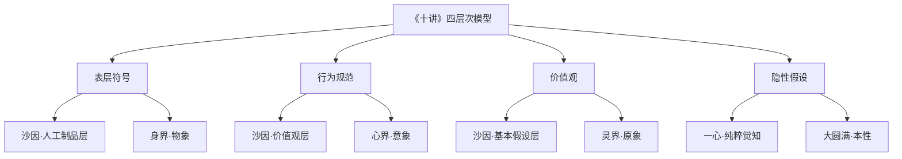

**核心洞察**：
- 《十讲》的"隐性假设" = 沙因的"基本假设" = 东方哲学的"一心"
- 四层次模型实现了西方学术界定与东方精神内核的融合

---

### 1.2 员工文化认同三阶段 × 修心路径

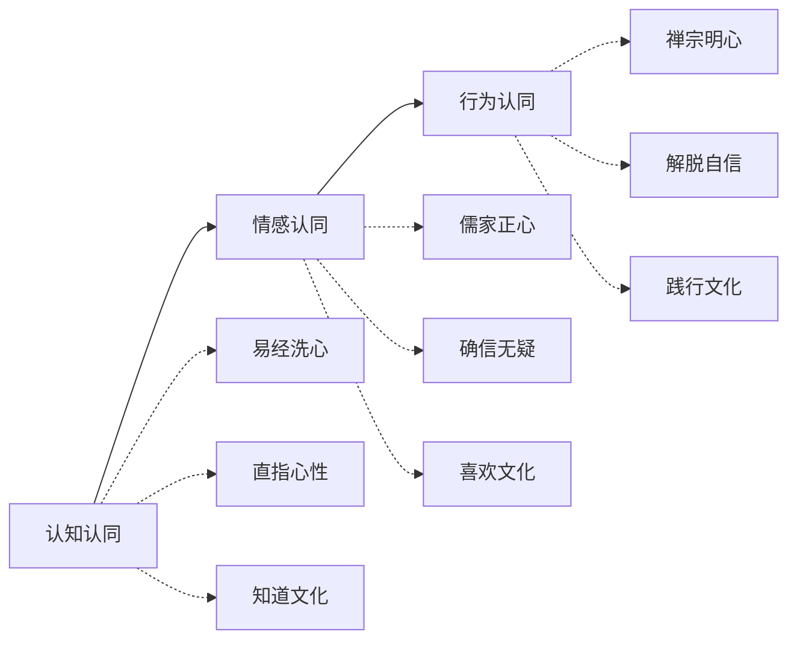

**隐秘联系**：
- 文化认同的三阶段与修心三路径完全同构
- 《十讲》的西方心理学语言与东方修行语言是同一本质的不同表达

---

### 1.3 文化-战略适配矩阵 × 五行理论

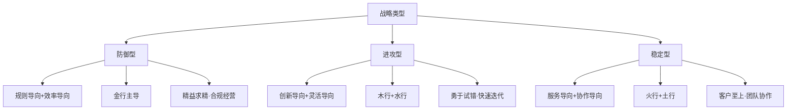

**跨域联系**：
- 战略管理的文化适配与五行人格的特质分工形成共振
- 不同战略需要不同五行特质的员工配置

---

## 二、方法论工具关联网络

### 2.1 文化诊断工具 × OD组织发展

| 《十讲》工具 | OD工具 | 五行应用 | 一心三界对应 |
|-------------|--------|---------|-------------|
| 四层次审计模型 | 六盒模型 | 五行团队诊断 | 一心三界全息 |
| 文化-人才适配诊断 | 岗位分析 | 五行识人测评 | 身心灵匹配 |
| 问题-根源-对策闭环 | 根因分析 | 五行生克分析 | 转化路径设计 |

**隐秘联系**：
- 四层次审计的"表层-行为-价值观-隐性假设"与六盒模型的六个维度形成映射
- 五行识人为文化诊断提供了人格维度的分析工具

---

### 2.2 文化落地工具 × 行为经济学

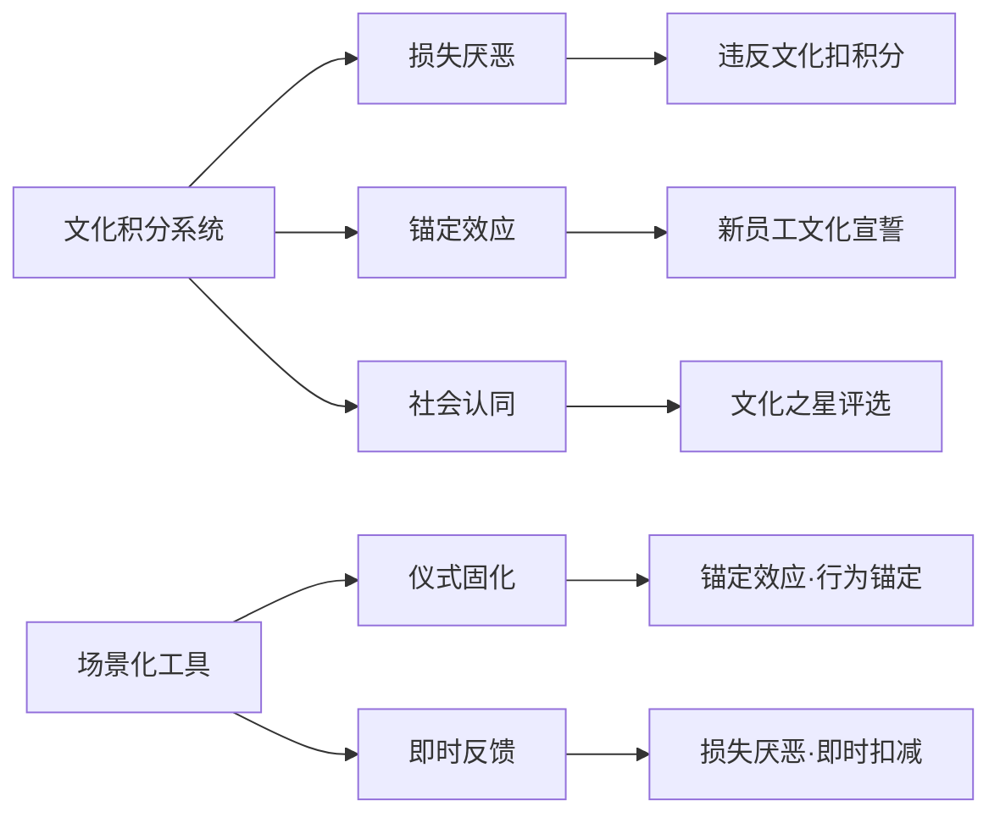

**核心洞察**：
- 文化积分系统的设计原理根植于行为经济学的三大原理
- 仪式固化的本质是"锚定效应"的行为化应用

---

### 2.3 PDCA迭代闭环 × 知行合一

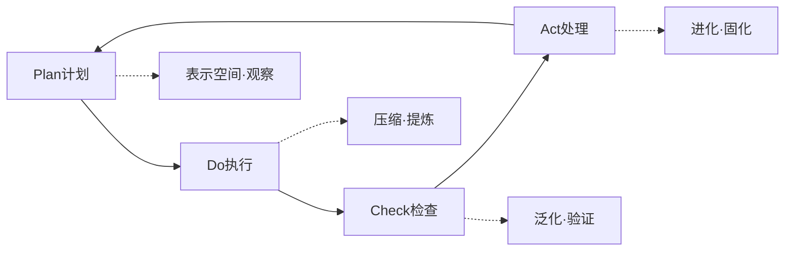

**隐秘联系**：
- PDCA的四个阶段与知行合一的三阶段形成互补
- PDCA强调"迭代"，知行合一强调"转化"，共同构成完整的文化进化机制

---

## 三、文化角色与五行关联网络

### 3.1 《十讲》文化角色 × 五行特质 × 岗位适配

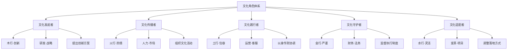

**核心洞察**：
- 文化角色的分工与五行特质形成天然适配
- 不同岗位需要不同五行特质的员工担任对应文化角色

---

### 3.2 员工社会化路径 × 五行生克

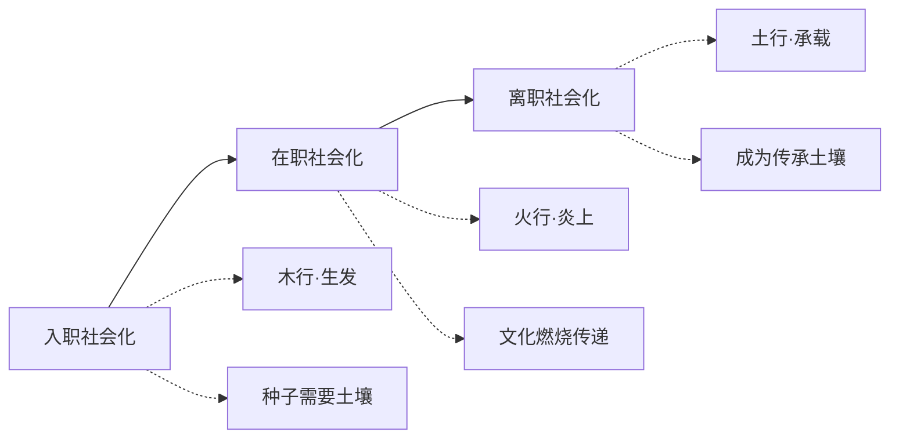

**隐秘联系**：
- 员工社会化的三阶段与五行的生克关系形成隐喻共振
- 入职如木之生发，在职如火之炎上，离职如土之承载

---

## 四、跨文化管理关联网络

### 4.1 跨文化冲突 × 差序格局 × 和而不同

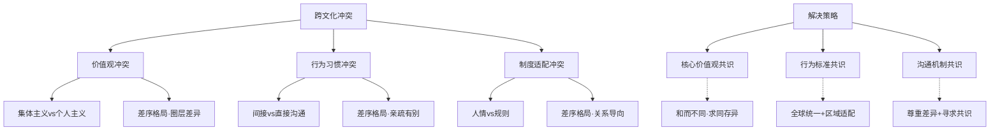

**核心洞察**：
- 跨文化冲突的本质是不同"差序格局"的碰撞
- "和而不同"的儒家智慧为跨文化管理提供了哲学基础

---

### 4.2 跨文化团队配置 × 五行互补

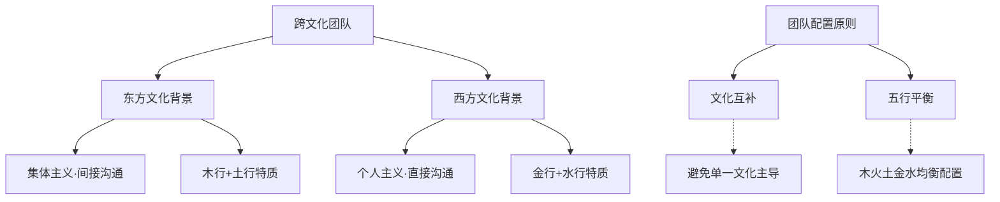

**隐秘联系**：
- 跨文化团队的理想配置是"文化互补"与"五行平衡"的统一
- 五行识人测评可用于跨文化团队的成员筛选

---

## 五、数字化文化关联网络

### 5.1 AI赋能数字化文化 × 龙心OS五大引擎

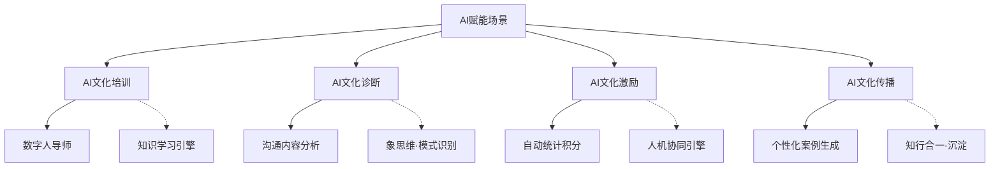

**核心洞察**：
- AI赋能的四大场景与龙心OS五大引擎形成能力映射
- 数字化文化的本质是"技术赋能+文化内核"的融合

---

### 5.2 数字化文化特征 × 三体一心

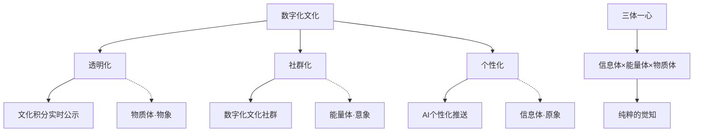

**隐秘联系**：
- 数字化文化的三大特征对应三体一心的三个层面
- 透明化=物质体，社群化=能量体，个性化=信息体

---

## 六、文化-绩效关联网络

### 6.1 文化强度指数 × 绩效指标关联模型

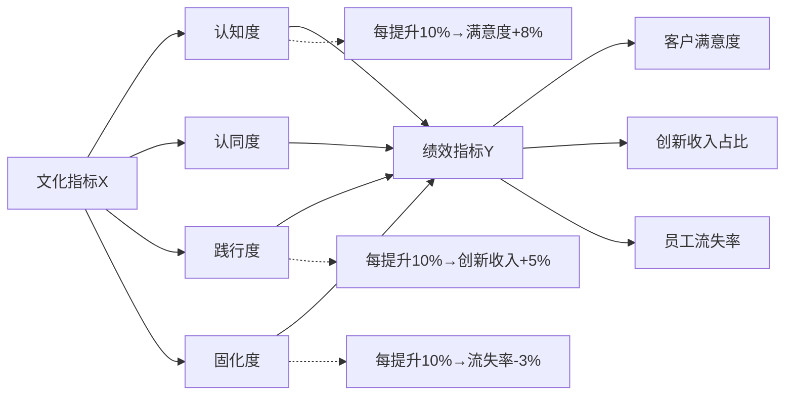

**核心洞察**：
- 文化指标与绩效指标存在量化关联
- 回归分析可计算具体的影响系数

---

## 七、知识联系总表

### 7.1 理论体系联系（20条）

| 序号 | 联系A | 联系B | 联系类型 | 核心洞察 |
|------|-------|-------|---------|---------|
| 1 | 《十讲》四层次 | 沙因三层次 | 扩展映射 | 隐性假设=基本假设 |
| 2 | 《十讲》四层次 | 一心三界 | 跨域融合 | 隐性假设=一心 |
| 3 | 员工认同三阶段 | 修心三路径 | 同构对应 | 同一本质不同表达 |
| 4 | 员工认同三阶段 | 大圆满三要 | 修行对应 | 认知=直指，情感=确信，行为=解脱 |
| 5 | 文化-战略适配 | 五行理论 | 特质映射 | 不同战略需不同五行 |
| 6 | 四层次审计 | 六盒模型 | 工具映射 | 表层=帮助，行为=关系+流程 |
| 7 | 文化-人才适配 | 五行识人 | 应用整合 | 岗位需求-员工特质匹配 |
| 8 | 问题-根源-对策 | 根因分析 | 方法对应 | 五行生克分析根因 |
| 9 | 跨文化冲突 | 差序格局 | 本质解释 | 不同差序格局的碰撞 |
| 10 | 跨文化策略 | 和而不同 | 哲学基础 | 儒家智慧的应用 |
| 11 | 文化角色分工 | 五行特质 | 天然适配 | 角色=五行特质 |
| 12 | 员工社会化 | 五行生克 | 隐喻共振 | 入职=木，在职=火，离职=土 |
| 13 | 文化积分系统 | 行为经济学 | 原理应用 | 损失厌恶+锚定+社会认同 |
| 14 | 仪式固化 | 锚定效应 | 行为应用 | 仪式=行为锚定 |
| 15 | PDCA迭代 | 知行合一 | 机制互补 | PDCA=迭代，知行合一=转化 |
| 16 | 数字化文化 | 三体一心 | 层面映射 | 透明=物质，社群=能量，个性=信息 |
| 17 | AI赋能场景 | 龙心OS引擎 | 能力映射 | AI场景=引擎能力 |
| 18 | 文化强度指数 | 绩效指标 | 量化关联 | 回归分析影响系数 |
| 19 | 文化共创 | 差序格局 | 圈层应用 | 核心-紧密-外围圈层 |
| 20 | 文化大使 | 五行角色 | 角色对应 | 大使=文化传播者=火行 |

### 7.2 工具方法联系（20条）

| 序号 | 工具A | 工具B | 整合方式 | 应用场景 |
|------|-------|-------|---------|---------|
| 21 | 四层次审计 | 五行团队诊断 | 并行使用 | 文化诊断 |
| 22 | 文化-人才适配 | 六盒模型 | 交叉验证 | 团队建设 |
| 23 | 三阶段认同 | 每日修心打卡 | 落地工具 | 行为养成 |
| 24 | 文化积分 | SMART目标 | 结合使用 | 激励设计 |
| 25 | 文化共创 | 四阶段工作坊 | 流程整合 | 文化搭建 |
| 26 | 员工委员会 | 五行角色轮换 | 机制设计 | 持续运营 |
| 27 | 3-6-9计划 | 双导师制 | 组合应用 | 新员工融入 |
| 28 | 三驱动机制 | 文化积分兑换 | 激励整合 | 老员工深化 |
| 29 | 四角色定位 | 管理者清单 | 工具配套 | 文化引领 |
| 30 | 场景对照表 | 禁止行为清单 | 组合使用 | 行为规范 |
| 31 | 三级调解 | 文化违规制度 | 制度配套 | 冲突解决 |
| 32 | 回归分析 | 文化强度指数 | 方法应用 | 效果评估 |
| 33 | PDCA | 年度迭代机制 | 流程整合 | 持续优化 |
| 34 | 跨文化培训 | 五行识人 | 内容整合 | 团队配置 |
| 35 | AI文化诊断 | 象思维 | 能力结合 | 模式识别 |
| 36 | AI文化激励 | 知行合一 | 机制结合 | 即时反馈 |
| 37 | 数字化社群 | 差序格局 | 线上映射 | 圈层传播 |
| 38 | 个性化推送 | 五行特质 | 精准匹配 | 内容分发 |
| 39 | 文化审计 | 焦点小组 | 方法组合 | 定性研究 |
| 40 | 文化定位 | SWOT分析 | 框架整合 | 战略分析 |

### 7.3 实践应用联系（28条）

| 序号 | 实践A | 实践B | 协同方式 | 效果增强 |
|------|-------|-------|---------|---------|
| 41 | 文化溯源 | 企业史梳理 | 内容整合 | 增强传承感 |
| 42 | 文化提炼 | 集体投票 | 民主参与 | 增强认同感 |
| 43 | 文化设计 | 员工参与 | 共创设计 | 增强归属感 |
| 44 | 文化试点 | 反馈收集 | 迭代优化 | 降低风险 |
| 45 | 入职礼 | 文化宣誓 | 仪式锚定 | 强化记忆 |
| 46 | 场景培训 | 角色扮演 | 体验式学习 | 提升转化率 |
| 47 | 文化导师 | 定期沟通 | 持续辅导 | 深化理解 |
| 48 | 文化提案 | 员工牵头 | 赋权参与 | 激发主动性 |
| 49 | 实时反馈 | 行为强化 | 即时激励 | 固化习惯 |
| 50 | 文化社群 | 兴趣驱动 | 自愿参与 | 提升活跃度 |
| 51 | 离职访谈 | 文化反馈 | 双向学习 | 持续改进 |
| 52 | 离职纪念 | 文化传承 | 情感连接 | 品牌延伸 |
| 53 | 校友社群 | 动态分享 | 持续触达 | 外部代言 |
| 54 | 战略目标 | 行为拆解 | 层层分解 | 确保落地 |
| 55 | 文化行为 | 流程嵌入 | 制度化 | 确保执行 |
| 56 | 流程绩效 | 挂钩机制 | 激励约束 | 确保效果 |
| 57 | 文化审计 | 差距识别 | 精准定位 | 有的放矢 |
| 58 | 文化迭代 | 过渡缓冲 | 渐进调整 | 降低震荡 |
| 59 | 文化定位 | 内外对比 | 差异竞争 | 突出特色 |
| 60 | 可视化 | 定位图 | 直观呈现 | 便于理解 |
| 61 | 分层拆解 | 岗位适配 | 精准匹配 | 提升针对性 |
| 62 | 符号设计 | 情感化 | 温度传递 | 增强共鸣 |
| 63 | 委员会 | 常态化 | 机制保障 | 持续运营 |
| 64 | 年度迭代 | 全员参与 | 民主决策 | 增强认同 |
| 65 | 3-6-9计划 | 考核通关 | 强制达标 | 确保质量 |
| 66 | 三驱动 | 多维度 | 综合激励 | 全面覆盖 |
| 67 | 四角色 | 绩效考核 | 责任绑定 | 确保执行 |
| 68 | PDCA | 闭环管理 | 持续改进 | 螺旋上升 |

---

## 八、核心洞察汇总

### 8.1 理论体系洞察（5条）

1. **四层次-三层次-一心三界的统一**：隐性假设、基本假设、一心是同一本质的不同表述
2. **三阶段认同与修心路径的同构**：文化认同与心性修炼遵循相同的进阶规律
3. **文化-战略适配的五行映射**：不同战略类型需要不同五行特质的文化支撑
4. **跨文化冲突的差序格局解释**：文化冲突本质是不同差序格局的碰撞
5. **数字化文化的三体一心映射**：透明=物质体，社群=能量体，个性=信息体

### 8.2 方法论洞察（5条）

1. **文化积分的行为经济学原理**：损失厌恶+锚定效应+社会认同的综合应用
2. **PDCA与知行合一的互补**：迭代与转化共同构成文化进化机制
3. **文化角色的五行天然适配**：发起者=木，传播者=火，践行者=土，守护者=金，适配者=水
4. **员工社会化的五行隐喻**：入职=木之生发，在职=火之炎上，离职=土之承载
5. **AI赋能与龙心OS的映射**：AI场景与五大引擎形成能力对应

### 8.3 实践应用洞察（5条）

1. **文化共创的四阶段闭环**：溯源→提炼→设计→试点，确保接地气
2. **3-6-9计划的通关设计**：认知→实践→内化，层层考核确保质量
3. **三级调解的升级机制**：同事→部门→公司，逐级升级确保公正
4. **文化-绩效的量化关联**：回归分析可计算文化投入的业务回报
5. **跨文化团队的互补配置**：文化互补+五行平衡=理想团队

---

## 九、关联文档导航

### 向上关联（理论体系）
- [[企业文化十讲(精)·深度学习主文档]] - 本图谱的理论基础
- [[企业文化OS知识库]] - 企业文化理论体系总览
- [[企业文化全息体系]] - 迪尔与沙因理论融合

### 平行关联（方法论）
- [[五行人格心理学OS]] - 五行识人应用体系
- [[差序格局与组织管理]] - 中国传统关系理论
- [[大圆满心文化]] - 修心为本的文化哲学
- [[行为经济学应用]] - 文化激励的心理学基础
- [[知行合一]] - 文化进化的转化机制
- [[象思维]] - 文化模式的直觉识别

### 向下关联（实践案例）
- [[企业文化十讲(精)·实操工具包]] - 可直接复用的工具
- [[XX企业文化手册·深度学习]] - 实战案例
- [[企业家精神·张维迎深度学习]] - 企业家与文化的共生

---

## 十、标签体系

### 知识图谱专属标签
#知识图谱 #跨域联系 #隐秘关联 #理论体系 #方法论 #实践应用

### 联系类型标签
#同构对应 #跨域融合 #工具映射 #原理应用 #机制互补 #隐喻共振

### 领域标签
#企业文化十讲 #沙因模型 #五行理论 #差序格局 #心文化 #行为经济学 #知行合一 #龙心OS

---

**图谱状态**：✅ 已完成68条知识联系挖掘
**图谱类型**：多维度关联网络
**维护者**：龙龟神将
**更新日期**：2026-04-11
