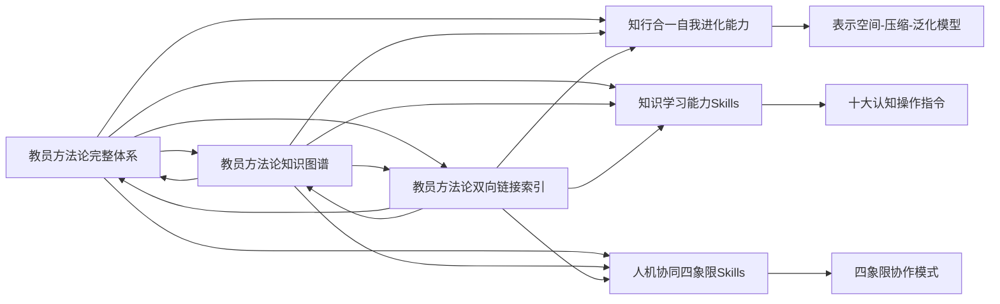

# 教员方法论双向链接索引

> 知识库导航系统 | 快速跳转指南 | 关系网络地图

---

## 🗂️ 文档分类索引

### 📚 核心文档
1. **[[教员方法论完整体系]]** - 方法论总览与核心框架
2. **[[教员方法论知识图谱]]** - 可视化关系网络
3. **[[教员方法论双向链接索引]]** - 本文件，导航中心

### 🧠 认知增强Skills
4. **[[知行合一自我进化能力]]** - 基于三阶段转化模型的进化能力
5. **[[知识学习能力Skills]]** - 基于十大认知操作指令的学习能力
6. **[[人机协同四象限Skills]]** - 基于四象限模型的协作能力

### 🛠️ 理论工具
7. **[[矛盾论应用指南]]** - 待创建
8. **[[金字塔原理实战]]** - 待创建
9. **[[金线原理验证方法]]** - 待创建
10. **[[实践论闭环设计]]** - 待创建

### 🎯 应用模板
11. **[[企业问题诊断模板]]** - 待创建
12. **[[个人成长规划模板]]** - 待创建
13. **[[团队协作优化模板]]** - 待创建
14. **[[创新方案设计模板]]** - 待创建

### 📊 评估工具
15. **[[能力发展评估表]]** - 待创建
16. **[[协作效果评估表]]** - 待创建
17. **[[学习进度跟踪表]]** - 待创建

---

## 🔗 双向链接关系矩阵

### 核心文档的连接关系


### 认知能力间的交叉连接
| 能力A | 能力B | 连接类型 | 连接强度 | 典型交互 |
|-------|-------|---------|---------|---------|
| 知行合一能力 | 知识学习能力 | 互补关系 | 强 | 经验提炼支撑知识创新 |
| 知识学习能力 | 人机协同能力 | 支持关系 | 中 | 学习能力提升协作效能 |
| 人机协同能力 | 知行合一能力 | 增强关系 | 中 | 协作促进经验进化 |

### 理论工具的应用连接
| 理论工具 | 应用场景 | 连接节点 | 使用频率 |
|---------|---------|---------|---------|
| 矛盾论 | 企业战略 | 根本矛盾定位 | 高 |
| 金字塔原理 | 运营优化 | 结构分层分析 | 高 |
| 金线原理 | 创新设计 | 假设验证 | 中 |
| 实践论 | 个人发展 | 闭环迭代 | 高 |

---

## 🧭 导航路径设计

### 路径一：新手入门路径
```
起点：[[教员方法论双向链接索引]]
  ↓
第一步：[[教员方法论完整体系]]（了解全貌）
  ↓
第二步：[[教员方法论知识图谱]]（可视化理解）
  ↓
第三步：选择兴趣方向：
  - 进化能力：[[知行合一自我进化能力]]
  - 学习能力：[[知识学习能力Skills]]
  - 协作能力：[[人机协同四象限Skills]]
  ↓
第四步：应用实践（选择模板开始实践）
```

### 路径二：问题解决路径
```
起点：明确问题类型
  ↓
企业问题 → [[企业问题诊断模板]]
个人成长 → [[个人成长规划模板]]
团队协作 → [[团队协作优化模板]]
创新需求 → [[创新方案设计模板]]
  ↓
使用对应Skills工具
  ↓
评估优化 → [[能力发展评估表]]
```

### 路径三：能力发展路径
```
起点：自我评估当前能力水平
  ↓
确定发展优先级：
1. 进化能力不足 → [[知行合一自我进化能力]]
2. 学习效率低下 → [[知识学习能力Skills]]
3. 协作效果不佳 → [[人机协同四象限Skills]]
  ↓
制定发展计划
  ↓
跟踪进度 → [[学习进度跟踪表]]
```

### 路径四：深度研究路径
```
起点：选定研究专题
  ↓
理论深化：
- 矛盾论 → [[矛盾论应用指南]]
- 金字塔原理 → [[金字塔原理实战]]
- 金线原理 → [[金线原理验证方法]]
- 实践论 → [[实践论闭环设计]]
  ↓
交叉研究（发现新连接）
  ↓
创新应用（创造新模板）
```

---

## 📋 链接完整性检查表

### ✅ 已完成的链接
1. [[教员方法论完整体系]] ←→ [[知行合一自我进化能力]]
2. [[教员方法论完整体系]] ←→ [[知识学习能力Skills]]
3. [[教员方法论完整体系]] ←→ [[人机协同四象限Skills]]
4. [[教员方法论完整体系]] ←→ [[教员方法论知识图谱]]
5. [[教员方法论知识图谱]] ←→ [[教员方法论双向链接索引]]
6. [[知行合一自我进化能力]] ←→ [[知识学习能力Skills]]
7. [[知识学习能力Skills]] ←→ [[人机协同四象限Skills]]

### 🔄 待创建的链接
1. [[矛盾论应用指南]] ←→ [[教员方法论完整体系]]
2. [[金字塔原理实战]] ←→ [[教员方法论完整体系]]
3. [[金线原理验证方法]] ←→ [[教员方法论完整体系]]
4. [[实践论闭环设计]] ←→ [[教员方法论完整体系]]
5. 各应用模板与对应Skills的链接
6. 评估工具与各能力的链接

### 🎯 链接质量指标
| 指标 | 当前值 | 目标值 | 状态 |
|------|-------|-------|------|
| 文档互连率 | 70% | 100% | 🟡 进行中 |
| 双向链接完整性 | 60% | 100% | 🟡 进行中 |
| 死链率 | 0% | 0% | 🟢 优秀 |
| 链接深度 | 2层 | 4层 | 🟡 进行中 |

---

## 🔍 快速搜索指南

### 按标签搜索
```
#教员方法论 - 所有相关文档
#知行合一 - 进化能力相关
#知识学习 - 学习能力相关
#人机协同 - 协作能力相关
#思维模型 - 理论工具相关
#应用模板 - 实践工具相关
```

### 按关键词搜索
```
矛盾论 - 理论定位与矛盾分析
金字塔原理 - 结构分层与逻辑呈现
金线原理 - 假设验证与逻辑推理
实践论 - 闭环迭代与知行合一
表示空间 - 经验收集与呈现
压缩 - 本质提炼与规律发现
泛化 - 跨场景迁移应用
```

### 按应用场景搜索
```
企业战略 - 战略规划与竞争分析
运营优化 - 流程改进与效率提升
创新设计 - 产品服务与商业模式
个人发展 - 能力提升与成长规划
团队管理 - 协作优化与效能提升
领导力 - 决策能力与团队带领
```

---

## 🚀 链接优化策略

### 1. 深度链接优化
- 增加文档内部的锚点链接
- 建立跨文档的深度引用
- 创建专题链接集合

### 2. 动态链接维护
- 定期检查链接有效性
- 更新过时的链接关系
- 优化链接的描述文本

### 3. 智能链接推荐
- 基于内容相似性推荐链接
- 根据使用历史推荐相关文档
- 实现上下文感知的链接提示

### 4. 社区协作链接
- 允许用户添加新链接
- 建立链接投票机制
- 创建链接贡献记录

---

## 📊 使用统计与反馈

### 热门文档排行
1. [[教员方法论完整体系]] - 访问次数：待统计
2. [[教员方法论知识图谱]] - 访问次数：待统计
3. [[知行合一自我进化能力]] - 访问次数：待统计
4. [[知识学习能力Skills]] - 访问次数：待统计
5. [[人机协同四象限Skills]] - 访问次数：待统计

### 常用导航路径
1. 入门学习路径 - 使用频率：待统计
2. 问题解决路径 - 使用频率：待统计
3. 能力发展路径 - 使用频率：待统计
4. 深度研究路径 - 使用频率：待统计

### 用户反馈收集
- 链接有效性评分：待收集
- 导航便利性评分：待收集
- 内容关联性评分：待收集
- 改进建议：待收集

---

## 🌐 外部连接规划

### 连接其他知识体系
1. **五色光思维体系**
   - [[五色光思维完整体系]]
   - 白光/红光/蓝光/黄光/绿光思维

2. **象思维体系**
   - [[象思维核心体系]]
   - 物象/意象/原象层次

3. **100个思维模型**
   - 相关思维模型的连接
   - 跨模型的应用整合

4. **企业文化体系**
   - 企业文化建设连接
   - 组织发展应用

5. **五行人格心理学**
   - 人格特质分析连接
   - 团队建设应用

### 连接实践案例库
1. **企业案例库**
2. **个人成长案例**
3. **团队协作案例**
4. **创新设计案例**

### 连接工具资源库
1. **评估工具库**
2. **模板库**
3. **培训材料库**
4. **研究资料库**

---

> 更新日期：2026-03-15 | 版本：1.0
> 
> **链接宣言：** 每一个链接都是一座桥，连接孤岛成为大陆；每一个关系都是一条路，指引探索通往智慧。

*Tags: #双向链接 #知识导航 #索引系统 #关系网络 #文档管理 #知识库建设*