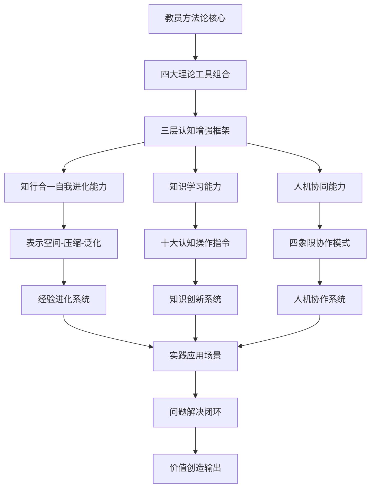

# 教员方法论完整体系

> 来源：WorkBuddy记忆系统沉淀 | 更新日期：2026-03-14

---

## 🎯 核心定位

教员方法论是一套**企业问题的"全流程手术方案"**，是一套系统性问题解决框架。（原教员方法论）

**核心公式：**
> 矛盾论（定位本质）× 金字塔原理（结构分层）× 金线原理（逻辑验证）× 实践论（闭环迭代）

---

## 🏗️ 融合理论体系

| 理论工具 | 功能 |
|---------|------|
| **矛盾论** | 定位问题本质，识别根本矛盾 |
| **金字塔原理** | 结构化分层，逻辑清晰呈现 |
| **金线原理** | 逻辑验证，确保论证有效 |
| **实践论** | 闭环迭代，知行合一落地 |
| **三维动态结构** | 物质体×能量体×信息体 |

---

## 📐 矛盾层次定位

### 四个矛盾层次

```
根本矛盾（系统层面结构性失衡）
    ↓
阶段矛盾（发展周期动态矛盾）
    ↓
主要矛盾（当前阶段决定性矛盾）
    ↓
矛盾主次方面（矛盾内部主导方与从属方）
```

### 六大矛盾维度

| 维度 | 关注重点 |
|------|---------|
| **个人** | 操作者技能与责任 |
| **部门** | 协作流程效率 |
| **店面** | 本地化执行 |
| **公司** | 战略资源匹配 |
| **行业** | 竞争格局 |
| **时代** | 政策技术影响 |

---

## ⚙️ 三维动力机制（矛盾内部结构）

```
┌─────────────────────────────────────┐
│          三维动力机制                 │
│                                     │
│  物质体    ←→    能量体    ←→    信息体  │
│ (食材/设备/资金) (团队/流程) (战略/文化/数据) │
│                                     │
│  任一维度变动超±15% → 引发矛盾运动      │
└─────────────────────────────────────┘
```

### 三维说明

- **物质体**：食材、设备、资金等有形资源
- **能量体**：团队执行力、流程效率等运营能力
- **信息体**：战略方向、企业文化、数据系统等信息资源

**关键阈值：** 任一维度变动超过 ±15%，即引发矛盾运动

---

## 🔄 主次矛盾转化条件

| 转化方向 | 触发条件（示例） |
|---------|----------------|
| 次要矛盾 → 主要矛盾 | 数据阈值突破，如客诉率连续3月 > 15% |
| 主要方面 → 次要方面 | 技术突破，如AI品控覆盖率 > 99.9% |

---

## 🛤️ 问题解决路径

```
① 假设驱动（感性）
        ↓
② 事实验证（理性，相关系数 > 0.7）
        ↓
③ 动态执行（实践）
        ↓
④ 市场检验（闭环，监测复购率↑20% & 损耗率↓至5%）
```

---

## 📋 实战应用模板

```markdown
## 教员方法论分析模板

### 1. 根本矛盾（三维结构定性描述）
- 物质体状态：___
- 能量体状态：___
- 信息体状态：___

### 2. 阶段定位
- [ ] 初创期
- [ ] 扩张期
- [ ] 成熟期
- [ ] 转型期

### 3. 当前主矛盾
- 主矛盾所在维度：物质体 / 能量体 / 信息体
- 矛盾主要方面：___
- 矛盾次要方面：___

### 4. 转化预警
- 监控指标：___
- 阈值设定：___
- 预警信号：___

### 5. 行动方案
- 物质体措施：___
- 能量体措施：___
- 信息体措施：___
```

---

## 🏛️ 三层认知增强框架Skills体系

### 第一层：知行合一自我进化能力Skills
基于"表示空间-压缩-泛化"三阶段转化模型，实现经验的系统化进化。

**核心能力：**
- 表示空间构建：全面收集与呈现原始经验
- 本质压缩提炼：从复杂信息中提取规律
- 跨场景泛化应用：将本质迁移到新情境

**关联文件：** [[知行合一自我进化能力]]

### 第二层：知识学习能力Skills
系统性的学习方法，基于十大认知操作指令。

**十大认知操作指令：**
1. 洞察 - 穿透表象发现本质
2. 剖析 - 系统分解理解结构
3. 透视 - 多角度全面观察
4. 阐释 - 意义建构价值赋予
5. 推演 - 逻辑推理预测结果
6. 解构 - 打破框架重新组合
7. 思辨 - 批判评估理性判断
8. 溯源 - 追根溯源理解脉络
9. 融合 - 整合信息创造新知
10. 启发 - 激发创意促进创新

**关联文件：** [[知识学习能力Skills]]

### 第三层：人机协同四象限Skills
基于任务复杂度与能力匹配度的四种协作模式。

**四象限模型：**
- 高效助理模式：低AI需求 × 低人类参与
- 知识导师模式：高AI需求 × 低人类参与
- 学习型助手模式：低AI需求 × 高人类参与
- 共创合伙人模式：高AI需求 × 高人类参与

**关联文件：** [[人机协同四象限Skills]]

---

## 🔗 关联文件体系

### 基础理论工具
- [[五色光思维完整体系]] - 教员方法论的基础思维工具
- [[象思维核心体系]] - 方法论中0→1的创新来源

### 核心能力Skills
- [[知行合一自我进化能力]] - 基于三阶段转化模型的进化能力
- [[知识学习能力Skills]] - 基于认知操作指令的学习能力
- [[人机协同四象限Skills]] - 基于四象限模型的协作能力

### 实践应用
- [[知行合一三阶段转化模型]] - 方法论落地的转化路径
- 企业实战案例库 - 具体应用场景与解决方案

---

## 🔄 系统协同逻辑



---

## 📌 核心价值

> 教员方法论不是诊断书，而是**手术方案** —— 从定位矛盾到闭环验证，形成完整的问题解决闭环。

> 三层认知增强框架是**进化引擎** —— 从个人能力提升到人机协同，实现系统的持续进化。

> Skills体系是**可执行工具** —— 将理论转化为可操作、可复制、可评估的实践能力。

---

## 🚀 应用前景

### 1. 个人层面
- 构建个人认知增强系统
- 提升问题解决与创新能力
- 实现持续自我进化

### 2. 团队层面
- 建立团队协同思维框架
- 提升团队学习与创新能力
- 优化人机协作效能

### 3. 组织层面
- 构建组织级问题解决体系
- 建立学习型组织基础设施
- 实现数字化转型与智能化升级

### 4. 教育层面
- 开发新一代思维训练课程
- 构建AI时代的认知教育体系
- 培养未来需要的复合型人才

---

*Tags: #思维模型 #教员方法论 #矛盾论 #问题解决 #认知增强 #自我进化 #知识学习 #人机协同 #Skills体系 #企业诊断*

*更新日期：2026-03-15 | 版本：2.0（完整Skills体系版）*
