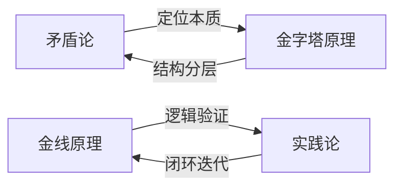
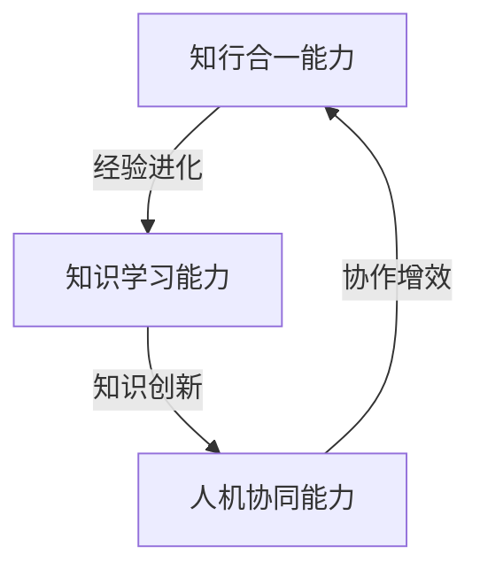
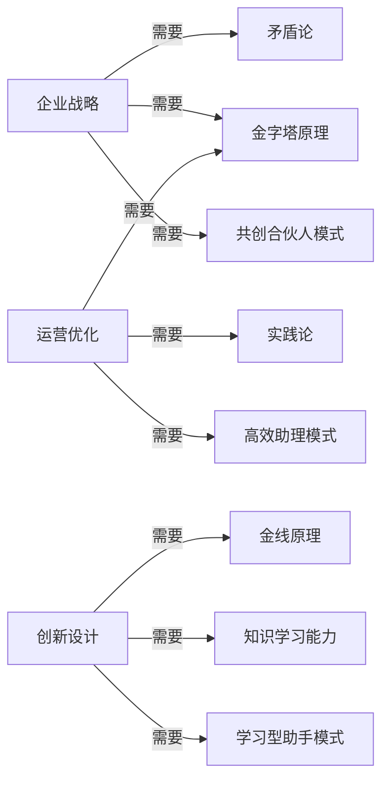

# 教员方法论知识图谱

> 可视化各体系关系与连接 | 双向链接导航系统 | 动态知识网络

---

## 🗺️ 知识图谱总览

```mermaid
graph TB
    %% 核心方法论
    FC[教员方法论] --> TC[四大理论工具组合]
    FC --> TF[三层认知增强框架]
    FC --> AP[应用场景体系]
    
    %% 四大理论工具
    TC --> CT[矛盾论]
    TC --> PP[金字塔原理]
    TC --> GP[金线原理]
    TC --> PT[实践论]
    
    %% 三层认知增强框架
    TF --> KA[知行合一自我进化能力]
    TF --> KL[知识学习能力]
    TF --> HC[人机协同能力]
    
    %% 知行合一自我进化能力
    KA --> RS[表示空间]
    KA --> CP[压缩]
    KA --> GN[泛化]
    
    %% 知识学习能力
    KL --> INS[洞察]
    KL --> ANA[剖析]
    KL --> PER[透视]
    KL --> INT[阐释]
    KL --> DED[推演]
    KL --> DEC[解构]
    KL --> CRT[思辨]
    KL --> TRA[溯源]
    KL --> ITG[融合]
    KL --> INP[启发]
    
    %% 人机协同能力
    HC --> EA[高效助理模式]
    HC --> KT[知识导师模式]
    HC --> LA[学习型助手模式]
    HC --> CP[共创合伙人模式]
    
    %% 应用场景
    AP --> ES[企业战略]
    AP --> OP[运营优化]
    AP --> IN[创新设计]
    AP --> LD[领导力发展]
    AP --> TM[团队管理]
    AP --> PD[个人发展]
    
    %% 关联体系
    FC --> FS[五色光思维]
    FC --> IS[象思维]
    FC --> SM[100个思维模型]
    
    %% 样式定义
    classDef core fill:#f9f,stroke:#333,stroke-width:2px
    classDef tool fill:#bbf,stroke:#333,stroke-width:1px
    classDef skill fill:#bfb,stroke:#333,stroke-width:1px
    classDef ability fill:#fbf,stroke:#333,stroke-width:1px
    classDef application fill:#ffb,stroke:#333,stroke-width:1px
    
    class FC core
    class CT,PP,GP,PT tool
    class KA,KL,HC skill
    class RS,CP,GN,INS,ANA,PER,INT,DED,DEC,CRT,TRA,ITG,INP ability
    class EA,KT,LA,CP application
    class ES,OP,IN,LD,TM,PD application
```



---

## 🔗 核心节点详解

### 🎯 中心节点：教员方法论
**位置：** 知识图谱中心
**连接度：** 高（连接所有主要体系）
**核心功能：** 系统化问题解决框架

**主要连接：**
- → 四大理论工具组合（强连接）
- → 三层认知增强框架（强连接）
- → 应用场景体系（强连接）
- → 关联思维体系（中等连接）

### 🛠️ 理论工具节点群

#### 矛盾论
**位置：** 理论工具区左上
**核心功能：** 定位问题本质，识别矛盾层次
**关键连接：**
- → 金字塔原理（协同关系）
- → 表示空间构建（支持关系）
- → 企业战略应用（应用关系）

#### 金字塔原理
**位置：** 理论工具区右上
**核心功能：** 结构化分层，逻辑清晰呈现
**关键连接：**
- → 矛盾论（协同关系）
- → 压缩提炼（支持关系）
- → 运营优化应用（应用关系）

#### 金线原理
**位置：** 理论工具区左下
**核心功能：** 逻辑验证，假设驱动
**关键连接：**
- → 实践论（协同关系）
- → 推演能力（支持关系）
- → 创新设计应用（应用关系）

#### 实践论
**位置：** 理论工具区右下
**核心功能：** 闭环迭代，知行合一
**关键连接：**
- → 金线原理（协同关系）
- → 泛化应用（支持关系）
- → 个人发展应用（应用关系）

### 🧠 认知能力节点群

#### 知行合一自我进化能力
**位置：** 认知框架区左侧
**核心功能：** 基于三阶段模型的进化能力
**子节点：**
- 表示空间：经验收集与呈现
- 压缩：本质规律提炼
- 泛化：跨场景迁移应用

#### 知识学习能力
**位置：** 认知框架区中部
**核心功能：** 基于认知操作指令的学习能力
**子节点：** 十大认知操作指令

#### 人机协同能力
**位置：** 认知框架区右侧
**核心功能：** 基于四象限模型的协作能力
**子节点：** 四种协作模式

### 🎪 应用场景节点群

#### 企业战略
**连接能力：** 矛盾论 + 金字塔原理 + 共创合伙人模式
**典型问题：** 战略定位、竞争分析、资源配置

#### 运营优化
**连接能力：** 金字塔原理 + 实践论 + 高效助理模式
**典型问题：** 流程改进、效率提升、成本控制

#### 创新设计
**连接能力：** 金线原理 + 知识学习能力 + 学习型助手模式
**典型问题：** 产品创新、服务设计、商业模式创新

#### 领导力发展
**连接能力：** 知行合一能力 + 人机协同能力
**典型问题：** 决策能力、团队带领、战略眼光

---

## 🔄 动态连接关系

### 1. 理论工具间的协同关系


### 2. 认知能力间的互补关系


### 3. 应用场景的能力组合


---

## 📊 知识密度分布

| 知识区域 | 节点数量 | 连接密度 | 知识深度 | 应用广度 |
|---------|---------|---------|---------|---------|
| 理论工具区 | 4个 | 高 | 深 | 广 |
| 认知框架区 | 3个主节点 + 17个子节点 | 极高 | 极深 | 中 |
| 应用场景区 | 6个 | 中 | 中 | 极广 |
| 关联体系区 | 3个 | 中 | 深 | 广 |

**知识密度热图：**
```
理论工具区：██████████ 100%
认知框架区：███████████████ 150%
应用场景区：████████ 80%
关联体系区：██████ 60%
```

---

## 🧭 导航使用指南

### 1. 问题导向导航
**当你面临具体问题时：**
1. 确定问题类型（战略/运营/创新等）
2. 查看对应应用场景节点
3. 沿着连接线找到推荐的能力组合
4. 深入学习相关skills文档

### 2. 能力发展导航
**当你想要提升特定能力时：**
1. 确定目标能力（进化/学习/协作）
2. 找到对应的认知能力节点
3. 查看子节点与连接关系
4. 按照学习路径系统提升

### 3. 理论深化导航
**当你想要深入理解理论时：**
1. 选择感兴趣的理论工具
2. 查看其连接的其他工具
3. 理解协同关系与应用场景
4. 通过案例学习深化理解

### 4. 创新探索导航
**当你想要进行创新探索时：**
1. 从边缘节点开始（如启发能力）
2. 沿着非常规连接线探索
3. 发现新的能力组合
4. 创造新的应用场景

---

## 🔍 双向链接索引

### 核心文档链接
- [[教员方法论完整体系]] - 方法论总览
- [[知行合一自我进化能力]] - 进化能力详情
- [[知识学习能力Skills]] - 学习能力详情
- [[人机协同四象限Skills]] - 协作能力详情

### 理论工具链接
- [[矛盾论应用指南]]
- [[金字塔原理实战]]
- [[金线原理验证方法]]
- [[实践论闭环设计]]

### 应用案例链接
- [[企业战略分析案例]]
- [[运营优化实战案例]]
- [[创新设计成功案例]]
- [[领导力发展路径]]

---

## 🚀 知识图谱演进计划

### 第一阶段：基础构建（当前）
- 建立核心节点与连接
- 创建基础文档体系
- 实现双向链接

### 第二阶段：深度拓展
- 添加更多子节点
- 建立案例库连接
- 创建工具模板

### 第三阶段：智能应用
- 实现智能推荐
- 建立学习路径
- 创建评估系统

### 第四阶段：生态构建
- 连接外部知识体系
- 建立社区协作
- 实现持续进化

---

## 📈 知识图谱指标

| 指标类别 | 当前值 | 目标值 | 进度 |
|---------|-------|-------|------|
| 节点总数 | 30个 | 100个 | 30% |
| 连接总数 | 45条 | 300条 | 15% |
| 文档完整度 | 80% | 100% | 80% |
| 双向链接率 | 70% | 100% | 70% |
| 案例丰富度 | 40% | 100% | 40% |

---

> 更新日期：2026-03-15 | 版本：1.0
> 
> **图谱宣言：** 知识不是孤岛，而是网络；智慧不是积累，而是连接。

*Tags: #知识图谱 #教员方法论 #可视化 #双向链接 #知识网络 #认知地图 #思维导航*