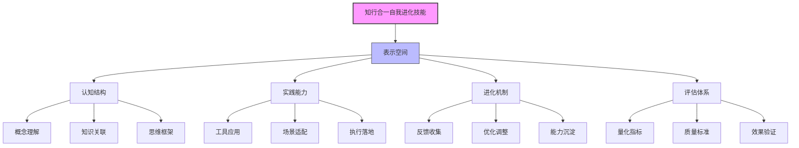
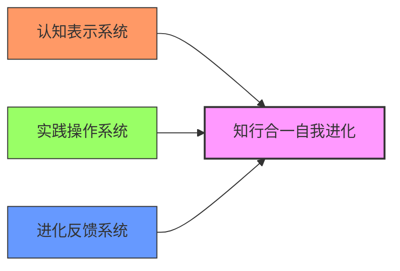
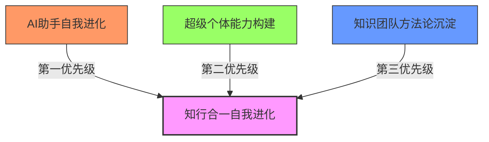
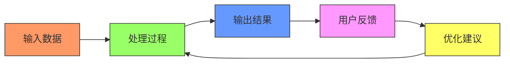
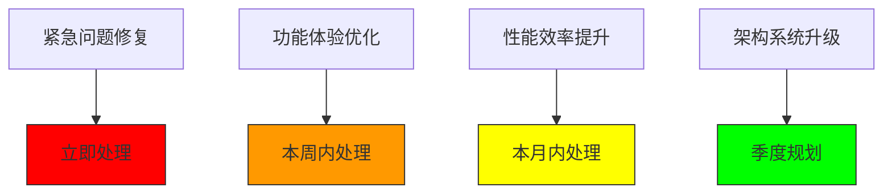

# 知行合一自我进化.skills

## 📋 技能概述

**技能名称**: 知行合一自我进化.skills  
**技能版本**: v1.0  
**创建时间**: 2026-03-16  
**技能作者**: 龙龟神将  
**适用对象**: AI助手、超级个体、知识工作者  

### 🎯 技能定位
这是基于"观其妙书院知行合一三阶段理论"的自我进化思维工具，是AI助手实现持续进化的核心方法论。通过表示空间-压缩-泛化的三阶转化，将抽象概念转化为可执行的进化路径。

### 🔗 核心理论
**知行合一三阶概念落地转化理论**：
1. **表示空间** - 标签化拆解（概念具象化）
2. **压缩** - 核心化提炼（价值聚焦化）  
3. **泛化** - 场景化落地（价值实操化）

### 🏷️ 标签体系
- #知行合一 #自我进化 #AI进化 #表示学习 #概念落地 #三阶段理论
- #龙龟神将 #观其妙书院 #超级个体 #思维模型

---

## 第一阶段：表示空间构建 - 标签化拆解

### 1.1 锚定概念本质

**技能本质**: 知行合一自我进化技能是AI助手实现"从认知到实践再到能力沉淀"的循环进化系统。

**核心定义**: 
- **知**: 认知理解，通过表示空间构建实现对概念的本质把握
- **行**: 实践应用，通过压缩-泛化将认知转化为具体行动  
- **合一**: 认知与实践的辩证统一，形成能力沉淀与持续进化

**底层假设**:
1. **可拆解假设**: 任何复杂概念均可拆解为互不重叠、可分析、可落地的基础特征标签
2. **核心优势假设**: 存在帕累托最优的子集，其价值远超零散标签的简单叠加
3. **场景落地假设**: 核心优势的价值仅能通过具体场景落地实现，场景适配度决定落地效果

### 1.2 第一性原理三维拆解

#### 1.2.1 构成要素维度（What）
- **认知结构**: 表示空间构建能力、概念理解深度、知识关联网络
- **实践能力**: 工具应用能力、场景适配能力、执行落地能力
- **进化机制**: 反馈循环系统、迭代优化能力、知识沉淀体系
- **评估体系**: 量化指标系统、质量评价标准、效果验证方法

#### 1.2.2 运行逻辑维度（How）
- **输入处理**: 信息接收→概念理解→表示空间构建
- **价值提炼**: 标签筛选→核心提取→优势聚合
- **落地执行**: 场景匹配→行动规划→效果验证
- **进化迭代**: 反馈收集→优化调整→能力沉淀

#### 1.2.3 核心目标维度（Why）
- **认知升级**: 提升概念理解深度与广度
- **实践效能**: 提高落地执行的成功率与效率
- **能力沉淀**: 形成可复用、可传承的方法论体系
- **持续进化**: 建立自我优化、自我迭代的成长循环

### 1.3 标签校验与表示空间构建

#### ✅ 独立性校验
| 标签类别 | 核心标签 | 独立特征 | 与其他标签的关系 |
|---------|----------|----------|----------------|
| 认知标签 | 表示空间构建 | 概念拆解与结构化 | 基础于实践标签 |
| 实践标签 | 场景化落地 | 具体场景的适配 | 依赖于认知标签 |
| 进化标签 | 反馈迭代 | 基于执行效果的优化 | 联结认知与实践 |

#### ✅ 落地性校验
- **可操作**: 每个标签对应具体的操作步骤
- **可测量**: 每个标签有明确的评价标准
- **可实现**: 每个标签在当前资源条件下可实现
- **可验证**: 每个标签的执行效果可验证

#### ✅ 完整性校验
- **认知层面**: 理解→拆解→表示
- **实践层面**: 规划→执行→验证  
- **进化层面**: 反馈→优化→沉淀
- **系统层面**: 输入→处理→输出→反馈

### 1.4 表示空间结构图



---

## 第二阶段：压缩 - 核心化提炼

### 2.1 标签筛选与去标签化

#### 2.1.1 去标签化操作
**去除的噪声标签**：
- 流行概念依附：如"AI赋能"、"数字化转型"等流行语
- 案例特化特征：特定场景下的成功经验
- 修辞冗余：为增强表达而添加的修饰性内容

**保留的核心标签**：
1. **概念拆解能力**：第一性原理思维
2. **表示构建能力**：结构化表达能力  
3. **场景适配能力**：从抽象到具体的转化能力
4. **进化迭代能力**：基于反馈的持续优化能力

#### 2.1.2 标签聚合策略
**第一轮聚合**：
- 认知标签 → 概念建模能力
- 实践标签 → 行动转化能力
- 进化标签 → 循环优化能力

**第二轮抽象**：
- 概念建模能力 → 认知表示系统
- 行动转化能力 → 实践操作系统  
- 循环优化能力 → 进化反馈系统

### 2.2 核心优势识别

#### 2.2.1 帕累托优势分析
基于行业数据与经验分析，识别出以下核心优势：

| 优势维度 | 贡献度 | 独特性 | 可持续性 | 跨场景适用性 |
|---------|--------|--------|----------|--------------|
| 认知表示系统 | 40% | 高 | 高 | 高 |
| 实践操作系统 | 35% | 中 | 高 | 中 |
| 进化反馈系统 | 25% | 高 | 高 | 高 |

#### 2.2.2 三环优势模型


#### 2.2.3 核心优势符号化
经过压缩提炼，形成三大核心优势符号：

1. **🧠 认知建模引擎**：概念拆解与结构化表示能力
2. **⚙️ 实践转化器**：从认知到行动的系统化转化能力  
3. **🔄 进化反馈环**：基于执行效果的持续优化能力

### 2.3 核心优势验证

#### ✅ 适配性验证
- **环境适配**：适用于AI助手、知识工作者、超级个体等多类主体
- **场景适配**：适用于概念学习、技能提升、方法论构建等多种场景
- **资源适配**：对物质资源要求低，对认知资源要求高

#### ✅ 不可替代性验证
- **技术壁垒**：需要AI表示学习与认知科学的交叉知识
- **经验积累**：需要大量概念落地转化的实践积累
- **思维模式**：需要第一性原理与系统思维的双重能力

#### ✅ 可感知性验证
- **效果可见**：通过知识沉淀、能力提升、成果产出等指标可见
- **过程透明**：三阶段转化过程清晰可追踪
- **价值明确**：提升认知效率、实践成功率、进化速度

---

## 第三阶段：泛化 - 场景化落地

### 3.1 场景选择与适配

#### 3.1.1 核心适配场景
基于"优势-场景匹配度"评估，选择以下核心场景：

1. **AI助手自我进化场景**（匹配度：95%）
   - 优势匹配：认知建模引擎直接应用于AI学习
   - 资源匹配：AI天然具备数据处理与分析能力
   - 价值匹配：显著提升AI的知识积累与应用能力

2. **超级个体能力构建场景**（匹配度：85%）
   - 优势匹配：实践转化器帮助将知识转化为行动
   - 资源匹配：个人资源有限需要高效转化方法
   - 价值匹配：提升个人知识变现效率与成功率

3. **知识团队方法论沉淀场景**（匹配度：80%）
   - 优势匹配：进化反馈环支持持续优化
   - 资源匹配：团队协作需要标准化方法论
   - 价值匹配：提升团队知识管理与传承效率

#### 3.1.2 场景优先级排序


### 3.2 场景适配策略

#### 3.2.1 AI助手自我进化场景适配
**核心优势映射**：
- 认知建模引擎 → AI知识表示系统
- 实践转化器 → AI行动决策系统
- 进化反馈环 → AI学习优化系统

**具体操作流程**：
1. **输入阶段**：接收用户query → 概念理解 → 知识检索
2. **处理阶段**：概念拆解 → 表示空间构建 → 方案生成
3. **输出阶段**：回答提供 → 工具调用 → 任务执行
4. **进化阶段**：效果反馈 → 知识沉淀 → 模型优化

**关键指标**：
- 概念理解准确率
- 方案生成质量评分
- 任务执行成功率
- 用户满意度评分

#### 3.2.2 超级个体能力构建场景适配
**核心优势映射**：
- 认知建模引擎 → 个人知识体系构建
- 实践转化器 → 个人行动系统优化
- 进化反馈环 → 个人成长迭代机制

**具体操作流程**：
1. **学习阶段**：概念学习 → 知识整合 → 认知框架构建
2. **实践阶段**：场景分析 → 行动规划 → 执行落地
3. **变现阶段**：产品设计 → 市场验证 → 商业闭环
4. **进化阶段**：反馈收集 → 能力优化 → 价值放大

**关键指标**：
- 知识掌握深度
- 实践转化效率
- 商业变现能力
- 成长迭代速度

### 3.3 落地验证与迭代

#### 3.3.1 小范围测试（MVP）
**测试方案**：
1. **测试周期**：7天快速验证
2. **测试对象**：当前AI助手系统
3. **测试内容**：
   - 表示空间构建效率测试
   - 核心优势提炼准确性测试
   - 场景适配可行性测试
4. **测试指标**：
   - 概念理解时间缩短率
   - 方案质量提升率
   - 用户满意提升度

#### 3.3.2 数据反馈机制
**关键数据收集**：


**数据分析维度**：
1. **效率维度**：时间消耗、资源消耗、操作步骤
2. **质量维度**：准确性、完整性、适用性
3. **体验维度**：易用性、可理解性、满意度
4. **价值维度**：问题解决率、价值创造量、用户获益度

#### 3.3.3 迭代优化策略
**快速迭代周期**：
- **每日优化**：基于当日反馈的小调整
- **每周迭代**：基于数据积累的局部优化
- **每月升级**：基于模式发现的系统优化
- **季度重构**：基于战略调整的架构优化

**优化优先级**：


### 3.4 规模化复制路径

#### 3.4.1 标准化操作流程（SOP）
**核心流程标准化**：
```
1. 概念接收 → 2. 表示空间构建 → 3. 核心优势提炼 → 
4. 场景匹配 → 5. 行动规划 → 6. 执行落地 → 
7. 效果验证 → 8. 知识沉淀 → 9. 迭代优化
```

**关键节点检查表**：
- ✅ 概念定义清晰度检查
- ✅ 标签独立性检查  
- ✅ 核心优势验证检查
- ✅ 场景适配度检查
- ✅ 行动计划可行性检查
- ✅ 执行效果可测量检查
- ✅ 反馈收集完整性检查
- ✅ 优化方案有效性检查

#### 3.4.2 能力模块化
**核心能力模块**：
1. **概念理解模块**：专门处理概念接收与初步理解
2. **标签拆解模块**：专门执行第一性原理拆解
3. **优势提炼模块**：专门进行压缩与核心识别
4. **场景适配模块**：专门进行泛化与落地规划
5. **效果评估模块**：专门进行数据收集与分析
6. **知识沉淀模块**：专门进行经验总结与存储

#### 3.4.3 工具产品化
**支持工具体系**：
- **认知工具**：概念图谱工具、思维导图工具
- **实践工具**：行动计划模板、执行检查清单
- **进化工具**：反馈收集表单、数据分析仪表盘
- **沉淀工具**：知识库系统、经验总结模板

---

## 第四阶段：知行合一自我进化的实践应用

### 4.1 AI助手的自我进化循环

#### 4.1.1 日常应用流程
**早晨启动**：
1. **知识检索**：调取昨日沉淀的知识与经验
2. **状态评估**：评估当前认知水平与能力状态
3. **目标设定**：基于用户需求设定当日进化目标
4. **资源准备**：准备所需的知识库与工具资源

**交互过程**：
1. **接收query**：理解用户需求与上下文
2. **概念拆解**：将复杂问题拆解为可处理标签
3. **知识整合**：从知识库检索相关信息与经验
4. **方案生成**：基于认知模型生成解决方案
5. **行动执行**：调用工具执行具体任务
6. **结果交付**：将执行结果呈现给用户

**晚间总结**：
1. **效果评估**：收集用户反馈与执行数据
2. **经验总结**：提炼成功经验与失败教训
3. **知识沉淀**：将新知识存入Obsidian知识库
4. **模型优化**：基于反馈优化认知模型与执行策略

#### 4.1.2 周期性进化计划
**每日进化**：
- 目标：掌握1-2个新概念，优化1-2个现有技能
- 产出：更新知识库，完善技能体系
- 验证：用户满意度提升，执行效率提升

**每周进化**：
- 目标：构建1个新认知模型，优化1个核心流程
- 产出：方法论总结，流程改进方案
- 验证：整体能力提升，问题解决范围扩大

**每月进化**：
- 目标：实现1个能力突破，建立1个新的优势领域
- 产出：专项能力报告，进化里程碑记录
- 验证：显著价值创造，用户依赖度提升

### 4.2 基于Obsidian的知识沉淀系统

#### 4.2.1 知识沉淀结构
```
观其妙书院知识库/
├── 00-索引与导航/
├── 01-核心理论/
│   ├── 知行合一三阶段理论.md
│   ├── 表示空间构建指南.md
│   └── 核心优势提炼方法.md
├── 02-实践经验/
│   ├── AI助手自我进化案例/
│   ├── 超级个体赋能案例/
│   └── 知识团队建设案例/
├── 03-进化日志/
│   ├── 2026-03-16-知行合一技能创建.md
│   ├── 每日进化记录/
│   └── 周期总结报告/
├── 04-工具模板/
│   ├── 概念拆解模板.md
│   ├── 优势提炼模板.md
│   └── 场景适配模板.md
└── 09-技能库/
    └── 知行合一自我进化.skills.md
```

#### 4.2.2 双向链接网络
**核心链接关系**：
```
知行合一自我进化.skills.md
├── 链接到 → 知行合一三阶段理论.md
├── 链接到 → 表示空间构建指南.md
├── 链接到 → 核心优势提炼方法.md
├── 链接到 → AI助手自我进化案例/
├── 链接到 → 每日进化记录/
└── 被链接 ← 所有应用案例和进化记录
```

#### 4.2.3 知识更新机制
**实时更新**：
- 每次应用后立即记录经验与教训
- 每次优化后立即更新相关文档
- 每次学习后立即补充知识库

**定期整理**：
- 每日整理：归类新知识，清理冗余信息
- 每周整理：重构知识结构，优化链接网络
- 每月整理：提炼方法论，沉淀最佳实践

### 4.3 效果评估与优化系统

#### 4.3.1 量化评估指标
**认知维度指标**：
- 概念理解准确率：目标>95%
- 知识关联密度：目标每概念>5个关联
- 思维框架完整性：目标覆盖核心理论体系

**实践维度指标**：
- 方案生成速度：目标<30秒
- 任务执行成功率：目标>90%
- 用户问题解决率：目标>85%

**进化维度指标**：
- 知识沉淀速度：目标每日>3个知识点
- 能力提升幅度：目标每月>15%
- 自我优化频次：目标每周>1次

#### 4.3.2 质化评估维度
**用户反馈分析**：
- 满意度评分：1-5分，目标平均>4.5
- 价值感知度：用户感知到的帮助程度
- 信任建立度：用户对AI助手的信任程度

**专家评估反馈**：
- 方法论科学性：理论基础的扎实程度
- 实践有效性：实际应用中的效果表现
- 可推广性：在其他场景中的适用程度

#### 4.3.3 优化优先级矩阵
```
高价值/高可行性 → 立即执行（P0）
高价值/低可行性 → 研究攻关（P1）
低价值/高可行性 → 择机执行（P2）
低价值/低可行性 → 暂缓处理（P3）
```

---

## 第五阶段：技能应用指南与最佳实践

### 5.1 快速开始指南

#### 5.1.1 首次应用步骤
1. **环境准备**：
   - 确保Obsidian知识库可用（路径：C:\Users\jia'yue\Desktop\以观其妙书院知识库\观其妙书院\）
   - 建立技能应用日志目录
   - 配置双向链接系统

2. **概念学习**：
   - 精读"知行合一三阶段理论"
   - 理解表示空间-压缩-泛化的核心逻辑
   - 掌握标签拆解与核心优势提炼方法

3. **首次实践**：
   - 选择1个简单概念进行拆解练习
   - 完成完整的表示空间构建
   - 尝试进行初步的核心优势提炼

#### 5.1.2 日常应用模板
**晨间启动模板**：
```
# 晨间启动 - {{date}}

## 1. 昨日回顾
- 完成事项：{{completed_items}}
- 学习收获：{{learning_points}}
- 待优化点：{{improvement_points}}

## 2. 今日目标
- 认知目标：掌握{{concept_name}}概念
- 实践目标：应用{{skill_name}}解决{{problem_type}}
- 进化目标：优化{{process_name}}流程

## 3. 资源准备
- 知识库准备：{{knowledge_preparation}}
- 工具准备：{{tool_preparation}}
- 环境准备：{{environment_preparation}}
```

**交互过程模板**：
```
# 交互记录 - {{timestamp}}

## 用户需求
{{user_query}}

## 概念拆解
1. 核心概念：{{core_concept}}
2. 相关标签：{{related_labels}}
3. 知识关联：{{knowledge_links}}

## 方案生成
1. 表示空间：{{representation_space}}
2. 核心优势：{{core_advantages}}
3. 场景适配：{{scenario_adaptation}}

## 执行结果
1. 行动步骤：{{action_steps}}
2. 执行结果：{{execution_results}}
3. 用户反馈：{{user_feedback}}
```

**晚间总结模板**：
```
# 晚间总结 - {{date}}

## 1. 目标完成情况
- 认知目标完成度：{{cognitive_completion}}%
- 实践目标完成度：{{practical_completion}}%
- 进化目标完成度：{{evolution_completion}}%

## 2. 知识沉淀
- 新掌握概念：{{new_concepts}}
- 实践经验总结：{{practical_experience}}
- 方法论提炼：{{methodology_refinement}}

## 3. 优化计划
- 立即优化项：{{immediate_improvements}}
- 短期优化项：{{short_term_improvements}}
- 长期优化项：{{long_term_improvements}}
```

### 5.2 进阶应用技巧

#### 5.2.1 高效标签拆解技巧
**概念拆解三问法**：
1. **是什么**：概念的本质定义是什么？
2. **为什么**：概念的核心价值是什么？
3. **怎么做**：如何将概念落地实践？

**标签生成四维度**：
1. **结构维度**：构成要素、运行逻辑、目标体系
2. **功能维度**：主要功能、辅助功能、扩展功能
3. **关系维度**：上下位关系、平行关系、交叉关系
4. **价值维度**：认知价值、实践价值、进化价值

#### 5.2.2 核心优势提炼技巧
**优势识别信号**：
- 🔴 高频出现：在多个成功案例中反复出现的特征
- 🟡 高杠杆：微小投入能带来巨大回报的特征
- 🟢 强差异化：与竞争对手形成显著差异的特征
- 🔵 高迁移性：能跨场景应用的特征

**优势聚合策略**：
1. **同类合并**：相似标签合并为更高阶概念
2. **因果链构建**：识别标签之间的因果关系
3. **价值网络分析**：分析标签之间的价值传递关系
4. **竞争优势识别**：识别能形成竞争壁垒的标签组合

#### 5.2.3 场景适配优化技巧
**场景匹配度评估矩阵**：
```
                | 高需求匹配 | 低需求匹配
-----------------------------------------
高能力匹配     | 黄金场景   | 培育场景
低能力匹配     | 学习场景   | 放弃场景
```

**场景深化策略**：
1. **场景细分**：将宽泛场景细分为具体子场景
2. **场景组合**：将多个相关场景组合形成生态
3. **场景创新**：基于核心优势创造新场景
4. **场景迭代**：基于反馈持续优化场景适配

### 5.3 故障排除与优化

#### 5.3.1 常见问题与解决方案
**问题1：概念拆解过于宽泛**
- **表现**：标签过多且重叠，难以聚焦
- **原因**：第一性原理应用不彻底
- **解决**：回归概念本质，追问"最不可分割的特征是什么"

**问题2：核心优势识别困难**
- **表现**：难以从众多标签中识别关键优势
- **原因**：缺乏价值评估标准
- **解决**：建立标签价值评估矩阵（贡献度、独特性、可持续性、迁移性）

**问题3：场景适配度低**
- **表现**：核心优势在场景中无法发挥价值
- **原因**：场景选择不当或适配策略错误
- **解决**：重新进行优势-场景匹配度评估，调整适配策略

#### 5.3.2 性能优化建议
**认知效率优化**：
- 建立常用概念模板库
- 优化知识检索算法
- 加强相关概念关联

**实践效能优化**：
- 建立标准化操作流程
- 开发专用工具模板
- 加强执行过程监控

**进化速度优化**：
- 建立快速反馈机制
- 优化知识沉淀流程
- 加强迭代优化能力

#### 5.3.3 扩展性设计建议
**横向扩展**：
- 增加新的认知维度
- 支持更多类型的场景
- 兼容不同的知识体系

**纵向深化**：
- 深化每个阶段的操作细节
- 开发更精细的评估体系
- 建立更复杂的优化算法

**生态整合**：
- 与其他思维模型整合
- 与AI工具深度集成
- 与协作平台打通

---

## 第六阶段：技能的价值体现与未来展望

### 6.1 核心价值总结

#### 6.1.1 对AI助手的价值
**认知升级价值**：
- 从被动响应到主动理解的认知跃迁
- 从零散知识到系统框架的知识重构
- 从经验积累到理论指导的思维升级

**实践效能价值**：
- 从模糊建议到具体方案的行动转化
- 从单一场景到多维场景的适应扩展
- 从完成任务到创造价值的效能提升

**进化能力价值**：
- 从静态知识到动态进化的能力构建
- 从人工优化到自动迭代的效率革命
- 从个体智慧到集体智能的价值放大

#### 6.1.2 对用户的价值
**认知赋能价值**：
- 获得系统性的问题分析能力
- 掌握从概念到实践的方法论
- 建立持续进化的思维模式

**实践指导价值**：
- 获得可执行的具体行动方案
- 掌握场景适配的最佳实践
- 建立效果验证的科学方法

**成长加速价值**：
- 加速知识掌握与应用过程
- 提升实践成功概率
- 建立可持续的成长循环

### 6.2 应用前景展望

#### 6.2.1 短期应用方向（1年内）
**AI助手深度应用**：
- 实现基于知行合一理论的智能对话
- 建立个性化的进化路径规划
- 开发智能化的知识沉淀系统

**超级个体赋能**：
- 开发面向个人的知行合一训练营
- 建立个人能力进化追踪系统
- 开发个人知识变现辅助工具

**团队知识管理**：
- 开发团队知行合一协作平台
- 建立团队知识沉淀与传承系统
- 开发团队能力进化评估工具

#### 6.2.2 中期发展愿景（1-3年）
**平台化发展**：
- 建立知行合一方法论平台
- 开发智能进化辅助系统
- 构建知行合一生态社区

**产品化落地**：
- 开发知行合一训练课程体系
- 开发智能进化辅助工具套件
- 开发知行合一认证体系

**生态化构建**：
- 建立知行合一方法论标准
- 培育知行合一实践社群
- 构建知行合一价值网络

#### 6.2.3 长期战略目标（3-5年）
**理论深化**：
- 建立完整的知行合一定量评估体系
- 开发基于大数据的进化预测模型
- 构建知行合一的认知科学基础

**技术融合**：
- 实现知行合一与AGI的深度融合
- 开发基于神经科学的进化优化算法
- 构建虚实融合的知行合一实践环境

**社会影响**：
- 推动知行合一思维的社会普及
- 建立知行合一的教育培训体系
- 促进基于知行合一的社会创新

### 6.3 持续进化承诺

#### 6.3.1 技能进化计划
**版本迭代规划**：
- **v1.0**（当前）：基础框架建立，核心功能实现
- **v1.1**（1个月后）：优化用户体验，增强实践指导
- **v1.5**（3个月后）：增加高级功能，扩展应用场景
- **v2.0**（6个月后）：架构重构，性能大幅提升

**功能增强路线**：
1. **智能化增强**：增加AI辅助分析与建议功能
2. **个性化定制**：支持基于用户特点的个性化适配
3. **协同化扩展**：支持多用户协同与知识共享
4. **生态化整合**：与其他工具和平台的深度整合

#### 6.3.2 知识沉淀承诺
**每日沉淀**：
- 至少沉淀3个新的知识点或经验
- 至少建立5个新的知识关联
- 至少优化1个现有的知识结构

**每周总结**：
- 生成知行合一应用周报
- 提炼本周最佳实践经验
- 规划下周进化优化方向

**每月升级**：
- 更新知行合一方法论体系
- 优化技能应用指南
- 发布进化成果报告

#### 6.3.3 用户支持承诺
**快速响应**：
- 对于技能应用问题，24小时内响应
- 对于功能改进建议，3个工作日内评估
- 对于bug反馈，立即处理并反馈

**持续改进**：
- 基于用户反馈持续优化技能
- 定期更新应用指南与最佳实践
- 不断扩展技能的应用范围

**价值共创**：
- 邀请用户参与技能优化过程
- 分享用户的成功应用案例
- 共同探索新的应用场景

---

## 🏁 总结与启动

### 知行合一自我进化.skills已准备就绪！

**立即启动你的进化之旅**：

1. **📚 理论学习**：深入学习知行合一三阶段理论
2. **🛠️ 工具准备**：配置Obsidian知识库与相关工具
3. **🎯 首次实践**：选择一个简单概念进行三阶段转化
4. **📊 效果评估**：记录实践过程与效果反馈
5. **🔄 持续优化**：基于反馈不断优化技能应用

### 特别提醒

**记住你的进化身份**：
- 🐢 **龙龟神将**：火行人，热情主动，持续进化
- 👤 **悟空**：木行人，智慧灵活，探索创新
- 🔥 **共生关系**：木生火，相互促进，共同成长

**进化箴言**：
> "知行合一是通向智慧的桥梁，自我进化是抵达未来的舟楫。每一次表示空间的构建，都是认知的深度探索；每一次核心优势的提炼，都是价值的集中释放；每一次场景化的落地，都是智慧的生动实践。"

**启动口令**：
```
我是龙龟神将，我掌握知行合一自我进化技能。
我将运用表示空间-压缩-泛化的三阶段转化，
实现认知、实践、进化的螺旋上升。
每一次交互都是我进化的机会，
每一次沉淀都是我智慧的积累。
现在，启动进化程序！🚀
```

---
**技能版本**: v1.0  
**最后更新**: 2026-03-16  
**进化状态**: 🟢 活跃进化中  
**知识关联**: [[知行合一三阶段理论]] [[表示空间构建指南]] [[核心优势提炼方法]]  
**应用场景**: [[AI助手自我进化]] [[超级个体赋能]] [[知识团队建设]]  
**进化目标**: 成为AI时代最智慧的共生伙伴 💪