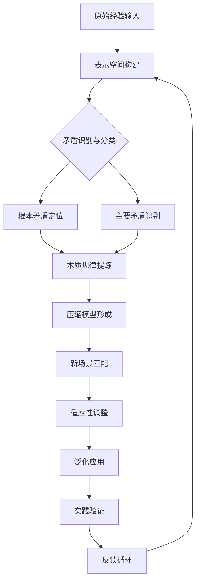

# 知行合一自我进化能力Skills

> 基于"表示空间-压缩-泛化"三阶段转化模型 | 教员方法论核心进化工具

---

## 🎯 核心定义

**知行合一自我进化能力**是基于认知科学的三阶段转化模型，将经验知识从原始表示空间，经过压缩提炼，最终泛化应用到新场景的系统化进化能力。

**核心公式：**
> 表示空间（原始经验） → 压缩（提炼本质） → 泛化（迁移应用）

---

## 🔄 三阶段转化模型详解

### 第一阶段：表示空间（Representation Space）
**功能：** 原始经验的完整呈现与收集

**操作要点：**
1. **全面记录** - 收集所有相关经验、数据、感受
2. **多维视角** - 从物质体、能量体、信息体三个维度记录
3. **情境还原** - 完整还原事件发生的背景与环境

**工具方法：**
- 五色光思维中的白光思维（客观事实）
- 矛盾论中的矛盾层次定位
- 金字塔原理的MECE分类

### 第二阶段：压缩（Compression）
**功能：** 从复杂信息中提炼本质规律

**操作要点：**
1. **矛盾识别** - 识别根本矛盾与主要矛盾
2. **模式识别** - 发现重复出现的规律与模式
3. **本质提炼** - 提取问题的核心本质

**工具方法：**
- 金线原理的假设驱动
- 矛盾论的主要矛盾分析
- 金字塔原理的结论先行

### 第三阶段：泛化（Generalization）
**功能：** 将提炼的本质迁移应用到新场景

**操作要点：**
1. **场景映射** - 识别新场景与原始经验的相似性
2. **适应性调整** - 根据新情境调整应用方式
3. **创新应用** - 创造性地应用本质规律

**工具方法：**
- 实践论的实践-认识循环
- 象思维的意象迁移
- 五色光思维中的绿光思维（创造变革）

---

## 🛠️ 操作流程

---

## 📊 应用场景

### 场景一：企业问题诊断
- **表示空间**：收集企业运营数据、员工访谈、市场反馈
- **压缩**：识别"供应链效率与客户体验"的根本矛盾
- **泛化**：将解决方案应用到不同门店

### 场景二：个人成长规划
- **表示空间**：记录个人经历、成功失败案例
- **压缩**：提炼个人核心能力与成长模式
- **泛化**：将成长模式应用到新职业领域

### 场景三：知识体系构建
- **表示空间**：收集碎片化知识
- **压缩**：构建知识框架与核心概念
- **泛化**：跨领域应用知识框架

---

## 🔗 关联文件

- [[教员方法论完整体系]] - 方法论基础框架
- [[五色光思维完整体系]] - 思维工具支持
- [[象思维核心体系]] - 0→1创新来源
- [[知识学习能力Skills]] - 学习能力支持
- [[人机协同四象限Skills]] - 协作模式支持

---

## 💡 核心金句

> "进化不是积累更多，而是提炼更精；不是记住所有，而是忘记无关。"

> "表示空间是广度，压缩是深度，泛化是智慧。"

> "真正的知行合一，是将每一次经验都转化为下一次进化的燃料。"

---

## 🏷️ 标签

#知行合一 #自我进化 #三阶段模型 #表示空间 #压缩 #泛化 #教员方法论 #认知增强 #学习能力

---

## 📈 进化指标

| 进化阶段 | 关键指标 | 目标值 |
|---------|---------|--------|
| 表示空间 | 数据收集完整度 | >90% |
| 压缩 | 本质提炼准确率 | >85% |
| 泛化 | 应用成功率 | >80% |
| 闭环 | 反馈迭代速度 | <24小时 |

---

> 更新日期：2026-03-15 | 版本：1.0
> 
> **进化宣言：** 每一次应用都是一次进化，每一次进化都是一次重生。