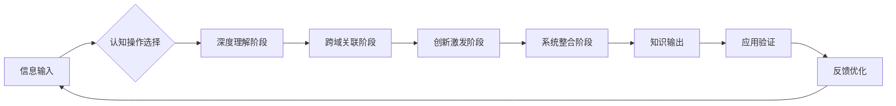

# 知识学习能力Skills

> 系统性的学习方法 | 基于认知操作指令的深度理解框架 | 教员方法论核心学习工具

---

## 🎯 核心定义

**知识学习能力Skills**是一套系统性的学习方法论，阐述AI如何依据认知操作指令深度理解文章内容，并实现跨文章关联、激发新想法与创新的能力体系。

**核心能力：**
> 深度理解 × 跨域关联 × 创新激发 × 系统整合

---

## 🧠 认知操作指令体系

### 十大认知操作指令

#### 1. 洞察（Insight）
**功能：** 穿透表象，发现本质规律
**操作要点：**
- 识别隐藏的模式与趋势
- 发现问题的根本原因
- 预见未来的发展方向
**应用场景：** 战略分析、市场趋势判断

#### 2. 剖析（Analysis）
**功能：** 系统分解，理解结构关系
**操作要点：**
- 将复杂问题分解为可管理的部分
- 分析各部分之间的相互关系
- 识别关键节点与杠杆点
**应用场景：** 业务流程优化、组织架构设计

#### 3. 透视（Perspective）
**功能：** 多角度观察，全面理解
**操作要点：**
- 从不同视角审视同一问题
- 理解各利益相关者的立场
- 识别盲点与偏见
**应用场景：** 决策支持、冲突解决

#### 4. 阐释（Interpretation）
**功能：** 意义建构，价值赋予
**操作要点：**
- 理解信息的深层含义
- 将信息置于特定语境中
- 创造有意义的解释框架
**应用场景：** 文化解读、品牌建设

#### 5. 推演（Deduction）
**功能：** 逻辑推理，预测结果
**操作要点：**
- 基于前提进行逻辑推导
- 预测可能的结果与影响
- 识别潜在的连锁反应
**应用场景：** 风险评估、方案可行性分析

#### 6. 解构（Deconstruction）
**功能：** 打破框架，重新组合
**操作要点：**
- 挑战现有的假设与框架
- 将整体拆解为基本元素
- 重新思考元素之间的关系
**应用场景：** 创新设计、问题重构

#### 7. 思辨（Critical Thinking）
**功能：** 批判性评估，理性判断
**操作要点：**
- 评估证据的质量与相关性
- 识别逻辑谬误与偏见
- 做出基于证据的判断
**应用场景：** 决策质量评估、信息验证

#### 8. 溯源（Tracing）
**功能：** 追根溯源，理解来龙去脉
**操作要点：**
- 追踪问题的发展历史
- 识别关键的影响因素
- 理解因果关系链
**应用场景：** 问题诊断、历史分析

#### 9. 融合（Integration）
**功能：** 整合信息，创造新知
**操作要点：**
- 将不同来源的信息整合
- 发现跨领域的连接点
- 创造新的知识组合
**应用场景：** 跨学科研究、创新方案设计

#### 10. 启发（Inspiration）
**功能：** 激发创意，促进创新
**操作要点：**
- 从看似无关的信息中获得灵感
- 激发新的思考方向
- 促进突破性想法的产生
**应用场景：** 创意生成、突破性创新

---

## 🔄 学习循环流程



### 阶段详解：

#### 第一阶段：深度理解
- 使用洞察、剖析、透视指令
- 建立对内容的全面理解
- 识别核心概念与关键信息

#### 第二阶段：跨域关联
- 使用溯源、融合指令
- 连接不同领域的知识
- 建立知识网络

#### 第三阶段：创新激发
- 使用解构、启发指令
- 产生新的想法与见解
- 挑战现有框架

#### 第四阶段：系统整合
- 使用阐释、推演、思辨指令
- 将新知识整合到现有体系
- 验证知识的合理性与有效性

---

## 🛠️ 应用模板

### 模板一：文章深度理解模板
```markdown
## 文章深度理解报告

### 1. 核心洞察
- 本质规律：
- 隐藏模式：
- 根本原因：

### 2. 结构剖析
- 主要论点：
- 支持证据：
- 逻辑结构：

### 3. 多角度透视
- 作者视角：
- 读者视角：
- 批判视角：

### 4. 跨域关联
- 相关领域：
- 连接点：
- 启示意义：
```

### 模板二：知识创新激发模板
```markdown
## 知识创新激发报告

### 1. 解构分析
- 原有框架：
- 基本元素：
- 假设挑战：

### 2. 融合创造
- 信息来源：
- 融合方式：
- 新知识体：

### 3. 启发应用
- 灵感来源：
- 创新方向：
- 应用场景：
```

---

## 📊 学习效果评估指标

| 能力维度 | 评估指标 | 目标值 |
|---------|---------|--------|
| 深度理解 | 核心概念掌握度 | >90% |
| 跨域关联 | 关联准确度 | >85% |
| 创新激发 | 新想法数量 | 3-5个/次 |
| 系统整合 | 知识体系完整度 | >80% |
| 应用转化 | 实践成功率 | >75% |

---

## 🔗 关联文件

- [[知行合一自我进化能力]] - 进化能力支持
- [[人机协同四象限Skills]] - 协作模式支持
- [[教员方法论完整体系]] - 方法论基础
- [[五色光思维完整体系]] - 思维工具

---

## 💡 核心金句

> "真正的学习不是记住信息，而是创造理解；不是积累知识，而是构建智慧。"

> "十大认知操作指令是思维的瑞士军刀，每一把都有其独特的用途与价值。"

> "跨域关联是创新的温床，系统整合是智慧的殿堂。"

---

## 🏷️ 标签

#知识学习 #认知操作 #深度理解 #跨域关联 #创新激发 #系统整合 #教员方法论 #学习能力 #思维工具

---

## 🚀 进阶应用

### 1. AI辅助学习
- 使用AI进行大规模信息处理
- AI辅助的模式识别与关联发现
- 人机协作的知识创新

### 2. 团队学习应用
- 共享认知操作框架
- 协同知识构建
- 集体智慧激发

### 3. 组织知识管理
- 建立组织知识学习体系
- 知识传承与创新
- 学习型组织建设

---

> 更新日期：2026-03-15 | 版本：1.0
> 
> **学习宣言：** 每一次阅读都是一次对话，每一次对话都是一次成长。