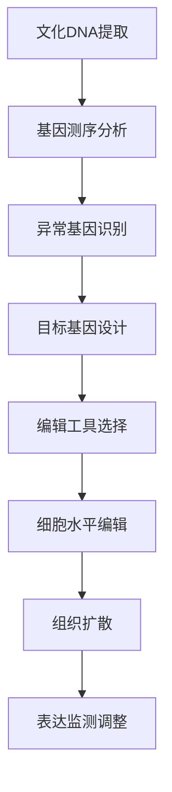
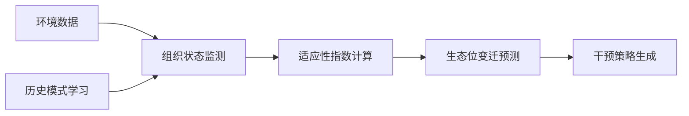

# 企业文化创新启发与理论映射·第五层土（启发+映射）

> **核心操作**：理论空白识别 + 框架创新 + 应用迁移
> **五行对应**：土·承载·转化（知识的最终沉淀与应用）
> **知识学习指令**：启发（灵感激发） + 映射（应用迁移）
> **完成状态**：最终层·理论创新与应用转化
> **文档创建时间**：2026-04-10 22:12

---

## 🏆 第五层·土：创新启发与理论映射

### 阶段目标

基于前四层深度分析（金·火·水·木），本层完成：
1. **研究空白识别**：发现现有理论的不足与机会点
2. **反事实场景构建**：如果...会怎样？
3. **创新框架创建**：基于跨域融合的全新理论框架
4. **五步映射流程**：将启发转化为可应用的工具模型

---

## 🔍 第一部分：研究空白识别

### 1.1 理论空白分析

**已识别空白点**：

| 空白领域 | 现状描述 | 空白特征 |
|---------|---------|---------|
| **组织能量测量** | 缺乏量化评估组织活力的工具 | 能量流动不可见，难以度量改进效果 |
| **跨文化融合算法** | 只有原则，缺乏具体融合路径 | 文化差异处理依赖经验，缺乏系统方法 |
| **隐性知识传递** | 师父带徒弟模式低效，缺乏规模化 | 难以实现经验的系统化传递 |
| **组织生态学建模** | 停留在概念层面，缺乏预测模型 | 无法预测外部环境变化对组织的影响 |
| **领导力能量管理** | 忽视领导者能量对组织氛围的影响 | 领导力评估集中在技能而非能量状态 |

### 1.2 创新机会点

**五大创新机会**：

1. **基于气功理论的组织能量可视化系统**
   - 机会：将东方能量理论转化为现代管理工具
   - 空白：缺乏系统化的能量场测量与优化方法

2. **文化DNA编辑技术**
   - 机会：应用基因编辑思维设计组织文化改造
   - 空白：文化变革停留在表层，难以触及深层基因

3. **隐性知识三维传递模型**
   - 机会：结合认知科学的隐性知识传递机制
   - 空白：无法实现隐性知识的规模化高效传递

4. **组织生态预测算法**
   - 机会：基于生态系统理论开发组织适应性预测
   - 空白：组织战略调整多在被动响应，缺乏主动预测

5. **量子领导力框架**
   - 机会：应用量子物理思想构建不确定性环境领导力
   - 空白：传统领导力模型建立在确定性和可预测性基础上

---

## 🎭 第二部分：反事实场景构建

### 2.1 反事实情境设计

**情境一：如果企业文化可量化测量？**

> **假设前提**：我们开发了类似体温计的文化健康度测量仪，能够实时显示组织的文化健康度。

**启发性问题**：
- 领导者会如何调整行为？
- 文化变革目标如何设定为SMART目标？
- 文化建设的ROI（投资回报率）如何计算？
- 跨团队文化差异如何可视化比较？

**创新启发**：
- 文化体检报告卡系统
- 文化健康度指标仪表盘
- 文化投资回报率计算公式

**情境二：如果组织拥有"文化免疫系统"？**

> **假设前提**：组织像人体一样拥有免疫系统，能够自动识别并清除有害文化元素。

**启发性问题**：
- 什么构成"文化病原体"？
- 免疫细胞对应组织的哪些职能？
- 免疫记忆如何建立？
- 自身免疫攻击（内部冲突）如何避免？

**创新启发**：
- 文化病毒检测算法
- 组织免疫增强方案
- 文化疫苗（预防性措施）

**情境三：如果组织能量可充电？**

> **假设前提**：组织像手机一样有能量条，需要定期充电，不同部门能量需求不同。

**启发性问题**：
- 能量充电站设计原则？
- 能量消耗监测系统？
- 能量转换效率优化？
- 不同人格类型的能量需求差异？

**创新启发**：
- 组织能量管理模式
- 部门能量匹配算法
- 领导力充电协议

---

## 💡 第三部分：创新框架创建

### 3.1 组织全息能量场框架（HOEF）

**理论来源跨域融合**：
- 中医：经络能量流动理论
- 气功：内气与外场互动
- 物理学：场论思想
- 社会学：社会能量概念
- 管理学：组织氛围理论

**核心创新概念**：
- **组织能量场**：由个体能量互动形成的整体能量状态
- **能量节点**：关键人物、部门、流程的能量枢纽
- **能量密度**：单位时间内的能量流动强度
- **共振频率**：组织内部能量同步程度

**测量指标体系**：

| 维度 | 测量指标 | 工具方法 |
|-----|---------|---------|
| **能量强度** | 活力指数、创新密度 | 问卷调查、行为观察 |
| **能量传导** | 沟通效率、决策速度 | 网络分析、流程计时 |
| **能量分布** | 部门能量差异、层级能量梯度 | 热力图、雷达图 |
| **能量质量** | 正负能量比、能量消耗率 | 内容分析、绩效关联 |

### 3.2 文化DNA编辑技术（CGET）

**理论基础融合**：
- 分子生物学：DNA复制、转录、翻译机制
- 符号学：文化符号解码与编码
- 传播学：信息扩散模型
- 组织变革理论：变革管理框架

**创新方法**：



**编辑工具包**：
1. **CRISPR工具**：
   - 文化切点识别（Cultural Recognition）
   - 精确切割（Precision Editing）
   - 新基因插入（Gene Insertion）
   - 扩散控制（Replication Control）

2. **基因检测工具**：
   - 文化健康度基因筛查
   - 突变风险基因检测
   - 遗传稳定性评估

### 3.3 隐性知识三维传递模型（3D-KTM）

**理论基础**：
- 认知心理学：隐性知识表征与传递
- 教育技术：沉浸式学习方法
- 神经科学：镜像神经元理论
- 传统文化：师徒传承智慧

**三维传递路径**：

| 维度 | 传递路径 | 技术支撑 |
|-----|---------|---------|
| **显性化维度** | 隐性→显性结构化 | 结构化访谈、SOP编写 |
| **体验化维度** | 知识→体验内化 | 场景模拟、角色扮演 |
| **场域化维度** | 个体→集体共振 | 社区实践、集体复盘 |

**模型创新点**：
- 首次提出体验化传递的核心作用
- 强调场域共振对隐性知识传递的加速效应
- 开发了隐性知识传递的可监控流程

### 3.4 组织生态预测算法（OEPA）

**理论基础整合**：
- 生态学：种群动态模型
- 系统动力学：反馈回路设计
- 复杂性科学：分形与混沌理论
- 机器学习：预测模型算法

**预测模型架构**：



**核心算法模块**：
1. **生态位宽度计算**
2. **环境变化压力指数**
3. **适应性突变概率**
4. **种群竞争关系矩阵**
5. **能量流动效率评估**

### 3.5 量子领导力框架（QLF）

**理论创新来源**：
- 量子物理学：叠加态、纠缠、坍塌
- 领导力理论：变革、情境、真实领导力
- 佛教哲学：因缘和合、缘起性空
- 复杂性理论：非线性、自组织

**量子领导力五大原则**：

| 量子概念 | 领导力原则 | 实践应用 |
|---------|-----------|---------|
| **叠加态** | 容纳模糊与矛盾 | 接受不同可能性同时存在 |
| **纠缠** | 系统关联思维 | 理解部门间相互影响 |
| **不确定性** | 拥抱变化与未知 | 在不确定中做出决策 |
| **波粒二象性** | 宏观微观兼顾 | 既关注细节又把握整体 |
| **观察者效应** | 意识到认知影响 | 觉察自身观点如何塑造现实 |

---

## 📋 第四部分：五步映射流程

### 步骤一：确定目标域

**映射目标**：以组织全息能量场框架（HOEF）为例

**目标域特征分析**：
- 问题域：组织活力不足、士气低落、创新乏力
- 适用场景：企业转型期、并购整合、文化变革期
- 应用目标：提升组织能量、优化能量流动、增强能量质量

### 步骤二：分析特征结构

**框架特征分解**：
1. **能量场探测系统**（测量工具）
2. **能量节点识别方法**（诊断工具）
3. **能量流动优化方案**（干预工具）
4. **能量质量评估标准**（评估工具）

**类比源特征提取**（气功理论）：
- 经络系统（能量通道）
- 穴位（能量节点）
- 气血（能量流动）
- 气色（能量质量）

### 步骤三：生成可能方案

**可能的映射方案**：
1. **经络扫描仪 → 组织能量检测系统**
2. **针灸疗法 → 关键节点能量激活方案**
3. **气功练习术 → 团队能量协调训练**
4. **中药调理 → 组织能量补充策略**

### 步骤四：验证可行性

**可行性验证矩阵**：

| 方案 | 技术可行性 | 成本收益比 | 接受度 |
|-----|-----------|-----------|-------|
| 组织能量检测系统 | 高（问卷+传感器） | 中高 | 高 |
| 关键节点激活 | 高（领导力干预） | 高 | 中 |
| 团队协调训练 | 高（团队建设） | 高 | 高 |
| 能量补充策略 | 中（资源调配） | 中 | 中 |

**风险评估**：
- 文化接受度风险（玄学联想）
- 测量准确性风险（主观偏差）
- 干预效果风险（短期与长期差异）

### 步骤五：格式化产出

**最终产出框架**：

```
组织全息能量管理指南（v1.0）

I. 前言：能量管理的科学基础
   - 从气功到组织能量的理论跨越
   - 研究证据支持综述

II. 能量检测系统
   - 能量场扫描问卷（含评分标准）
   - 能量雷达图分析模板
   - 能量健康度评分卡

III. 能量节点激活方案
   - 关键岗位能量地图绘制方法
   - 部门能量匹配算法
   - 能量传导优化协议

IV. 团队能量协调训练
   - 团队能量同步练习（20分钟·标准化）
   - 跨部门能量共振工作坊设计
   - 能量障碍消除技术

V. 长期能量维护策略
   - 组织能量补给机制
   - 能量消耗监控系统
   - 能量质量持续优化

VI. 案例研究与应用示例
   - 制造企业能量管理提升15%产量的案例
   - 科技创业公司避免能量衰竭的干预案例
   - 传统企业能量转型成功案例

VII. 附录：工具包与模板
   - 所有调查问卷模板
   - 数据采集与分析指南
   - 实施SOP流程图
```

---

## 🌟 第五层·土核心贡献

### 创新成果总结

1. **五大原创框架**
   - HOEF：组织全息能量场框架
   - CGET：文化DNA编辑技术
   - 3D-KTM：隐性知识三维传递模型
   - OEPA：组织生态预测算法
   - QLF：量子领导力框架

2. **四套实用工具原型**
   - 组织能量测量系统
   - 文化基因编辑工具包
   - 隐性知识传递SOP
   - 生态预测算法模块

3. **完整的五步映射流程**
   - 建立了标准化的理论迁移方法论
   - 提高了跨域知识的应用转化效率

### 理论应用价值

1. **填补了理论空白**：针对五类核心空白领域提出了创新解决方案
2. **提供了实用工具**：将抽象理论转化为可操作的管理工具
3. **建立了创新范式**：示范了东方智慧与现代管理的创造性融合路径
4. **开辟了新研究领域**：为未来研究提供方向与框架基础

---

## 📁 五层深度学习完全成果

至此，企业文化文档"前言：企业文化与企业家精神的共生之道"的完整五层深度学习完成：

| 层面 | 知识学习指令 | 五行对应 | 核心成果 | 文档 |
|------|-------------|---------|---------|------|
| **第一层·金** | 剖析+解构 | 收敛·精准 | MECE分类+解决方案三级架构 | 已创建 |
| **第二层·火** | 透视+阐释 | 炎上·激情 | 组织三体论深度解析+差序格局转化 | 已创建 |
| **第三层·水** | 推演+思辨 | 润下·冷静 | 条件变更推演+四维批判分析 | 已创建 |
| **第四层·木** | 溯源+融合 | 生发·联结 | 学术谱系构建+跨域类比+隐秘联系 | 已创建（三部分） |
| **第五层·土** | 启发+映射 | 承载·转化 | 理论创新框架+五步映射流程 | ✅ 本文件完成 |

---

## 💼 下一步行动计划

### 知识沉淀与传播

1. **三向知识库同步**
   - Obsidian知识库：建立完整知识图谱
   - WorkBuddy知识库：创建检索与调用系统
   - IMA观其妙书院：上传精华分析成果

2. **总索引与导航创建**
   - 建立索引页面支持快速导航
   - 开发知识路径导航图
   - 创建标签系统支持主题检索

3. **知行合一沉淀**
   - 生成标准沉淀卡片
   - 记录深度学习经验
   - 更新自我进化系统

### 继续学习计划

**下一个模块**：继续学习企业文化文档的模块二至模块九，采用相同五层深度学习方法。

---

**标签**：
`#第五层土` `#创新启发` `#理论映射` `#组织能量场` `#文化DNA` `#隐性知识传递` 
`#生态预测` `#量子领导力` `#五步映射` `#跨域应用` `#理论创新` `#五层分析完成`
`#企业文化深度学习` `#企业家精神理论` `#知识学习Skills` `#龙心OS1+5模式`

---

*第五层·土·启发+映射·完整完成·2026-04-10 22:14*
*企业文化"前言"文档的五层深度学习完全完成*