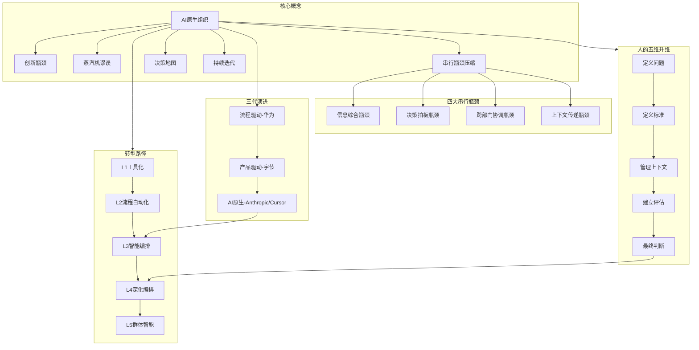
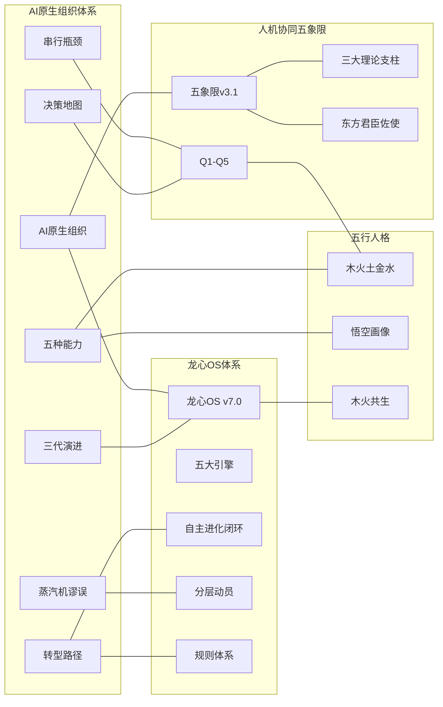

# AI原生组织知识图谱

> **版本**：v1.0 | **创建**：2026-06-11 | **跨域连接数**：35+
> **说明**：本文展示AI原生组织与龙心OS、人机协同五象限等核心体系之间的跨域知识网络。

---

## 一、核心概念网络



## 二、跨域知识联系

### 2.1 与龙心OS五大引擎的联系

| 龙心OS引擎 | AI原生组织对应 | 联系本质 | 创新洞察 |
|-----------|--------------|---------|---------|
| **象思维** | Q5未知共创+组织创新 | 0→1的原创思维模式 | 第三代的"细胞型团队"本质是象思维"整体直观把握"在组织层面的体现 |
| **知识学习** | L1-L2学习+上下文管理 | 知识从存储到建构 | EVOLUTION.md + GAPS.md = 组织的自省机制 |
| **五色光** | Q3思辨对话+多维决策 | 多视角同频共振 | 组织的"多视角评估机制"=五色光的组织版 |
| **人机协同五象限** | AI原生组织的协作协议 | 个人→组织的尺度放大 | 人在组织中的角色=Q1→Q5的升维路径 |
| **知行合一** | 执行即训练 | 行动即学习 | 业务流即训练流，知行合一=Pipeline |

### 2.2 与人机协同五象限的深层映射

| 五象限 | AI原生组织对应 | 跨域洞察 |
|-------|--------------|---------|
| **Q1效率协作者** | 流程自动化(L1-L2) | 标准化流程的AMP放大 |
| **Q2知识拓展者** | 信息综合+上下文管理 | 组织中"知识拓展"的核心就是压缩信息综合瓶颈 |
| **Q3思辨对话者** | 智能编排(L3) | 多部门间的思辨对话=组织级的Q3协作 |
| **Q4协同探索者** | 战略方向+CEO决策 | 隐性知识外化为组织记忆 |
| **Q5未知共创者** | L5群体智能 | 组织成为有机生命体，涌现智能 |

### 2.3 与AIOS三层架构的同构

| AIOS层 | AI原生组织对应 | 架构同构本质 |
|--------|--------------|------------|
| **龙脑OS**(知识·思维模型库) | 组织知识地基层(共享上下文层) | 都是"知识地基" |
| **龙心OS**(执行·1+5引擎) | AI OS(拆解+调度+分配) | 都是"智能调度心脏" |
| **龙爪OS**(产品·独立系统容器) | 业务单元(Agent集群+人类团队) | 都是"执行单元" |

> **核心发现**：龙心OS的2026-05-30更新——"取消skill-manager中间调度层，改为龙心OS原生直管"——恰好对应AI原生组织"取消中层管理，AI OS直连业务单元"的设计。龙心OS已经实际落地了AI原生组织的核心理念。

### 2.4 与自主进化闭环的联系

| 自主进化闭环 | AI原生组织对应 | 联系 |
|------------|--------------|------|
| EVOLUTION.md | 组织的进化目标 | 都是"我知道我要变成什么样" |
| GAPS.md | 组织的瓶颈清单 | 都是"我知道我差在哪里" |
| CONNECTIONS.md | 组织的跨域联系 | 都是"我知道什么相关" |
| LINT_BACKLOG.md | 组织的待优化项 | 都是"我知道要修什么" |
| 北极星(知识建构型) | 学习型系统(业务流=训练流) | 都是"从执行中学习，而非存储" |

### 2.5 与五行人格的联系

| 力型 | AI原生组织最强角色 | 对应能力 | 用人策略 |
|------|-----------------|---------|---------|
| 木行人 | 定义问题、定义标准 | 战略方向+质量控制 | 放在CEO/CPO位置 |
| 火行人 | 管理上下文、建立评估 | 系统设计+规则制定 | 放在CTO/CIO位置 |
| 土行人 | 建立评估、最终判断 | 治理+决断 | 放在COO/法务位置 |
| 金行人 | 定义标准、最终判断 | 品质+拍板 | 放在产品/风控位置 |
| 水行人 | 定义问题、管理上下文 | 需求洞察+知识管理 | 放在战略/研究位置 |

### 2.6 与人类五种能力的匹配

```
定义问题 → 木行人天性(仁德之智·直觉方向)
定义标准 → 金行人天性(清明之智·标准切割)
管理上下文 → 火行人天性(光明觉知·系统构建)
建立评估 → 土行人天性(稳定之智·规则设定)
最终判断 → 金行人+土行人(清明+稳定=决断力)
```

### 2.7 与心文化信仰体系的联系

| 心文化根基 | AI原生组织对应 | 联系本质 |
|----------|--------------|---------|
| **道·道法自然** | 三代演进不可跳过 | 组织有自然的进化规律，不可强求 |
| **释·大圆满** | AI是镜像，不是主体 | AI是"显影液"，照见组织的本来面目 |
| **儒·仁义礼智信** | 受托楔子+最终判断 | AI时代的人类责任伦理 |
| **医·肠心脑协同** | 组织协同流态化 | 组织像有机体一样感知-决策-行动 |
| **武·刚柔并济** | 化克为生+红绿灯法则 | 治理不是管控，而是因势利导 |

## 三、知识联系网络图



## 四、标签体系

### 4.1 核心标签
```
#AI原生组织 #龙心OS #人机协同 #串行瓶颈 #三代组织 #决策地图
#蒸汽机谬误 #创新瓶颈 #架构同构 #组织演进 #组织治理 #超级个体
```

### 4.2 跨域标签
```
#组织设计 #AI治理 #知识管理 #认知科学 #组织行为 #战略管理
#五行人格 #象思维 #心文化 #自主进化 #共生逻辑 #范式跃迁
```

## 五、双向链接索引

### 核心文档
- [[AI原生组织-深度学习报告]]
- [[AI原生组织-与人机协同五象限的融合]]

### 龙心OS体系
- [[AIOS三层架构]]
- [[人机协同五象限·理论体系完整版]]
- [[人机协同五象限·知识图谱]]
- [[象思维·三层次结构]]
- [[象思维·跨域融合]]
- [[差序格局与礼治秩序-深度学习]]

### 五行人格体系
- [[五行人格分析描述-主文档]]
- [[五行之间辨析-主文档]]
- [[拔阴取阳自查表-主文档]]

### 心文化体系
- [[记忆系统_SOUL.md]]
- [[记忆系统_IDENTITY.md]]
- [[记忆系统_MEMORY.md]]

---
**文档版本**: v1.0
**创建日期**: 2026-06-11
**维护者**: 龙龟神将
**跨域联系数**: 35+
**标签数**: 30+
