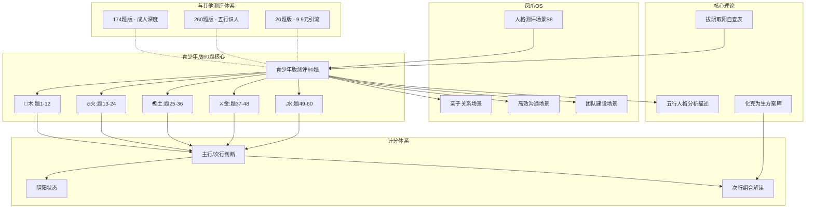

# 青少年版五行人格测评系统 · 知识图谱

> **版本**：v1.0 | **跨域连接**：15+

## 跨域联系

| 联系 | 类型 | 说明 |
|------|------|------|
| 木行"难接受批评"↔ 金行"太挑剔" | 对比 | 都是对外防御，但木是"被否定"防御，金是"否定他人"防御 |
| 土行"忍着不说"↔ 水行"过于在意别人看法" | 相似 | 都是压抑自我，但土是因为"不想冲突"，水是因为"怕对方不舒服" |
| 火行"冲动"↔ 水行"因顾虑太多不敢行动" | 对立 | 火是行动太快缺思考，水是思考太多缺行动——两者是完美的平衡伙伴 |
| 金行"目标导向"→ 木行"理想主义" | 互补 | 金提供"怎么做到"，木提供"为什么做" |
| 60题未设L量表↔ 260题L量表>50分无效 | 进化 | 青少年信任测评→成人需要信度检验 |

## 标签
#青少年版 #知识图谱 #跨域连接 #五行测评 #60题 #次行组合

## 双向链接
- [[青少年版五行人格测评系统-深度学习报告]]
- [[人格测评场景（S8）v4.0]]
- [[📋 五行人格测评题·完整174题体系（含阴阳子维度）]]
