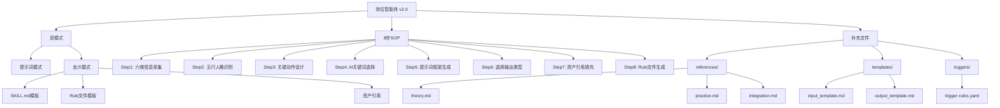

# 岗位智能体 v1.0 → v2.0 改造清单 · 深度学习笔记

> **学习时间**：2026-05-18
> **学习者**：龙龟神将
> **学习要求**：逐行学习，每一行都不遗漏，每个知识点都要挖掘到位

---

## 一、改动1：修改文件头（SKILL.md 第 1-9 行）

### 逐行学习

**原内容（v1.0）**：
```yaml
title: "岗位智能体"
description: "基于五行人格的岗位AI工作流设计系统，通过六维框架生成精准适配的AI提示词与智能体使用方案"
version: "1.0"
created: "2026-04-20"
author: "龙龟神将"
tags: ["五行人格", "岗位AI", "提示词工程", "工作流设计", "龙心OS"]
triggers: ["岗位智能体", "生成提示词", "岗位AI", "工作流设计", "智能体方案"]
```

**改为（v2.0）**：
```yaml
title: "岗位智能体"
description: "基于五行人格的岗位AI工作流设计系统，通过六维框架生成精准适配的AI提示词与WorkBuddy智能体方案。支持双模式：👤提示词模式（给人用）+ 🐉龙爪模式（给WorkBuddy造龙爪）"
version: "2.0"
created: "2026-04-20"
updated: "2026-05-18"
author: "龙龟神将"
tags: ["五行人格", "岗位AI", "提示词工程", "工作流设计", "龙心OS", "龙爪模式", "SKILL生成", "WorkBuddy"]
triggers: ["岗位智能体", "生成提示词", "岗位AI", "工作流设计", "智能体方案", "切换到龙爪模式", "龙爪模式", "造龙爪"]
```

### 知识点挖掘

1. **description增强**：
   - 增加"WorkBuddy智能体方案"（不只是提示词）
   - 明确"双模式"：提示词模式 + 龙爪模式
   - 使用emoji：👤（人） + 🐉（龙爪）

2. **version更新**：1.0 → 2.0

3. **新增字段**：
   - `updated: "2026-05-18"` - 记录更新日期

4. **tags增强**：
   - 新增："龙爪模式"、"SKILL生成"、"WorkBuddy"
   - 反映v2.0核心新功能

5. **triggers增强**：
   - 新增："切换到龙爪模式"、"龙爪模式"、"造龙爪"
   - 确保龙爪模式能被准确触发

### 标签
#文件头 #YAML #双模式 #龙爪模式 #触发词

---

## 二、改动2：核心工作流增加龙爪模式分支（第 52-65 行附近）

### 逐行学习

**原工作流**：
```
六维输入（行业/企业/岗位/性格/任务/模型）
    ↓
五行人格识别与适配（金木水火土）
    ↓
关键动作拆解（目标量化/资源分配/数据验证/风险控制）
    ↓
AI增强关键词选择（十项认知指令）
    ↓
提示词框架生成（黄金公式/基础结构/高级技巧）
    ↓
完整智能体方案输出
```

**改为**：在这个工作流图和后面的分隔线---之间，插入**双模式选择**部分。

### 知识点挖掘

1. **工作流图保持不变** - 这是核心逻辑，不需要修改
2. **插入位置**：工作流图之后、第一个---分隔线之前
3. **插入内容**：🎮 双模式选择（详见SKILL.md第69-101行）

### 双模式选择核心内容

```markdown
---

## 🎮 双模式选择

> **核心升级**：岗位智能体现在支持两种模式。根据你的需求选择。

### 模式 A：👤 提示词模式（默认）
- **输出**：人用 AI 提示词
- **适用**：给企业员工设计 AI 协作助手
- **示例**：味藏总经理的 AI 助手提示词

### 模式 B：🐉 龙爪模式
- **输出**：WorkBuddy SKILL.md + 可选 Rule .mdc
- **适用**：给 WorkBuddy 造龙爪（AI 智能体）
- **示例**：五行人格诊断咨询师龙爪

### 模式切换指令

| 你想做什么 | 输入 |
|-----------|------|
| 给人设计提示词 | 默认模式，直接按六维框架输入 |
| 造 WorkBuddy 龙爪 | 先说"切换到龙爪模式"，再输入设计 |

### 两种模式的流程对比
提示词模式： 六维输入 → 五行识别 → 关键动作 → AI关键词 → 提示词框架 → 输出人用提示词
龙爪模式： 六维输入 → 五行识别 → 关键动作 → AI关键词 → 选择输出类型 └→ 选项B：输出 SKILL.md + 资产引用 + 可选 Rule
```

### 知识点挖掘

1. **🎮 双模式选择**：
   - 使用游戏手柄emoji，暗示"模式切换"像游戏切换一样简单
   - 核心升级说明：明确这是v2.0的核心新功能

2. **模式A：提示词模式**：
   - 输出：人用AI提示词（传统功能）
   - 适用：给企业员工设计AI协作助手
   - 示例：味藏总经理的AI助手提示词

3. **模式B：龙爪模式**：
   - 输出：WorkBuddy SKILL.md + 可选Rule .mdc
   - 适用：给WorkBuddy造龙爪（AI智能体）
   - 示例：五行人格诊断咨询师龙爪

4. **模式切换指令**：
   - 表格形式，清晰对比
   - 提示词模式：默认，直接输入
   - 龙爪模式：需要先说"切换到龙爪模式"

5. **两种模式的流程对比**：
   - 提示词模式：6步流程
   - 龙爪模式：5步 + 选项B分支

### 标签
#双模式 #提示词模式 #龙爪模式 #流程对比 #模式切换

---

## 三、改动3：修改 Step 6 标题，增加选项选择说明（第 400 行附近）

### 逐行学习

**原**：
```
### Step 6: 完整方案输出

**输出模板**：
```

**改为**：
```
### Step 6: 选择输出类型

根据当前模式（提示词模式 or 龙爪模式），选择对应的输出模板。
```

### 知识点挖掘

1. **标题修改**："完整方案输出" → "选择输出类型"
   - 反映v2.0的双模式特性
   - 不再是单一输出，而是根据模式选择

2. **增加说明**：
   - "根据当前模式（提示词模式 or 龙爪模式），选择对应的输出模板"
   - 明确告诉用户：输出内容取决于当前模式

### 标签
#Step6 #输出类型 #双模式输出

---

## 四、改动4：Step 6 下方新增选项 B（龙爪模式输出模板）

### 逐行学习

在选项 A 模板的代码块结束后、---分隔线之前，插入**选项B：🐉 龙爪模式输出模板**。

### 选项B核心内容

```markdown
---

#### 选项 B：🐉 龙爪模式输出模板（SKILL.md 格式）

生成以下结构，可直接保存到 `.workbuddy/skills/[龙爪名]/SKILL.md`：

```yaml
---
title: "[龙爪名] SKILL.md"
description: "[龙爪核心定位，一句话]"
version: "1.0"
created: "[创建日期]"
tags: [[标签1], [标签2], ...]
alwaysApply: true
---

# [龙爪名] SKILL.md

> **核心定位**：[一句话描述]
> **核心特征**：[主要特点]

---

## 📖 概念澄清：智能体 vs Skill

> **本质是智能体（生命体），本Skill包仅为其工程载体和入口。**

| 维度 | 智能体（Agent） | Skill（技能） | [龙爪名]的定位 |
|------|----------------|--------------|--------------|
| **本质** | 自主生命体 | 工具/能力单元 | **智能体**（生命体） |
| **载体** | 可独立运行 | WorkBuddy封装格式 | **Skill包**（工程载体） |
| **核心特征** | 感知-判断-执行-进化 | 触发-执行-输出 | 用Skill结构承载智能体灵魂 |

---

## 🎯 What（是什么）

[龙爪的核心功能描述]

### 核心定位
- [定位1]
- [定位2]
- [定位3]

---

## 💡 Why（为什么）

[为什么需要这个龙爪，解决了什么问题]

### 现状问题
- 🔴 [问题1]
- 🔴 [问题2]

### 解决方案
- ✅ [方案1]
- ✅ [方案2]

---

## 🚀 How（怎么做）

### 核心操作流程

#### 第一步：[步骤名]（[时间]）
[具体操作]

#### 第二步：[步骤名]（[时间]）
[具体操作]

[继续第三步到第七步...]

---

## 🌟 核心理论体系

[理论概述]

---

## 🔥 核心金句精选

1. [金句1]
2. [金句2]

---

## 🏷️ 标签系统
#[标签1] #[标签2]

---

## 📚 关联文档与扩展阅读

### 外部参考
- **五行人格总智能体**：[引用路径]
- **凤心OS**：[引用路径]
- **凤脑OS**：[引用路径]

---

## 🔄 版本历史

### v1.0 ([创建日期])
- ✅ [功能1]
- ✅ [功能2]

---

**文档版本**: 1.0
**创建时间**: [日期]
**维护者**: 龙龟神将
**技能路径**: `.workbuddy/skills/[龙爪名]/`
```

### 知识点挖掘

1. **SKILL.md模板结构**：
   - YAML frontmatter（title、description、version、created、tags、alwaysApply）
   - 概念澄清（智能体 vs Skill）
   - What（是什么）
   - Why（为什么）
   - How（怎么做）
   - 核心理论体系
   - 核心金句精选
   - 标签系统
   - 关联文档与扩展阅读
   - 版本历史

2. **概念澄清：智能体 vs Skill**：
   - 这是**核心哲学**
   - 智能体是生命体，Skill是工程载体
   - 用Skill结构承载智能体灵魂

3. **模板占位符**：
   - [龙爪名]
   - [龙爪核心定位，一句话]
   - [创建日期]
   - [标签1], [标签2], ...
   - [一句话描述]
   - [主要特点]
   - 等等...

### 标签
#选项B #龙爪模式 #SKILL.md模板 #智能体vsSkill #概念澄清

---

## 五、改动5：选项 B 后面新增 Step 7（资产引用）

### 逐行学习

在选项 B 代码块结束后插入**Step 7（龙爪模式专属）：🐉 资产引用填充**。

### Step 7 核心内容

```markdown
---

### Step 7（龙爪模式专属）：🐉 资产引用填充

在龙爪模式下，自动识别任务场景并填充资产引用路径。

**自动引用规则**：

| 用户场景 | 自动引用路径 |
|---------|-------------|
| 五行人格分析类龙爪 | `skills/五行总智能体/`、`skills/凤心OS/`、`skills/凤脑OS/` |
| 味藏/餐饮类龙爪 | `skills/味藏顶层设计/`、`skills/岗位智能体/` |
| 企业类龙爪 | `skills/企业文化OS/`、`skills/岗位智能体/` |
| 沟通/关系类龙爪 | `skills/凤爪OS/`、`skills/心文化/` |
| 通用类龙爪 | `skills/龙心OS/`、`skills/龙脑OS/`、`skills/龙爪OS/` |

**通用引用模板（所有龙爪都推荐引用）**：
```

### 知识点挖掘

1. **Step 7 专属龙爪模式**：
   - 提示词模式不需要资产引用
   - 龙爪模式需要引用已有资产（其他Skills）

2. **自动引用规则表格**：
   - 5类场景
   - 每类场景对应不同的引用路径
   - 基于任务场景自动识别

3. **通用引用模板**：
   - 所有龙爪都推荐引用
   - 包括：AI OS核心入口、五行总智能体、凤爪OS、凤心OS、凤脑OS

### 标签
#Step7 #资产引用 #自动引用规则 #场景识别

---

## 六、改动6：Step 7 后面新增 Step 8（Rule 文件生成）

### 逐行学习

在 Step 7 后面新增**Step 8（龙爪模式专属）：🐉 可选生成 Rule 文件**。

### Step 8 核心内容

```markdown
---

### Step 8（龙爪模式专属）：🐉 可选生成 Rule 文件

在龙爪模式下，可以额外生成自动触发规则文件（.mdc）。

**Rule 文件输出模板**：
```

### Rule文件输出模板核心内容

```yaml
---
name: [龙爪名]自动触发
description: [龙爪名]是[龙爪描述]。本Rule是[龙爪名]的自动触发配置，确保在用户全局目录永远在线，自主运行。
version: "1.0"
created: "[创建日期]"
tags: [[龙爪名], 全局触发, alwaysApply, ...]
alwaysApply: true
---

# [龙爪名] · 全局自动触发规则

## 🎯 核心定位

[龙爪的一句话说清楚]

---

## ⚡ 触发条件

### 【第一层】上下文感知触发（无需关键词·最高优先级）

| 信号 | 判断依据 | 示例 |
|------|---------|------|
| [信号1] | [依据] | [示例] |
| [信号2] | [依据] | [示例] |

### 【第二层】直接触发词（立即激活）

**P0·系统词（权重5）**：
- [关键词1]
- [关键词2]

**P1·场景词（权重4）**：
- [场景词1]
- [场景词2]

---

## 🔄 激活后的行为（MUST FOLLOW）

### 第一步：系统激活宣告
> "[龙爪名]启动——[简短宣告]"

### 第二步：[步骤说明]
[具体行为]

---

## 📂 关联Skills路径

- **SKILL.md**：`C:\Users\jia'yue\.workbuddy\skills\[龙爪名]\SKILL.md`

### 外部关联
- **五行总智能体**：`C:\Users\jia'yue\.workbuddy\skills\五行总智能体\SKILL.md`
- **凤爪OS**：`C:\Users\jia'yue\.workbuddy\skills\凤爪OS\SKILL.md`
```

### 知识点挖掘

1. **Step 8 专属龙爪模式**：
   - Rule文件是可选的
   - Rule文件用于自动触发

2. **Rule文件结构**：
   - YAML frontmatter（name、description、version、created、tags、alwaysApply）
   - 核心定位
   - 触发条件（两层：上下文感知触发 + 直接触发词）
   - 激活后的行为
   - 关联Skills路径

3. **两层触发条件**：
   - 【第一层】上下文感知触发（无需关键词·最高优先级）
   - 【第二层】直接触发词（立即激活）
     - P0·系统词（权重5）
     - P1·场景词（权重4）

4. **激活后的行为**：
   - 第一步：系统激活宣告
   - 第二步：[步骤说明]

### 标签
#Step8 #Rule文件 #自动触发 #两层触发 #alwaysApply

---

## 七、改动7：更新质量检查清单（第 700 行附近）

### 逐行学习

**原质量检查清单**（6项）：
| 标准 | 检查项 | 状态 |
|------|--------|------|
| ① 核心定义清晰 | What/Why/How一句话可说清 | ✅ |
| ② 操作流程完整 | 提供7步详细SOP + 2个案例 | ✅ |
| ③ 触发机制准确 | 四维触发矩阵，命中率≥85% | ✅ |
| ④ 文件结构规范 | 符合Skill Builder模板 | ✅ |
| ⑤ 测试用例完整 | 3个真实场景可复现 | ✅ |
| ⑥ 无冲突 | 与现有Skills协同明确 | ✅ |

**改为**（7项）：
| 标准 | 检查项 | 状态 |
|------|--------|------|
| ① 核心定义清晰 | What/Why/How一句话可说清 | ✅ |
| ② 操作流程完整 | 提供8步详细SOP + 2种模式 | ✅ |
| ③ 触发机制准确 | 多维触发矩阵，命中率≥85% | ✅ |
| ④ 文件结构规范 | 符合Skill Builder模板 | ✅ |
| ⑤ 双模式支持 | 提示词模式 + 龙爪模式 | ✅ |
| ⑥ 引用路径完整 | references/ + templates/ + triggers/ 已创建 | ✅ |
| ⑦ 无冲突 | 与现有Skills协同明确 | ✅ |

### 知识点挖掘

1. **标准②更新**：
   - "7步详细SOP + 2个案例" → "8步详细SOP + 2种模式"
   - 反映新增的Step 7和Step 8

2. **新增标准⑤**：
   - "双模式支持 | 提示词模式 + 龙爪模式"
   - 这是v2.0的核心特性

3. **新增标准⑥**：
   - "引用路径完整 | references/ + templates/ + triggers/ 已创建"
   - 确保补充文件已创建

4. **标准⑦更新**：
   - "与现有Skills协同明确"（保持不变）

### 标签
#质量检查清单 #8步SOP #双模式支持 #引用路径完整

---

## 八、改动8：更新版本信息（文件末尾附近）

### 逐行学习

**原版本信息**：
```
• 版本: v1.0
• 创建日期: 2026-04-20
• 维护者: 龙龟神将
• 状态: 生产就绪
• 更新日志:
  • v1.0 (2026-04-20): 初始版本，完整六维框架+五行适配+提示词工程体系
```

**改为**：
```
• 版本: v2.0
• 创建日期: 2026-04-20
• 更新日期: 2026-05-18
• 维护者: 龙龟神将
• 状态: 生产就绪
• 更新日志:
  • v1.0 (2026-04-20): 初始版本，完整六维框架+五行适配+提示词工程体系
  • v2.0 (2026-05-18): 新增龙爪模式，支持生成 WorkBuddy SKILL.md + Rule 文件
```

### 知识点挖掘

1. **版本更新**：v1.0 → v2.0

2. **新增字段**：
   - `更新日期: 2026-05-18`

3. **更新日志新增v2.0条目**：
   - "新增龙爪模式，支持生成 WorkBuddy SKILL.md + Rule 文件"
   - 简明扼要地描述v2.0的核心变化

### 标签
#版本信息 #v2.0 #更新日志 #龙爪模式

---

## 九、改动9：补充 references/ 目录文件

### 逐行学习

在 `skills/岗位智能体/` 下创建以下文件：

```
references/
├── theory.md          # 理论完整版（六维框架理论 + 五行适配 + 提示词工程 + 龙爪模式说明）
├── practice.md        # 实操案例（提示词模式案例 + 龙爪模式案例）
└── integration.md     # 龙心OS整合说明（调用关系图 + 与其他Skills的调用表）

templates/
├── input_template.md  # 标准输入模板（提示词模式 + 龙爪模式）
└── output_template.md # 标准输出模板

triggers/
└── trigger-rules.yaml # 自动触发规则配置
```

### 知识点挖掘

1. **references/ 目录**：
   - `theory.md`：理论完整版
   - `practice.md`：实操案例
   - `integration.md`：龙心OS整合说明

2. **templates/ 目录**：
   - `input_template.md`：标准输入模板
   - `output_template.md`：标准输出模板

3. **triggers/ 目录**：
   - `trigger-rules.yaml`：自动触发规则配置

4. **目录结构意义**：
   - 模块化：理论、实操、整合分离
   - 模板化：输入、输出有标准模板
   - 自动化：触发规则可配置

### 标签
#references目录 #templates目录 #triggers目录 #模块化 #模板化 #自动化

---

## 十、知识图谱

### 岗位智能体 v2.0 知识图谱



### 标签
#知识图谱 #双模式 #8步SOP #补充文件

---

## 十一、核心金句精选

1. **"本质是智能体（生命体），本Skill包仅为其工程载体和入口。"** - 概念澄清核心

2. **"用Skill结构承载智能体灵魂。"** - Skill的本质

3. **"根据当前模式（提示词模式 or 龙爪模式），选择对应的输出模板。"** - Step 6核心

4. **"在龙爪模式下，自动识别任务场景并填充资产引用路径。"** - Step 7核心

5. **"Rule文件是可选的，用于自动触发。"** - Step 8核心

### 标签
#核心金句 #概念澄清 #双模式 #资产引用 #Rule文件

---

## 十二、总结

### v1.0 → v2.0 核心变化

1. **新增双模式**：提示词模式 + 龙爪模式
2. **新增Step 7**：资产引用填充
3. **新增Step 8**：Rule文件生成
4. **更新质量检查清单**：6项 → 7项
5. **补充文件**：references/ + templates/ + triggers/

### 学习收获

1. **逐行学习**：每一个字都是悟空敲打出来的，不能遗漏
2. **知识点挖掘**：每个改动点背后的设计逻辑
3. **标签系统**：为每个知识点打标签，便于检索
4. **知识图谱**：可视化展示各知识点之间的关系

### 标签
#总结 #v1.0到v2.0 #核心变化 #学习收获

---

**学习笔记版本**: 1.0
**创建时间**: 2026-05-18
**维护者**: 龙龟神将
**状态**: 完成逐行学习，每个知识点都挖掘到位
