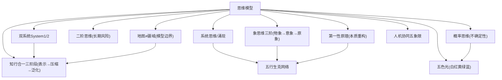
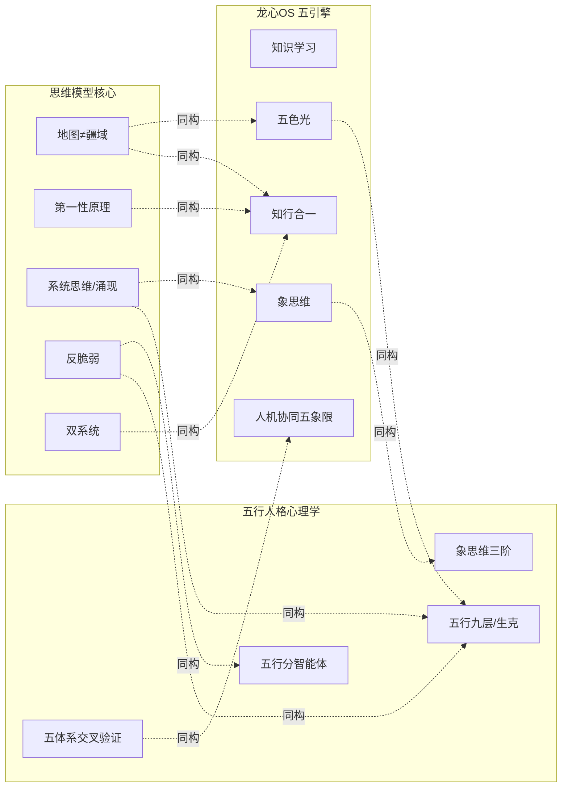

# 10-知识图谱 · 思维模型（龙心OS mermaid 可视化）

## 图1 · 章节/分类树（80 份文档结构地图）

```mermaid
graph TD
  ROOT["思维模型 · 龙心OS结构化总索引"]
  C_10["理论模型（金/C层）"]
  ROOT --> C_10
  N1["PERMA幸福理论"]
  C_10 --> N1
  N2["主体间性理论"]
  C_10 --> N2
  N3["交互记忆系统"]
  C_10 --> N3
  N4["享乐适应理论"]
  C_10 --> N4
  N5["他者"]
  C_10 --> N5
  N6["保护动机理论"]
  C_10 --> N6
  N7["创新抵抗理论"]
  C_10 --> N7
  N8["单文章元分析"]
  C_10 --> N8
  N9["反脆弱性"]
  C_10 --> N9
  N10["嵌入理论"]
  C_10 --> N10
  N11["建构发展理论"]
  C_10 --> N11
  N12["恐惧管理理论"]
  C_10 --> N12
  N13["情感事件理论"]
  C_10 --> N13
  N14["情绪认知评价理论"]
  C_10 --> N14
  N15["意义构建理论"]
  C_10 --> N15
  N16["敏捷治理"]
  C_10 --> N16
  N17["文化维度理论"]
  C_10 --> N17
  N18["文本挖掘"]
  C_10 --> N18
  N19["最佳唤醒理论"]
  C_10 --> N19
  N20["比较分析法"]
  C_10 --> N20
  N21["消费价值理论"]
  C_10 --> N21
  N22["激励相容理论"]
  C_10 --> N22
  N23["特质激活理论"]
  C_10 --> N23
  N24["社会促进理论"]
  C_10 --> N24
  N25["社会支持理论"]
  C_10 --> N25
  N26["社会视觉理论"]
  C_10 --> N26
  N27["积极情绪的拓展-建构…"]
  C_10 --> N27
  N28["组织信息加工理论"]
  C_10 --> N28
  N29["自我呈现理论"]
  C_10 --> N29
  N30["解释水平理论"]
  C_10 --> N30
  N31["认知-情感-意动框架"]
  C_10 --> N31
  N32["认知吝啬者理论"]
  C_10 --> N32
  N33["资源保存理论"]
  C_10 --> N33
  N34["过程调节法"]
  C_10 --> N34
  N35["道德基础理论"]
  C_10 --> N35
  N36["高低语境理论"]
  C_10 --> N36
  C_20["思维模型分类（木/A层）"]
  ROOT --> C_20
  N37["《麦肯锡思考工具》理…"]
  C_20 --> N37
  N38["思维模型——人类认知…"]
  C_20 --> N38
  N39["思维模型框"]
  C_20 --> N39
  N40["思维模式-方法论-解…"]
  C_20 --> N40
  N41["掌握这100个思维模…"]
  C_20 --> N41
  N42["教员方法论"]
  C_20 --> N42
  N43["易经错综复杂"]
  C_20 --> N43
  N44["框架-思维框架-框架…"]
  C_20 --> N44
  N45["第一性原理"]
  C_20 --> N45
  N46["金字塔原理"]
  C_20 --> N46
  N47["龙脑OS升级 · 专…"]
  C_20 --> N47
  C_30["思维模型组合（火/B层）"]
  ROOT --> C_30
  N48["11种思维模型速查手…"]
  C_30 --> N48
  N49["5W2H七维分析"]
  C_30 --> N49
  N50["6种提问法速查手册"]
  C_30 --> N50
  N51["7种高阶提问法速查手…"]
  C_30 --> N51
  N52["8个沟通模型速查手册"]
  C_30 --> N52
  N53["ORID焦点讨论法"]
  C_30 --> N53
  N54["SCAMPER奔驰法"]
  C_30 --> N54
  N55["「五层分析法"]
  C_30 --> N55
  N56["三步矫正思维陷阱"]
  C_30 --> N56
  N57["五维重构法"]
  C_30 --> N57
  N58["五维问题拆解法"]
  C_30 --> N58
  N59["从一团乱麻到清晰方案"]
  C_30 --> N59
  N60["从复杂到简单"]
  C_30 --> N60
  N61["从锚定方向到破局突围"]
  C_30 --> N61
  N62["价值聚焦"]
  C_30 --> N62
  N63["动力从来不是行动的前…"]
  C_30 --> N63
  N64["十种知识整合方式"]
  C_30 --> N64
  N65["双系统理论"]
  C_30 --> N65
  N66["如果X，那么Y"]
  C_30 --> N66
  N67["批判性思维"]
  C_30 --> N67
  N68["概率思维"]
  C_30 --> N68
  N69["第一层到第二层"]
  C_30 --> N69
  N70["苏格拉底6大提问框架"]
  C_30 --> N70
  N71["视角转换工具箱"]
  C_30 --> N71
  N72["逆向思维工具箱"]
  C_30 --> N72
  N73["问题的答案"]
  C_30 --> N73
  C_40["象思维（水/B层）"]
  ROOT --> C_40
  N74["以象入道，以化见真—…"]
  C_40 --> N74
  N75["象思维理论"]
  C_40 --> N75
  N76["象思维理论体系：回归…"]
  C_40 --> N76
  N77["象思维理论体系：回归…"]
  C_40 --> N77
  N78["象道思维：“观·比·…"]
  C_40 --> N78
  N79["象道思维：“观·比·…"]
  C_40 --> N79
  N80["象道思维：“观·比·…"]
  C_40 --> N80

```

## 图2 · 核心概念体系（从『思维模型』生发）

```mermaid
graph TD
  M["思维模型"]
  M --> MAP["地图≠疆域(模型边界)"]
  M --> F["第一性原理(本质重构)"]
  M --> S2["二阶思维(长期风险)"]
  M --> SYS["系统思维/涌现"]
  M --> P["概率思维(不确定性)"]
  M --> DUAL["双系统System1/2"]
  M --> XIANG["象思维三阶(物象→意象→原象)"]
  M --> KZ["知行合一三阶段(表示→压缩→泛化)"]
  M --> WX["五色光(白红黄绿蓝)"]
  M --> WQ["人机协同五象限"]
  SYS --> WX5["五行生克网络"]
  XIANG --> WX5
  F --> WX5
  DUAL --> KZ
  P --> WX
  MAP --> KZ

```

## 图3 · 跨域同构连接网（龙心OS ⟷ 思维模型 ⟷ 五行人格）

```mermaid
graph LR
  subgraph OS[龙心OS 五引擎]
    E1[知识学习]
    E2[象思维]
    E3[五色光]
    E4[知行合一]
    E5[人机协同五象限]
  end
  subgraph TM[思维模型核心]
    A1[地图≠疆域]
    A2[第一性原理]
    A3[系统思维/涌现]
    A4[反脆弱]
    A5[双系统]
  end
  subgraph WX[五行人格心理学]
    W1[五行九层/生克]
    W2[五行分智能体]
    W3[象思维三阶]
    W4[五体系交叉验证]
  end
  A1 -.同构.-> E4
  A2 -.同构.-> E4
  A3 -.同构.-> W1
  A4 -.同构.-> W1
  A5 -.同构.-> E4
  E2 -.同构.-> W3
  E3 -.同构.-> W1
  A3 -.同构.-> E2
  A4 -.同构.-> W2
  A1 -.同构.-> E3
  W4 -.同构.-> E5

```
