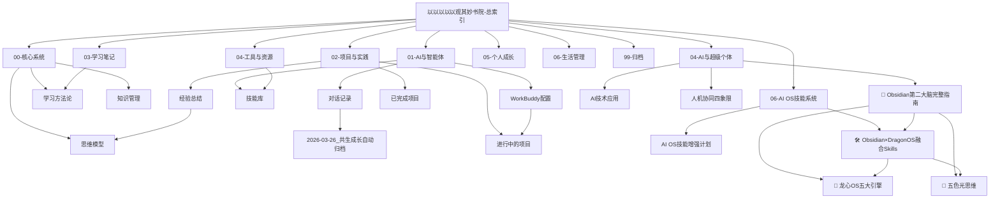

# 知识图谱

_可视化知识网络，展示体系间的关系_

## 核心连接

### 强连接（高频引用）
- [[以以以以以观其妙书院-总索引]] ↔ [[01-01-WorkBuddy配置]]
- [[01-01-WorkBuddy配置]] ↔ [[01-03-对话记录]]
- [[01-03-对话记录]] ↔ [[2026-03-26_共生成长自动归档]]
- [[02-01-进行中的项目]] ↔ [[02-03-经验总结]]
- [[04-AI应用/🧠 Obsidian第二大脑完整指南]] ↔ [[🐉 龙心 OS 龙脑操作系统]]
- [[04-AI应用/🧠 Obsidian第二大脑完整指南]] ↔ [[五色光思维Skills]]
- [[06-AI OS技能系统/08-Obsidian-DragonOS融合Skills]] ↔ [[04-AI应用/🧠 Obsidian第二大脑完整指南]]

### 弱连接（偶尔引用）
- [[00-01-思维模型]] → [[03-01-读书笔记]]
- [[04-01-软件工具]] → [[01-02-技能库]]
- [[04-AI应用/🧠 Obsidian第二大脑完整指南]] → [[📚 知识学习Skills]]

### 🆕 2026-03-25 新增节点
- `🧠 Obsidian第二大脑完整指南` — 路径：`04-AI与超级个体/01-AI应用/`
- `🛠️ Obsidian×DragonOS融合Skills` — 路径：`06-AI OS技能系统/`

### 🆕 2026-03-26 新增节点
- `2026-03-26_共生成长自动归档` — 路径：`02-对话记录/`
- `每日知识库同步自动化记录` — 路径：`.codebuddy/automations/ai-os-daily-archive/`
- `三向同步系统验证` — 路径：`06-三向同步系统/`

### 🆕 2026-04-10 新增节点（龙心OS每日备份）
- `企业文化体系-中西融合AI赋能全景构建` — 路径：`05-企业文化/`
- `2026-04-10-龙心OS每日备份` — 路径：`01-每日归档/`
- `组织三体论` — 概念节点（信息体-能量体-物质体）
- `差序格局三层模型` — 概念节点（核心/紧密/外围圈）
- `心文化五维体系` — 概念节点（易经洗心/中医养心/儒家正心/道家静心/禅宗明心）

### 新增连接
- [[企业文化体系-中西融合AI赋能全景构建]] ↔ [[五行人格心理学OS]]
- [[企业文化体系-中西融合AI赋能全景构建]] ↔ [[差序格局理论]]
- [[企业文化体系-中西融合AI赋能全景构建]] ↔ [[心文化体系]]
- [[企业文化体系-中西融合AI赋能全景构建]] ↔ [[行为经济学应用]]
- [[企业文化体系-中西融合AI赋能全景构建]] ↔ [[知识学习Skills]]

## 孤立节点检查

_定期扫描，确保没有孤立的文档_

- [ ] 扫描孤立文档
- [ ] 建立必要连接
- [ ] 归档或删除无用文档

---
_知识因连接而有价值。_ 🔗
